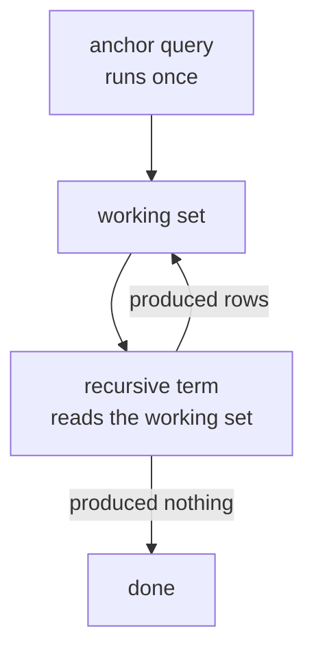

Every query so far has looked at a fixed number of tables. A
**recursive CTE** looks at its own output, over and over, until it
stops producing new rows. That is what lets one query walk an
organisation chart of unknown depth, follow a chain of replies, or
generate a series of dates.

<Figure
  slug="sql-recursive-ctes-cutout"
  alt="Recursive common table expressions, an isometric illustration"
/>

## The two halves

A recursive CTE is always two queries joined by `UNION ALL`:

- The **anchor** runs once and produces the starting rows.
- The **recursive term** refers to the CTE by name and runs again and
  again, each time seeing only the rows the previous round produced.

Iteration stops when a round produces nothing.

<SyntaxBreakdown
  parts={[
    { text: "WITH RECURSIVE chain AS (", label: "the name, marked recursive" },
    { text: "SELECT ... WHERE manager_id IS NULL", label: "anchor: where to start" },
    { text: "UNION ALL", label: "always ALL, not UNION" },
    { text: "SELECT ... JOIN chain ON ...", label: "recursive term: one step further" },
    { text: ")", label: "close, then query it like a table" },
  ]}
/>

## Counting, the smallest possible example

Before any real data, here is the mechanism on its own: start at 1,
and each round adds one until the guard stops it.

<SqlCodeBlock
  dialect="postgres"
  title="A recursive CTE that counts to 24"
  initSql={`CREATE TABLE noop (id INTEGER);`}
  starterCode={`WITH RECURSIVE counter AS (
  -- anchor: the first row
  SELECT 1 AS n

  UNION ALL

  -- recursive term: one more than the last row
  SELECT n + 1
  FROM counter
  WHERE n < 24
)
SELECT
  n,
  n * n AS squared
FROM
  counter
ORDER BY
  n;`}
/>

<Callout type="danger" title="Always have a stopping condition">
Remove the `WHERE n < 24` and the query runs until it exhausts memory
or you cancel it. A recursive CTE has no built-in depth limit, so the
recursive term must contain something that eventually stops matching:
a bound on a counter, a shrinking set of rows, or a cycle guard. Write
the stop condition before you write the recursion.
</Callout>

## Walking a hierarchy

The classic use is a table whose rows point at other rows in the same
table. Each employee has a `manager_id`, and the depth of the tree is
not known in advance:

<SqlCodeBlock
  dialect="postgres"
  title="The whole reporting chain, with depth"
  initSql={`CREATE TABLE employees (
  id         INTEGER PRIMARY KEY,
  name       TEXT,
  manager_id INTEGER REFERENCES employees(id)
);
INSERT INTO employees (id, name, manager_id) VALUES
  (1,'Ada',NULL),
  (2,'Ben',1), (3,'Cleo',1), (4,'Dan',1),
  (5,'Elle',2), (6,'Finn',2), (7,'Gia',3), (8,'Hugo',3),
  (9,'Iris',4), (10,'Jae',4), (11,'Kai',5), (12,'Lena',5),
  (13,'Mira',6), (14,'Nils',7), (15,'Omar',7), (16,'Pia',8),
  (17,'Quinn',9), (18,'Rui',10), (19,'Sana',11), (20,'Tom',11),
  (21,'Uma',14), (22,'Vic',16), (23,'Wren',19), (24,'Zoe',21);`}
  starterCode={`WITH RECURSIVE chart AS (
  -- anchor: everyone with no manager
  SELECT
    id,
    name,
    manager_id,
    1 AS depth,
    name AS path
  FROM
    employees
  WHERE
    manager_id IS NULL

  UNION ALL

  -- recursive term: everyone reporting to a row we already have
  SELECT
    e.id,
    e.name,
    e.manager_id,
    c.depth + 1,
    c.path || ' > ' || e.name
  FROM
    employees e
    JOIN chart c ON e.manager_id = c.id
)
SELECT
  depth,
  name,
  path
FROM
  chart
ORDER BY
  path;`}
/>

Read the recursive term carefully: it joins `employees` to `chart`,
the CTE being defined. Each round finds the direct reports of everyone
found in the previous round, so the query reaches six levels deep
without anywhere saying "six".

<Figure
  slug="sql-recursive-ctes-walking-hierarchy-inline-cutout"
  alt="A tall stack of blocks being built one layer at a time, each new layer placed only on the blocks laid in the previous round"
  caption="Each round of a recursive CTE builds on the rows the round before it produced."
/>

## Starting anywhere, and going either way

The anchor is just a query, so changing it changes where the walk
begins. Start at one employee and follow `manager_id` upward instead
of downward, and you have their chain of command:

<SqlCodeBlock
  dialect="postgres"
  title="Everyone above Zoe"
  initSql={`CREATE TABLE employees (
  id         INTEGER PRIMARY KEY,
  name       TEXT,
  manager_id INTEGER REFERENCES employees(id)
);
INSERT INTO employees (id, name, manager_id) VALUES
  (1,'Ada',NULL),
  (2,'Ben',1), (3,'Cleo',1), (4,'Dan',1),
  (5,'Elle',2), (6,'Finn',2), (7,'Gia',3), (8,'Hugo',3),
  (9,'Iris',4), (10,'Jae',4), (11,'Kai',5), (12,'Lena',5),
  (13,'Mira',6), (14,'Nils',7), (15,'Omar',7), (16,'Pia',8),
  (17,'Quinn',9), (18,'Rui',10), (19,'Sana',11), (20,'Tom',11),
  (21,'Uma',14), (22,'Vic',16), (23,'Wren',19), (24,'Zoe',21);`}
  starterCode={`WITH RECURSIVE up AS (
  SELECT
    id,
    name,
    manager_id,
    0 AS steps_up
  FROM
    employees
  WHERE
    name = 'Zoe'

  UNION ALL

  SELECT
    m.id,
    m.name,
    m.manager_id,
    u.steps_up + 1
  FROM
    employees m
    JOIN up u ON u.manager_id = m.id
)
SELECT
  steps_up,
  name
FROM
  up
ORDER BY
  steps_up;`}
/>

Same table, same mechanism, opposite direction: the join condition is
the only thing that changed.

## Generating rows out of nothing

A recursive CTE needs no table at all, which makes it a way to
manufacture a series. That matters for reports that must show empty
periods, since a `GROUP BY` can only produce rows for days the data
actually contains:

<SqlCodeBlock
  dialect="postgres"
  title="Every day in March, including the quiet ones"
  initSql={`CREATE TABLE visits (
  day    DATE PRIMARY KEY,
  people INTEGER
);
INSERT INTO visits (day, people) VALUES
  ('2025-03-01',40), ('2025-03-02',35), ('2025-03-04',60),
  ('2025-03-05',52), ('2025-03-06',48), ('2025-03-09',71),
  ('2025-03-10',65), ('2025-03-11',44), ('2025-03-12',80),
  ('2025-03-15',39), ('2025-03-16',58), ('2025-03-17',62),
  ('2025-03-18',47), ('2025-03-21',75), ('2025-03-22',53),
  ('2025-03-23',41), ('2025-03-25',68), ('2025-03-26',59),
  ('2025-03-27',72), ('2025-03-29',36), ('2025-03-30',64),
  ('2025-03-31',49), ('2025-04-01',57), ('2025-04-02',70);`}
  starterCode={`WITH RECURSIVE calendar AS (
  SELECT DATE '2025-03-01' AS day

  UNION ALL

  SELECT day + 1
  FROM calendar
  WHERE day < DATE '2025-03-31'
)
SELECT
  c.day,
  COALESCE(v.people, 0) AS people
FROM
  calendar c
  LEFT JOIN visits v ON v.day = c.day
ORDER BY
  c.day;`}
/>

Thirty-one rows, including the six days nobody visited. Without the
generated calendar those days would simply be missing, and a chart
drawn from the result would quietly join across the gaps.

<Callout type="info" title="PostgreSQL has a shortcut for this one">
`generate_series(DATE '2025-03-01', DATE '2025-03-31', INTERVAL '1 day')`
does the same job in one function call, and is what you would reach
for in practice. The recursive version is worth writing once because
it works everywhere and shows the mechanism; `generate_series` is a
PostgreSQL extension.
</Callout>

## Guarding against cycles

If the data contains a loop, employee A reports to B and B reports to
A, the recursion never runs out of new rows. Carrying the path and
refusing to revisit a node is the standard defence:

<SqlCodeBlock
  dialect="postgres"
  title="A cycle that would otherwise never end"
  initSql={`CREATE TABLE links (
  from_page TEXT,
  to_page   TEXT
);
INSERT INTO links (from_page, to_page) VALUES
  ('home','about'), ('home','pricing'), ('about','team'),
  ('about','home'), ('pricing','faq'), ('pricing','home'),
  ('team','about'), ('faq','pricing'), ('faq','contact'),
  ('contact','home'), ('team','careers'), ('careers','team'),
  ('careers','jobs'), ('jobs','careers'), ('jobs','apply'),
  ('apply','jobs'), ('blog','home'), ('home','blog'),
  ('blog','post1'), ('post1','blog'), ('post1','post2'),
  ('post2','post1'), ('post2','blog'), ('contact','faq');`}
  starterCode={`WITH RECURSIVE walk AS (
  SELECT
    to_page AS page,
    ARRAY['home'] AS visited,
    1 AS hops
  FROM
    links
  WHERE
    from_page = 'home'

  UNION ALL

  SELECT
    l.to_page,
    w.visited || w.page,
    w.hops + 1
  FROM
    links l
    JOIN walk w ON l.from_page = w.page
  WHERE
    NOT (l.to_page = ANY (w.visited))
    AND w.hops < 6
)
SELECT DISTINCT ON (page)
  page,
  hops
FROM
  walk
ORDER BY
  page,
  hops;`}
/>

The `visited` array accumulates the pages already seen, and
`NOT (l.to_page = ANY (w.visited))` refuses to step onto one twice.
The `hops < 6` bound is a second line of defence, and having both is
not paranoid: an unguarded recursive query on cyclic data is one of
the few ways to make a database genuinely hang.

## Check your understanding

<MultipleChoice
  markdown={`What does the recursive term of a \`WITH RECURSIVE\` CTE read from on each round?

- The whole table, re-scanned from the beginning every time.
  > Reading everything again would repeat the same rows forever rather than advancing.
- [o] Only the rows produced by the previous round.
  > Each iteration works from the newest rows, which is what makes the walk move outward one step at a time.
- Only the anchor's rows, which never change.
  > Restricting it to the anchor would produce a fixed second level and then stop.
- Nothing; it runs once and its output is appended.
  > A term that ran once would not be recursive at all.

The working set is replaced each round, which is why the recursion terminates.`}
/>

<MultipleChoice
  markdown={`Why must a recursive CTE contain a condition that eventually fails?

- Because PostgreSQL rejects a recursive CTE without a \`WHERE\` clause.
  > The syntax is accepted; the problem shows up only at run time.
- Because the recursion is limited to 100 rounds and then errors.
  > There is no built-in round limit, which is exactly why the query can run away.
- Because \`UNION ALL\` requires both halves to filter their rows.
  > \`UNION ALL\` places no requirement on either half.
- [o] Because iteration stops only when a round produces no rows.
  > With nothing to exhaust, each round keeps producing new rows and the query never finishes.

Write the stopping condition first, then the recursion.`}
/>

<MultipleChoice
  markdown={`Which task is a recursive CTE the natural tool for?

- Summing a column across every row of a table.
  > A plain aggregate does that in one pass with no recursion needed.
- Joining two tables on a shared key.
  > An ordinary join handles a fixed number of steps between tables.
- [o] Following a parent link through a tree of unknown depth.
  > The number of steps is not known when the query is written, which is what recursion supplies.
- Removing duplicate rows from a result set.
  > \`DISTINCT\` or \`UNION\` handles deduplication directly.

Unknown depth is the signal: a fixed number of joins cannot express it.`}
/>

Next: how all of these clauses fit into the order the database runs
them.
