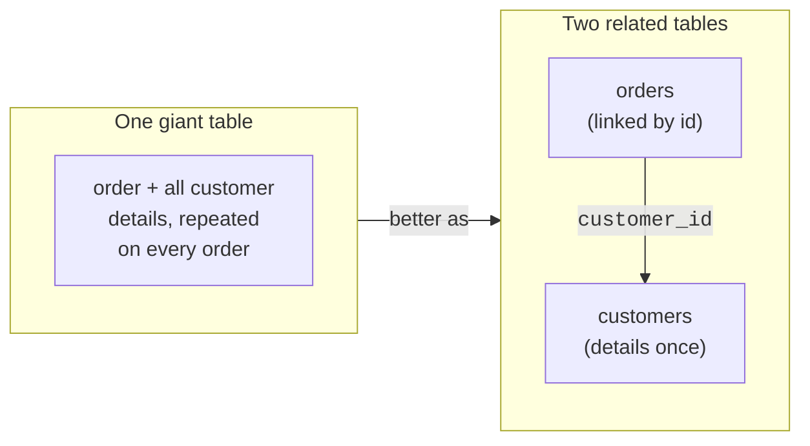
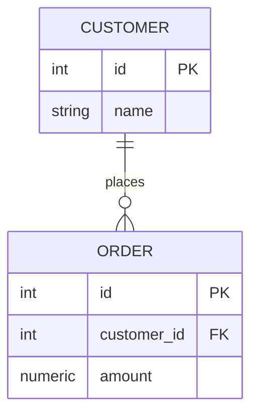
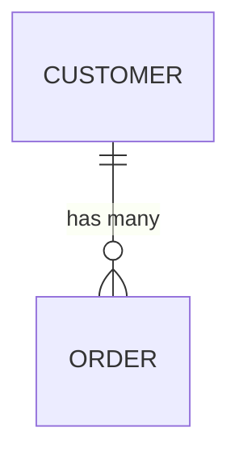
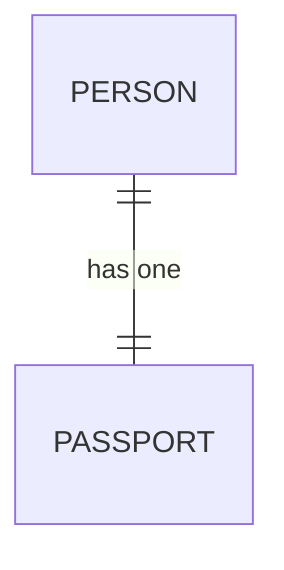

We have built up tables, rows, columns, and primary keys. Now we
reach the idea that gives **relational** databases their name and
their power: tables do not live in isolation, they **relate** to
one another.

<Figure
  slug="sql-relationships-intro-cutout"
  alt="Relationships between tables, an isometric illustration"
/>

## Why split data across tables at all?

A natural first instinct is to cram everything into one giant table.
Resist it. Real information has natural *kinds of things*,
customers, orders, products, and each kind deserves its own table.

Why? Because mixing them forces duplication. If every order row also
stored the customer's full name, address, and phone number, then a
customer with 50 orders would have their details copied 50 times,
and changing their phone number would mean fixing 50 rows.

The relational answer: keep each kind of thing in its own table, and
**connect** them with a shared value. Each order simply stores the
customer's `id`, a tiny reference, instead of copying all their
details.

## How the connection works

The connection is beautifully simple. The customer's identity lives
in the customers table as its **primary key**. An order *points to*
that customer by storing the same id value. That pointing column is
called a **foreign key** (we devote a full page to it later).

Read the link as: *the `customer_id` on each order refers to the
`id` of a customer.* Follow it, and you can travel from any order to
its customer, or gather all orders for a customer.

## The three shapes of relationships

Almost every relationship between two kinds of things takes one of
three shapes. Learning to recognize them is a core modeling skill.

<Figure
  slug="sql-relationships-intro-inline-cutout"
  alt="Two boards on a bench joined by a single cord that runs from a tagged row in one to a tagged row in the other"
/>

### One-to-many (the most common)

One customer has many orders; each order belongs to one customer.
One country has many cities; each city is in one country.

The little crow's-foot (`o{`) means "many." One on the left, many on
the right.

### One-to-one

One person has one passport; one passport belongs to one person.
Less common, used to split rarely-needed details into a separate
table.

### Many-to-many

One student takes many courses; one course has many students. Both
sides are "many." This shape needs a special helper table, which we
will explore in the **Connecting Tables** section.

<Callout type="info" title="Read relationships as two sentences">
Every relationship is really two sentences, one from each side. For
customers and orders: *"a customer has many orders"* **and** *"an
order belongs to one customer."* Saying both out loud tells you the
shape, here, one-to-many.
</Callout>

## See a relationship in action

Two tables, linked by `customer_id`. The query walks the link to
show each order beside the name of the customer who placed it,
without the name ever being duplicated in the orders table.

<SqlCodeBlock
  dialect="postgres"
  title="Following a one-to-many relationship"
  initSql={`CREATE TABLE customers (
  id   INTEGER PRIMARY KEY,
  name TEXT
);
CREATE TABLE orders (
  id          INTEGER PRIMARY KEY,
  customer_id INTEGER,
  amount      NUMERIC
);
INSERT INTO customers (id, name) VALUES
  (1, 'Ada'), (2, 'Grace');
INSERT INTO orders (id, customer_id, amount) VALUES
  (101, 1, 42),
  (102, 1, 18),
  (103, 2, 99);`}
  starterCode={`SELECT
  c.name,
  o.id AS order_id,
  o.amount
FROM
  customers c
  JOIN orders o ON o.customer_id = c.id
ORDER BY
  c.name,
  o.id;`}
/>

Ada appears twice in the *result* (she has two orders), but she is
stored only **once**. The relationship let us combine the two tables
on demand. That on-demand combining is called a **join**, and it
gets its own deep dive soon.

## Check your understanding

<MultipleChoice
  markdown={`Why do relational databases split data into multiple related tables instead of one giant table?

- [o] To avoid duplicating the same facts; each kind of thing is stored once in its own table and linked by shared values.
  > Separating entities and linking them keeps each fact in one place, which prevents inconsistency and repeated data.
- Because a database can only hold a limited number of columns per table.
  > Tables can have many columns; the reason for splitting is about avoiding duplication, not a column limit.
- To make every table look identical.
  > Tables hold different kinds of things; uniform appearance is not the goal.
- Because SQL cannot read a table with more than 100 rows.
  > SQL handles enormous tables; row count is not the reason for splitting data.

Splitting data into related tables stores each fact once and connects the pieces through shared values.`}
/>

<MultipleChoice
  markdown={`"One customer has many orders, and each order belongs to one customer." What relationship shape is this?

- No relationship at all.
  > There is clearly a relationship, orders reference customers, so "none" is incorrect.
- [o] One-to-many.
  > One customer relating to many orders, with each order tied back to a single customer, is the classic one-to-many shape.
- Many-to-many.
  > Many-to-many would require each order to belong to several customers as well, which is not the case here.
- One-to-one.
  > One-to-one would mean each side has exactly one of the other, like a person and a single passport.

A customer having many orders, each tied to one customer, is one-to-many.`}
/>

<MultipleChoice
  markdown={`"A student can take many courses, and a course can have many students." What relationship shape is this?

- One-to-many.
  > One-to-many would have only one side as "many"; here *both* sides are many.
- One-to-one.
  > One-to-one means each side has exactly one of the other, which does not fit students and courses.
- [o] Many-to-many.
  > Both students and courses can relate to many of the other, which is the defining feature of many-to-many.
- It is impossible to model.
  > Many-to-many is very common and is modeled with a helper table, as we will see later.

When both sides can relate to many of the other, the relationship is many-to-many.`}
/>
