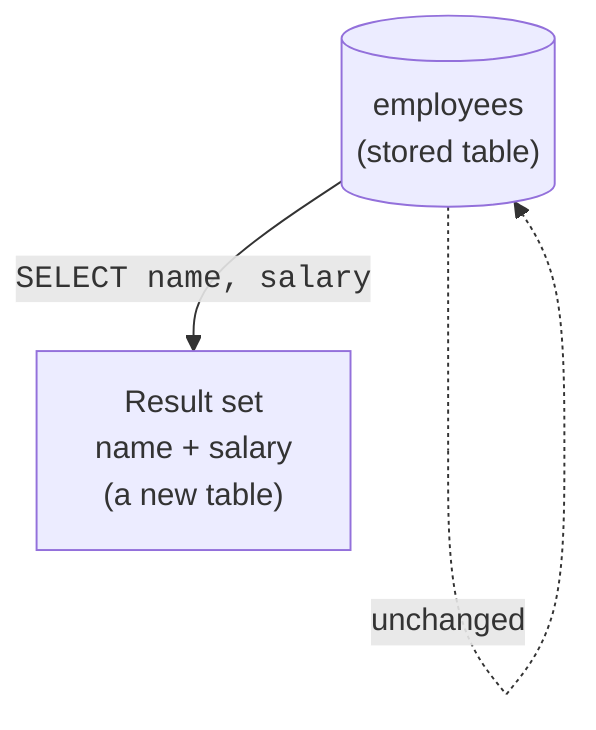

`SELECT` is the workhorse of SQL, the statement you will write more
than any other. We met it as a calculator; now we use it to *read
data from tables*, which is what it was truly built for.

<Figure
  slug="sql-select-basics-cutout"
  alt="SELECT basics, an isometric illustration"
/>

## Choosing columns

The simplest read names the columns you want, `FROM` a table:

<SqlCodeBlock
  dialect="postgres"
  title="Pick specific columns"
  initSql={`CREATE TABLE employees (
  id     SERIAL PRIMARY KEY,
  name   TEXT,
  dept   TEXT,
  salary NUMERIC
);
INSERT INTO employees (name, dept, salary) VALUES
  ('Alice','Engineering',120000),('Bob','Engineering',95000),
  ('Carol','Sales',80000),('Dave','Sales',72000),('Eve','Marketing',68000),
  ('Frank','Engineering',110000),('Grace','Engineering',132000),
  ('Hana','Engineering',88000),('Ivan','Sales',76000),('Jade','Sales',91000),
  ('Kai','Sales',67000),('Lena','Marketing',74000),('Mark','Marketing',62000),
  ('Nina','Support',58000),('Omar','Support',61000),('Pia','Support',55000),
  ('Quinn','Support',63000),('Rosa','Engineering',105000),
  ('Sam','Engineering',99000),('Tara','Sales',84000),('Uri','Finance',88000),
  ('Vera','Finance',92000),('Wes','Legal',115000),('Yara','Marketing',70000);`}
  starterCode={`SELECT
  name,
  salary
FROM
  employees;`}
/>

You asked for two columns, so you got two columns, for **every**
row in the table. `SELECT` decides the *columns*; by default you get
*all the rows*. Narrowing the rows is the next page's job (`WHERE`).

## SELECT *, every column

`*` is shorthand for "all columns, in their defined order":

<SqlCodeBlock
  dialect="postgres"
  title="All columns with *"
  initSql={`CREATE TABLE employees (
  id     SERIAL PRIMARY KEY,
  name   TEXT,
  dept   TEXT,
  salary NUMERIC
);
INSERT INTO employees (name, dept, salary) VALUES
  ('Alice','Engineering',120000),('Bob','Engineering',95000),
  ('Carol','Sales',80000),('Dave','Sales',72000),('Eve','Marketing',68000),
  ('Frank','Engineering',110000),('Grace','Engineering',132000),
  ('Hana','Engineering',88000),('Ivan','Sales',76000),('Jade','Sales',91000),
  ('Kai','Sales',67000),('Lena','Marketing',74000),('Mark','Marketing',62000),
  ('Nina','Support',58000),('Omar','Support',61000),('Pia','Support',55000),
  ('Quinn','Support',63000),('Rosa','Engineering',105000),
  ('Sam','Engineering',99000),('Tara','Sales',84000),('Uri','Finance',88000),
  ('Vera','Finance',92000),('Wes','Legal',115000),('Yara','Marketing',70000);`}
  starterCode={`SELECT
  *
FROM
  employees;`}
/>

`SELECT *` is handy for exploring a table quickly. In real queries,
though, it is usually better to name the exact columns you need,
it is clearer, and you are not pulling back data you will not use.

<Figure
  slug="sql-select-basics-inline-cutout"
  alt="A wide board with three of its columns copied onto a smaller board, the original left untouched"
  caption="`SELECT *` is for exploring; naming the columns is for queries you keep."
/>

## A query produces a new result, not a changed table

This is a subtle but liberating idea: a `SELECT` **never changes the
underlying table.** It computes a fresh **result set**, its own
little table, and hands that back to you. The stored data sits
untouched, ready for the next question.

Because of this, you can run as many `SELECT`s as you like, in any
order, experimenting freely. You cannot "break" data by reading it.

<Callout type="info" title="Result sets are tables too">
The output of a query has rows and columns, it *is* a table, just a
temporary one. This is why you can build bigger queries by feeding
one query's result into another, an idea we reach in the
**Composing Queries** section.
</Callout>

## Order of columns is up to you

The result's columns appear in the order you list them, regardless
of how the table was defined. You are describing the *shape of the
answer*, not echoing the table:

<SqlCodeBlock
  dialect="postgres"
  title="Reorder columns in the output"
  initSql={`CREATE TABLE employees (
  id     SERIAL PRIMARY KEY,
  name   TEXT,
  dept   TEXT,
  salary NUMERIC
);
INSERT INTO employees (name, dept, salary) VALUES
  ('Alice','Engineering',120000),('Bob','Engineering',95000),
  ('Carol','Sales',80000),('Dave','Sales',72000),('Eve','Marketing',68000),
  ('Frank','Engineering',110000),('Grace','Engineering',132000),
  ('Hana','Engineering',88000),('Ivan','Sales',76000),('Jade','Sales',91000),
  ('Kai','Sales',67000),('Lena','Marketing',74000),('Mark','Marketing',62000),
  ('Nina','Support',58000),('Omar','Support',61000),('Pia','Support',55000),
  ('Quinn','Support',63000),('Rosa','Engineering',105000),
  ('Sam','Engineering',99000),('Tara','Sales',84000),('Uri','Finance',88000),
  ('Vera','Finance',92000),('Wes','Legal',115000),('Yara','Marketing',70000);`}
  starterCode={`-- salary first, then dept, then name, any order you want
SELECT
  salary,
  dept,
  name
FROM
  employees;`}
/>

## Removing duplicates with DISTINCT

Sometimes you only care about the *distinct* values in a column.
`SELECT DISTINCT` collapses repeated rows into unique ones:

<SqlCodeBlock
  dialect="postgres"
  title="Unique departments only"
  initSql={`CREATE TABLE employees (
  id     SERIAL PRIMARY KEY,
  name   TEXT,
  dept   TEXT
);
INSERT INTO employees (name, dept) VALUES
  ('Alice','Engineering'),('Bob','Engineering'),('Carol','Sales'),
  ('Dave','Sales'),('Eve','Marketing'),('Frank','Engineering'),
  ('Grace','Engineering'),('Hana','Engineering'),('Ivan','Sales'),
  ('Jade','Sales'),('Kai','Sales'),('Lena','Marketing'),('Mark','Marketing'),
  ('Nina','Support'),('Omar','Support'),('Pia','Support'),('Quinn','Support'),
  ('Rosa','Engineering'),('Sam','Engineering'),('Tara','Sales'),
  ('Uri','Finance'),('Vera','Finance'),('Wes','Legal'),('Yara','Marketing');`}
  starterCode={`SELECT DISTINCT
  dept
FROM
  employees
ORDER BY
  dept;`}
/>

Five employees, but only three distinct departments. `DISTINCT` is
perfect for answering "what are the possible values here?"

## Check your understanding

<MultipleChoice
  markdown={`What does \`SELECT *\` return?

- The table's structure but none of its data.
  > \`SELECT *\` returns actual rows of data, not just the structure.
- [o] Every column of the table, in their defined order.
  > The asterisk is shorthand for all columns, which is why it is handy for quickly exploring a table.
- Only the first column of the table.
  > \`*\` is the opposite of "one column"; it means all of them.
- A count of how many rows exist.
  > Counting rows uses \`COUNT(*)\`, which is different from selecting all columns.

\`SELECT *\` retrieves all columns for the matching rows.`}
/>

<MultipleChoice
  markdown={`Running a \`SELECT\` query on a table does what to the stored data?

- It deletes the columns you did not select.
  > Unselected columns are simply not returned; they remain safely in the table.
- [o] Nothing, \`SELECT\` reads the data and returns a new result set, leaving the stored table unchanged.
  > Because reads do not modify storage, you can run any number of \`SELECT\`s freely without risk.
- It permanently sorts the table.
  > A \`SELECT\` may sort its *result*, but it does not reorder or change the stored table.
- It locks the table so no one else can read it.
  > A basic \`SELECT\` does not lock others out; reading data is a safe, non-destructive operation.

A \`SELECT\` produces a fresh result and never alters the underlying table.`}
/>

<MultipleChoice
  markdown={`A \`dept\` column contains "Sales" three times and "Eng" twice. What does \`SELECT DISTINCT dept\` return?

- The single most common value only.
  > \`DISTINCT\` keeps every unique value, not just the most frequent one.
- Nothing, because the values repeat.
  > Repeated values do not cause an empty result; \`DISTINCT\` simply de-duplicates them.
- All five values, including the repeats.
  > \`DISTINCT\` exists precisely to remove repeats, so it would not return all five.
- [o] Two rows: "Sales" and "Eng", each distinct value once.
  > \`DISTINCT\` collapses duplicate values so each unique value appears a single time.

\`DISTINCT\` returns each unique value once, which is ideal for listing the possible values in a column.`}
/>

## Practice challenge

<SqlChallengeCard
  dialect="postgres"
  title="Select titles and authors"
  instructions={`The \`books\` table has \`id\`, \`title\`, \`author\`, and \`year\` columns. Return just the \`title\` and \`author\` of every book.`}
  initSql={`CREATE TABLE books (
  id     SERIAL PRIMARY KEY,
  title  TEXT NOT NULL,
  author TEXT NOT NULL,
  year   INTEGER
);
INSERT INTO books (title, author, year) VALUES
  ('The Pragmatic Programmer', 'Hunt & Thomas', 1999),
  ('Clean Code', 'Robert C. Martin', 2008),
  ('Refactoring', 'Martin Fowler', 2018),
  ('SQL for Smarties', 'Joe Celko', 1995),
  ('The Mythical Man-Month', 'Fred Brooks', 1975),
  ('Design Patterns', 'Gamma et al.', 1994),
  ('Code Complete', 'Steve McConnell', 2004),
  ('Working Effectively with Legacy Code', 'Michael Feathers', 2005),
  ('Domain-Driven Design', 'Eric Evans', 2003),
  ('Structure and Interpretation of Computer Programs', 'Abelson & Sussman', 1985),
  ('The Art of Computer Programming', 'Donald Knuth', 1968),
  ('Peopleware', 'DeMarco & Lister', 1987),
  ('Test-Driven Development', 'Kent Beck', 2002),
  ('Continuous Delivery', 'Humble & Farley', 2010),
  ('Release It!', 'Michael Nygard', 2007),
  ('The Phoenix Project', 'Kim et al.', 2013),
  ('Accelerate', 'Forsgren et al.', 2018),
  ('Designing Data-Intensive Applications', 'Martin Kleppmann', 2017),
  ('Database Internals', 'Alex Petrov', 2019),
  ('Site Reliability Engineering', 'Beyer et al.', 2016),
  ('A Philosophy of Software Design', 'John Ousterhout', 2018),
  ('The Unicorn Project', 'Gene Kim', 2019),
  ('Software Engineering at Google', 'Winters et al.', 2020),
  ('Fundamentals of Data Engineering', 'Reis & Housley', 2022);`}
  starterCode={`-- Return only the title and author columns:
SELECT
FROM
  books;`}
  solutionSql={`SELECT
  title,
  author
FROM
  books
ORDER BY
  id;`}
  tests={[
    {
      id: "columns",
      name: "Returns title and author",
      description: "Those two columns, in that order.",
      expectedColumns: ["title", "author"],
    },
    {
      id: "row_count",
      name: "Returns all 24 books",
      description: "One row per book.",
      expectedRowCount: 24,
    },
    {
      id: "matches",
      name: "Matches the reference solution",
      description: "The same titles and authors.",
      matchesSolution: true,
    },
  ]}
/>

Once that passes, you have the whole of `SELECT`: which columns, in
what order, with or without duplicates. The next page adds the other
half of every query you will ever write, choosing which **rows** come
back.
