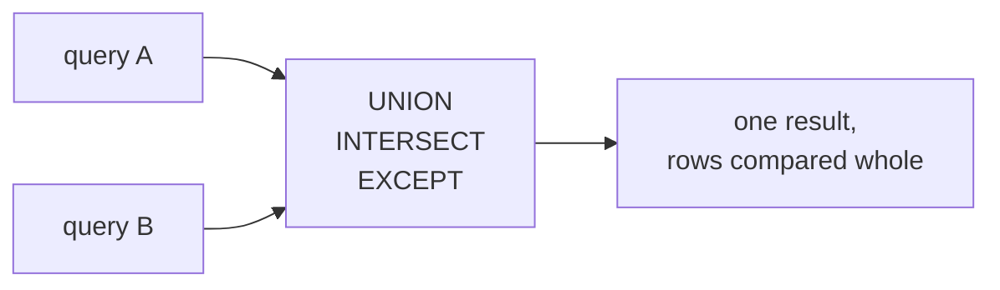

A join puts two tables **side by side**, matching rows on a key. A set
operation puts two results **on top of each other**, comparing whole
rows. They answer different questions, and mixing them up is a common
early mistake: if you find yourself wanting more *columns*, you want a
join; if you want more *rows*, you want `UNION`.

<Figure
  slug="sql-set-operations-cutout"
  alt="Set operations, an isometric illustration"
/>

## The three operators

| Operator | Returns |
| --- | --- |
| `UNION` | every row in either result, duplicates removed |
| `UNION ALL` | every row in either result, duplicates kept |
| `INTERSECT` | only rows present in both |
| `EXCEPT` | rows in the first result that are not in the second |

All of them require the two queries to be **union compatible**: the
same number of columns, in the same order, with compatible types. The
column *names* need not match; the first query's names are used.

## UNION stacks two results

<SqlCodeBlock
  dialect="postgres"
  title="One contact list from two tables"
  initSql={`CREATE TABLE customers (
  id    INTEGER PRIMARY KEY,
  name  TEXT,
  email TEXT
);
CREATE TABLE suppliers (
  id    INTEGER PRIMARY KEY,
  name  TEXT,
  email TEXT
);
INSERT INTO customers (id, name, email) VALUES
  (1,'Ada','ada@example.com'), (2,'Ben','ben@example.com'),
  (3,'Cleo','cleo@example.com'), (4,'Dan','dan@example.com'),
  (5,'Elle','elle@example.com'), (6,'Finn','finn@example.com'),
  (7,'Gia','gia@example.com'), (8,'Hugo','hugo@example.com'),
  (9,'Iris','iris@example.com'), (10,'Jae','jae@example.com'),
  (11,'Kai','kai@example.com'), (12,'Lena','lena@example.com');
INSERT INTO suppliers (id, name, email) VALUES
  (1,'Mira','mira@example.com'), (2,'Nils','nils@example.com'),
  (3,'Cleo','cleo@example.com'), (4,'Omar','omar@example.com'),
  (5,'Pia','pia@example.com'), (6,'Hugo','hugo@example.com'),
  (7,'Quinn','quinn@example.com'), (8,'Rui','rui@example.com'),
  (9,'Sana','sana@example.com'), (10,'Kai','kai@example.com'),
  (11,'Tom','tom@example.com'), (12,'Uma','uma@example.com');`}
  starterCode={`SELECT name, email FROM customers
UNION
SELECT name, email FROM suppliers
ORDER BY name;`}
/>

Twenty-four rows go in and twenty-one come out: Cleo, Hugo and Kai
appear in both tables and `UNION` kept one copy of each. A single
`ORDER BY` at the very end sorts the combined result; it cannot be
attached to either half.

## UNION ALL keeps the duplicates, and is faster

Removing duplicates means sorting or hashing every row, which is real
work. When you know the two results cannot overlap, or when the
duplicates are meaningful, `UNION ALL` skips it:

<SqlCodeBlock
  dialect="postgres"
  title="Labelling the source of each row"
  initSql={`CREATE TABLE customers (
  id    INTEGER PRIMARY KEY,
  name  TEXT,
  email TEXT
);
CREATE TABLE suppliers (
  id    INTEGER PRIMARY KEY,
  name  TEXT,
  email TEXT
);
INSERT INTO customers (id, name, email) VALUES
  (1,'Ada','ada@example.com'), (2,'Ben','ben@example.com'),
  (3,'Cleo','cleo@example.com'), (4,'Dan','dan@example.com'),
  (5,'Elle','elle@example.com'), (6,'Finn','finn@example.com'),
  (7,'Gia','gia@example.com'), (8,'Hugo','hugo@example.com'),
  (9,'Iris','iris@example.com'), (10,'Jae','jae@example.com'),
  (11,'Kai','kai@example.com'), (12,'Lena','lena@example.com');
INSERT INTO suppliers (id, name, email) VALUES
  (1,'Mira','mira@example.com'), (2,'Nils','nils@example.com'),
  (3,'Cleo','cleo@example.com'), (4,'Omar','omar@example.com'),
  (5,'Pia','pia@example.com'), (6,'Hugo','hugo@example.com'),
  (7,'Quinn','quinn@example.com'), (8,'Rui','rui@example.com'),
  (9,'Sana','sana@example.com'), (10,'Kai','kai@example.com'),
  (11,'Tom','tom@example.com'), (12,'Uma','uma@example.com');`}
  starterCode={`SELECT 'customer' AS role, name, email FROM customers
UNION ALL
SELECT 'supplier' AS role, name, email FROM suppliers
ORDER BY name, role;`}
/>

Adding a literal column that names the source is a standard move. It
also makes the two halves genuinely distinct, so `UNION` and
`UNION ALL` would now return the same 24 rows.

<Callout type="tip" title="Default to UNION ALL">
`UNION` deduplicates, which is a cost you pay whether or not there are
duplicates to remove. Reach for `UNION ALL` first, and switch to
`UNION` only when you actually need the rows collapsed. On large
results the difference is substantial.
</Callout>

<Figure
  slug="sql-set-operations-union-stacks-inline-cutout"
  alt="Two short columns of blocks on a bench being lifted onto one taller column, with a few matching blocks set aside"
  caption="`UNION` stacks two results and drops the repeats; `UNION ALL` keeps them."
/>

## INTERSECT and EXCEPT compare whole rows

These two answer membership questions without a join:

<SqlCodeBlock
  dialect="postgres"
  title="Who is in both lists, and who is in only one"
  initSql={`CREATE TABLE customers (
  id    INTEGER PRIMARY KEY,
  name  TEXT,
  email TEXT
);
CREATE TABLE suppliers (
  id    INTEGER PRIMARY KEY,
  name  TEXT,
  email TEXT
);
INSERT INTO customers (id, name, email) VALUES
  (1,'Ada','ada@example.com'), (2,'Ben','ben@example.com'),
  (3,'Cleo','cleo@example.com'), (4,'Dan','dan@example.com'),
  (5,'Elle','elle@example.com'), (6,'Finn','finn@example.com'),
  (7,'Gia','gia@example.com'), (8,'Hugo','hugo@example.com'),
  (9,'Iris','iris@example.com'), (10,'Jae','jae@example.com'),
  (11,'Kai','kai@example.com'), (12,'Lena','lena@example.com');
INSERT INTO suppliers (id, name, email) VALUES
  (1,'Mira','mira@example.com'), (2,'Nils','nils@example.com'),
  (3,'Cleo','cleo@example.com'), (4,'Omar','omar@example.com'),
  (5,'Pia','pia@example.com'), (6,'Hugo','hugo@example.com'),
  (7,'Quinn','quinn@example.com'), (8,'Rui','rui@example.com'),
  (9,'Sana','sana@example.com'), (10,'Kai','kai@example.com'),
  (11,'Tom','tom@example.com'), (12,'Uma','uma@example.com');`}
  starterCode={`SELECT name FROM customers
INTERSECT
SELECT name FROM suppliers
ORDER BY name;`}
/>

Swap `INTERSECT` for `EXCEPT` in that query and you get customers who
are not also suppliers. Swap the two halves around as well and you get
suppliers who are not customers: `EXCEPT` is directional, unlike the
other two.

## A practical use: comparing two tables

`EXCEPT` in both directions is the quickest way to find out how two
result sets differ, which makes it a natural fit for checking a
migration or a rewritten query:

<SqlCodeBlock
  dialect="postgres"
  title="What changed between the old table and the new one"
  initSql={`CREATE TABLE prices_old (
  sku   TEXT PRIMARY KEY,
  price NUMERIC
);
CREATE TABLE prices_new (
  sku   TEXT PRIMARY KEY,
  price NUMERIC
);
INSERT INTO prices_old (sku, price) VALUES
  ('kettle',24.00), ('blender',38.00), ('toaster',19.50),
  ('whisk',6.00), ('pan',42.00), ('ladle',8.25),
  ('lamp',31.00), ('bulb',4.75), ('shade',15.00),
  ('chair',89.00), ('desk',210.00), ('stool',45.00);
INSERT INTO prices_new (sku, price) VALUES
  ('kettle',24.00), ('blender',41.00), ('toaster',19.50),
  ('whisk',6.00), ('pan',39.50), ('ladle',8.25),
  ('lamp',31.00), ('bulb',4.75), ('shade',15.00),
  ('chair',89.00), ('desk',210.00), ('bench',52.00);`}
  starterCode={`SELECT 'removed or changed' AS change, sku, price
FROM (SELECT sku, price FROM prices_old
      EXCEPT
      SELECT sku, price FROM prices_new) AS gone
UNION ALL
SELECT 'added or changed', sku, price
FROM (SELECT sku, price FROM prices_new
      EXCEPT
      SELECT sku, price FROM prices_old) AS arrived
ORDER BY sku, change;`}
/>

Four rows come back: `blender` and `pan` changed price so they appear
on both sides, `stool` was removed, and `bench` was added. Nothing
about that query needs to know which columns form a key.

<Callout type="warn" title="Set operations compare every column">
`EXCEPT` matches on the whole row, so adding a column that always
differs (a timestamp, a surrogate id) makes every row look distinct
and the result becomes meaningless. Select only the columns whose
equality you actually care about.
</Callout>

## NULL counts as equal here

This is the one place SQL treats two `NULL`s as the same value. In a
`WHERE` clause `NULL = NULL` is unknown; in a set operation two rows
that are `NULL` in the same column are duplicates:

<SqlCodeBlock
  dialect="postgres"
  title="NULL behaves differently inside a set operation"
  initSql={`CREATE TABLE a (v INTEGER);
CREATE TABLE b (v INTEGER);
INSERT INTO a (v) VALUES (1), (2), (NULL), (4), (5), (NULL),
  (7), (8), (9), (10), (11), (12);
INSERT INTO b (v) VALUES (2), (3), (NULL), (5), (6), (NULL),
  (8), (13), (14), (15), (16), (17);`}
  starterCode={`SELECT v FROM a
INTERSECT
SELECT v FROM b
ORDER BY v;`}
/>

`NULL` appears in the result, because the set operators use "not
distinct from" rather than `=`. That is a deliberate part of the
standard and it catches people out in exactly one direction: they
expect the `NULL` to disappear, and it does not.

## Practice challenge

<SqlChallengeCard
  dialect="postgres"
  title="Everyone we have an address for"
  instructions={`\`customers\` and \`suppliers\` both have \`name\` and \`city\` columns. Return a single list of \`name\` and \`city\` covering both tables, with no row appearing twice, sorted by \`name\`.

\`\`\`sql
SELECT ... FROM customers
UNION
SELECT ... FROM suppliers
ORDER BY name;
\`\`\``}
  initSql={`CREATE TABLE customers (
  id   SERIAL PRIMARY KEY,
  name TEXT NOT NULL,
  city TEXT NOT NULL
);
CREATE TABLE suppliers (
  id   SERIAL PRIMARY KEY,
  name TEXT NOT NULL,
  city TEXT NOT NULL
);
INSERT INTO customers (name, city) VALUES
  ('Ada','Leeds'), ('Ben','Bristol'), ('Cleo','Leeds'),
  ('Dan','Cardiff'), ('Elle','Bristol'), ('Finn','Leeds'),
  ('Gia','Glasgow'), ('Hugo','Cardiff'), ('Iris','Leeds'),
  ('Jae','Bristol'), ('Kai','Glasgow'), ('Lena','Cardiff');
INSERT INTO suppliers (name, city) VALUES
  ('Mira','Leeds'), ('Nils','Bristol'), ('Cleo','Leeds'),
  ('Omar','Cardiff'), ('Pia','Glasgow'), ('Hugo','Cardiff'),
  ('Quinn','Leeds'), ('Rui','Bristol'), ('Sana','Glasgow'),
  ('Kai','Glasgow'), ('Tom','Cardiff'), ('Uma','Leeds');`}
  starterCode={`-- Stack the two lists and remove the repeats.
SELECT
  name,
  city
FROM
  customers
ORDER BY
  name;`}
  solutionSql={`SELECT name, city FROM customers
UNION
SELECT name, city FROM suppliers
ORDER BY name;`}
  tests={[
    {
      id: "columns",
      name: "Returns name and city",
      description: "Two columns, in that order.",
      expectedColumns: ["name", "city"],
    },
    {
      id: "row_count",
      name: "Removes the three shared rows",
      description: "24 rows in, 21 out: Cleo, Hugo and Kai appear in both tables.",
      expectedRowCount: 21,
    },
    {
      id: "matches",
      name: "Matches the reference solution",
      description: "One row per distinct name and city pair.",
      matchesSolution: true,
    },
  ]}
/>

## Check your understanding

<MultipleChoice
  markdown={`Two queries return 12 rows each and share 3 identical rows. How many rows does \`UNION ALL\` return?

- 21, because the shared rows are collapsed.
  > Collapsing duplicates is what plain \`UNION\` does.
- 3, because only the matching rows are kept.
  > Keeping only the overlap is \`INTERSECT\`.
- 9, because the shared rows are removed from both sides.
  > No operator removes a shared row from both halves at once.
- [o] 24, because nothing is removed.
  > \`UNION ALL\` concatenates the two results without comparing them.

The \`ALL\` is exactly the instruction not to deduplicate.`}
/>

<MultipleChoice
  markdown={`Which requirement must two queries meet to be combined with \`UNION\`?

- They must read from tables that share a foreign key.
  > No relationship between the tables is needed; the rows are simply stacked.
- Their column names must be identical.
  > The names may differ, and the first query's names are used for the result.
- [o] They must return the same number of columns, in compatible types and order.
  > Rows are compared and stacked position by position, so the shapes must line up.
- They must return the same number of rows.
  > The two halves can be any size, including empty.

Position and type matter; names do not.`}
/>

<MultipleChoice
  markdown={`What does \`SELECT sku FROM prices_old EXCEPT SELECT sku FROM prices_new\` return?

- Every SKU in either table, with the shared ones removed.
  > That symmetric difference needs \`EXCEPT\` run in both directions and combined.
- Every SKU present in both tables.
  > Keeping only what appears in both is \`INTERSECT\`.
- [o] SKUs in the old table that are absent from the new one.
  > \`EXCEPT\` subtracts the second result from the first, so the direction matters.
- The rows whose price changed between the two tables.
  > Selecting only \`sku\` means prices are not compared at all.

Reversing the two halves answers the opposite question.`}
/>

Next: a CTE that can refer to itself.
