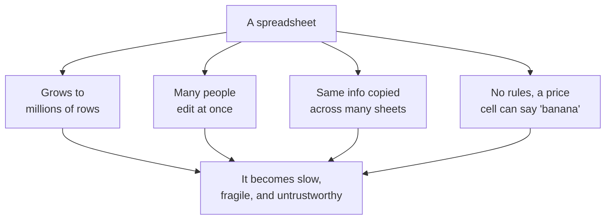

Spreadsheets are one of the most successful tools ever made. They
are visual, immediate, and forgiving. Almost everyone who works
with data starts there, and for good reason. So why move to a
database at all? This optional discussion page takes the question
seriously instead of waving it away.

<Figure
  slug="sql-spreadsheets-vs-databases-cutout"
  alt="Spreadsheets vs databases, an isometric illustration"
/>

The honest answer: **for small, personal, one-off work, you often
shouldn't.** Databases earn their keep when a spreadsheet starts to
strain. This page is about recognizing those moments.

## Where spreadsheets shine

- You can **see everything** at once and click any cell.
- Formulas update instantly as you type.
- There is nothing to set up, open it and go.
- They are perfect for quick calculations, small lists, and
  drafts.

<Figure
  slug="sql-spreadsheets-vs-databases-inline-cutout"
  alt="One enormous unwieldy sheet sagging off a bench, beside a compact cabinet of interlocking drawers holding the same records"
  caption="Past a certain size the sheet sags where a database keeps its shape."
/>

If your data fits comfortably on a screen and only you touch it, a
spreadsheet is frequently the *right* choice. Using a database
there would be over-engineering.

## Where spreadsheets start to crack

The trouble begins as data grows in **size**, **users**, and
**importance**. Watch what happens:

Let us name each crack precisely.

<Figure
  slug="sql-spreadsheets-vs-databases-where-spreadsheets-shine-inline-cutout"
  alt="One small board of filled cells on a bench with a hand marking a cell directly, quick and unaided"
  caption="For small personal work a spreadsheet is quicker, and that is a real answer."
/>

### 1. Scale

Spreadsheets slow to a crawl, or refuse to open, somewhere in the
hundreds of thousands to a few million rows. Databases routinely
handle billions.

### 2. Simultaneous editing

When two people edit the same shared spreadsheet, changes collide,
overwrite each other, or force everyone into a single-file
queue. Databases are built from the ground up for many users at
once.

### 3. Consistency

In a spreadsheet, the same customer's name might be typed slightly
differently in twenty rows: "Acme", "ACME", "Acme Inc." Nothing
stops it. A relational database lets you store that customer
**once** and point to it everywhere, so there is a single source of
truth.

### 4. Rules and validation

A spreadsheet cell will happily accept a price of `"banana"` or a
date of `"someday"`. A database column declared as a number or a
date **refuses** values that don't fit, catching errors at the
moment they happen.

### 5. Relationships

This is the big one. Real data is full of **connections**:
customers *have* orders, orders *contain* products. Spreadsheets
have no real notion of a relationship, you end up copying data
between sheets and praying it stays in sync. Relational databases
are *designed* around relationships, primary keys, foreign keys,
and joins, the machinery this course has spent whole sections on.

## A side-by-side summary

| Question | Spreadsheet | Relational database |
| --- | --- | --- |
| How much data? | Thousands of rows | Millions to billions |
| Many editors at once? | Painful, error-prone | Built for it |
| One source of truth? | Hard to enforce | Core feature |
| Rules on values? | Optional, weak | Enforced by the schema |
| Relationships between datasets? | Manual copying | First-class concept |
| Best for | Quick, small, personal work | Shared, large, long-lived data |

<Callout type="info" title="It is not a competition">
This is not "spreadsheets bad, databases good." They are different
tools for different moments. A skilled data professional uses a
spreadsheet to sketch an idea and a database to run the business.
Knowing *when* to reach for each is part of the judgment this
course builds.
</Callout>

## A glimpse of the relationship problem

Here is the crack that databases handle most beautifully. In a
spreadsheet you might repeat the customer's full name on every
single order line. In a database you store customers once, orders
once, and *link* them. Run this to see two small linked tables:

<SqlCodeBlock
  dialect="postgres"
  title="Customers stored once, orders linked to them"
  initSql={`CREATE TABLE customers (
  id   INTEGER,
  name TEXT
);
CREATE TABLE orders (
  id          INTEGER,
  customer_id INTEGER,
  amount      NUMERIC
);
INSERT INTO customers (id, name) VALUES
  (1,'Ada'), (2,'Grace'), (3,'Linus'), (4,'Mae'),
  (5,'Rosa'), (6,'Ivan'), (7,'Nadia'), (8,'Omar'),
  (9,'Priya'), (10,'Quinn'), (11,'Ruth'), (12,'Sam'),
  (13,'Tariq'), (14,'Uma'), (15,'Viktor'), (16,'Wen'),
  (17,'Xenia'), (18,'Yusuf'), (19,'Zara'), (20,'Bruno'),
  (21,'Chidi'), (22,'Dara'), (23,'Elif'), (24,'Farid');
INSERT INTO orders (id, customer_id, amount) VALUES
  (101,1,42), (102,1,18), (103,2,99), (104,2,15),
  (105,5,30), (106,5,76), (107,6,22), (108,7,64),
  (109,8,12), (110,8,48), (111,9,91), (112,11,27),
  (113,11,55), (114,12,38), (115,13,19), (116,13,83),
  (117,14,45), (118,15,61), (119,16,24), (120,16,70),
  (121,17,33), (122,18,88), (123,20,16), (124,20,52),
  (125,21,29), (126,22,74), (127,22,21), (128,23,95),
  (129,24,36), (130,1,57), (131,9,40), (132,17,68);`}
  starterCode={`-- Ada's name is stored ONCE, yet both her orders can find it
SELECT
  c.name,
  o.id AS order_id,
  o.amount
FROM
  orders o
  JOIN customers c ON c.id = o.customer_id
ORDER BY
  o.id;`}
/>

You can read that `JOIN` fluently now, which is itself a nice
measure of how far you have come. The point to absorb: "Ada"
appears **once** in storage, and the database stitches the two
tables together on demand. That single idea is why relational
databases conquered the data world, and it is the one thing a
spreadsheet fundamentally cannot give you.

## Check your understanding

<MultipleChoice
  markdown={`Which situation most strongly suggests reaching for a relational database instead of a spreadsheet?

- You need to color-code ten cells for a presentation.
  > Visual formatting of a tiny amount of data is a spreadsheet strength, not a reason to adopt a database.
- You need to add up a short column of numbers for a one-time report.
  > A spreadsheet is perfect for quick, small, personal calculations like this; a database would be overkill.
- [o] Many people must edit shared data that contains millions of rows and connected datasets that must stay consistent.
  > Scale, simultaneous editors, and relationships that must stay in sync are precisely the conditions databases are built for.
- You want to sketch a rough budget that only you will ever see.
  > Personal, small, throwaway work is exactly where spreadsheets shine.

Databases earn their value with large, shared, connected, long-lived data, not tiny personal tasks.`}
/>

<MultipleChoice
  markdown={`In a spreadsheet, the same customer name is typed as "Acme", "ACME", and "Acme Inc." across many rows. How does a relational database help avoid this?

- [o] It lets you store each customer once and refer to that single record everywhere, creating one source of truth.
  > Storing a fact once and pointing to it removes the chance for inconsistent duplicate copies entirely.
- It hides the duplicate rows from view.
  > Hiding rows would not fix the underlying inconsistency; storing the customer once does.
- It makes the spreadsheet open faster.
  > Open speed is unrelated; the issue here is the same fact being entered inconsistently many times.
- It automatically corrects spelling mistakes in any cell.
  > A database does not guess intended spellings; it avoids the problem by structure, not by autocorrect.

The relational answer to inconsistent duplicates is to store each entity once and reference it everywhere.`}
/>
