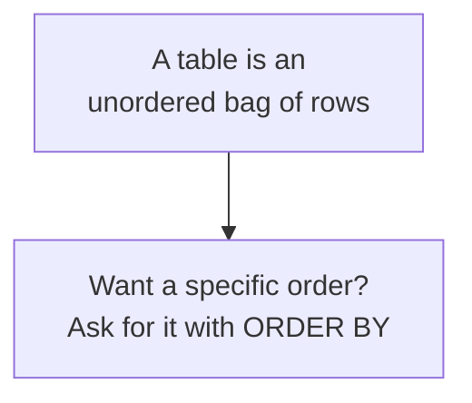

We touched these words earlier. Now we make them rock-solid,
because **every** idea in the rest of the course is built on this
one picture. If tables, rows, and columns are crystal clear, SQL
becomes mostly common sense.

<Figure
  slug="sql-tables-rows-columns-cutout"
  alt="Tables, rows, and columns, an isometric illustration"
/>

## The three words

The `students` table:

| id | name | grade | gpa |
| --- | --- | --- | --- |
| 1 | Ana | 9 | 3.8 |
| 2 | Ben | 10 | 3.4 |
| 3 | Cara | 11 | 2.9 |

- **Table**, a named grid that holds data about one kind of thing.
  This one holds *students*.
- **Column**, one attribute, running top to bottom. `name` is a
  column; `gpa` is a column. Every column has a name and a type.
- **Row**, one specific thing, running left to right. The second
  row is *Ben, grade 10, gpa 3.4*. A row is also called a
  **record**.
- **Cell**, the value where a row and column meet. The cell at
  Cara's row and the `gpa` column is `2.9`.

<Figure
  slug="sql-tables-rows-columns-inline-cutout"
  alt="One ruled board with a single row highlighted along its width and a single column highlighted down its height"
/>

<Callout type="info" title="Read it as a sentence">
A handy trick: read each row as a sentence using the column names.
Row 1 becomes *"Student 1 is named Ana, in grade 9, with a GPA of
3.8."* If a row reads like a sensible sentence about one thing, your
table is well-shaped.
</Callout>

## Rows are "things," columns are "attributes"

This is worth slowing down on, because it is the source of good
data instincts:

- A **row** answers *"which one?"*, which student, which order,
  which product.
- A **column** answers *"what about it?"*, what name, what price,
  what date.

| Table | Each row is one… | Typical columns (attributes) |
| --- | --- | --- |
| `students` | student | name, grade, gpa |
| `orders` | order | date, amount, customer_id |
| `products` | product | name, price, category |
| `cities` | city | name, country, population |

When you design or read a table, always be able to finish the
sentence *"each row is one ____."* If you cannot, the table is
probably confused about what it holds.

## Order does not matter (mostly)

A subtle but important point: in a relational table, **rows have no
inherent order.** The database is free to store and return them in
any order unless you explicitly ask for a sort. Ana being "first"
in the picture is not a property of the data, it is just how we
happened to print it.

This is why, later, we use `ORDER BY` whenever order matters. If you
do not ask, you must not assume.

## Every value has a type

Notice that `grade` holds whole numbers and `name` holds text. Each
column has a declared **type**, and the database enforces it. We
devote the next pages to keys and types, for now, just register
that a column is not a free-for-all: it is a named slot of a
specific kind of value.

## See it live

Run this and connect each part of the result to a word you just
learned: the whole result is shaped like a *table*, each line is a
*row*, each heading is a *column*, and each printed value is a
*cell*.

<SqlCodeBlock
  dialect="postgres"
  title="Name the parts: table, row, column, cell"
  initSql={`CREATE TABLE students (
  id    INTEGER,
  name  TEXT,
  grade INTEGER,
  gpa   NUMERIC
);
INSERT INTO students (id, name, grade, gpa) VALUES
  (1, 'Ana', 9, 3.8),
  (2, 'Ben', 10, 3.4),
  (3, 'Cara', 11, 2.9);`}
  starterCode={`SELECT
  *
FROM
  students;`}
/>

Try changing `SELECT *` to `SELECT name, gpa` and run again. You
just asked for *two columns instead of all of them*, your first
deliberate slice of a table.

## Check your understanding

<MultipleChoice
  markdown={`In a table called \`orders\`, what does a single **row** most naturally represent?

- [o] One specific order, with a value in each of the table's columns.
  > A row gathers all the attributes of one entity, here, one order, into a single record.
- The total number of orders in the table.
  > A count summarizes the table; a row is one individual record within it.
- The word "amount" that labels one of the columns.
  > A column label like "amount" names an attribute; a row is a full record, not a single heading.
- The list of types each column can hold.
  > That describes the table's schema, not a row.

A row is one record: a single order described across every column.`}
/>

<MultipleChoice
  markdown={`Which statement about the **order of rows** in a relational table is correct?

- Row order is fixed forever once the table is created.
  > Nothing fixes a permanent order; the database may return rows in any order unless you specify one.
- Rows are always returned in the order they were inserted, automatically.
  > A table is an unordered set of rows; insertion order is not guaranteed to be preserved on retrieval.
- Rows are always sorted alphabetically by default.
  > There is no automatic alphabetical sorting; without an explicit sort, no order is promised.
- [o] Rows have no guaranteed order; if you need a specific order, you must ask for it with \`ORDER BY\`.
  > Because a table is conceptually an unordered bag of rows, you should always sort explicitly when order matters.

Never assume an order you did not request, use \`ORDER BY\` when it matters.`}
/>

<MultipleChoice
  markdown={`A **column** in a relational table corresponds to which concept?

- The grid as a whole.
  > The whole grid is the table; a column is a single vertical slice of it.
- One specific thing, such as one customer.
  > That is a row, one specific entity. A column is different.
- [o] One attribute shared by every row, such as "name" or "price."
  > A column is a single attribute running down the table, with a name and a type, present for every row.
- A backup of the table.
  > A backup is a copy of data; a column is a structural part of the table.

A column is a single named, typed attribute that every row in the table has.`}
/>
