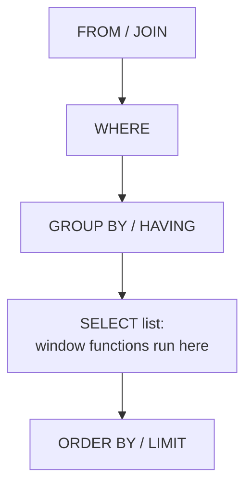

Everything that makes a window function a *window* function lives
inside the parentheses after `OVER`. This lesson fills them in: how to
cut the rows into groups with `PARTITION BY`, how to run several
different windows in one query, and how to name a window so you only
write it once.

<Figure
  slug="sql-the-over-clause-cutout"
  alt="The OVER clause, an isometric illustration"
/>

## An empty OVER means "every row"

`OVER ()` is the simplest window there is: no grouping, no ordering,
no frame. Every row sees every other row, so every row gets the same
answer.

<SyntaxBreakdown
  parts={[
    { text: "AVG(amount)", label: "the function" },
    { text: "OVER" },
    { text: "()", label: "the window: all rows in the result" },
  ]}
/>

That is useful for a grand total or an overall average, and it is
also the starting point. Adding words inside the parentheses narrows
what each row can see.

## PARTITION BY cuts the rows into groups

`PARTITION BY region` tells the database to split the rows into one
window per region. The function then runs separately inside each
window, and every row gets the answer for *its own* group.

<SqlCodeBlock
  dialect="postgres"
  title="A total per region, attached to every row"
  initSql={`CREATE TABLE sales (
  id     INTEGER PRIMARY KEY,
  region TEXT,
  rep    TEXT,
  amount NUMERIC
);
INSERT INTO sales (id, region, rep, amount) VALUES
  (1,'North','Ada',120), (2,'North','Ben',95), (3,'North','Cleo',140),
  (4,'North','Dan',60), (5,'North','Elle',210), (6,'North','Finn',85),
  (7,'South','Gia',175), (8,'South','Hugo',130), (9,'South','Iris',90),
  (10,'South','Jae',45), (11,'South','Kai',160), (12,'South','Lena',115),
  (13,'East','Mira',200), (14,'East','Nils',70), (15,'East','Omar',155),
  (16,'East','Pia',105), (17,'East','Quinn',135), (18,'East','Rui',80),
  (19,'West','Sana',190), (20,'West','Tom',125), (21,'West','Uma',100),
  (22,'West','Vic',55), (23,'West','Wren',145), (24,'West','Zoe',165);`}
  starterCode={`SELECT
  region,
  rep,
  amount,
  SUM(amount) OVER (PARTITION BY region) AS region_total
FROM
  sales
ORDER BY
  region,
  amount DESC;`}
/>

All twenty-four rows come back, and the six North rows all carry
North's total while the six South rows carry South's. Compare that
with `GROUP BY region`, which would have returned four rows and lost
every rep's name.

<Figure
  slug="sql-the-over-clause-partition-by-cuts-inline-cutout"
  alt="A long bench with three upright partitions dropped across it, each of the four sections holding its own pile and its own small weighing scale"
  caption="`PARTITION BY` drops walls across the rows, and each section is weighed on its own."
/>

<Callout type="info" title="PARTITION BY is not GROUP BY">
They sound alike and do opposite things to the row count. `GROUP BY`
**replaces** each group with one row. `PARTITION BY` **keeps** every
row and merely decides which rows are averaged, summed, or ranked
together. A query can use both at once, and the window then partitions
the grouped rows.
</Callout>

## Partitioning by more than one column

A partition can be defined by several columns, exactly like a
`GROUP BY` list. The window is then one group per distinct
combination:

<SqlCodeBlock
  dialect="postgres"
  title="A window per region and quarter"
  initSql={`CREATE TABLE sales (
  id      INTEGER PRIMARY KEY,
  region  TEXT,
  quarter TEXT,
  rep     TEXT,
  amount  NUMERIC
);
INSERT INTO sales (id, region, quarter, rep, amount) VALUES
  (1,'North','Q1','Ada',120), (2,'North','Q1','Ben',95),
  (3,'North','Q2','Cleo',140), (4,'North','Q2','Dan',60),
  (5,'North','Q3','Elle',210), (6,'North','Q3','Finn',85),
  (7,'South','Q1','Gia',175), (8,'South','Q1','Hugo',130),
  (9,'South','Q2','Iris',90), (10,'South','Q2','Jae',45),
  (11,'South','Q3','Kai',160), (12,'South','Q3','Lena',115),
  (13,'East','Q1','Mira',200), (14,'East','Q1','Nils',70),
  (15,'East','Q2','Omar',155), (16,'East','Q2','Pia',105),
  (17,'East','Q3','Quinn',135), (18,'East','Q3','Rui',80),
  (19,'West','Q1','Sana',190), (20,'West','Q1','Tom',125),
  (21,'West','Q2','Uma',100), (22,'West','Q2','Vic',55),
  (23,'West','Q3','Wren',145), (24,'West','Q3','Zoe',165);`}
  starterCode={`SELECT
  region,
  quarter,
  rep,
  amount,
  SUM(amount) OVER (PARTITION BY region, quarter) AS region_quarter_total
FROM
  sales
ORDER BY
  region,
  quarter;`}
/>

Each pair of rows sharing a region *and* a quarter now sees its own
subtotal.

## Several windows in one query

Nothing says the windows in a query have to match. Each window
function carries its own `OVER` clause, so one query can compare a row
against its region, its quarter, and the whole company at once:

<SqlCodeBlock
  dialect="postgres"
  title="Three windows, three points of comparison"
  initSql={`CREATE TABLE sales (
  id      INTEGER PRIMARY KEY,
  region  TEXT,
  quarter TEXT,
  rep     TEXT,
  amount  NUMERIC
);
INSERT INTO sales (id, region, quarter, rep, amount) VALUES
  (1,'North','Q1','Ada',120), (2,'North','Q1','Ben',95),
  (3,'North','Q2','Cleo',140), (4,'North','Q2','Dan',60),
  (5,'North','Q3','Elle',210), (6,'North','Q3','Finn',85),
  (7,'South','Q1','Gia',175), (8,'South','Q1','Hugo',130),
  (9,'South','Q2','Iris',90), (10,'South','Q2','Jae',45),
  (11,'South','Q3','Kai',160), (12,'South','Q3','Lena',115),
  (13,'East','Q1','Mira',200), (14,'East','Q1','Nils',70),
  (15,'East','Q2','Omar',155), (16,'East','Q2','Pia',105),
  (17,'East','Q3','Quinn',135), (18,'East','Q3','Rui',80),
  (19,'West','Q1','Sana',190), (20,'West','Q1','Tom',125),
  (21,'West','Q2','Uma',100), (22,'West','Q2','Vic',55),
  (23,'West','Q3','Wren',145), (24,'West','Q3','Zoe',165);`}
  starterCode={`SELECT
  rep,
  amount,
  ROUND(AVG(amount) OVER (PARTITION BY region), 1)  AS region_avg,
  ROUND(AVG(amount) OVER (PARTITION BY quarter), 1) AS quarter_avg,
  ROUND(AVG(amount) OVER (), 1)                     AS company_avg
FROM
  sales
ORDER BY
  rep;`}
/>

Read one row across: this rep's sale, their region's average, their
quarter's average, and the company's. Answering that with `GROUP BY`
would take three separate queries joined back together.

## WINDOW: name a window once

When the same window appears several times, the `WINDOW` clause lets
you define it once, after `HAVING` and before `ORDER BY`, and refer to
it by name:

<SyntaxBreakdown
  parts={[
    { text: "WINDOW", label: "the clause" },
    { text: "per_region", label: "the name you choose" },
    { text: "AS (PARTITION BY region)", label: "the window definition" },
  ]}
/>

<SqlCodeBlock
  dialect="postgres"
  title="One named window, used three times"
  initSql={`CREATE TABLE sales (
  id     INTEGER PRIMARY KEY,
  region TEXT,
  rep    TEXT,
  amount NUMERIC
);
INSERT INTO sales (id, region, rep, amount) VALUES
  (1,'North','Ada',120), (2,'North','Ben',95), (3,'North','Cleo',140),
  (4,'North','Dan',60), (5,'North','Elle',210), (6,'North','Finn',85),
  (7,'South','Gia',175), (8,'South','Hugo',130), (9,'South','Iris',90),
  (10,'South','Jae',45), (11,'South','Kai',160), (12,'South','Lena',115),
  (13,'East','Mira',200), (14,'East','Nils',70), (15,'East','Omar',155),
  (16,'East','Pia',105), (17,'East','Quinn',135), (18,'East','Rui',80),
  (19,'West','Sana',190), (20,'West','Tom',125), (21,'West','Uma',100),
  (22,'West','Vic',55), (23,'West','Wren',145), (24,'West','Zoe',165);`}
  starterCode={`SELECT
  region,
  rep,
  amount,
  MIN(amount) OVER per_region AS region_min,
  MAX(amount) OVER per_region AS region_max,
  ROUND(AVG(amount) OVER per_region, 1) AS region_avg
FROM
  sales
WINDOW
  per_region AS (PARTITION BY region)
ORDER BY
  region,
  amount;`}
/>

Three window functions, one definition. Change the partition once and
all three follow, which is exactly the reason to use it.

## Where the OVER clause sits in a query

Because windows are computed in the `SELECT` list, they can use
anything that exists by then, including the results of `GROUP BY`, and
they can be referred to afterwards only by `ORDER BY`.

## Practice challenge

<SqlChallengeCard
  dialect="postgres"
  title="Compare each salary to its department"
  instructions={`The \`staff\` table has \`name\`, \`department\` and \`salary\`. Return every row with the columns \`name\`, \`department\`, \`salary\`, and \`dept_avg\`, where \`dept_avg\` is the average salary of that row's department, rounded to 1 decimal place. Keep all 24 rows and sort by \`name\`.

\`\`\`sql
SELECT ..., AVG(salary) OVER (PARTITION BY ...) ...
\`\`\``}
  initSql={`CREATE TABLE staff (
  id         SERIAL PRIMARY KEY,
  name       TEXT NOT NULL,
  department TEXT NOT NULL,
  salary     NUMERIC(9, 2) NOT NULL
);
INSERT INTO staff (name, department, salary) VALUES
  ('Ada','Engineering',95000), ('Ben','Engineering',88000),
  ('Cleo','Engineering',102000), ('Dan','Engineering',76000),
  ('Elle','Engineering',118000), ('Finn','Engineering',81000),
  ('Gia','Sales',67000), ('Hugo','Sales',72000),
  ('Iris','Sales',59000), ('Jae','Sales',84000),
  ('Kai','Sales',63000), ('Lena','Sales',91000),
  ('Mira','Support',52000), ('Nils','Support',48000),
  ('Omar','Support',56000), ('Pia','Support',61000),
  ('Quinn','Support',45000), ('Rui','Support',58000),
  ('Sana','Design',78000), ('Tom','Design',82000),
  ('Uma','Design',69000), ('Vic','Design',74000),
  ('Wren','Design',87000), ('Zoe','Design',71000);`}
  starterCode={`-- Every row, plus its department's average salary.
SELECT
  name,
  department,
  salary
FROM
  staff
ORDER BY
  name;`}
  solutionSql={`SELECT
  name,
  department,
  salary,
  ROUND(AVG(salary) OVER (PARTITION BY department), 1) AS dept_avg
FROM
  staff
ORDER BY
  name;`}
  tests={[
    {
      id: "columns",
      name: "Returns name, department, salary, dept_avg",
      description: "Four columns, in that order.",
      expectedColumns: ["name", "department", "salary", "dept_avg"],
    },
    {
      id: "row_count",
      name: "Keeps every row",
      description: "A window function does not collapse rows, so all 24 remain.",
      expectedRowCount: 24,
    },
    {
      id: "matches",
      name: "Matches the reference solution",
      description: "Each row carries its own department's average.",
      matchesSolution: true,
    },
  ]}
/>

## Check your understanding

<MultipleChoice
  markdown={`What does \`PARTITION BY department\` do to the number of rows a query returns?

- It returns one row per department, like \`GROUP BY\` does.
  > That describes \`GROUP BY\`; a partition does not fold its rows into one.
- It removes rows whose department is \`NULL\` from the result.
  > \`NULL\` forms its own partition and its rows are kept like any others.
- [o] Nothing; it only decides which rows are computed together.
  > Partitioning slices the rows for the function's benefit while every input row is still returned.
- It doubles them, returning one detail row and one summary row for each.
  > No extra rows are produced; the summary arrives as another column on the existing row.

\`PARTITION BY\` changes what each row *sees*, never how many rows come back.`}
/>

<MultipleChoice
  markdown={`Which query attaches each employee's departmental average to their own row?

- \`SELECT name, AVG(salary) FROM staff GROUP BY department;\`
  > Grouping returns one row per department, and \`name\` is not even valid in that select list.
- \`SELECT name, AVG(salary) FROM staff;\`
  > Mixing a bare column with an aggregate and no \`GROUP BY\` is an error in PostgreSQL.
- \`SELECT name, AVG(salary) OVER (GROUP BY department) FROM staff;\`
  > \`GROUP BY\` is not valid inside an \`OVER\` clause; the keyword there is \`PARTITION BY\`.
- [o] \`SELECT name, AVG(salary) OVER (PARTITION BY department) FROM staff;\`
  > The window averages within each department and returns the value on every employee row.

Inside \`OVER\`, grouping is spelled \`PARTITION BY\`.`}
/>

<MultipleChoice
  markdown={`What is the \`WINDOW\` clause for?

- Limiting how many rows the query is allowed to scan.
  > That is what \`LIMIT\` and \`WHERE\` do; \`WINDOW\` places no restriction on scanning.
- [o] Defining a window once under a name so several functions can share it.
  > The named definition is written once and each function refers to it after \`OVER\`.
- Declaring a window before the table it reads from is known.
  > It appears late in the statement, after \`FROM\`, \`WHERE\` and \`HAVING\` have all been written.
- Making a window function usable inside \`WHERE\`.
  > Naming a window does not change when it is computed, so \`WHERE\` still cannot see it.

A named window is a readability tool: one definition, many uses.`}
/>

Next: the family of functions that exist only inside an `OVER`
clause, starting with ranking.
