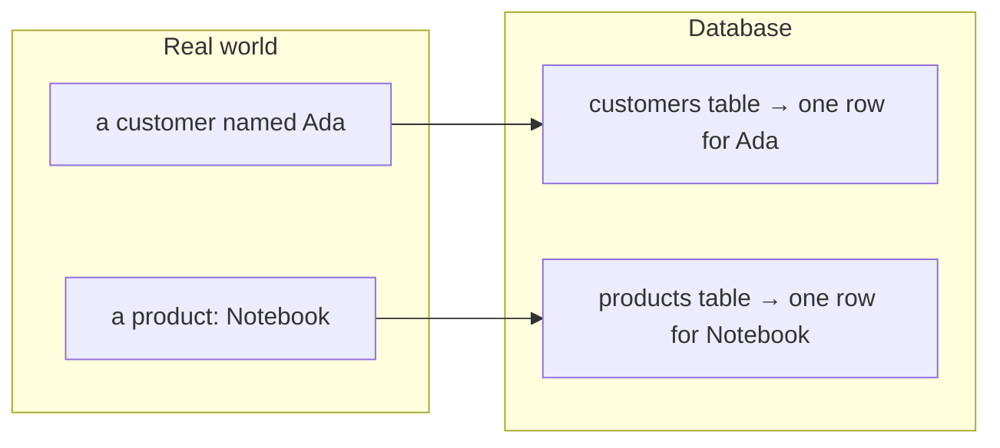
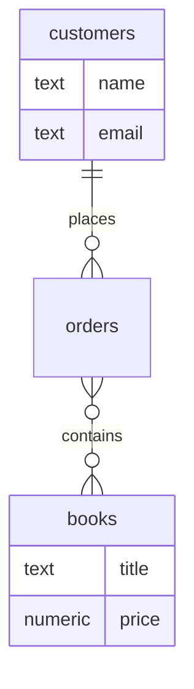

Before writing a single `CREATE TABLE`, good database design starts
on paper (or in your head) by asking: *what are the real things this
system is about, and how do they relate?* This habit is called
**data modeling**, and its core unit is the **entity**.

<Figure
  slug="sql-thinking-in-entities-cutout"
  alt="Thinking in entities, an isometric illustration"
/>

## What is an entity?

An **entity** is a distinct "thing" your data is about, something
you would naturally talk about in the real world: a *customer*, a
*product*, an *order*, a *student*, a *course*. Each entity usually
becomes a **table**, and each real instance of it becomes a **row**.

<Figure
  slug="sql-thinking-in-entities-entity-inline-cutout"
  alt="One crate lifted from a heap of mixed facts and set alone on a bench with its own facts inside"
/>

A simple test: if you find yourself saying "each one has..." or
"we have many of these," you have probably found an entity.

## Finding entities in a description

Data modeling often begins with a plain-English description. The
**nouns** are your candidate entities; the facts about them are
their **attributes**. Read this sentence:

> "A **bookstore** sells **books** to **customers**, who place
> **orders**."

The nouns, bookstore, book, customer, order, are candidate
entities. Now ask of each: *what do we need to know about it?* Those
become attributes (columns):

| Entity | Attributes |
| --- | --- |
| `books` | title, author, price |
| `customers` | name, email |
| `orders` | order date, total |

Notice attributes describe **one** instance of the entity: one book
has one title and one price. If a "fact" really describes *many*
values (a customer's many orders), that is a sign of a
**relationship** to another entity, not an attribute.

<Figure
  slug="sql-thinking-in-entities-inline-cutout"
  alt="A bench of loose facts being sorted into three labelled crates, each crate holding one kind of thing"
/>

## Attributes vs. relationships

Telling these two apart is the heart of modeling:

- An **attribute** is a single value owned by one row, a book's
  `price`, a customer's `email`.
- A **relationship** is a connection to another entity, a customer
  *places* orders, an order *contains* books.

The verbs in the description, *sells*, *places*, *contains*, point
to relationships. The "many" symbols on the diagram (`o{`) capture
how many of each side participate, just as you saw with foreign keys
and junction tables.

## A worked example

Let's turn a short description into a model. Imagine a library:

> "A library lends **books** to **members**. Each loan records when
> a book was borrowed and when it is due."

Working through it:

1. **Entities (nouns):** `books`, `members`, and `loans`, a loan is
   a real thing we track, so it is its own entity.
2. **Attributes:** books have a `title`; members have a `name`;
   loans have a `borrowed_on` and `due_on`.
3. **Relationships:** a member *has* many loans; a book *appears in*
   many loans. `loans` connects the two, it is a junction-like
   entity that also carries its own dates.

<SqlCodeBlock
  dialect="postgres"
  title="The library model, expressed as tables"
  initSql={`CREATE TABLE members (
  id   INTEGER PRIMARY KEY,
  name TEXT
);
CREATE TABLE books (
  id    INTEGER PRIMARY KEY,
  title TEXT
);
CREATE TABLE loans (
  id          INTEGER PRIMARY KEY,
  member_id   INTEGER REFERENCES members(id),
  book_id     INTEGER REFERENCES books(id),
  borrowed_on DATE,
  due_on      DATE
);
INSERT INTO members (id, name) VALUES (1,'Ada'),(2,'Grace');
INSERT INTO books (id, title) VALUES (10,'SQL Basics'),(11,'Databases 101');
INSERT INTO loans (id, member_id, book_id, borrowed_on, due_on) VALUES
  (100, 1, 10, DATE '2026-05-01', DATE '2026-05-15'),
  (101, 2, 11, DATE '2026-05-03', DATE '2026-05-17');`}
  starterCode={`SELECT
  m.name,
  b.title,
  l.borrowed_on,
  l.due_on
FROM
  loans l
  JOIN members m ON m.id = l.member_id
  JOIN books b ON b.id = l.book_id
ORDER BY
  l.borrowed_on;`}
/>

Every noun became a table, every fact-about-one-thing became a
column, and every verb became a foreign-key relationship. That is
the entire modeling reflex in miniature.

<Callout type="info" title="Model before you build">
Spending a few minutes naming entities, attributes, and
relationships *before* creating tables prevents the most common
beginner mistake: cramming many different things into one giant
table.
</Callout>

## Check your understanding

<MultipleChoice
  markdown={`In data modeling, what is an **entity**?

- A single column in a table.
  > A column is an attribute of an entity, not the entity itself.
- A connection between two tables.
  > A connection is a relationship; an entity is the thing being connected.
- [o] A distinct real-world "thing" the data is about, which usually becomes a table.
  > Entities are the core nouns of a system (customer, order, book) and typically map to tables.
- A query that summarizes data.
  > A query reads data; an entity is part of the data's structure.

An entity is a real-world thing the data describes, usually realized as a table.`}
/>

<MultipleChoice
  markdown={`When turning a plain-English description into a model, which words are the best clues to **entities**?

- The numbers.
  > Numbers are usually attribute values, not entities.
- The verbs.
  > Verbs hint at relationships between entities, not the entities themselves.
- [o] The nouns.
  > Nouns name the things a system tracks, which become candidate entities.
- The adjectives.
  > Adjectives tend to describe attributes' qualities, not the core things themselves.

Nouns in a description point to the entities; verbs point to relationships.`}
/>

<MultipleChoice
  markdown={`A customer can have many orders. How should "the customer's orders" be modeled?

- [o] As a relationship to a separate \`orders\` entity, linked by a foreign key.
  > "Many orders" is a relationship to another entity, expressed with a foreign key, not an attribute.
- It cannot be modeled in a relational database.
  > One-to-many relationships are a core, well-supported relational pattern.
- As an attribute, since every fact about a customer is an attribute.
  > A fact that has *many* values per row signals a relationship, not a single-valued attribute.
- As a single column on the customers table listing all order ids.
  > Stuffing many values into one column breaks the one-value-per-cell idea and is hard to query.

"Many of something" per row is a relationship to another entity, modeled with a foreign key.`}
/>
