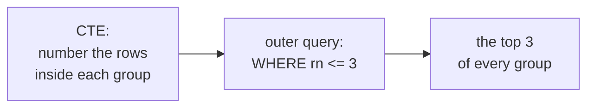

*"The top three products in each category."* *"Each customer's most
recent order."* *"The highest-paid person per department."* These all
have the same shape, they are asked constantly, and plain `GROUP BY`
answers none of them. The window functions from the last few lessons
combine into one reliable pattern.

<Figure
  slug="sql-top-n-per-group-cutout"
  alt="Top N per group, an isometric illustration"
/>

## Why MAX does not solve it

The instinct is `GROUP BY department` with `MAX(salary)`, and it gets
you the number but not the person:

<SqlCodeBlock
  dialect="postgres"
  title="MAX gives the salary, not the employee"
  initSql={`CREATE TABLE staff (
  id         INTEGER PRIMARY KEY,
  name       TEXT,
  department TEXT,
  salary     NUMERIC
);
INSERT INTO staff (id, name, department, salary) VALUES
  (1,'Ada','Engineering',95000), (2,'Ben','Engineering',88000),
  (3,'Cleo','Engineering',102000), (4,'Dan','Engineering',76000),
  (5,'Elle','Engineering',118000), (6,'Finn','Engineering',81000),
  (7,'Gia','Sales',67000), (8,'Hugo','Sales',72000),
  (9,'Iris','Sales',59000), (10,'Jae','Sales',84000),
  (11,'Kai','Sales',63000), (12,'Lena','Sales',91000),
  (13,'Mira','Support',52000), (14,'Nils','Support',48000),
  (15,'Omar','Support',56000), (16,'Pia','Support',61000),
  (17,'Quinn','Support',45000), (18,'Rui','Support',58000),
  (19,'Sana','Design',78000), (20,'Tom','Design',82000),
  (21,'Uma','Design',69000), (22,'Vic','Design',74000),
  (23,'Wren','Design',87000), (24,'Zoe','Design',71000);`}
  starterCode={`SELECT
  department,
  MAX(salary) AS top_salary
FROM
  staff
GROUP BY
  department
ORDER BY
  department;`}
/>

Four rows, four numbers, and no names, because `name` did not survive
the grouping. Adding `name` to the select list is an error, and adding
it to the `GROUP BY` changes the question entirely.

## The pattern: rank, then filter

Window functions cannot go in `WHERE`, since `WHERE` runs first. So
the ranking goes in a CTE, and the filter reads the CTE:

<SqlCodeBlock
  dialect="postgres"
  title="The two highest earners in every department"
  initSql={`CREATE TABLE staff (
  id         INTEGER PRIMARY KEY,
  name       TEXT,
  department TEXT,
  salary     NUMERIC
);
INSERT INTO staff (id, name, department, salary) VALUES
  (1,'Ada','Engineering',95000), (2,'Ben','Engineering',88000),
  (3,'Cleo','Engineering',102000), (4,'Dan','Engineering',76000),
  (5,'Elle','Engineering',118000), (6,'Finn','Engineering',81000),
  (7,'Gia','Sales',67000), (8,'Hugo','Sales',72000),
  (9,'Iris','Sales',59000), (10,'Jae','Sales',84000),
  (11,'Kai','Sales',63000), (12,'Lena','Sales',91000),
  (13,'Mira','Support',52000), (14,'Nils','Support',48000),
  (15,'Omar','Support',56000), (16,'Pia','Support',61000),
  (17,'Quinn','Support',45000), (18,'Rui','Support',58000),
  (19,'Sana','Design',78000), (20,'Tom','Design',82000),
  (21,'Uma','Design',69000), (22,'Vic','Design',74000),
  (23,'Wren','Design',87000), (24,'Zoe','Design',71000);`}
  starterCode={`WITH
  ranked AS (
    SELECT
      name,
      department,
      salary,
      ROW_NUMBER() OVER (
        PARTITION BY department
        ORDER BY salary DESC
      ) AS rn
    FROM
      staff
  )
SELECT
  department,
  name,
  salary
FROM
  ranked
WHERE
  rn <= 2
ORDER BY
  department,
  salary DESC;`}
/>

Eight rows: two per department, with names attached. Change `2` to `5`
and the query still works. Change the `ORDER BY` inside the window to
`ASC` and it returns the *lowest* paid instead.

<Figure
  slug="sql-top-n-per-group-rank-then-filter-inline-cutout"
  alt="Four short towers standing on a bench with the top two blocks of every tower lifted off onto one shared tray beside them"
  caption="Order inside each group first, then keep the top of every tower."
/>

<Callout type="warn" title="The filter must be outside the window step">
`WHERE ROW_NUMBER() OVER (...) <= 2` does not work in any SQL
database. The row filter is applied before window functions are
computed, so the rank does not exist yet. The CTE is not a style
choice; it is what makes the query legal.
</Callout>

## Choosing the ranking function on purpose

Which of the three ranking functions you use decides what happens when
two rows tie at the cut line:

| Function | Behaviour at a tie | Rows returned |
| --- | --- | --- |
| `ROW_NUMBER()` | picks one arbitrarily | exactly N per group |
| `RANK()` | keeps both | N or more per group |
| `DENSE_RANK()` | keeps both, no gaps | N distinct values per group |

<SqlCodeBlock
  dialect="postgres"
  title="Same cut-off, three different answers"
  initSql={`CREATE TABLE staff (
  id         INTEGER PRIMARY KEY,
  name       TEXT,
  department TEXT,
  salary     NUMERIC
);
INSERT INTO staff (id, name, department, salary) VALUES
  (1,'Ada','Engineering',95000), (2,'Ben','Engineering',95000),
  (3,'Cleo','Engineering',102000), (4,'Dan','Engineering',76000),
  (5,'Elle','Engineering',118000), (6,'Finn','Engineering',81000),
  (7,'Gia','Sales',67000), (8,'Hugo','Sales',72000),
  (9,'Iris','Sales',59000), (10,'Jae','Sales',84000),
  (11,'Kai','Sales',84000), (12,'Lena','Sales',91000),
  (13,'Mira','Support',52000), (14,'Nils','Support',48000),
  (15,'Omar','Support',56000), (16,'Pia','Support',61000),
  (17,'Quinn','Support',45000), (18,'Rui','Support',58000),
  (19,'Sana','Design',78000), (20,'Tom','Design',82000),
  (21,'Uma','Design',69000), (22,'Vic','Design',74000),
  (23,'Wren','Design',87000), (24,'Zoe','Design',71000);`}
  starterCode={`WITH
  ranked AS (
    SELECT
      name,
      department,
      salary,
      ROW_NUMBER() OVER w AS rn,
      RANK()       OVER w AS rk,
      DENSE_RANK() OVER w AS dr
    FROM
      staff
    WINDOW
      w AS (PARTITION BY department ORDER BY salary DESC)
  )
SELECT
  department,
  name,
  salary,
  rn,
  rk,
  dr
FROM
  ranked
WHERE
  rk <= 2
ORDER BY
  department,
  salary DESC;`}
/>

Engineering has two people on 95,000. Filtering on `rk <= 2` returns
three Engineering rows, because both of them are ranked 2. Filtering
on `rn <= 2` would have returned exactly two and silently dropped a
person who tied. Neither is a bug; you have to decide which you want.

## The latest row per group

Swap salary for a date and the same pattern answers *"each customer's
most recent order"*:

<SqlCodeBlock
  dialect="postgres"
  title="Every customer's latest order"
  initSql={`CREATE TABLE orders (
  id          INTEGER PRIMARY KEY,
  customer_id INTEGER,
  placed_on   DATE,
  amount      NUMERIC
);
INSERT INTO orders (id, customer_id, placed_on, amount) VALUES
  (1,1,'2025-01-04',120), (2,1,'2025-01-19',80), (3,1,'2025-02-02',210),
  (4,1,'2025-03-15',95), (5,1,'2025-03-28',60), (6,1,'2025-05-01',175),
  (7,2,'2025-01-07',45), (8,2,'2025-01-09',130), (9,2,'2025-02-18',90),
  (10,2,'2025-02-25',160), (11,2,'2025-04-03',115), (12,2,'2025-04-30',200),
  (13,3,'2025-01-12',70), (14,3,'2025-02-11',155), (15,3,'2025-02-27',105),
  (16,3,'2025-03-06',135), (17,3,'2025-04-14',80), (18,3,'2025-05-20',190),
  (19,4,'2025-01-22',125), (20,4,'2025-03-01',100), (21,4,'2025-03-19',55),
  (22,4,'2025-04-08',145), (23,4,'2025-04-21',165), (24,4,'2025-06-02',85);`}
  starterCode={`WITH
  numbered AS (
    SELECT
      customer_id,
      placed_on,
      amount,
      ROW_NUMBER() OVER (
        PARTITION BY customer_id
        ORDER BY placed_on DESC
      ) AS recency
    FROM
      orders
  )
SELECT
  customer_id,
  placed_on,
  amount
FROM
  numbered
WHERE
  recency = 1
ORDER BY
  customer_id;`}
/>

## DISTINCT ON: PostgreSQL's shortcut for N = 1

When N is exactly 1, PostgreSQL offers a shorter route.
`SELECT DISTINCT ON (customer_id)` keeps the **first** row it meets for
each distinct `customer_id`, and the `ORDER BY` decides which row that
is:

<SyntaxBreakdown
  parts={[
    { text: "SELECT DISTINCT ON", label: "keep one row per..." },
    { text: "(customer_id)", label: "...distinct value of this" },
    { text: "* FROM orders" },
    { text: "ORDER BY customer_id, placed_on DESC", label: "must start with the same column" },
  ]}
/>

<SqlCodeBlock
  dialect="postgres"
  title="The same answer with DISTINCT ON"
  initSql={`CREATE TABLE orders (
  id          INTEGER PRIMARY KEY,
  customer_id INTEGER,
  placed_on   DATE,
  amount      NUMERIC
);
INSERT INTO orders (id, customer_id, placed_on, amount) VALUES
  (1,1,'2025-01-04',120), (2,1,'2025-01-19',80), (3,1,'2025-02-02',210),
  (4,1,'2025-03-15',95), (5,1,'2025-03-28',60), (6,1,'2025-05-01',175),
  (7,2,'2025-01-07',45), (8,2,'2025-01-09',130), (9,2,'2025-02-18',90),
  (10,2,'2025-02-25',160), (11,2,'2025-04-03',115), (12,2,'2025-04-30',200),
  (13,3,'2025-01-12',70), (14,3,'2025-02-11',155), (15,3,'2025-02-27',105),
  (16,3,'2025-03-06',135), (17,3,'2025-04-14',80), (18,3,'2025-05-20',190),
  (19,4,'2025-01-22',125), (20,4,'2025-03-01',100), (21,4,'2025-03-19',55),
  (22,4,'2025-04-08',145), (23,4,'2025-04-21',165), (24,4,'2025-06-02',85);`}
  starterCode={`SELECT DISTINCT ON (customer_id)
  customer_id,
  placed_on,
  amount
FROM
  orders
ORDER BY
  customer_id,
  placed_on DESC;`}
/>

<Callout type="info" title="Convenient, and not portable">
`DISTINCT ON` is a PostgreSQL extension. The `ROW_NUMBER()` pattern
runs unchanged on SQLite, DuckDB, MySQL, SQL Server and BigQuery, so
it is the one worth learning first. Some databases (DuckDB and
Snowflake among them) add a `QUALIFY` clause that filters window
results directly and removes the need for the CTE; PostgreSQL has no
such clause.
</Callout>

## Practice challenge

<SqlChallengeCard
  dialect="postgres"
  title="The two best-selling products in each category"
  instructions={`The \`products\` table has \`name\`, \`category\` and \`units_sold\`. Return \`category\`, \`name\` and \`units_sold\` for the two best-selling products in each category, sorted by \`category\` then \`units_sold\` descending. There are no ties, so exactly 8 rows should come back.

\`\`\`sql
WITH ranked AS (
  SELECT ..., ROW_NUMBER() OVER (PARTITION BY ... ORDER BY ... DESC) AS rn
  FROM products
)
SELECT ... FROM ranked WHERE rn <= 2 ...
\`\`\``}
  initSql={`CREATE TABLE products (
  id         SERIAL PRIMARY KEY,
  name       TEXT NOT NULL,
  category   TEXT NOT NULL,
  units_sold INTEGER NOT NULL
);
INSERT INTO products (name, category, units_sold) VALUES
  ('Kettle','Kitchen',420), ('Blender','Kitchen',380),
  ('Toaster','Kitchen',510), ('Whisk','Kitchen',290),
  ('Pan','Kitchen',640), ('Ladle','Kitchen',155),
  ('Lamp','Lighting',300), ('Sconce','Lighting',720),
  ('Bulb','Lighting',610), ('Shade','Lighting',180),
  ('Torch','Lighting',350), ('Dimmer','Lighting',260),
  ('Chair','Furniture',495), ('Desk','Furniture',830),
  ('Stool','Furniture',275), ('Shelf','Furniture',610),
  ('Bench','Furniture',140), ('Table','Furniture',390),
  ('Mug','Tableware',700), ('Plate','Tableware',465),
  ('Bowl','Tableware',520), ('Fork','Tableware',380),
  ('Glass','Tableware',650), ('Spoon','Tableware',215);`}
  starterCode={`-- Rank inside each category, then keep the top two.
SELECT
  category,
  name,
  units_sold
FROM
  products
ORDER BY
  category,
  units_sold DESC;`}
  solutionSql={`WITH
  ranked AS (
    SELECT
      category,
      name,
      units_sold,
      ROW_NUMBER() OVER (
        PARTITION BY category
        ORDER BY units_sold DESC
      ) AS rn
    FROM
      products
  )
SELECT
  category,
  name,
  units_sold
FROM
  ranked
WHERE
  rn <= 2
ORDER BY
  category,
  units_sold DESC;`}
  tests={[
    {
      id: "columns",
      name: "Returns category, name, units_sold",
      description: "Three columns, in that order.",
      expectedColumns: ["category", "name", "units_sold"],
    },
    {
      id: "row_count",
      name: "Returns two rows per category",
      description: "Four categories, two rows each.",
      expectedRowCount: 8,
    },
    {
      id: "matches",
      name: "Matches the reference solution",
      description: "The two highest units_sold within each category.",
      matchesSolution: true,
    },
  ]}
/>

## Check your understanding

<MultipleChoice
  markdown={`Why does the top-N pattern need a CTE or subquery?

- Because \`ROW_NUMBER()\` can only be selected, never compared.
  > It can be compared like any other value, but only after it has been computed.
- Because a CTE is the only place \`PARTITION BY\` is allowed.
  > Partitioning works anywhere a window function is valid, including a plain \`SELECT\`.
- [o] Because \`WHERE\` runs before window functions, so the rank is not available to it.
  > Computing the rank in one step and filtering it in the next is what makes the comparison legal.
- Because window functions may not appear in a \`SELECT\` list with other columns.
  > They coexist with ordinary columns; that is the point of them.

The CTE exists to put the rank in a place the outer \`WHERE\` can see.`}
/>

<MultipleChoice
  markdown={`Two employees tie for second-highest salary in a department. Filtering on \`RANK() <= 2\` returns how many rows for that department?

- Two, with the tie broken by primary key order.
  > \`RANK()\` does not break ties; it assigns both rows the same value.
- One, because the tie makes the second position ambiguous.
  > A tie removes nothing; both tied rows keep their shared rank.
- [o] Three, because both tied employees are ranked 2.
  > The rank is shared, so the filter admits the top earner and both people on the second position.
- Four, because \`RANK()\` skips a position after every tie.
  > The skip affects the *next* distinct value, which is ranked 4 and excluded by the filter.

Use \`ROW_NUMBER()\` when you need exactly N rows per group.`}
/>

<MultipleChoice
  markdown={`What does \`SELECT DISTINCT ON (customer_id) ... ORDER BY customer_id, placed_on DESC\` return?

- One row per customer, chosen at random from their orders.
  > The choice is fully determined by the \`ORDER BY\`, not arbitrary.
- Every order, with duplicate customers marked.
  > \`DISTINCT ON\` reduces the result to one row per named value.
- One row per distinct \`placed_on\` date across the table.
  > The parenthesised column decides what is made distinct, and that is \`customer_id\`.
- [o] Each customer's most recent order, as one row per customer.
  > The first row per customer under that ordering is the one with the latest date.

The \`ORDER BY\` must begin with the \`DISTINCT ON\` columns, and the rest of it picks the winner.`}
/>

That is the window function toolkit complete. Next, a look at how all
these clauses fit together in the order the database actually runs
them.
