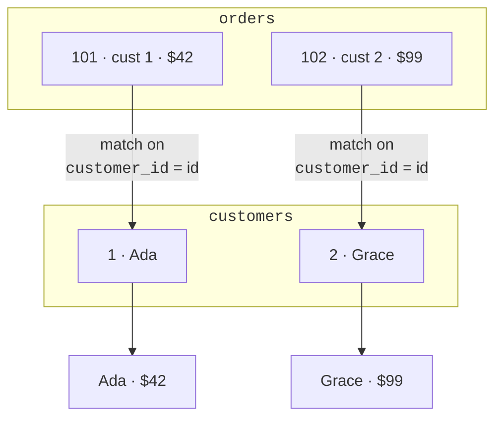
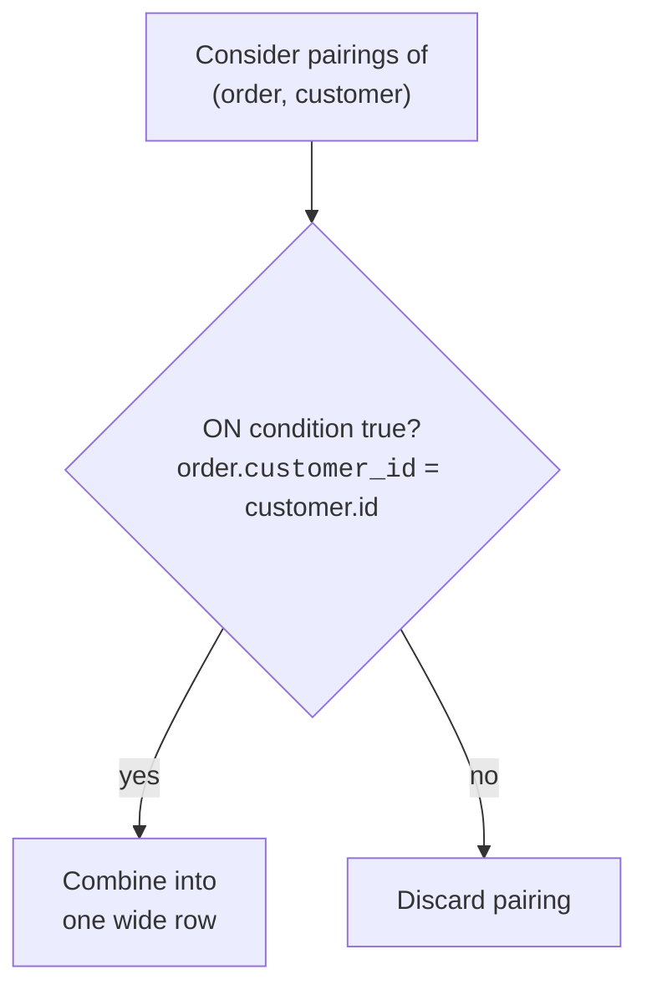

A **join** combines rows from two tables into a single result by
**matching them on a condition**, almost always a foreign key
meeting the primary key it points to. Joins are how the relational
model delivers on its promise: data split for storage, recombined
for answers. This page builds the intuition; the next two cover the
specific kinds.

<Figure
  slug="sql-understanding-joins-cutout"
  alt="Understanding joins, an isometric illustration"
/>

## The question a join answers

You have customers in one table and orders in another. Neither table
alone can answer *"show each order with its customer's name."* The
name is in `customers`; the amount is in `orders`. A join stitches
them together:

For each order, the database finds the customer whose `id` equals
the order's `customer_id`, and glues their columns together into one
wide row.

## The anatomy of a JOIN

A join lives in the `FROM` part of a query. It names a second table
and the **matching condition** with `ON`:

<SqlCodeBlock
  dialect="postgres"
  title="Your first join, narrated"
  initSql={`CREATE TABLE customers (
  id SERIAL PRIMARY KEY, name TEXT
);
CREATE TABLE orders (
  id SERIAL PRIMARY KEY, customer_id INTEGER REFERENCES customers(id), amount NUMERIC
);
INSERT INTO customers (name) VALUES ('Ada'), ('Grace');
INSERT INTO orders (id, customer_id, amount) VALUES (101, 1, 42), (102, 2, 99);`}
  starterCode={`SELECT
  orders.id AS order_id,
  customers.name AS customer,
  orders.amount
FROM
  orders
  JOIN customers ON orders.customer_id = customers.id;`}
/>

Read it: *"From orders, joined to customers wherever the order's
`customer_id` equals the customer's `id`, give me the order id, the
customer name, and the amount."* The `ON` clause is the heart, it
states which rows belong together.

## Table aliases keep joins readable

Writing `orders.` and `customers.` everywhere is tedious. SQL lets
you give each table a short **alias** right after its name, then use
the alias as a prefix:

<SqlCodeBlock
  dialect="postgres"
  title="The same join, with aliases o and c"
  initSql={`CREATE TABLE customers (
  id SERIAL PRIMARY KEY, name TEXT
);
CREATE TABLE orders (
  id SERIAL PRIMARY KEY, customer_id INTEGER REFERENCES customers(id), amount NUMERIC
);
INSERT INTO customers (name) VALUES ('Ada'), ('Grace');
INSERT INTO orders (id, customer_id, amount) VALUES (101, 1, 42), (102, 2, 99);`}
  starterCode={`SELECT
  o.id AS order_id,
  c.name AS customer,
  o.amount
FROM
  orders o
  JOIN customers c ON o.customer_id = c.id;`}
/>

`orders o` means "call orders `o` here." This is the style you will
see in nearly all real SQL, because joins of three or four tables
would be unreadable otherwise.

<Callout type="info" title="Why prefix columns at all?">
Both tables might have a column named `id`. Writing `o.id` versus
`c.id` removes the ambiguity, it tells the database (and the
reader) *which* table's `id` you mean. When a column name exists in
only one table, the prefix is optional, but using it consistently
keeps joins clear.
</Callout>

## A join is a matching process

Picture a join as checking every possible pairing of rows and
keeping the ones where the `ON` condition is true:

You do not literally write that loop, remember, SQL is declarative.
You *describe the match* with `ON`, and the database finds an
efficient way to perform it. But this "keep the matching pairs"
picture is exactly what a join means.

## What comes next

There is one more crucial question: what about rows that have **no
match**? An order with a missing customer, or a customer with no
orders, do they appear or vanish? The answer depends on the *kind*
of join, and that is precisely what the next two pages, **Inner
Joins** and **Outer Joins**, are about.

## Check your understanding

<MultipleChoice
  markdown={`What does a **join** do?

- [o] It combines rows from two tables into one result by matching them on a condition.
  > A join pairs rows that satisfy its \`ON\` condition and merges their columns into single result rows.
- It deletes rows that appear in two tables.
  > Joins combine data; they do not delete rows from your tables.
- It sorts a single table by two columns.
  > Sorting is \`ORDER BY\`; a join is about combining tables.
- It copies one table on top of another.
  > A join matches related rows on a condition rather than blindly stacking tables.

A join merges related rows from two tables based on a matching condition.`}
/>

<MultipleChoice
  markdown={`In \`JOIN customers c ON o.customer_id = c.id\`, what is the role of the \`ON\` clause?

- [o] It states the condition for matching rows between the two tables.
  > \`ON\` defines which order pairs with which customer, here, equal \`customer_id\` and \`id\`.
- It limits how many rows are returned.
  > Limiting rows is \`LIMIT\`; \`ON\` is the matching condition.
- It sorts the combined result.
  > Sorting is \`ORDER BY\`; \`ON\` defines the match.
- It chooses which columns appear in the output.
  > Choosing output columns is the job of \`SELECT\`; \`ON\` specifies how rows are matched.

The \`ON\` clause defines how rows from the two tables are matched.`}
/>

<MultipleChoice
  markdown={`Why are table aliases like \`orders o\` and \`customers c\` commonly used in joins?

- [o] They give each table a short prefix, making column references shorter and removing ambiguity when both tables share a column name.
  > Aliases let you write \`o.id\` versus \`c.id\` clearly and concisely, which matters as joins grow.
- They permanently rename the tables in the database.
  > An alias applies only within that query; the table keeps its real name.
- They make the query run on more tables at once.
  > Aliases do not change how many tables are involved; they are a readability convenience.
- They are required for every single query.
  > Aliases are optional; they are simply very helpful in joins.

Aliases shorten and disambiguate column references within a query.`}
/>
