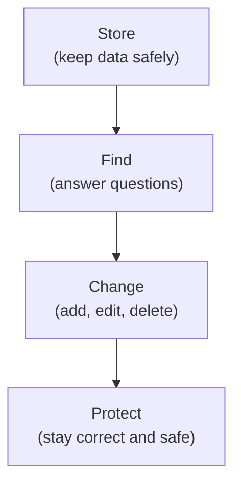
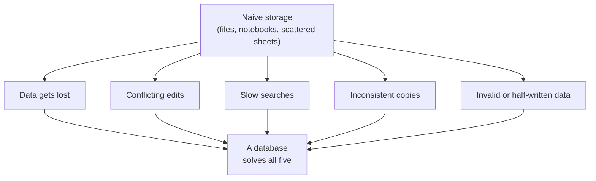
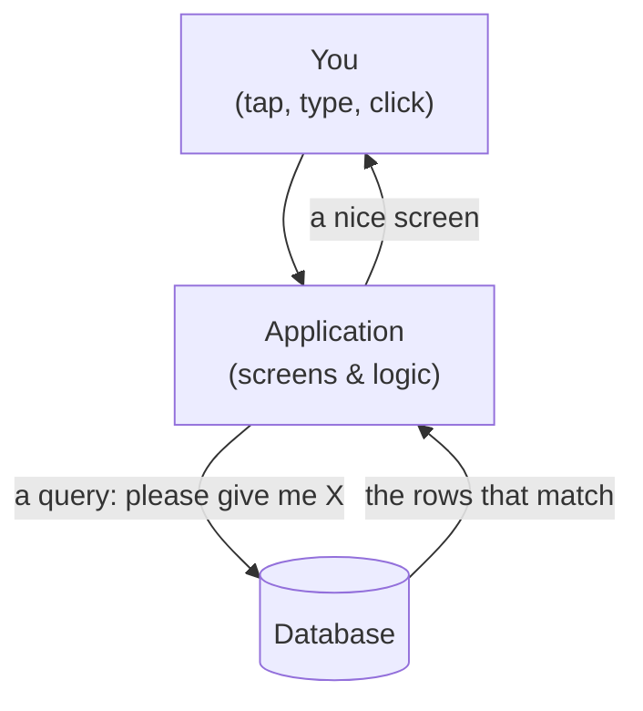
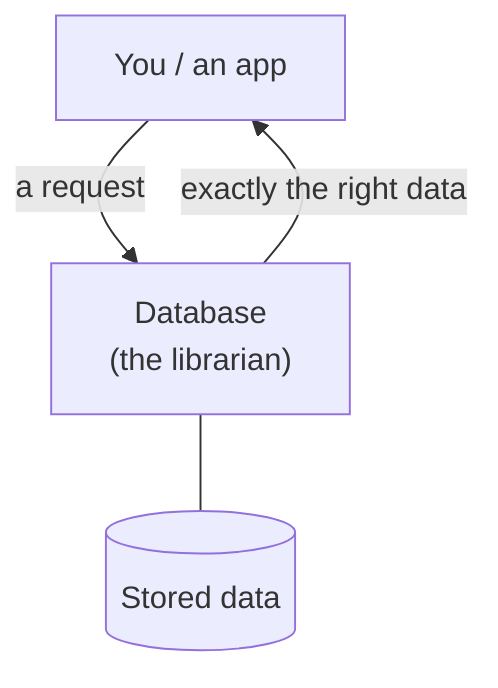

You used a database before breakfast today. Probably a dozen. The
alarm app that remembered your wake-up time, the bank app that knew
your balance, the message thread that still had last night's
conversation, the coffee shop register that rang up your order,
every one of them leaned on a database. They are the most invisible
successful technology in the world, and this page makes them
visible.

<Figure
  slug="sql-what-is-a-database-cutout"
  alt="What is a database, an isometric illustration"
/>

## A first, honest definition

A **database** is an organized collection of information, together
with software that lets you **store**, **find**, **change**, and
**protect** that information reliably, even when many people and
programs use it at the same time.

Read that again slowly. There are four verbs hiding in it, and they
are the whole reason databases exist:

A pile of files can *store* data. A database is what you get when
storing is the easy part, and **finding, changing, and protecting**
the data, quickly, correctly, and at scale, become the hard part.

<Callout type="info" title="Database vs. database system">
Strictly speaking, the organized data is the *database*, and the
software that manages it is the *database management system*, or
**DBMS**. PostgreSQL is a DBMS. In everyday speech people say
"database" for both, and so will we, but it is useful to know that
the data and the software managing it are two different things.
</Callout>

## The five nightmares

Databases were not invented because someone thought they were
elegant. They were invented because, without them, working with
data at any real scale becomes a nightmare, five distinct
nightmares, in fact. Every feature you will learn in this course
exists to prevent one of them.

**Nightmare 1: losing the data.** Imagine a shop that records every
sale in a notebook. The notebook can be lost, burned, soaked, or
simply run out of pages. If two clerks each keep their own
notebook, the records are split across two places that may
disagree. A database provides **durable, central storage**: one
trusted place where data lives, survives crashes, and can be backed
up.

**Nightmare 2: many people at once.** Now imagine ten clerks all
updating the same inventory at the same moment. Two of them sell
the last umbrella within the same second, who actually got it?
Without coordination, the shop just sold one umbrella twice.
Databases solve this with **concurrency control**: many users can
read and write at the same time, and the data stays consistent.
The last umbrella is sold exactly once.

**Nightmare 3: slow searches.** A notebook with 100 sales is easy
to scan. A notebook with 10 million is not, answering *"how much
did we sell in March to customers in Ohio?"* by reading every line
would take days. Databases are built to **answer questions fast**,
even over huge amounts of data, using clever internal structures so
that finding the right rows does not require reading every row.

**Nightmare 4: copies that disagree.** Suppose a customer's address
is written in five different places, and the customer moves. You
must remember to update all five, miss one, and your data quietly
contradicts itself. Which address is correct? Nobody knows.
Databases let you store each fact **once** and refer to it from
everywhere else. This idea, *don't repeat the same fact*, is the
beating heart of relational databases, and we will return to it
again and again.

**Nightmare 5: nonsense and half-finished work.** Data needs
protecting from accidents (a program crashes halfway through
recording a sale) and from bad values (a price of `"banana"`, an
age of `-7`). Databases guarantee that a change either fully
happens or does not happen at all, and they **enforce rules** about
what counts as valid data, refusing values that break them.

When a concept later in the course feels abstract, ask yourself:
*which of these five nightmares is this protecting me from?* The
answer is almost always illuminating.

## What the stored data looks like

So a database keeps data safe, consistent, and findable. But what
does the data actually *look like* inside? The relational answer is
disarmingly simple: **rectangles.**

Almost all useful data is a collection of **facts about things**.
"This customer is named Ada and lives in Toronto." "This order was
placed on March 3rd for \$42." A relational database groups those
facts into **tables**: each **row** is one thing (one customer, one
order), each **column** is one attribute (a name, a city, a price),
and each **cell** holds a single value.

| id | name | city |
| --- | --- | --- |
| 1 | Ada | Toronto |
| 2 | Linus | Helsinki |
| 3 | Grace | New York |

Why a grid, rather than paragraphs of text? Because a grid makes
questions answerable *mechanically*. "Which rows have
`city = 'Toronto'`?", check one column. "How many customers?",
count the rows. Every value has a known place and a known kind,
and that regularity is what lets a computer answer questions about
millions of facts in milliseconds. Here is that exact table, alive.
Run the query and what comes back is the stored grid itself:

<SqlCodeBlock
  dialect="postgres"
  title="A stored table is just a grid of rows and columns"
  initSql={`CREATE TABLE customers (
  id   INTEGER,
  name TEXT,
  city TEXT
);
INSERT INTO customers (id, name, city) VALUES
  (1, 'Ada',   'Toronto'),
  (2, 'Linus', 'Helsinki'),
  (3, 'Grace', 'New York');`}
  starterCode={`SELECT
  *
FROM
  customers;`}
/>

The `*` means "every column." That labeled grid is the single most
important image in this course, almost everything we do from here
is *reading* such a grid, *changing* it, or *combining* two of
them. The next section makes each part of it precise.

## Where the database hides in an app

One last piece of the picture. When you use an app, a store, a
chat, a banking site, there are really **two separate things**
working together: the **application** (the screens and buttons you
touch) and the **database** (the quiet, screen-less system that
remembers everything). The application never stores the real data
itself. Every time it needs to remember or retrieve something, it
sends the database a request written in SQL. That request is called
a **query**.

<Figure
  slug="sql-what-is-a-database-first-honest-definition-inline-cutout"
  alt="A strongroom with several benches drawing from it at once, each holding only a small tray"
  caption="The database holds the facts; the application only borrows them."
/>

<Figure
  slug="sql-what-is-a-database-inline-cutout"
  alt="A shared strongroom with several benches drawing from it at once, each bench holding only a small tray"
  caption="One database, many applications, and one shared version of the truth."
/>

Open a food-delivery app and tap a restaurant: that is a query
("give me the menu for restaurant 57"). Place an order: another
query ("insert this order"). The app is, to a surprising degree, a
friendly face on top of a stream of SQL, and the language of that
stream is what you are here to learn. (For a fuller tour of this
picture, see [How Applications Use
Databases](/courses/intro-sql-postgres/how-applications-use-databases)
in the *Interesting discussions* section near the end of the
course.)

## A tiny mental model to carry with you

For the rest of this course, hold this picture in your head: a
database is a **trustworthy librarian** for your data.

You do not walk into the stacks and rummage around yourself. You
hand the librarian a precise request, *"every customer in Ohio who
ordered last month"*, and the librarian fetches exactly that,
quickly, without losing or damaging anything, even while answering
hundreds of other requests at the same time.

Two clarifications before we move on, because they trip people up.
A database is **not** a website or an app, apps *use* databases,
but the database itself has no buttons or screens. And a database
is **not** necessarily huge: it can hold ten rows or ten billion.
What makes it a database is *how* the data is managed, not how much
there is. (If you are wondering how all this compares to the
spreadsheets you already know, a genuinely interesting question,
that comparison gets its own page:
[Spreadsheets vs. Databases](/courses/intro-sql-postgres/spreadsheets-vs-databases),
also in *Interesting discussions*.)

So: organized data, a librarian guarding it, requests written in a
language called SQL. The obvious next questions are *why that
particular language* and *why PostgreSQL*, and the answers involve
a 1970 research paper, a trademark dispute, and a race IBM lost to
a startup. That story is next.

## Check your understanding

<MultipleChoice
  markdown={`Which of the following best describes what a database is?

- A website that displays information to users.
  > A website may *use* a database, but the database itself has no user interface. They are separate things.
- A single spreadsheet file stored on your desktop.
  > A spreadsheet can hold data, but a database is defined by the software that lets many users reliably store, find, change, and protect data, often far beyond what a spreadsheet can do.
- [o] An organized collection of data plus software that lets you reliably store, find, change, and protect it.
  > This captures the four jobs, store, find, change, protect, that make something a database rather than just a pile of files.
- A programming language for building apps.
  > A programming language is a tool for writing software; a database is the system that manages data. SQL is a language *for talking to* databases, which is different again.

A database is the combination of organized data and the management
system that keeps it reliable, searchable, and safe.`}
/>

<MultipleChoice
  markdown={`Two clerks try to sell the last item in stock at the same instant. Which database capability prevents the item from being sold twice?

- Fast searching over large tables.
  > Speed helps answer questions quickly but does not, by itself, coordinate simultaneous changes to the same data.
- Backing up data to survive crashes.
  > Backups protect against data loss, but they do not arbitrate between two simultaneous edits.
- Enforcing that prices are numbers, not text.
  > Validating data types keeps individual values sensible, but it does not resolve a race between two simultaneous sales.
- [o] Concurrency control, coordinating simultaneous reads and writes so the data stays consistent.
  > Concurrency control is precisely what lets many users act at once while ensuring the last item is sold exactly once.

Coordinating simultaneous access so the data stays correct is the job of concurrency control.`}
/>

<MultipleChoice
  markdown={`Storing a customer's address in five different places creates which classic problem that databases are designed to prevent?

- The address becomes impossible to search.
  > Having multiple copies does not prevent searching; the real risk is that the copies disagree after an update.
- [o] Inconsistency, if the address changes, some copies may be updated and others missed, so the data contradicts itself.
  > Storing a fact once and referring to it everywhere is exactly how relational databases avoid this, and it is a theme we return to throughout the course.
- The database runs out of memory.
  > Memory exhaustion is unrelated to having a few duplicate addresses; the genuine problem is conflicting copies.
- The data takes up too much disk space to store.
  > Storage space is rarely the real issue; copying a short address five times costs almost nothing. The deeper danger is the data disagreeing with itself.

Storing the same fact in many places risks those copies drifting out of sync, the consistency problem.`}
/>

<MultipleChoice
  markdown={`What is a SQL **query**, in plain terms?

- The physical disk where data is stored.
  > Storage hardware holds the data; a query is the request that asks the database to read or change that data.
- A backup copy of the database.
  > A backup is a safety copy of data; a query is an instruction or question sent to the database.
- [o] A precise request, a question or an instruction, sent to the database, written in SQL.
  > Whether it reads data or changes it, a query is the message that tells the database exactly what to do.
- A type of button inside an application.
  > Buttons are part of the application's interface; a query is the request the app sends to the database when a button is used.

A query is how you ask a database a question or tell it to make a change.`}
/>
