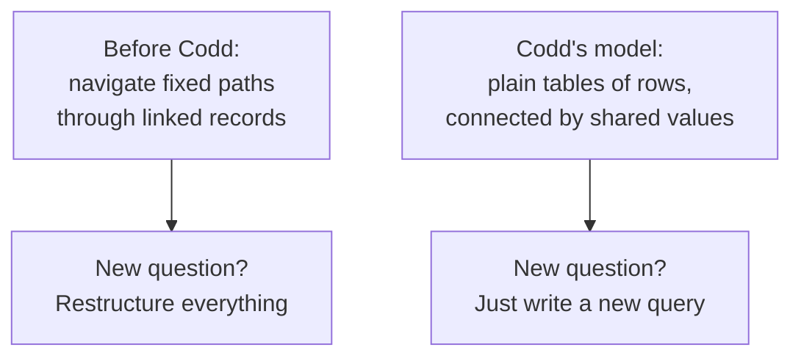
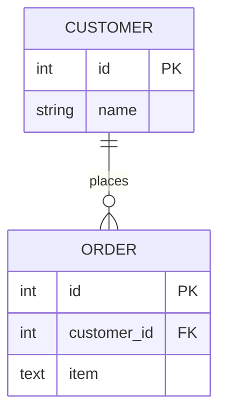
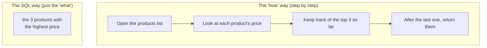

You know what a database is. Now: why do we talk to it in a strange
little language called SQL, and why does this course use a database
named PostgreSQL? Both answers are stories — true ones, with a
research lab, a trademark dispute, and a race that IBM lost to a
startup — and knowing them will make the language feel less like
arbitrary syntax and more like the punchline of a very good idea.

## 1970: Codd's dangerous idea

<IllustrationPrompt subject="Edgar F. Codd" photo />

In the late 1960s, databases already existed — and they were
miserable to use. Data was stored in rigid hierarchies and
networks, where the *paths* between records were baked into the
design. To find anything, a programmer had to know exactly how the
data was physically wired together and navigate it step by step,
like following directions through a maze. Want to ask a question
nobody anticipated when the maze was built? Too bad — you might
have to restructure everything.

Then, in June 1970, a British-born mathematician at IBM's San Jose
research lab named **Edgar F. Codd** published a paper with the
unglamorous title *"A Relational Model of Data for Large Shared
Data Banks."* Its idea was radical in its simplicity: store all
data in plain tables — what mathematicians call **relations** — and
let people ask *any* question later, in a logical language, without
knowing or caring how the data is physically stored.

That is the whole relational idea in one sentence: **a relational
database organizes data into tables, and lets those tables relate
to one another through shared values.** Customers in one table,
orders in another, and a shared value — the customer's id — tying
each order back to its customer:

(Don't worry about reading this diagram precisely yet — we will
learn the notation properly later. For now, just feel the shape:
two simple tables, one link.)

The model brought three gifts. **Simplicity:** there is exactly one
shape to learn — the table. **Flexibility:** because data is not
locked into pre-built paths, you can pose brand-new questions at
any time just by writing a new query. **No duplication:** each fact
is stored once and *referenced* everywhere else — the cure for the
"copies that disagree" nightmare from the previous page.

<Callout type="info" title='Why the name "relational"?'>
A common guess is that "relational" refers to the relationships
between tables. Reasonable — but the name actually comes from
mathematics, where a **relation** is essentially a table of rows.
The relationships are real and important either way; the name just
honors the math.
</Callout>

## SEQUEL, the trademark, and the race IBM lost

Codd's paper was theory. Someone had to build it. IBM — which had a
lucrative non-relational database product to protect — moved
cautiously, but in the mid-1970s its San Jose lab launched a
research project called **System R** to prove a relational database
could actually work. Two researchers on the project, **Donald
Chamberlin** and **Raymond Boyce**, designed a query language for
it that ordinary people, not just programmers, might read and
write. They called it **SEQUEL**: *Structured English Query
Language*.

The name did not survive contact with the lawyers. "SEQUEL" turned
out to be a trademark of Hawker Siddeley, a British aircraft
company, so the language's name was shortened to **SQL**. The
ghost of the old name lives on in how many people pronounce it:
you will hear both "sequel" and "S-Q-L," and both are fine.

<IllustrationPrompt subject="Larry Ellison" photo />

Meanwhile, the published System R papers were being read very
carefully in California by a young programmer named **Larry
Ellison**. His small company — later renamed **Oracle** — raced to
build a commercial implementation and shipped one in **1979**,
*before* IBM brought its own relational product to market. The
language born in IBM's research lab made a startup rich first.
Within a decade, SQL had become the standard language of data, and
it has outlived every fashionable technology that was supposed to
replace it since.

## The big idea inside SQL: say *what*, not *how*

Why did SQL win? Largely because of one genuinely surprising design
decision: **you describe the result you want, not the steps to
compute it.**

<svg
  viewBox="0 0 640 200"
  role="img"
  aria-label="A speech bubble of structured word bars is sent toward a grid of cells, lighting up exactly the cells that answer it"
  style={{ display: "block", width: "100%", maxWidth: "640px", height: "auto", margin: "2.5rem auto" }}
>
  <g style={{ color: "var(--ds-blue-500)" }} fill="currentColor">
    <rect x="60" y="44" width="180" height="84" rx="18" fillOpacity="0.15" />
    <polygon points="120,126 146,126 128,150" fillOpacity="0.15" />
    <rect x="78" y="66" width="52" height="10" rx="5" />
    <rect x="138" y="66" width="36" height="10" rx="5" fillOpacity="0.7" />
    <rect x="182" y="66" width="40" height="10" rx="5" fillOpacity="0.5" />
    <rect x="78" y="90" width="30" height="10" rx="5" fillOpacity="0.8" />
    <rect x="114" y="90" width="58" height="10" rx="5" fillOpacity="0.6" />
    <rect x="178" y="90" width="28" height="10" rx="5" />
  </g>
  <g fill="currentColor" opacity="0.3">
    <circle cx="262" cy="90" r="3.5" />
    <circle cx="286" cy="90" r="3.5" />
    <circle cx="310" cy="90" r="3.5" />
    <polygon points="326,80 326,100 344,90" />
  </g>
  <g fill="currentColor" opacity="0.08">
    <rect x="370" y="44" width="52" height="34" rx="6" />
    <rect x="430" y="44" width="52" height="34" rx="6" />
    <rect x="490" y="44" width="52" height="34" rx="6" />
    <rect x="370" y="86" width="52" height="34" rx="6" />
    <rect x="490" y="86" width="52" height="34" rx="6" />
    <rect x="370" y="128" width="52" height="34" rx="6" />
    <rect x="430" y="128" width="52" height="34" rx="6" />
  </g>
  <g style={{ color: "var(--ds-green-500)" }} fill="currentColor">
    <rect x="550" y="44" width="52" height="34" rx="6" fillOpacity="0.75" />
    <rect x="430" y="86" width="52" height="34" rx="6" fillOpacity="0.75" />
    <rect x="490" y="128" width="52" height="34" rx="6" fillOpacity="0.75" />
  </g>
  <g fill="currentColor" opacity="0.08">
    <rect x="550" y="86" width="52" height="34" rx="6" />
    <rect x="550" y="128" width="52" height="34" rx="6" />
  </g>
</svg>

Compare two ways of getting "the three most expensive products":

With most programming, you write out every step (the left side).
With SQL, you simply *state the goal* and the database figures out
the steps. This style is called **declarative**, and it is a big
deal for two reasons. First, it is why SQL reads almost like
English — SEQUEL's founding goal. Second, because you only describe
the result, the database is free to find the *fastest* way to
produce it, and to change that strategy as your data grows, without
you rewriting a single query.

Try it. You will not write any steps below — only the *what*:

<SqlCodeBlock
  dialect="postgres"
  title="State the goal; the database finds the steps"
  initSql={`CREATE TABLE products (
  name  TEXT,
  price NUMERIC
);
INSERT INTO products (name, price) VALUES
  ('Keyboard', 80),
  ('Monitor', 300),
  ('Mouse', 25),
  ('Desk', 220),
  ('Lamp', 45);`}
  starterCode={`SELECT
  name,
  price
FROM
  products
WHERE
  price > 100
ORDER BY
  price DESC;`}
/>

Read your query aloud: *"Select the name and price, from the
products, where the price is over 100, ordered by price from high
to low."* You never told PostgreSQL how to scan rows, compare
prices, or sort. You declared the result; it delivered. That is the
essence of SQL.

One more consequence of the standardization story: because SQL
became a shared **standard**, the same core language works across
many database systems — PostgreSQL, MySQL, SQLite, SQL Server,
Oracle, and more. Each system adds its own extra features and small
dialect quirks, but the heart of the language — `SELECT`, `WHERE`,
`JOIN`, `GROUP BY` — is shared. Learn the fundamentals once and you
can talk to almost any relational database on Earth.

## Berkeley's answer: from Ingres to Postgres

<IllustrationPrompt subject="Michael Stonebraker" photo />

So where does **PostgreSQL** fit into this story? Across the bay
from IBM's lab, at the University of California, Berkeley,
professor **Michael Stonebraker** read Codd's paper and built his
own relational database in the mid-1970s: **Ingres**. A decade
later, in 1986, he started a successor project and named it, with
academic directness, **Postgres** — as in *post-Ingres*. (For this
body of work Stonebraker eventually received the Turing Award,
computing's highest honor.)

Postgres originally spoke its own query language, not SQL. In the
mid-1990s, two Berkeley graduate students, Andrew Yu and Jolly
Chen, replaced it with a SQL interpreter and released the result as
open source. In 1996 the project took its modern name —
**PostgreSQL** — wearing its whole lineage in one slightly awkward
word: *Postgres*, the post-Ingres project, plus *QL* for the query
language that conquered the world.

<svg
  viewBox="0 0 640 220"
  role="img"
  aria-label="A friendly elephant built from translucent blue circles carries small colored data dots on its back — PostgreSQL, the dependable workhorse"
  style={{ display: "block", width: "100%", maxWidth: "640px", height: "auto", margin: "2.5rem auto" }}
>
  <g style={{ color: "var(--ds-blue-500)" }} fill="currentColor">
    <circle cx="300" cy="128" r="52" fillOpacity="0.3" />
    <circle cx="380" cy="104" r="34" fillOpacity="0.45" />
    <circle cx="366" cy="90" r="18" fillOpacity="0.7" />
    <circle cx="394" cy="98" r="4" />
    <circle cx="408" cy="132" r="9" fillOpacity="0.6" />
    <circle cx="415" cy="152" r="8" fillOpacity="0.6" />
    <circle cx="412" cy="170" r="7" fillOpacity="0.6" />
    <circle cx="402" cy="180" r="6" fillOpacity="0.6" />
    <rect x="262" y="168" width="20" height="38" rx="8" fillOpacity="0.45" />
    <rect x="316" y="168" width="20" height="38" rx="8" fillOpacity="0.45" />
    <circle cx="246" cy="116" r="5" fillOpacity="0.4" />
    <circle cx="238" cy="128" r="4" fillOpacity="0.3" />
  </g>
  <g style={{ color: "var(--ds-green-500)" }} fill="currentColor">
    <circle cx="278" cy="68" r="7" />
    <circle cx="328" cy="64" r="7" fillOpacity="0.8" />
  </g>
  <g style={{ color: "var(--ds-yellow-500)" }} fill="currentColor">
    <circle cx="303" cy="56" r="7" />
  </g>
  <g fill="currentColor" opacity="0.15">
    <rect x="200" y="206" width="260" height="6" rx="3" />
  </g>
</svg>

<Callout type="info" title="How do you say it?">
Officially: "post-GRES-cue-ell." In practice, nearly everyone just
says **"Postgres,"** and so does this course. The project's
elephant mascot even has a name — *Slonik*, from a Russian word for
a little elephant.
</Callout>

Today PostgreSQL is **free and open source** — anyone can use it,
read its code, and run it without paying for a license — and after
decades of continuous development it is one of the most trusted
databases in the world, running everything from weekend side
projects to some of the largest applications in existence.

## Why it is the right database to *learn* on

Out of all the SQL databases, this course picks PostgreSQL for
three reasons that matter specifically to a learner:

1. **It follows the SQL standard closely.** The SQL you learn here
   transfers cleanly to other databases, because Postgres tends to
   do things "the standard way" rather than with quirky shortcuts.
2. **It is strict in the helpful way.** Postgres enforces data
   types and rules carefully, so it teaches good habits and catches
   mistakes early instead of silently accepting bad data.
3. **It is honest about results.** What you see is what is stored —
   a great property when you are building a mental model of how
   data behaves.

<Callout type="info" title="You are running real PostgreSQL right now">
The runnable SQL blocks in this course use **PGlite** — the actual
PostgreSQL engine compiled to run inside your web browser. It is
not a simplified imitation. When a query works here, it works in a
"real" PostgreSQL too.
</Callout>

One scope note: PostgreSQL is a deep system with many operational
features — replication, backups, performance tuning, security
roles. Those belong to the world of **database administration**,
and this course deliberately leaves them alone. We are here for the
foundation: SQL and relational thinking, the layer everything else
is built on.

Let's confirm the machinery works. The simplest possible query asks
PostgreSQL to compute something and hand it back — no tables
required:

<SqlCodeBlock
  dialect="postgres"
  title="Hello from PostgreSQL"
  starterCode={`SELECT
  'Hello, PostgreSQL!' AS greeting,
  2 + 2 AS sum;`}
/>

You just ran a query against a direct descendant of Codd's 1970
idea, in a language descended from SEQUEL, on an engine descended
from a Berkeley research project — all inside a browser tab. The
concepts section starts next, and from here on, you write SQL on
nearly every page.

## Check your understanding

<MultipleChoice
  markdown={`What is the central idea of a relational database?

- Storing all data in one enormous single table.
  > Relational databases deliberately split data into multiple focused tables rather than one giant one.
- Storing data only as plain paragraphs of text.
  > Relational databases store data in structured tables of rows and columns, not free-form text.
- [o] Organizing data into multiple tables that relate to one another through shared values.
  > Separate, focused tables connected by shared values (like a customer id on each order) is exactly the relational model Codd proposed in 1970.
- Avoiding tables entirely in favor of folders of files.
  > The table is the fundamental building block of the relational model, not folders of files.

Relational databases split data into focused tables and connect them through shared values.`}
/>

<MultipleChoice
  markdown={`SQL is described as a **declarative** language. What does that mean?

- You must write out every step the database should take to compute the answer.
  > That describes an *imperative* style. SQL is the opposite: you leave the steps to the database.
- [o] You describe the result you want, and the database figures out the steps to produce it.
  > Declaring the desired result and letting the system find an efficient path is exactly what makes SQL declarative.
- It can only be used to delete data.
  > SQL covers reading, inserting, updating, and deleting; "declarative" refers to its style, not a limitation to deletion.
- It only works on a single brand of database.
  > SQL is a shared standard that works across many database systems; that is a separate strength from being declarative.

Declarative means you state *what* you want; the database determines *how* to get it.`}
/>

<MultipleChoice
  markdown={`Why is it valuable that SQL is a widely adopted **standard**?

- It guarantees every database is exactly identical with no differences.
  > Systems still have their own dialects and extra features; the standard ensures the *core* language is shared, not perfect uniformity.
- It means SQL can never change or improve.
  > Being a standard does not freeze the language; it evolves while keeping a stable, shared core.
- [o] The same core skills work across many database systems, so what you learn transfers broadly.
  > Learning SELECT, WHERE, JOIN, and GROUP BY once lets you work with PostgreSQL, MySQL, SQLite, and more.
- It makes SQL run faster than any other language.
  > Standardization is about portability of knowledge, not raw speed.

A shared standard means your SQL knowledge carries over from one relational database to the next.`}
/>

<MultipleChoice
  markdown={`What *is* PostgreSQL?

- A spreadsheet program with extra formulas.
  > PostgreSQL is not a spreadsheet; it is a database management system that stores tables and runs SQL.
- A programming language that competes with SQL.
  > PostgreSQL is a database system that *uses* SQL; it is not itself a programming language competing with SQL.
- [o] A free, open-source relational database management system that stores tables and runs SQL queries.
  > That captures it: the software that manages relational data and answers SQL queries, available freely and openly — with a lineage going back to Berkeley's Ingres and Postgres projects.
- A cloud hosting provider.
  > Cloud providers may *offer* PostgreSQL, but PostgreSQL itself is the database software, not a hosting company.

PostgreSQL is the relational database management system this course uses to store data and run SQL.`}
/>
