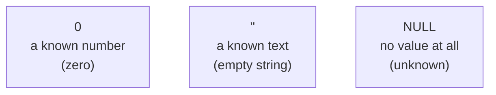
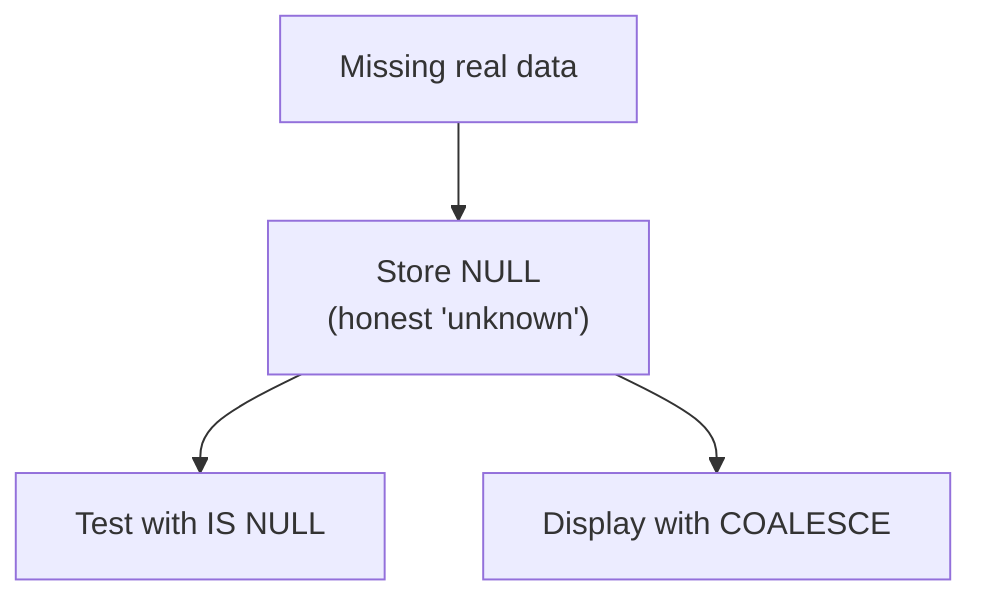

`NULL` is one of the most important, and most misunderstood, ideas
in SQL. It is the source of countless beginner bugs. Slow down here:
a clear understanding of `NULL` will save you real confusion later,
which is why this page has extra checks at the end.

<Figure
  slug="sql-working-with-null-cutout"
  alt="Working with NULL, an isometric illustration"
/>

## NULL means "unknown," not "zero" or "empty"

A cell can be **`NULL`**, which means *there is no value here, it is
unknown or missing.* This is **not** the same as zero, and not the
same as an empty string `''`:

- `0` is a known quantity: zero dollars.
- `''` is a known piece of text: the empty string.
- `NULL` is the **absence** of any value: we simply do not know.

Imagine a `phone` column. A customer with `phone = ''` told us their
phone is blank; a customer with `phone = NULL` never told us their
phone at all. Different meanings, and databases keep them distinct.

## The surprising part: NULL is "contagious"

Because `NULL` means "unknown," any calculation involving it usually
produces `NULL`, because the answer is genuinely unknown. If you do
not know someone's age, you also do not know "their age plus one."

<Figure
  slug="sql-working-with-null-inline-cutout"
  alt="A socket left deliberately empty with a small cover over it, beside a socket holding a zero-sized block, the two clearly not the same"
  caption="An unknown value is not an empty one, and arithmetic on it stays unknown."
/>

<SqlCodeBlock
  dialect="postgres"
  title="Arithmetic with NULL yields NULL"
  starterCode={`SELECT
  5 + NULL AS five_plus_null,
  'Hi ' || NULL AS greeting,
  NULL = NULL AS is_null_equal_null;`}
/>

Look closely at the third column. Even `NULL = NULL` is **not true**,
it comes back as `NULL` (shown as blank), because "is one unknown
equal to another unknown?" cannot be answered. This is the trap that
catches everyone.

There is a name for what you just witnessed: **three-valued
logic**. In most programming, a comparison is either true or false.
In SQL there is a third outcome, *unknown*, and it matters
enormously for filtering, because `WHERE` keeps only the rows where
the condition is **true**. Not false, and *not unknown*. A
comparison against `NULL` is always unknown, so the row is dropped.
That is why the next section's rule exists.

Three-valued logic is the rule behind all of it. Once `UNKNOWN` is a
value that `AND`, `OR` and `NOT` have to handle, the truth tables stop
looking like the ones you know.

<Chart slug="sql-null-logic" />

## Testing for NULL: use IS NULL, never = NULL

Since `= NULL` does not work, SQL gives you special tests:

- `IS NULL`, true when the value is missing.
- `IS NOT NULL`, true when the value is present.

<SqlCodeBlock
  dialect="postgres"
  title="Find the rows with missing data"
  initSql={`CREATE TABLE customers (
  id    SERIAL PRIMARY KEY,
  name  TEXT,
  phone TEXT
);
INSERT INTO customers (name, phone) VALUES
  ('Ada', '555-0101'),
  ('Grace', NULL),
  ('Linus', '555-0102'),
  ('Mae', NULL);`}
  starterCode={`-- Customers we cannot phone:
SELECT
  name
FROM
  customers
WHERE
  phone IS NULL;`}
/>

<Callout type="warn" title="WHERE phone = NULL returns nothing">
A very common bug: writing `WHERE phone = NULL`. It does not error,
it just silently matches **no rows**, because the comparison is never
true. Always use `IS NULL` / `IS NOT NULL` to test for missing
values.
</Callout>

## When NULL escapes into the real world

Mishandled NULLs are not just a beginner's stumble, they cause
real, expensive, occasionally hilarious bugs in production systems.
The most famous example: in 2016, security researcher **Joseph
Tartaro** registered a California vanity license plate reading
`NULL`. He thought of it as a nerdy joke. The joke reversed itself:
systems that processed traffic citations apparently associated
tickets that had a *missing* plate value with the literal string
"NULL", and Tartaro started receiving **thousands of dollars'
worth of other drivers' tickets**, eventually totaling over
\$12,000. He told the story at the DEF CON security conference in
2019, by which point clearing his record had become a recurring
chore.

The bug at the heart of it is exactly the distinction this page is
teaching: *the text `'NULL'`* is a known value, while *`NULL`* is
the absence of one. Somewhere, a system blurred that line. After
this page, you will not.

## Filling in NULLs with COALESCE

Often you want to display a friendly fallback instead of a blank.
`COALESCE(a, b)` returns the first argument that is not `NULL`:

<SqlCodeBlock
  dialect="postgres"
  title="Show a placeholder for missing phones"
  initSql={`CREATE TABLE customers (
  id SERIAL PRIMARY KEY, name TEXT, phone TEXT
);
INSERT INTO customers (name, phone) VALUES
  ('Ada','555-0101'),('Grace',NULL),('Linus','555-0102'),('Mae',NULL);`}
  starterCode={`SELECT
  name,
  COALESCE(phone, 'No phone on file') AS phone_display
FROM
  customers
ORDER BY
  name;`}
/>

`COALESCE()` reads as "use the phone, or if that is `NULL`, use this
text instead." It is the standard, clean way to handle missing
values for display or calculation.

## Why allow NULL at all?

If `NULL` is so tricky, why have it? Because **"unknown" is a real
and honest state.** When a customer has not given a phone number,
forcing in a fake `0` or `''` would *lie* about the data. `NULL`
lets the database tell the truth: "we do not know." The strange
behavior is the price of that honesty, and `IS NULL` plus
`COALESCE()` make it manageable.

## Check your understanding

<MultipleChoice
  markdown={`What does \`NULL\` mean in SQL?

- [o] That the value is unknown or missing, there is no value present.
  > \`NULL\` represents "we don't know," which is distinct from zero or an empty string.
- The number zero.
  > Zero is a known value; \`NULL\` means there is no known value at all.
- A syntax error in the query.
  > \`NULL\` is a valid, intentional marker for missing data, not an error.
- An empty string of text.
  > An empty string \`''\` is a known (if blank) text value; \`NULL\` is the absence of any value.

\`NULL\` represents a missing or unknown value, different from \`0\` or \`''\`.`}
/>

<MultipleChoice
  markdown={`What does the expression \`NULL = NULL\` evaluate to?

- \`true\`, because both sides are the same.
  > Two unknowns are not provably equal; SQL cannot claim they are the same.
- \`false\`, because \`NULL\` never equals anything.
  > It is not \`false\` either; the comparison simply has no known answer.
- It causes the query to crash.
  > The expression is valid; it just produces \`NULL\` rather than crashing.
- [o] \`NULL\` (unknown), because comparing two unknown values has no knowable answer.
  > Since \`NULL\` means "unknown," asking whether one unknown equals another yields unknown, not true or false.

Comparing \`NULL\` with \`=\` yields \`NULL\`, which is exactly why \`= NULL\` never matches rows.`}
/>

<MultipleChoice
  markdown={`How do you correctly select rows where the \`phone\` column has no value?

- [o] \`WHERE phone IS NULL\`
  > \`IS NULL\` is the dedicated, correct test for missing values.
- \`WHERE phone = NULL\`
  > This silently matches no rows, because a comparison with \`NULL\` is never true.
- \`WHERE phone = 'NULL'\`
  > That matches the literal text "NULL", not an actual missing value.
- \`WHERE phone = ''\`
  > That matches an empty string, which is a *known* value, not the same as a missing \`NULL\`.

Use \`IS NULL\` (never \`= NULL\`) to test for missing values.`}
/>

<MultipleChoice
  markdown={`What does \`COALESCE(phone, 'No phone')\` return for a row where \`phone\` is \`NULL\`?

- An error, because the arguments differ.
  > \`COALESCE()\` is designed to take multiple arguments and pick the first non-NULL; differing arguments are fine.
- [o] \`'No phone'\`, because \`COALESCE()\` returns the first argument that is not \`NULL\`.
  > When \`phone\` is missing, \`COALESCE()\` falls through to the provided fallback text.
- The literal word "COALESCE".
  > \`COALESCE()\` returns one of its argument values, not its own name.
- \`NULL\`, because the first argument is \`NULL\`.
  > \`COALESCE()\` skips \`NULL\` arguments and moves on to the next one.

\`COALESCE()\` returns the first non-NULL argument, making it ideal for fallback values.`}
/>

<MultipleChoice
  markdown={`Why does SQL bother having \`NULL\` instead of just storing \`0\` or \`''\` for missing data?

- Because \`NULL\` makes queries run faster.
  > \`NULL\` is about representing missing data accurately, not performance.
- [o] Because "unknown" is a genuinely different state from zero or empty, and \`NULL\` lets the data stay honest about what is truly missing.
  > Substituting a real value like \`0\` would misrepresent the data; \`NULL\` faithfully records that a value is absent.
- Because \`NULL\` saves disk space compared to other values.
  > The motivation is meaning, not storage size.
- Because every column is required to allow \`NULL\`.
  > Columns can forbid \`NULL\` with \`NOT NULL\`; \`NULL\` exists to honestly represent the unknown when allowed.

\`NULL\` exists so the database can distinguish genuinely missing data from a real zero or empty value.`}
/>

## Practice challenge

<SqlChallengeCard
  dialect="postgres"
  title="A friendly fallback for missing emails"
  instructions={`The \`customers\` table has \`name\` and \`email\` columns, and some emails are missing (\`NULL\`). Return every customer's \`name\` plus a column named \`email_display\` that shows the email when present and the text \`no email\` when it is missing. Sort by \`name\` ascending (A to Z).`}
  initSql={`CREATE TABLE customers (
  id    SERIAL PRIMARY KEY,
  name  TEXT NOT NULL,
  email TEXT
);
INSERT INTO customers (name, email) VALUES
  ('Ada', 'ada@example.com'),
  ('Grace', NULL),
  ('Linus', 'linus@example.com'),
  ('Mae', NULL);`}
  starterCode={`SELECT
  name,
  email AS email_display -- wrap this in COALESCE with a fallback
FROM
  customers
ORDER BY
  name;`}
  solutionSql={`SELECT
  name,
  COALESCE(email, 'no email') AS email_display
FROM
  customers
ORDER BY
  name;`}
  tests={[
    {
      id: "columns",
      name: "Returns name and email_display",
      description: "Two columns, in that order.",
      expectedColumns: ["name", "email_display"],
    },
    {
      id: "row_count",
      name: "Returns all four customers",
      description: "Nobody is filtered out, missing emails get a fallback instead.",
      expectedRowCount: 4,
    },
    {
      id: "matches",
      name: "Matches the reference solution",
      description: "Grace and Mae show 'no email'; Ada and Linus show their addresses.",
      matchesSolution: true,
      ordered: true,
    },
  ]}
/>
