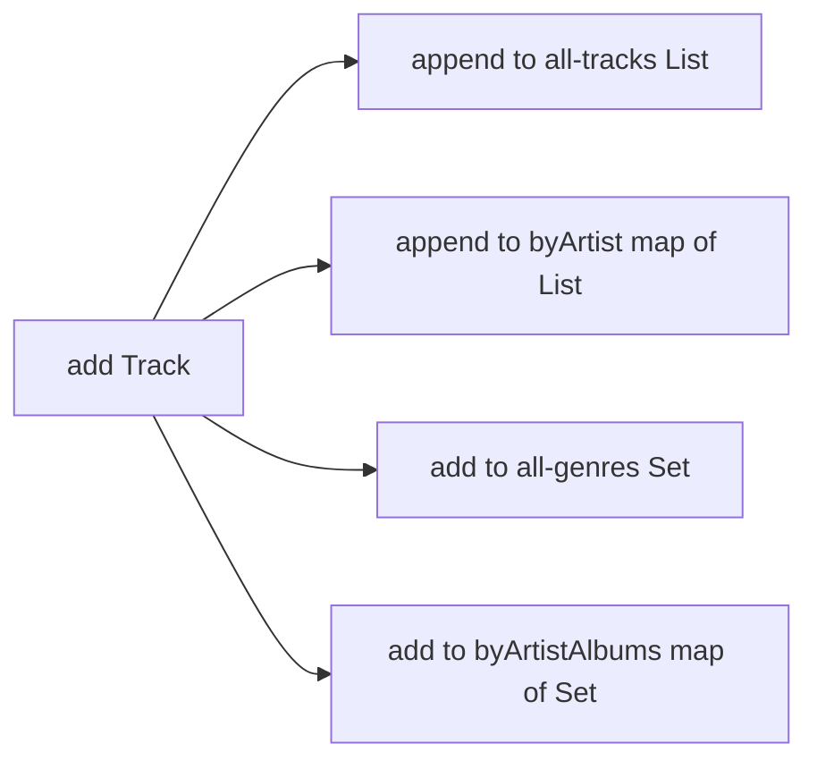

We've covered the whole map: the four collection families, generic
types, equality and hashing, comparators, iteration, immutability,
and architecture. This chapter is one substantial challenge that
exercises all of it.

<svg
  viewBox="0 0 640 240"
  role="img"
  aria-label="Three little note shapes stream into one large library container, which fans out along dotted spokes to four small answers — an ordered row, a unique cluster, a ranked trio, and a keyed pair of albums"
  style={{ display: "block", width: "100%", maxWidth: "640px", height: "auto", margin: "2.5rem auto" }}
>
  <g style={{ color: "var(--ds-blue-500)" }} fill="currentColor">
    <circle cx="72" cy="78" r="7" />
    <rect x="77" y="56" width="3.5" height="20" rx="1.75" />
    <circle cx="66" cy="134" r="7" />
    <rect x="71" y="112" width="3.5" height="20" rx="1.75" />
    <circle cx="78" cy="188" r="7" />
    <rect x="83" y="166" width="3.5" height="20" rx="1.75" />
  </g>
  <g fill="currentColor" opacity="0.3">
    <circle cx="115" cy="95" r="3" />
    <circle cx="165" cy="110" r="3" />
    <circle cx="115" cy="137" r="3" />
    <circle cx="170" cy="134" r="3" />
    <circle cx="120" cy="176" r="3" />
    <circle cx="172" cy="154" r="3" />
  </g>
  <g style={{ color: "var(--ds-blue-500)" }} fill="currentColor">
    <rect x="235" y="84" width="170" height="92" rx="18" fillOpacity="0.14" />
    <circle cx="275" cy="130" r="8" fillOpacity="0.6" />
    <circle cx="305" cy="130" r="8" fillOpacity="0.6" />
    <circle cx="335" cy="130" r="8" fillOpacity="0.6" />
    <circle cx="365" cy="130" r="8" fillOpacity="0.6" />
  </g>
  <g fill="currentColor" opacity="0.3">
    <circle cx="425" cy="104" r="3" />
    <circle cx="465" cy="70" r="3" />
    <circle cx="425" cy="116" r="3" />
    <circle cx="468" cy="106" r="3" />
    <circle cx="425" cy="144" r="3" />
    <circle cx="468" cy="154" r="3" />
    <circle cx="425" cy="154" r="3" />
    <circle cx="462" cy="186" r="3" />
  </g>
  <g style={{ color: "var(--ds-blue-500)" }} fill="currentColor">
    <circle cx="525" cy="40" r="6" />
    <circle cx="549" cy="40" r="6" />
    <circle cx="573" cy="40" r="6" />
  </g>
  <g style={{ color: "var(--ds-green-500)" }} fill="currentColor">
    <circle cx="530" cy="92" r="6" />
    <circle cx="556" cy="104" r="6" />
    <circle cx="534" cy="114" r="6" />
  </g>
  <g style={{ color: "var(--ds-yellow-500)" }} fill="currentColor">
    <circle cx="528" cy="162" r="9" />
    <circle cx="556" cy="162" r="6.5" />
    <circle cx="578" cy="162" r="4.5" />
  </g>
  <g style={{ color: "var(--ds-blue-500)" }} fill="currentColor">
    <circle cx="522" cy="212" r="6" />
  </g>
  <g style={{ color: "var(--ds-green-500)" }} fill="currentColor">
    <rect x="536" y="206" width="13" height="13" rx="3" fillOpacity="0.7" />
    <rect x="554" y="206" width="13" height="13" rx="3" fillOpacity="0.7" />
  </g>
</svg>

You'll build a small **MusicLibrary** that ingests tracks and
answers four queries:

1. `byArtist(name)` — all tracks for an artist, in insertion order
2. `genres()` — the set of all unique genres
3. `topRated(n)` — the top `n` tracks by rating (ties broken by title)
4. `albumsByArtist(name)` — the *unique* album names for an artist,
   in insertion order

Each query corresponds directly to a collection shape we've studied:

| Query | Shape |
| --- | --- |
| `byArtist(name)` | `Map<String, List<Track>>` |
| `genres()` | `Set<String>` (insertion-ordered if we want a deterministic preview) |
| `topRated(n)` | `List<Track>` sorted with a `Comparator` |
| `albumsByArtist(name)` | `Map<String, Set<String>>` (insertion-ordered set) |

## What "good" looks like

A clean implementation will:

- Store `Track`s in the shape that matches each query (not a flat
  list scanned every time).
- Use `computeIfAbsent` to build per-artist lists and sets lazily.
- Use a `LinkedHashSet` where insertion-ordered uniqueness matters.
- Build `topRated` with a `Comparator.comparingInt(...).reversed().thenComparing(...)` chain.
- Return read-only / snapshot collections from every getter.

## The challenge

<ChallengeCard
  adapter="java"
  title="Build the MusicLibrary"
  instructions={`Implement \`MusicLibrary\` so that the driver in \`Main\` prints exactly:

\`\`\`
Debussy tracks:
  Clair de Lune
  Reverie
  La Mer
Genres: [classical, impressionist, orchestral]
Top 3:
  Clair de Lune (5)
  La Mer (5)
  Liebestraum (4)
Debussy albums: [Suite Bergamasque, Reveries, Sea Pieces]
\`\`\`

Hints:

- \`computeIfAbsent\` for "map of list" and "map of set" insertion.
- For \`Genres:\` use a \`LinkedHashSet<String>\` so iteration order is deterministic (insertion order).
- For \`topRated\`, sort a *copy* of the tracks list with \`Comparator.comparingInt(Track::rating).reversed().thenComparing(Track::title)\` and take the first \`n\`.
- For \`albumsByArtist\`, use \`LinkedHashSet<String>\` per artist.
- Return safe views from every public method (\`Collections.unmodifiableList\` / \`Collections.unmodifiableSet\`).`}
  entryFilename="Main.java"
  files={[
    {
      filename: "Main.java",
      starterCode: `import java.util.*;

public class Main {
  public static void main(String[] args) {
    MusicLibrary lib = new MusicLibrary();
    lib.add(new Track("Clair de Lune", "Debussy", "Suite Bergamasque",
                      List.of("classical", "impressionist"), 5));
    lib.add(new Track("Gymnopedie No.1", "Satie", "Gymnopedies",
                      List.of("classical"), 3));
    lib.add(new Track("Reverie", "Debussy", "Reveries",
                      List.of("classical", "impressionist"), 4));
    lib.add(new Track("Liebestraum", "Liszt", "Liebestraume",
                      List.of("classical"), 4));
    lib.add(new Track("La Mer", "Debussy", "Sea Pieces",
                      List.of("classical", "orchestral"), 5));

    System.out.println("Debussy tracks:");
    for (Track t : lib.byArtist("Debussy")) {
      System.out.println("  " + t.title());
    }

    System.out.println("Genres: " + lib.genres());

    System.out.println("Top 3:");
    for (Track t : lib.topRated(3)) {
      System.out.println("  " + t.title() + " (" + t.rating() + ")");
    }

    System.out.println("Debussy albums: " + lib.albumsByArtist("Debussy"));
  }
}
`,
    },
    {
      filename: "Track.java",
      starterCode: `import java.util.List;

public record Track(String title, String artist, String album,
                    List<String> genres, int rating) {}
`,
    },
    {
      filename: "MusicLibrary.java",
      starterCode: `import java.util.*;

public class MusicLibrary {
  // TODO: choose the right shapes for each query

  public void add(Track t) {
    // TODO
  }

  /** All tracks for the artist, in insertion order. */
  public List<Track> byArtist(String artist) {
    // TODO
    return List.of();
  }

  /** All genres across the library, in insertion order (deduped). */
  public Set<String> genres() {
    // TODO
    return Set.of();
  }

  /** Top n by rating desc, ties broken by title asc. */
  public List<Track> topRated(int n) {
    // TODO
    return List.of();
  }

  /** Unique albums for the artist, in insertion order. */
  public Set<String> albumsByArtist(String artist) {
    // TODO
    return Set.of();
  }
}
`,
      solutionCode: `import java.util.*;

public class MusicLibrary {
  private final List<Track> tracks = new ArrayList<>();
  private final Map<String, List<Track>> byArtist = new HashMap<>();
  private final Set<String> allGenres = new LinkedHashSet<>();
  private final Map<String, Set<String>> albumsOfArt = new HashMap<>();

  public void add(Track t) {
    tracks.add(t);
    byArtist.computeIfAbsent(t.artist(), k -> new ArrayList<>()).add(t);
    allGenres.addAll(t.genres());
    albumsOfArt.computeIfAbsent(t.artist(), k -> new LinkedHashSet<>())
        .add(t.album());
  }

  public List<Track> byArtist(String artist) {
    return Collections.unmodifiableList(
        byArtist.getOrDefault(artist, List.of()));
  }

  public Set<String> genres() { return Collections.unmodifiableSet(allGenres); }

  public List<Track> topRated(int n) {
    List<Track> copy = new ArrayList<>(tracks);
    copy.sort(Comparator.comparingInt(Track::rating)
                  .reversed()
                  .thenComparing(Track::title));
    return copy.subList(0, Math.min(n, copy.size()));
  }

  public Set<String> albumsByArtist(String artist) {
    return Collections.unmodifiableSet(
        albumsOfArt.getOrDefault(artist, Set.of()));
  }
}
`,
    },
  ]}
  tests={[
    {
      id: "music-library-capstone",
      name: "MusicLibrary answers all four queries correctly",
      expect: {
        stdoutEquals:
          "Debussy tracks:\n  Clair de Lune\n  Reverie\n  La Mer\nGenres: [classical, impressionist, orchestral]\nTop 3:\n  Clair de Lune (5)\n  La Mer (5)\n  Liebestraum (4)\nDebussy albums: [Suite Bergamasque, Reveries, Sea Pieces]",
      },
    },
  ]}
/>

## What you just demonstrated

That single class touches every major idea in the course:

- **Right shape per query** — one map of lists, one map of sets,
  one set, one list (Data Modeling).
- **`computeIfAbsent` for "map of \\*"** — concise, race-free against
  itself (Maps).
- **`LinkedHashSet`** — uniqueness *and* insertion order (Sets).
- **`Comparator` composition** — `reversed().thenComparing(...)`
  to combine two ordering criteria (Comparable & Comparator).
- **Safe getters** — every returned collection is an unmodifiable
  view (Immutable Collections + Architecture).
- **`record`-backed value objects** for `Track` — typed data, free
  `equals`/`hashCode`/`toString` (Equality and Hashing).

## Test your understanding

<MultipleChoice
  markdown={`Why \`LinkedHashSet<String>\` for \`genres()\` rather than \`HashSet<String>\`?

- It's faster
  > It's the same average complexity, with slightly more memory.
- It allows duplicates
  > It does not.
- [o] It keeps insertion order, which makes the printed output deterministic and matches the user-visible "as encountered" order
  > Determinism matters as soon as a human or a test reads the output.
- It supports concurrent reads
  > It does not (no built-in synchronization).`}
/>

<MultipleChoice
  markdown={`In \`topRated\`, why sort a **copy** of the tracks list?

- It is faster
  > It is not.
- [o] Because sorting in place would permanently reorder the library, making "insertion order" queries (like \`byArtist\`) wrong on subsequent calls
  > Never mutate state to compute a query result.
- The \`Comparator\` requires a fresh list
  > It does not.
- The original list is unmodifiable
  > It is mutable inside the class.`}
/>
