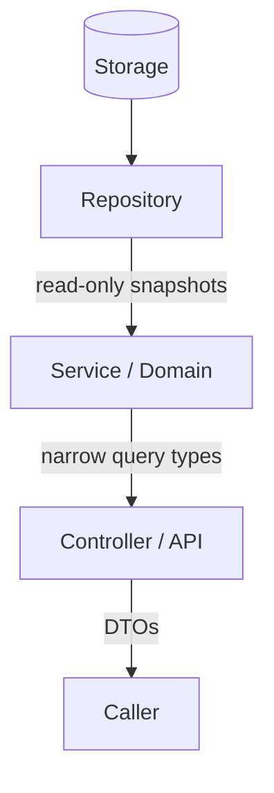

A class is small. An *architecture* is large. The decisions you make
about *how collections cross boundaries* between modules are some of
the most consequential decisions in a Java codebase, because they
constrain everyone who calls your code, often for years.

<Figure
  slug="jcol-collection-architecture-cutout"
  alt="Collection-oriented architecture, an isometric illustration"
/>

This chapter is a short, practical guide to designing module
boundaries with collections.

## Three principles

1. **Accept the widest type you can; return the narrowest type that's useful.**
2. **Make returned collections immutable (or unmodifiable views).**
3. **Defensive-copy on the way in, defensive-copy or share-immutable on the way out.**

These three together produce APIs that are simultaneously *easy to
call* and *impossible to misuse*.

## Principle 1: program to interfaces, not implementations

Imagine a method whose job is to count occurrences:

```java
// Too narrow on input
int countNonNull(ArrayList<String> items) { ... }

// Just right
int countNonNull(Collection<String> items) { ... }
```

If we take `ArrayList`, callers with a `LinkedHashSet` must copy
their data first. If we take `Collection`, every caller is happy and
nothing is given up, we only need `size()` and iteration anyway.

<Figure
  slug="jcol-collection-architecture-principle-1-program-inline-cutout"
  alt="One standard front plate shown on five very different containers, one hand working them all"
/>

The same idea on the return side, in reverse:

```java
// Too wide on output
Collection<String> activeNames();      // Caller doesn't know if order matters

// Just right
List<String> activeNames();            // Order is meaningful and documented
```

If your output preserves a meaningful order, say so by returning a
`List`. If it has no duplicates by construction, return a `Set`.

The rule of thumb:

| Direction | Choose |
| --- | --- |
| **Input** | `Iterable<T>` > `Collection<T>` > `List<T>` / `Set<T>` > `ArrayList<T>` |
| **Output** | `List<T>` / `Set<T>` / `Map<K,V>` (rarely just `Collection`) |

## Principle 2: never return your live, mutable state

The most common API-design mistake in Java is exactly:

```java
// BAD: caller can mutate this!
public List<Order> orders() { return this.orders; }
```

Two safe forms:

```java
// "Live, read-only view", caller cannot mutate; you still can
public List<Order> orders() { return Collections.unmodifiableList(orders); }

// "Immutable snapshot", caller sees a copy that never changes
public List<Order> orders() { return List.copyOf(orders); }
```

Which to pick depends on whether the caller benefits from seeing
later writes. For most "give me the data right now" calls, the
snapshot is the right default.

<Figure
  slug="jcol-collection-architecture-principle-2-never-inline-cutout"
  alt="A sealed tray handed out through a hatch as a copy, the original staying clamped inside the cabinet"
/>

## Principle 3: defensive copy on input

The mirror of principle 2:

```java
// BAD: caller can mutate this list later and corrupt our state
this.tasks = tasks;

// GOOD: snapshot at construction
this.tasks = List.copyOf(tasks);
```

This single discipline removes an entire category of bugs.

## Layering: where collections live, where they don't

In a typical layered application, collections move through several
roles:



A few useful conventions:

- **Repositories return data, not "queryable collections."** A
  repository's job is to *fetch*; the caller shouldn't be filtering
  in memory unless that's by design. Push the `WHERE` down to the
  data source.
- **Services hold the model.** It's fine for a service to *own*
  mutable internal collections. Just don't leak them.
- **Controllers / APIs adapt.** Convert to DTOs or response objects
  that you fully control. Don't serialize internal domain
  collections directly, they couple your storage shape to your wire
  format.

<Figure
  slug="jcol-collection-architecture-inline-cutout"
  alt="One set of standard fittings at the top of a board with several different containers below, each carrying those fittings"
/>

## A worked example: an in-memory `BookRepo`

We'll see the principles in one place. The repository owns its data,
but its API is safe to use everywhere:

<CodeBlock
  adapter="java"
  entryFilename="Main.java"
  files={[
    {
      filename: "Main.java",
      starterCode: `import java.util.*;

public class Main {
  public static void main(String[] args) {
    BookRepo repo =
        new BookRepo(Arrays.asList(new Book("978-1", "Clean Code", "Martin"),
                             new Book("978-2", "Effective Java", "Bloch"),
                             new Book("978-3", "TAOCP I", "Knuth")));

    // Read flows: callers can't accidentally damage repo state
    System.out.println("all: " + repo.allTitles());

    Optional<Book> hit = repo.findByIsbn("978-2");
    hit.ifPresent(b -> System.out.println("found: " + b.title()));

    // Demonstrate that the returned view is read-only
    try {
      repo.allTitles().add("hack");
    } catch (UnsupportedOperationException e) {
      System.out.println("allTitles is read-only");
    }
  }
}
`,
    },
    {
      filename: "Book.java",
      starterCode: `import java.util.Objects;

public final class Book {
  private final String isbn;
  private final String title;
  private final String author;

  public Book(String isbn, String title, String author) {
    this.isbn = isbn;
    this.title = title;
    this.author = author;
  }

  public String isbn() { return isbn; }
  public String title() { return title; }
  public String author() { return author; }

  @Override
  public boolean equals(Object o) {
    if (this == o) return true;
    if (!(o instanceof Book)) return false;
    Book other = (Book)o;
    return Objects.equals(isbn, other.isbn) && Objects.equals(title, other.title) && Objects.equals(author, other.author);
  }

  @Override
  public int hashCode() { return Objects.hash(isbn, title, author); }

  @Override
  public String toString() {
    return "Book[" + "isbn=" + isbn + ", " + "title=" + title + ", " + "author=" + author + "]";
  }
}
`,
    },
    {
      filename: "BookRepo.java",
      starterCode: `import java.util.*;

public final class BookRepo {
  private final Map<String, Book> byIsbn; // private mutable state, owned here

  public BookRepo(Collection<Book> seed) { // accept the widest sensible input
    Map<String, Book> m = new LinkedHashMap<>();
    for (Book b : seed)
      m.put(b.isbn(), b);
    this.byIsbn = m;
  }

  public Optional<Book> findByIsbn(String isbn) {
    return Optional.ofNullable(byIsbn.get(isbn));
  }

  public List<String> allTitles() {
    // narrow, ordered, unmodifiable
    List<String> out = new ArrayList<>(byIsbn.size());
    for (Book b : byIsbn.values())
      out.add(b.title());
    return Collections.unmodifiableList(out);
  }
}
`,
    },
  ]}
/>

Notice three things:

- The constructor accepts `Collection<Book>` (widest sensible) and
  copies into a private map (defensive).
- `findByIsbn` returns `Optional<Book>`, modeling absence in the
  type system (no `null` to forget about).
- `allTitles` returns a `List<String>` (caller knows order is
  meaningful) that's unmodifiable (caller can't damage anything).

## When you really need a "stream API"

For repositories of *huge* data, returning a list of everything is
the wrong shape, even if it's immutable. Then you have two clean
options:

- Return a **`Stream<T>`** so the caller can compose filters before
  ever materializing a collection. Document the need to `close()` if
  it wraps I/O.
- Return a **paged result** type with `items()`, `nextCursor()`, etc.

Avoid returning iterators directly, they expose mutation and have
no useful documentation surface.

## Practice

<ChallengeCard
  adapter="java"
  title="Tighten a leaky `Inbox`"
  instructions={`The current \`Inbox\` is leaky on both sides: the constructor stores the caller's list, and \`messages()\` returns the live list. Refactor it so:

- The constructor takes a defensive copy.
- \`messages()\` returns an unmodifiable list.
- \`add(String m)\` still works on the internal mutable list (you'll need to keep one).

Expected output:

\`\`\`
[hello, world]
external did not leak
caller mutation was blocked
[hello, world, !]
\`\`\``}
  entryFilename="Main.java"
  files={[
    {
      filename: "Main.java",
      starterCode: `import java.util.ArrayList;
import java.util.List;
import java.util.Arrays;

public class Main {
  public static void main(String[] args) {
    List<String> seed = new ArrayList<>(Arrays.asList("hello", "world"));
    Inbox in = new Inbox(seed);
    System.out.println(in.messages());

    seed.add("steal-me");
    if (!in.messages().contains("steal-me"))
      System.out.println("external did not leak");

    try {
      in.messages().add("hack");
    } catch (UnsupportedOperationException e) {
      System.out.println("caller mutation was blocked");
    }

    in.add("!");
    System.out.println(in.messages());
  }
}
`,
    },
    {
      filename: "Inbox.java",
      starterCode: `import java.util.ArrayList;
import java.util.List;

public class Inbox {
  private final List<String> msgs;

  public Inbox(List<String> msgs) {
    this.msgs = msgs; // TODO: defensive copy into a mutable list
  }

  public void add(String m) { msgs.add(m); }

  public List<String> messages() {
    return msgs; // TODO: unmodifiable
  }
}
`,
      solutionCode: `import java.util.ArrayList;
import java.util.Collections;
import java.util.List;

public class Inbox {
  private final List<String> msgs;

  public Inbox(List<String> msgs) {
    this.msgs = new ArrayList<>(msgs); // own a fresh mutable list
  }

  public void add(String m) { msgs.add(m); }

  public List<String> messages() { return Collections.unmodifiableList(msgs); }
}
`,
    },
  ]}
  tests={[
    {
      id: "inbox-leakproof",
      name: "Inbox takes a defensive copy and returns an unmodifiable view",
      expect: {
        stdoutEquals:
          "[hello, world]\nexternal did not leak\ncaller mutation was blocked\n[hello, world, !]",
      },
    },
  ]}
/>

## Test your understanding

<MultipleChoice
  markdown={`A method accepts a collection of strings and only needs to iterate it once. Which parameter type is the *best* practice?

- \`Object\`
  > Too wide; loses static type information.
- \`HashMap<String,?>\`
  > Wrong kind altogether.
- \`ArrayList<String>\`
  > Too narrow; rejects \`HashSet\`, \`LinkedList\`, \`Arrays.asList(...)\`.
- [o] \`Iterable<String>\` (or \`Collection<String>\` if you also need \`size()\`)
  > Accept the widest interface that satisfies your needs.`}
/>

<MultipleChoice
  markdown={`Why is \`return this.internalList;\` a dangerous getter even if the field is \`final\`?

- \`final\` is wrong here
  > \`final\` is fine; it refers to the reference, not the contents.
- It throws \`ConcurrentModificationException\`
  > Not by itself.
- It causes a memory leak
  > It does not.
- [o] The caller receives a reference to your live mutable state and can \`add\`, \`remove\`, or \`clear\` it, corrupting your invariants
  > Return an unmodifiable view or an immutable copy instead.`}
/>

<MultipleChoice
  markdown={`A repository for a 50-million-row table is asked "give me all items as a \`List\`." What is the *architecturally* better return type?

- \`Set<Item>\` for "uniqueness"
  > Same memory problem and the wrong shape.
- [o] \`Stream<Item>\` (or a paged result type), so the caller composes filters before materializing, and the repository can lazily fetch in batches
  > Lazy, composable, and never materializes the whole set if the caller filters first.
- \`List<Item>\`, load them all into memory
  > That guarantees an \`OutOfMemoryError\`.
- \`Iterator<Item>\` exposed directly
  > Iterators are poor public API; they support \`remove\` and have no good way to be closed.`}
/>
