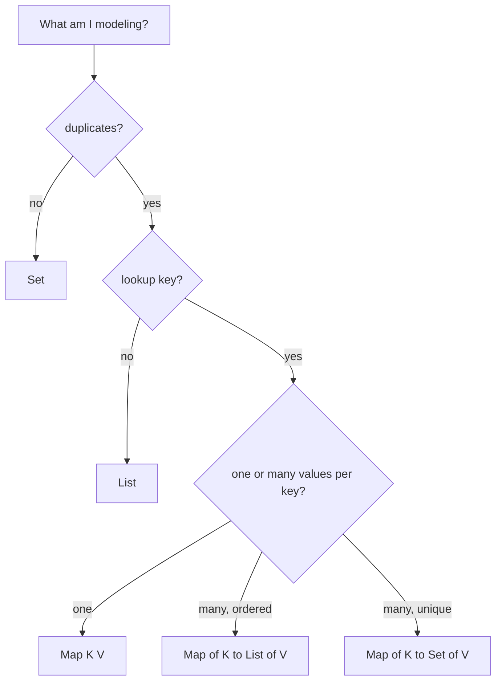

Most code, in the end, is some collection nested inside some other
collection. The shape you choose is a modeling decision, not a
performance one, pick wrongly and your code will be full of awkward
loops and edge cases; pick well and most queries become one method
call.

<Figure
  slug="jcol-data-modeling-cutout"
  alt="Data modeling with collections, an isometric illustration"
/>

This chapter is about the **shape** of your data.

## The "shape" mental model

Every modeling problem has three questions:

1. **Are duplicates allowed?** If no, you want a `Set`.
2. **Is order meaningful?** If yes, you want a `List` (or an ordered set/map).
3. **Is there a key by which we look things up?** If yes, you want a `Map`.

Combine these and you get the four canonical shapes:

| Question | Shape |
| --- | --- |
| "Ordered bag of things" | `List<T>` |
| "Unique things, lookup by identity" | `Set<T>` |
| "Lookup by key" | `Map<K, V>` |
| "Each key maps to many values" | `Map<K, List<V>>` or `Map<K, Set<V>>` |



## Worked example: a music library

Let's design the data of a tiny music library. Domain:

- A library has many **tracks**.
- Each track belongs to one **album** and one **artist**.
- A track has a list of **genres**.
- Listeners can **like** any track.
- We need to be able to:
  - List all tracks by a given artist.
  - List all unique genres in the library.
  - Show the top-N most liked tracks.

### First pass: lists everywhere

A naive design might use lists for everything:

```java
record Track(String title, String artist, String album, List<String> genres, int likes) {}

class Library {
    private final List<Track> tracks = new ArrayList<>();
    // tracksByArtist(name): for-loop over tracks, filtering by artist
    // allGenres(): for-loop with a duplicate-checking inner loop
    // topLiked(n): sort and take
}
```

This works, but every query is $O(n)$, every "is this duplicate?"
check is hand-written, and the *intent*, "lookup by artist", "set
of unique genres", is hidden inside loop bodies.

<Figure
  slug="jcol-data-modeling-with-collections-worked-example-music-inline-cutout"
  alt="A rack of records, a wall of keyed drawers for artists, and cords running between the two"
  caption="The right container turns a hand-written loop into a lookup."
/>

### Second pass: shape per query

If we let the **questions** drive the **shape**, we get:

- "List all tracks by a given artist" → `Map<String, List<Track>> tracksByArtist`
- "List all unique genres in the library" → `Set<String> allGenres`
- "Top-N most liked tracks" → keep a `List<Track>` and sort on demand

<CodeBlock
  adapter="java"
  entryFilename="Main.java"
  files={[
    {
      filename: "Main.java",
      starterCode: `import java.util.*;

public class Main {
  public static void main(String[] args) {
    Library lib = new Library();
    lib.add(new Track("Clair de Lune", "Debussy", "Suite Bergamasque",
                      Arrays.asList("classical", "impressionist"), 1200));
    lib.add(new Track("Gymnopedie No.1", "Satie", "Gymnopedies",
                      Arrays.asList("classical"), 900));
    lib.add(
        new Track("Reverie", "Debussy", "Reveries", Arrays.asList("classical"), 450));
    lib.add(new Track("Liebestraum", "Liszt", "Liebestraume",
                      Arrays.asList("classical", "romantic"), 700));

    System.out.println("Debussy tracks:");
    for (Track t : lib.tracksByArtist("Debussy")) {
      System.out.println("  " + t.title());
    }

    System.out.println("All genres: " + new TreeSet<>(lib.allGenres()));

    System.out.println("Top 2:");
    for (Track t : lib.topLiked(2)) {
      System.out.println("  " + t.title() + " (" + t.likes() + ")");
    }
  }
}
`,
    },
    {
      filename: "Track.java",
      starterCode: `import java.util.List;
import java.util.Objects;

public final class Track {
  private final String title;
  private final String artist;
  private final String album;
  private final List<String> genres;
  private final int likes;

  public Track(String title, String artist, String album, List<String> genres, int likes) {
    this.title = title;
    this.artist = artist;
    this.album = album;
    this.genres = genres;
    this.likes = likes;
  }

  public String title() { return title; }
  public String artist() { return artist; }
  public String album() { return album; }
  public List<String> genres() { return genres; }
  public int likes() { return likes; }

  @Override
  public boolean equals(Object o) {
    if (this == o) return true;
    if (!(o instanceof Track)) return false;
    Track other = (Track)o;
    return Objects.equals(title, other.title) && Objects.equals(artist, other.artist) && Objects.equals(album, other.album) && Objects.equals(genres, other.genres) && likes == other.likes;
  }

  @Override
  public int hashCode() { return Objects.hash(title, artist, album, genres, likes); }

  @Override
  public String toString() {
    return "Track[" + "title=" + title + ", " + "artist=" + artist + ", " + "album=" + album + ", " + "genres=" + genres + ", " + "likes=" + likes + "]";
  }
}
`,
    },
    {
      filename: "Library.java",
      starterCode: `import java.util.*;

public class Library {
  // shape: ordered list of tracks
  private final List<Track> tracks = new ArrayList<>();

  // shape: lookup by artist -> list of tracks
  private final Map<String, List<Track>> byArtist = new HashMap<>();

  // shape: set of all unique genres seen
  private final Set<String> genres = new HashSet<>();

  public void add(Track t) {
    tracks.add(t);
    byArtist.computeIfAbsent(t.artist(), k -> new ArrayList<>()).add(t);
    genres.addAll(t.genres());
  }

  public List<Track> tracksByArtist(String artist) {
    return Collections.unmodifiableList(
        byArtist.getOrDefault(artist, Collections.emptyList()));
  }

  public Set<String> allGenres() { return Collections.unmodifiableSet(genres); }

  public List<Track> topLiked(int n) {
    List<Track> copy = new ArrayList<>(tracks);
    copy.sort(Comparator.comparingInt(Track::likes).reversed());
    return copy.subList(0, Math.min(n, copy.size()));
  }
}
`,
    },
  ]}
/>

Notice what happened: `tracksByArtist(name)` went from an $O(n)$
scan to an $O(1)$ map lookup, *not* because we changed any
algorithm, but because we **stored the data in the shape we needed
to query it**.

## Modeling relationships

Most "real" data is graph-shaped. You'll mainly model two flavors of
relationship with collections:

### 1:N, one parent, many children

`Map<ParentKey, List<Child>>` (ordered) or
`Map<ParentKey, Set<Child>>` (unique).

<Figure
  slug="jcol-data-modeling-with-collections-shape-mental-model-inline-cutout"
  alt="Four containers in a row, a rail, a bag, a channel and a wall of keyed drawers, each shaped for a different job"
  caption="List, set, queue or map: pick from the shape of the question you will ask."
/>

Example: orders per customer.

```java
Map<CustomerId, List<Order>> ordersByCustomer = new HashMap<>();
```

### N:M, many on both sides

Two complementary maps form a bidirectional index:

```java
Map<UserId,    Set<TagId>>  tagsOfUser  = new HashMap<>();
Map<TagId,     Set<UserId>> usersOfTag  = new HashMap<>();
```

Whenever you tag a user, update both. The cost is a tiny bit of
discipline on every write; the benefit is that *both* questions
("what tags does this user have?" and "which users have this tag?")
become $O(1)$.

## Typed value objects beat strings

A subtle but huge win: don't let your maps and lists be keyed by
loose primitives. `Map<String, Order>` is fine, until you also have
`Map<String, Customer>` and accidentally pass a customer's email
where an order id was expected.

`record CustomerId(String value) {}` solves it: the compiler now
catches the mix-up, and you can attach validation to the record's
constructor.

<CodeBlock
  adapter="java"
  files={[
    {
      filename: "main.java",
      starterCode: `import java.util.HashMap;
import java.util.Map;
import java.util.Objects;

public class Main {
  static final class CustomerId {
    private final String value;

    public CustomerId(String value) {
      this.value = value;
    }

    public String value() { return value; }

    @Override
    public boolean equals(Object o) {
      if (this == o) return true;
      if (!(o instanceof CustomerId)) return false;
      CustomerId other = (CustomerId)o;
      return Objects.equals(value, other.value);
    }

    @Override
    public int hashCode() { return Objects.hash(value); }

    @Override
    public String toString() {
      return "CustomerId[" + "value=" + value + "]";
    }
  }
  static final class OrderId {
    private final String value;

    public OrderId(String value) {
      this.value = value;
    }

    public String value() { return value; }

    @Override
    public boolean equals(Object o) {
      if (this == o) return true;
      if (!(o instanceof OrderId)) return false;
      OrderId other = (OrderId)o;
      return Objects.equals(value, other.value);
    }

    @Override
    public int hashCode() { return Objects.hash(value); }

    @Override
    public String toString() {
      return "OrderId[" + "value=" + value + "]";
    }
  }
  static final class Order {
    private final OrderId id;
    private final CustomerId customer;
    private final int cents;

    public Order(OrderId id, CustomerId customer, int cents) {
      this.id = id;
      this.customer = customer;
      this.cents = cents;
    }

    public OrderId id() { return id; }
    public CustomerId customer() { return customer; }
    public int cents() { return cents; }

    @Override
    public boolean equals(Object o) {
      if (this == o) return true;
      if (!(o instanceof Order)) return false;
      Order other = (Order)o;
      return Objects.equals(id, other.id) && Objects.equals(customer, other.customer) && cents == other.cents;
    }

    @Override
    public int hashCode() { return Objects.hash(id, customer, cents); }

    @Override
    public String toString() {
      return "Order[" + "id=" + id + ", " + "customer=" + customer + ", " + "cents=" + cents + "]";
    }
  }

  public static void main(String[] args) {
    Map<OrderId, Order> orders = new HashMap<>();
    orders.put(new OrderId("o-1"),
               new Order(new OrderId("o-1"), new CustomerId("c-1"), 999));

    // This would not even compile:
    // orders.get(new CustomerId("c-1"));
    System.out.println(orders.get(new OrderId("o-1")));
  }
}
`,
    },
  ]}
/>

This is *type-driven data modeling*, letting the type system carry
information that comments and convention used to carry.

## Practice

<ChallengeCard
  adapter="java"
  title="Group orders by customer"
  instructions={`Implement \`OrderIndex.byCustomer(List<Order>)\` returning a \`Map<String, List<Order>>\` keyed by \`customerId\`, with each customer's orders **in input order**.

Expected output:

\`\`\`text
alice: [Order[id=1, customerId=alice, total=100], Order[id=3, customerId=alice, total=70]]
bob: [Order[id=2, customerId=bob, total=40]]
carol: [Order[id=4, customerId=carol, total=200]]
\`\`\``}
  entryFilename="Main.java"
  files={[
    {
      filename: "Main.java",
      starterCode: `import java.util.*;

public class Main {
  public static void main(String[] args) {
    List<Order> orders =
        Arrays.asList(new Order(1, "alice", 100), new Order(2, "bob", 40),
                new Order(3, "alice", 70), new Order(4, "carol", 200));
    Map<String, List<Order>> idx = new TreeMap<>(OrderIndex.byCustomer(orders));
    idx.forEach((k, v) -> System.out.println(k + ": " + v));
  }
}
`,
    },
    {
      filename: "Order.java",
      starterCode: `import java.util.Objects;

public final class Order {
  private final int id;
  private final String customerId;
  private final int total;

  public Order(int id, String customerId, int total) {
    this.id = id;
    this.customerId = customerId;
    this.total = total;
  }

  public int id() { return id; }
  public String customerId() { return customerId; }
  public int total() { return total; }

  @Override
  public boolean equals(Object o) {
    if (this == o) return true;
    if (!(o instanceof Order)) return false;
    Order other = (Order)o;
    return id == other.id && Objects.equals(customerId, other.customerId) && total == other.total;
  }

  @Override
  public int hashCode() { return Objects.hash(id, customerId, total); }

  @Override
  public String toString() {
    return "Order[" + "id=" + id + ", " + "customerId=" + customerId + ", " + "total=" + total + "]";
  }
}
`,
    },
    {
      filename: "OrderIndex.java",
      starterCode: `import java.util.*;

public final class OrderIndex {
  private OrderIndex() {}

  public static Map<String, List<Order>> byCustomer(List<Order> orders) {
    // TODO: use computeIfAbsent + ArrayList
    return new HashMap<>();
  }
}
`,
      solutionCode: `import java.util.*;

public final class OrderIndex {
  private OrderIndex() {}

  public static Map<String, List<Order>> byCustomer(List<Order> orders) {
    Map<String, List<Order>> out = new HashMap<>();
    for (Order o : orders) {
      out.computeIfAbsent(o.customerId(), k -> new ArrayList<>()).add(o);
    }
    return out;
  }
}
`,
    },
  ]}
  tests={[
    {
      id: "order-index",
      name: "OrderIndex groups orders by customerId in input order",
      expect: {
        stdoutEquals:
          "alice: [Order[id=1, customerId=alice, total=100], Order[id=3, customerId=alice, total=70]]\nbob: [Order[id=2, customerId=bob, total=40]]\ncarol: [Order[id=4, customerId=carol, total=200]]",
      },
    },
  ]}
/>

## Test your understanding

<MultipleChoice
  markdown={`You need to answer "all messages from a given user" instantly, where messages arrive over time and the per-user list grows. What is the natural shape?

- A \`Set<Message>\`
  > Loses order; doesn't index by user.
- A \`Map<UserId, Set<Message>>\`
  > Wrong if order matters; messages aren't naturally unique either.
- A flat \`List<Message>\` that you scan each time
  > Works, but every query is $O(n)$. Fine for small data, wrong shape for the question.
- [o] A \`Map<UserId, List<Message>>\` updated on every arrival
  > Lookup becomes $O(1)$ and per-user order is preserved.`}
/>

<MultipleChoice
  markdown={`You're modeling a tagging system: each post has many tags, each tag belongs to many posts. Which is a *good* design?

- One \`Map<TagId, List<PostId>>\`
  > Symmetric problem.
- One \`Map<PostId, List<TagId>>\`
  > Fine for "tags of a post"; "posts of a tag" becomes $O(n)$.
- [o] Two indices: \`Map<PostId, Set<TagId>>\` and \`Map<TagId, Set<PostId>>\`, kept in sync on every change
  > Each direction is $O(1)$; updates do a tiny bit more work.
- A \`List<Pair<PostId, TagId>>\`
  > Both queries become $O(n)$.`}
/>

<MultipleChoice
  markdown={`Why prefer \`record CustomerId(String value) {}\` over a bare \`String\` for keys?

- [o] The compiler now refuses to mix up customer ids with other strings (order ids, emails, etc.), and you can put validation in the record's constructor
  > Type-driven modeling shifts entire categories of bugs from runtime to compile time.
- It's required by the Collections API
  > It is not.
- It's faster
  > It is comparable.
- It uses less memory
  > It uses slightly *more* memory.`}
/>
