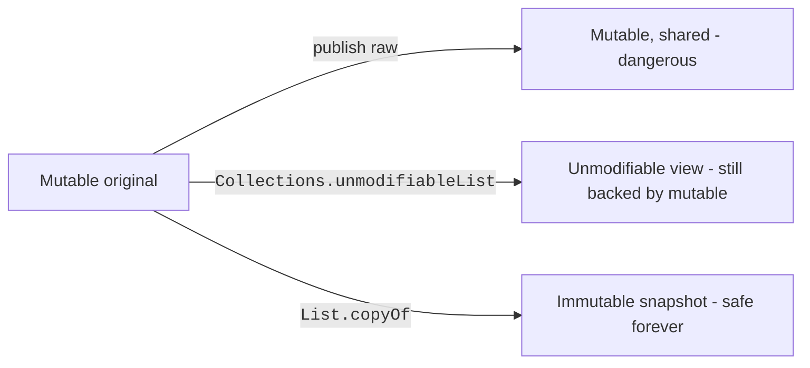

A *mutable* collection is the default in Java, and most days that is
exactly what you want. But when a collection crosses a trust
boundary, returned from a library, stored in a cache, shared
between threads, used as a map key, exposed to "the rest of the
codebase", mutability becomes a liability.

<Figure
  slug="jcol-immutable-collections-cutout"
  alt="Immutable collections, an isometric illustration"
/>

This chapter is about three intertwined ideas:

- **Truly immutable** collections, created with `List.of()`, `Set.of()`,
  `Map.of()`.
- **Unmodifiable views** over a mutable collection
  (`Collections.unmodifiableList`).
- **Defensive copies**, what you do at the boundaries of your code
  to keep your invariants safe.

## Why immutability matters

Mutable shared state is the source of more bugs than almost any
other software-engineering vice:

- Someone you didn't expect mutates a list you handed out, and your
  internal invariant breaks much later, in unrelated code.
- A `HashSet` element is mutated *after* being added, and now its
  hash points to the wrong bucket, silently lost forever.
- A second thread sees your collection halfway through a mutation
  and reads garbage.

<Figure
  slug="jcol-immutable-collections-immutability-matters-inline-cutout"
  alt="A sealed tray with a clamped lid on a shared bench, two hands unable to alter it"
  caption="A sealed collection can be shared without anyone worrying who might change it."
/>

Immutable collections make every one of those bugs impossible by
construction.

## Immutable factories: List.of, Set.of, Map.of

Java 9 introduced concise factories that return *truly immutable*
collections:

```java
import java.util.List;
import java.util.Map;
import java.util.Set;

public class Main {
  public static void main(String[] args) {
    List<Integer> xs = List.of(1, 2, 3);
    Set<String> ys = Set.of("a", "b", "c");
    Map<String, Integer> zs = Map.of("one", 1, "two", 2);

    System.out.println(xs);
    System.out.println(ys);
    System.out.println(zs);

    try {
      xs.add(4);
    } catch (UnsupportedOperationException e) {
      System.out.println("xs.add threw: " + e.getClass().getSimpleName());
    }
  }
}
```

These factories return purpose-built, compact implementations, not
just a wrapper. Mutator methods throw `UnsupportedOperationException`.

<Figure
  slug="jcol-immutable-collections-immutable-factories-list-inline-cutout"
  alt="Three sealed trays coming off a press already clamped shut, no opening fitted to any of them"
  caption="`List.of()` comes out already sealed, with no mutator to call."
/>

### A few rules to know

- They reject `null` keys, values, and elements. (If you need
  nulls, you almost always have a modeling bug to fix anyway.)
- `Set.of(...)` and `Map.of(...)` reject duplicates *at
  construction*, throwing `IllegalArgumentException`.
- They are unmodifiable, including through any iterator you obtain.

### What about more than 10 entries?

`Map.of()` has overloads up to 10 entries. For arbitrary numbers, use
`Map.ofEntries(...)` or `Map.copyOf(existingMap)`:

```java
import static java.util.Map.entry;

import java.util.Map;

public class Main {
  public static void main(String[] args) {
    Map<String, Integer> m = Map.ofEntries(entry("a", 1), entry("b", 2),
                                           entry("c", 3), entry("d", 4));
    System.out.println(m);
  }
}
```

<Callout type="info" title="Not runnable in the browser">
The `List.of()` / `Set.of()` / `Map.of()` family arrived in Java 9 and `Map.ofEntries`
with it; the playground on these pages runs Java 8, so `javac` here cannot
resolve any of them. Rewriting these two examples in Java 8 would remove the
very thing they exist to show, so they are shown rather than run. Every other
block on this page uses the Java 8 spellings (`Arrays.asList`,
`Collections.unmodifiableList`, `new ArrayList<>(source)`) and does run.
</Callout>

## Unmodifiable views: Collections.unmodifiableX

Before Java 9, the idiomatic way to publish a "read-only" collection
was `Collections.unmodifiableList(list)`. It is still common, and
still useful, but it is a **view**, not a copy:

<CodeBlock
  adapter="java"
  files={[
    {
      filename: "main.java",
      starterCode: `import java.util.*;

public class Main {
  public static void main(String[] args) {
    List<String> backing = new ArrayList<>(Arrays.asList("a", "b"));
    List<String> view = Collections.unmodifiableList(backing);

    System.out.println(view);
    backing.add("c");         // mutating the backing list...
    System.out.println(view); // ...is visible through the view!

    try {
      view.add("d");
    } catch (UnsupportedOperationException e) {
      System.out.println("view.add threw " + e.getClass().getSimpleName());
    }
  }
}
`,
    },
  ]}
/>

The view forbids *callers* from mutating, but the *owner* of
`backing` can still mutate. That is sometimes exactly right (a
controller publishes a live read-only view), and sometimes very wrong
(you wanted nobody to mutate it ever).

<Figure
  slug="jcol-immutable-collections-inline-cutout"
  alt="A sealed tray of blocks with a lid clamped down, a hand trying to lift one block and finding it fixed"
  caption="An unmodifiable view blocks the caller, not whoever owns the backing list."
/>

When you want a snapshot that genuinely cannot change, copy first:

```java
return List.copyOf(backing);  // returns an immutable copy
```

`List.copyOf`, `Set.copyOf`, and `Map.copyOf` are no-ops if the
argument is already immutable, and return a fresh immutable copy
otherwise.

## Defensive copies at the boundary

Defensive copying is a discipline:

- **In:** when a constructor or setter accepts a collection,
  immediately copy it. Otherwise the caller can keep their reference
  and mutate "your" data later.
- **Out:** when a getter returns a collection, return either an
  immutable copy or an unmodifiable view. Otherwise the caller can
  mutate your internal state.

<CodeBlock
  adapter="java"
  files={[
    {
      filename: "main.java",
      starterCode: `import java.util.*;

public class Main {
  static final class Schedule {
    private final List<String> tasks;

    // copy on the way in
    Schedule(List<String> tasks) {
      this.tasks = Collections.unmodifiableList(new ArrayList<>(tasks)); // snapshot + immutable
    }

    // return a safe view on the way out
    List<String> tasks() { return tasks; } // already immutable
  }

  public static void main(String[] args) {
    List<String> mutable = new ArrayList<>(Arrays.asList("write", "review", "ship"));
    Schedule s = new Schedule(mutable);

    mutable.add("oops"); // caller's mutation does NOT affect Schedule
    System.out.println(s.tasks());

    try {
      s.tasks().add("hack");
    } catch (UnsupportedOperationException e) {
      System.out.println("tasks() returns an unmodifiable list");
    }
  }
}
`,
    },
  ]}
/>

That's a 12-line class with no bugs.

## The three states a published collection can be in



The further right you go, the safer your API.

## Multi-file example: a safe `Catalog`

<CodeBlock
  adapter="java"
  entryFilename="Main.java"
  files={[
    {
      filename: "Main.java",
      starterCode: `import java.util.*;

public class Main {
  public static void main(String[] args) {
    List<String> initial = new ArrayList<>(Arrays.asList("apple", "bread", "cheese"));
    Catalog c = new Catalog(initial);

    // External mutation does not leak into the catalog
    initial.add("steal-me");
    System.out.println(c.items());

    // Caller cannot mutate what they got back
    try {
      c.items().add("hack");
    } catch (UnsupportedOperationException e) {
      System.out.println("safe: " + e.getClass().getSimpleName());
    }
  }
}
`,
    },
    {
      filename: "Catalog.java",
      starterCode: `import java.util.List;
import java.util.Collections;
import java.util.ArrayList;

public final class Catalog {
  private final List<String> items;

  public Catalog(List<String> items) {
    this.items = Collections.unmodifiableList(new ArrayList<>(items)); // snapshot in
  }

  public List<String> items() { return items; } // already immutable
}
`,
    },
  ]}
/>

## Practice

<ChallengeCard
  adapter="java"
  title="Make `Roster` leak-proof"
  instructions={`The class \`Roster\` is currently leaky in two ways: the constructor stores the caller's list reference, and the getter exposes the internal list directly. Fix both: take a defensive copy in the constructor, and return an immutable view from \`names()\`.

Expected output:

\`\`\`text
[Ada, Grace]
external mutation didn't leak
caller mutation was blocked
\`\`\``}
  entryFilename="Main.java"
  files={[
    {
      filename: "Main.java",
      starterCode: `import java.util.ArrayList;
import java.util.List;
import java.util.Arrays;

public class Main {
  public static void main(String[] args) {
    List<String> names = new ArrayList<>(Arrays.asList("Ada", "Grace"));
    Roster r = new Roster(names);
    System.out.println(r.names());

    names.add("Linus");
    if (!r.names().contains("Linus"))
      System.out.println("external mutation didn't leak");

    try {
      r.names().add("Edsger");
    } catch (UnsupportedOperationException e) {
      System.out.println("caller mutation was blocked");
    }
  }
}
`,
    },
    {
      filename: "Roster.java",
      starterCode: `import java.util.List;

public final class Roster {
  private final List<String> names;

  public Roster(List<String> names) {
    this.names = names; // TODO: defensive copy
  }

  public List<String> names() {
    return names; // TODO: unmodifiable
  }
}
`,
      solutionCode: `import java.util.List;
import java.util.Collections;
import java.util.ArrayList;

public final class Roster {
  private final List<String> names;

  public Roster(List<String> names) { this.names = Collections.unmodifiableList(new ArrayList<>(names)); }

  public List<String> names() { return names; }
}
`,
    },
  ]}
  tests={[
    {
      id: "roster-immutable",
      name: "Roster takes a defensive copy and returns an unmodifiable list",
      expect: {
        stdoutEquals:
          "[Ada, Grace]\nexternal mutation didn't leak\ncaller mutation was blocked",
      },
    },
  ]}
/>

## Test your understanding

<MultipleChoice
  markdown={`What is the key difference between \`List.of(...)\` and \`Collections.unmodifiableList(backing)\`?

- They are the same
  > They are not.
- \`Collections.unmodifiableList\` is faster
  > It's a thin wrapper, but mutability semantics are the issue.
- [o] \`List.of()\` is truly immutable (no backing to mutate); \`Collections.unmodifiableList\` is an unmodifiable **view** over a list whose owner can still mutate it
  > For a snapshot that nobody can change, use \`List.copyOf\` or \`List.of()\`.
- \`List.of()\` allows nulls
  > It explicitly does not.`}
/>

<MultipleChoice
  markdown={`Why is it a good habit to take a *defensive copy* of a collection passed into a constructor?

- Because Java requires it
  > It does not.
- [o] Because otherwise the caller still holds a reference to the same list and can mutate "your" state after construction
  > Defensive copy at the boundary is what protects your invariants.
- Because lists are not serializable otherwise
  > Serializability is unrelated.
- To save memory
  > It actually uses more.`}
/>

<MultipleChoice
  markdown={`What happens if you call \`Set.of("a", "b", "a")\`?

- [o] It throws \`IllegalArgumentException\` at construction
  > \`Set.of()\` and \`Map.of()\` are strict about duplicates.
- It throws \`NullPointerException\`
  > That's for null elements/keys/values.
- It returns \`{a, b, a}\`
  > Sets cannot contain duplicates.
- It silently dedups to \`{a, b}\`
  > That's how \`HashSet\` behaves, not \`Set.of()\`.`}
/>
