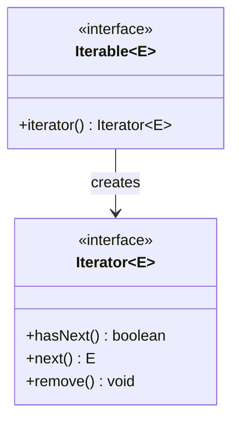

If you ask "what makes the Java Collections Framework feel coherent?"
the deepest honest answer is: **every container is iterable, and they
are all iterable in the same way**. Whether you have a `List`, a
`Set`, a `Map`'s `entrySet`, or your own custom container, the way
you walk through it is the same. That uniformity is enforced by two
tiny interfaces: `Iterable<E>` and `Iterator<E>`.

<Figure
  slug="jcol-iterables-iterators-cutout"
  alt="Iterables and iterators, an isometric illustration"
/>

## The two interfaces

That is it. Two interfaces, four methods.

<Figure
  slug="jcol-iterables-and-iterators-inline-cutout"
  alt="A sealed drum with a crank, one block emerging per turn, and a small pointer on the drum that has moved on by one after each"
  caption="The iterable hands out an iterator; the iterator remembers where the walk is."
/>

- `Iterable<E>` says "I can produce a fresh `Iterator<E>` on
  demand."
- `Iterator<E>` says "I am a cursor, ask me if there are more
  elements, then ask me for the next one."

Every `List`, `Set`, `Queue`, and `Deque` in the Collections Framework
implements
`Iterable`. `Map` does not directly (it isn't a `Collection`), but
its `keySet()`, `values()`, and `entrySet()` views do.

## The for-each loop is just sugar

Java's for-each loop (`for (E x : iterable)`) is compiled to a call
on `iterator()` and a `while` over `hasNext()` / `next()`. The two
fragments below produce identical bytecode:

<CodeBlock
  adapter="java"
  files={[
    {
      filename: "main.java",
      starterCode: `import java.util.ArrayList;
import java.util.Iterator;
import java.util.List;

public class Main {
  public static void main(String[] args) {
    List<String> xs = new ArrayList<>();
    xs.add("a");
    xs.add("b");
    xs.add("c");

    // Sugar:
    for (String s : xs)
      System.out.println("- " + s);

    // What the compiler turns it into:
    Iterator<String> it = xs.iterator();
    while (it.hasNext()) {
      String s = it.next();
      System.out.println("* " + s);
    }
  }
}
`,
    },
  ]}
/>

If you write your own class and implement `Iterable<E>`, the for-each
loop just works on it. That is the *return on* implementing the
interface.

<Figure
  slug="jcol-iterables-and-iterators-each-loop-just-inline-cutout"
  alt="A smooth handle on the outside of a drum, its cover lifted to show a crank and a pointer inside"
  caption="The for-each loop is the smooth handle over that same crank."
/>

## Writing an Iterable from scratch

The fastest way to internalize the contract is to write one. Here is
a tiny `IntRange` that produces the integers `[start, end)`:

<CodeBlock
  adapter="java"
  entryFilename="Main.java"
  files={[
    {
      filename: "Main.java",
      starterCode: `public class Main {
  public static void main(String[] args) {
    IntRange r = new IntRange(3, 8);
    for (int n : r)
      System.out.println(n);
  }
}
`,
    },
    {
      filename: "IntRange.java",
      starterCode: `import java.util.Iterator;
import java.util.NoSuchElementException;

public class IntRange implements Iterable<Integer> {
  private final int start;
  private final int end;

  public IntRange(int start, int end) {
    this.start = start;
    this.end = end;
  }

  @Override
  public Iterator<Integer> iterator() {
    return new Iterator<Integer>() {
      private int cursor = start;

      @Override
      public boolean hasNext() {
        return cursor < end;
      }
      @Override
      public Integer next() {
        if (!hasNext())
          throw new NoSuchElementException();
        return cursor++;
      }
    };
  }
}
`,
    },
  ]}
/>

Three observations:

- The `Iterator` is created *fresh* by every call to `iterator()`.
  That is why you can iterate the same `IntRange` twice, each
  walk gets its own cursor.
- `next()` is required to throw `NoSuchElementException` when called
  past the end. The contract is precise; library code relies on it.
- The `IntRange` itself is immutable. The state of the walk lives in
  the *iterator*, not in the iterable. That separation is the whole
  trick.

<Figure
  slug="jcol-iterables-and-iterators-writing-iterable-from-inline-cutout"
  alt="A drum being built on a bench with its crank and pointer fitted by hand before its cover goes on"
  caption="Implement the two interfaces and the for-each loop works on your own type."
/>

## Why a separate Iterator object?

A natural question: why doesn't the container itself carry the
cursor? Two reasons, both fundamental.

**1. Multiple walks at once.** If the container held the cursor, you
could not iterate it from two places at once.

<CodeBlock
  adapter="java"
  files={[
    {
      filename: "main.java",
      starterCode: `import java.util.ArrayList;
import java.util.List;

public class Main {
  public static void main(String[] args) {
    List<String> xs = new ArrayList<>();
    xs.add("a");
    xs.add("b");
    xs.add("c");

    // Two simultaneous walks, each has its own iterator,
    // so each has its own cursor.
    for (String outer : xs) {
      for (String inner : xs) {
        System.out.println("(" + outer + "," + inner + ")");
      }
    }
  }
}
`,
    },
  ]}
/>

A list with a single cursor inside it could never produce that
nested-loop output.

**2. Streaming sources.** Some "iterables" are not collections at all,
they are *generators*. A live stream of events, a file's lines, a
network response, each can implement `Iterable` and produce a
cursor that pulls one element at a time. No need to materialize the
whole sequence in memory.

## Iterator.remove(): safe in-place deletion

The big functional advance over the old `Enumeration` is
`Iterator.remove()`. It removes the element most recently returned
by `next()` from the *underlying collection*, in $O(1)$ for most
implementations.

<CodeBlock
  adapter="java"
  files={[
    {
      filename: "main.java",
      starterCode: `import java.util.ArrayList;
import java.util.Iterator;
import java.util.List;

public class Main {
  public static void main(String[] args) {
    List<Integer> xs = new ArrayList<>();
    for (int i = 1; i <= 10; i++)
      xs.add(i);

    // Remove every even number safely during iteration.
    Iterator<Integer> it = xs.iterator();
    while (it.hasNext()) {
      int n = it.next();
      if (n % 2 == 0)
        it.remove();
    }
    System.out.println(xs);
  }
}
`,
    },
  ]}
/>

Why does this matter? Because mutating a list with `list.remove(i)`
inside a for-each loop is **forbidden**, it throws
`ConcurrentModificationException`.

## ConcurrentModificationException: the fail-fast guarantee

JCF iterators are **fail-fast**: if the underlying collection is
modified by *anyone other than the iterator itself* during a walk,
the next call to `next()` throws.

<CodeBlock
  adapter="java"
  files={[
    {
      filename: "main.java",
      starterCode: `import java.util.ArrayList;
import java.util.List;

public class Main {
  public static void main(String[] args) {
    List<String> xs = new ArrayList<>();
    xs.add("a");
    xs.add("b");
    xs.add("c");

    try {
      for (String s : xs) {
        if (s.equals("b"))
          xs.remove(s); // structural change!
      }
    } catch (RuntimeException e) {
      System.out.println("threw: " + e.getClass().getSimpleName());
    }
  }
}
`,
    },
  ]}
/>

This is a *feature*, not a bug. Detecting concurrent mutation early
turns "mysterious data corruption" into "loud crash at the line of
the mistake."

## Iterating a Map

A `Map` is not a `Collection`, so it does not have its own
`iterator()`. Instead it exposes three *views*, each of which is
iterable:

<CodeBlock
  adapter="java"
  files={[
    {
      filename: "main.java",
      starterCode: `import java.util.HashMap;
import java.util.Map;

public class Main {
  public static void main(String[] args) {
    Map<String, Integer> m = new HashMap<>();
    m.put("alpha", 1);
    m.put("beta", 2);
    m.put("gamma", 3);

    // keys
    for (String k : m.keySet())
      System.out.println("key:   " + k);

    // values
    for (Integer v : m.values())
      System.out.println("value: " + v);

    // entries (preferred, one walk over both)
    for (Map.Entry<String, Integer> e : m.entrySet()) {
      System.out.println(e.getKey() + " -> " + e.getValue());
    }
  }
}
`,
    },
  ]}
/>

Prefer `entrySet()` when you need both: it walks the map once. Using
`keySet()` and then `m.get(k)` walks it twice.

## A multi-file example: an Iterable of an array

Let's wrap an `int[]` in an `Iterable` so it can be used in for-each.
This is exactly how `Arrays.asList` and friends work conceptually.

<CodeBlock
  adapter="java"
  entryFilename="Main.java"
  files={[
    {
      filename: "Main.java",
      starterCode: `public class Main {
  public static void main(String[] args) {
    int[] arr = {10, 20, 30, 40};
    IntArrayIterable it = new IntArrayIterable(arr);

    for (int n : it)
      System.out.println(n);

    // Walk it a second time, fresh iterator, starts over.
    int total = 0;
    for (int n : it)
      total += n;
    System.out.println("sum = " + total);
  }
}
`,
    },
    {
      filename: "IntArrayIterable.java",
      starterCode: `import java.util.Iterator;
import java.util.NoSuchElementException;

public class IntArrayIterable implements Iterable<Integer> {
  private final int[] data;

  public IntArrayIterable(int[] data) { this.data = data; }

  @Override
  public Iterator<Integer> iterator() {
    return new Iterator<Integer>() {
      private int i = 0;
      @Override
      public boolean hasNext() {
        return i < data.length;
      }
      @Override
      public Integer next() {
        if (!hasNext())
          throw new NoSuchElementException();
        return data[i++];
      }
    };
  }
}
`,
    },
  ]}
/>

## Practice

<ChallengeCard
  adapter="java"
  title="Implement a CountdownIterable"
  instructions={`Build a class \`Countdown\` that, when iterated, yields integers from \`start\` down to \`1\` inclusive.

- \`Countdown\` takes one constructor argument: \`int start\` (assume \`start >= 1\`).
- \`Countdown\` implements \`Iterable<Integer>\`.
- Iterating a \`Countdown(3)\` should produce \`3\`, \`2\`, \`1\` in that order.
- It must be safe to iterate the same \`Countdown\` twice, each walk should start over.

Expected output:

\`\`\`
3
2
1
---
3
2
1
\`\`\``}
  entryFilename="Main.java"
  files={[
    {
      filename: "Main.java",
      starterCode: `public class Main {
  public static void main(String[] args) {
    Countdown c = new Countdown(3);
    for (int n : c)
      System.out.println(n);
    System.out.println("---");
    for (int n : c)
      System.out.println(n);
  }
}
`,
    },
    {
      filename: "Countdown.java",
      starterCode: `import java.util.Iterator;

public class Countdown implements Iterable<Integer> {
  // TODO
  public Countdown(int start) {
    // TODO
  }

  @Override
  public Iterator<Integer> iterator() {
    // TODO
    return null;
  }
}
`,
      solutionCode: `import java.util.Iterator;
import java.util.NoSuchElementException;

public class Countdown implements Iterable<Integer> {
  private final int start;
  public Countdown(int start) { this.start = start; }

  @Override
  public Iterator<Integer> iterator() {
    return new Iterator<Integer>() {
      private int cursor = start;
      @Override
      public boolean hasNext() {
        return cursor >= 1;
      }
      @Override
      public Integer next() {
        if (!hasNext())
          throw new NoSuchElementException();
        return cursor--;
      }
    };
  }
}
`,
    },
  ]}
  tests={[
    {
      id: "countdown-twice",
      name: "Countdown is iterable twice",
      expect: { stdoutEquals: "3\n2\n1\n---\n3\n2\n1" },
    },
  ]}
/>

## Test your understanding

<MultipleChoice
  markdown={`Why is the cursor state stored in the \`Iterator\`, not in the \`Iterable\`?

- [o] So multiple independent walks of the same container can happen at once, each with its own cursor
  > Nested loops over the same collection rely on each walk having its own state.
- Because the JVM forbids state in interfaces
  > Interfaces can carry state via objects that implement them; that's irrelevant here.
- Because \`Iterator\` is older than \`Iterable\`
  > Iterable was added in Java 5 specifically to support \`for-each\` over \`Iterator\`-producing types.
- Because iterators are smaller in memory
  > Size isn't the design driver.`}
/>

<MultipleChoice
  markdown={`What exception do JCF iterators throw when the underlying collection is structurally modified during a walk (other than via the iterator itself)?

- \`UnsupportedOperationException\`
  > That is what an immutable collection throws on a mutating call.
- \`NoSuchElementException\`
  > That is what \`next()\` throws past the end.
- \`IllegalStateException\`
  > That is what \`remove()\` throws when called before \`next()\`.
- [o] \`ConcurrentModificationException\`
  > JCF iterators are fail-fast: they detect concurrent mutation and throw immediately.`}
/>

<MultipleChoice
  markdown={`Which is the preferred way to iterate both keys and values of a \`Map\` exactly once?

- Iterate \`keySet()\` and call \`get(key)\` for each
  > That walks the map twice, once for keys, once for the lookups.
- Convert the map to a \`List\` and iterate that
  > Unnecessary copying; \`entrySet()\` already does what you need.
- [o] Iterate \`entrySet()\` and read \`getKey()\` / \`getValue()\` on each entry
  > A single walk over the entry view yields both halves of each pair.
- Iterate \`values()\`
  > That gives you values without keys.`}
/>
