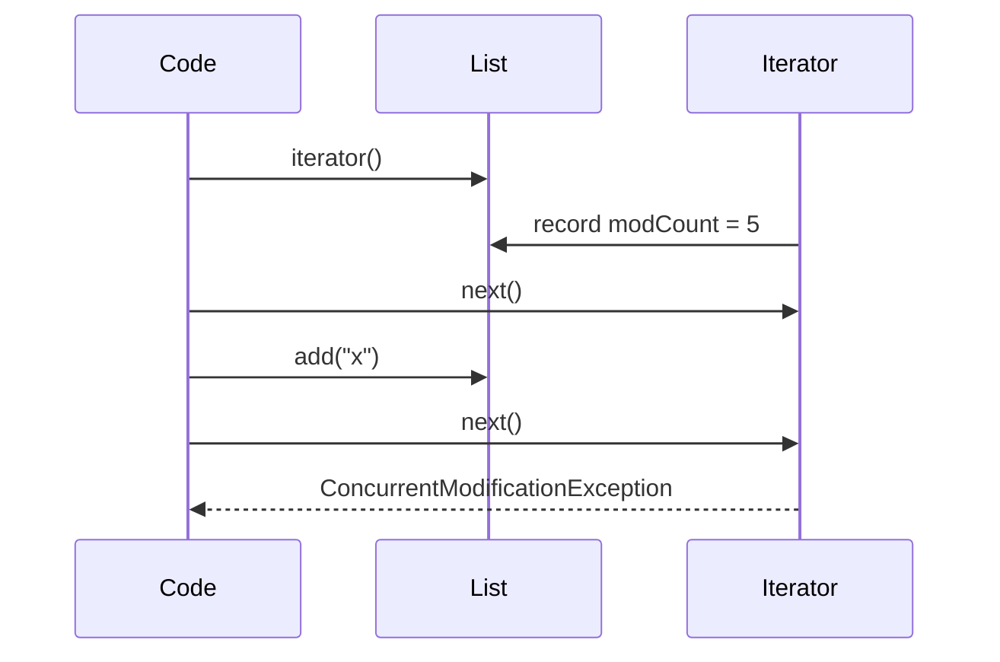

There is more than one way to walk a collection in Java, and the
*right* one depends on what you actually need: just read each
element? remove some as you go? insert new ones? walk backwards?
process the whole thing as a pipeline?

<Figure
  slug="jcol-iteration-patterns-cutout"
  alt="Iteration patterns, an isometric illustration"
/>

This chapter is a tour of the five iteration patterns you'll use
every week, plus the single most common bug each one introduces.

## 1. Enhanced for-each

The for-each loop is sugar over an `Iterator`. It is the right tool
for *"do something with each element, in order"*:

<CodeBlock
  adapter="java"
  files={[
    {
      filename: "main.java",
      starterCode: `import java.util.List;
import java.util.Arrays;

public class Main {
  public static void main(String[] args) {
    List<String> xs = Arrays.asList("a", "b", "c");
    for (String x : xs) {
      System.out.println(x);
    }
  }
}
`,
    },
  ]}
/>

The compiler rewrites `for (E x : c)` into roughly:

```java
Iterator<E> it = c.iterator();
while (it.hasNext()) {
    E x = it.next();
    /* body */
}
```

That has one immediate consequence: **you cannot remove elements
from the collection inside a for-each loop.** Doing so triggers
`ConcurrentModificationException` on the next `it.hasNext()`.

<Figure
  slug="jcol-iteration-patterns-1-enhanced-each-inline-cutout"
  alt="A drum with a single smooth handle, one block leaving per turn with nothing else to operate"
  caption="The for-each loop offers one handle and nothing else to get wrong."
/>

## 2. Explicit Iterator and Iterator.remove()

When you need to remove while iterating, use the explicit `Iterator`
form so you can call `it.remove()`, the only safe way to mutate
during iteration:

<CodeBlock
  adapter="java"
  files={[
    {
      filename: "main.java",
      starterCode: `import java.util.ArrayList;
import java.util.Iterator;
import java.util.List;
import java.util.Arrays;

public class Main {
  public static void main(String[] args) {
    List<Integer> xs = new ArrayList<>(Arrays.asList(1, 2, 3, 4, 5, 6));
    Iterator<Integer> it = xs.iterator();
    while (it.hasNext()) {
      int n = it.next();
      if (n % 2 == 0)
        it.remove(); // safe
    }
    System.out.println(xs);
  }
}
`,
    },
  ]}
/>

Even better, Java 8 added `removeIf` on every `Collection`, which is
the modern one-liner:

<CodeBlock
  adapter="java"
  files={[
    {
      filename: "main.java",
      starterCode: `import java.util.ArrayList;
import java.util.List;
import java.util.Arrays;

public class Main {
  public static void main(String[] args) {
    List<Integer> xs = new ArrayList<>(Arrays.asList(1, 2, 3, 4, 5, 6));
    xs.removeIf(n -> n % 2 == 0);
    System.out.println(xs);
  }
}
`,
    },
  ]}
/>

## 3. ListIterator: bidirectional, plus add()

`List`s support `listIterator()`, which is `Iterator` with
superpowers: you can walk backwards (`hasPrevious`, `previous`),
*replace* the current element (`set`), and *insert* a new element at
the cursor (`add()`):

<CodeBlock
  adapter="java"
  files={[
    {
      filename: "main.java",
      starterCode: `import java.util.ArrayList;
import java.util.List;
import java.util.ListIterator;
import java.util.Arrays;

public class Main {
  public static void main(String[] args) {
    List<String> xs = new ArrayList<>(Arrays.asList("a", "c", "e"));
    ListIterator<String> it = xs.listIterator();
    while (it.hasNext()) {
      String s = it.next();
      // insert a marker after every element
      it.add(s + "!");
    }
    System.out.println(xs);
  }
}
`,
    },
  ]}
/>

`ListIterator` is what makes "edit in place" patterns possible on
list-backed structures.

<Figure
  slug="jcol-iteration-patterns-2-explicit-iterator-inline-cutout"
  alt="A drum with its cover off, a hand on the crank and a second hand lifting one block out mid-turn"
  caption="Only the explicit iterator lets you remove an element mid-walk safely."
/>

## 4. forEach with a Consumer

Every `Iterable` has a default `forEach(Consumer<? super E>)`. It
reads naturally when the action is a simple, terminal side effect:

<CodeBlock
  adapter="java"
  files={[
    {
      filename: "main.java",
      starterCode: `import java.util.List;
import java.util.Arrays;

public class Main {
  public static void main(String[] args) {
    List<String> xs = Arrays.asList("a", "b", "c");
    xs.forEach(System.out::println);
  }
}
`,
    },
  ]}
/>

`forEach()` does not let you stop early, that's a `for` with a
`break`'s job. And, as with the enhanced for, you cannot modify the
collection from inside the action.

## 5. Streams: iteration as a pipeline

Streams are the *declarative* form of iteration. You describe **what**
should happen to each element (`filter()`, `map()`, `sorted()`,
`distinct()`, `flatMap()`, ...) and end with a terminal operation
(`toList()`, `count()`, `reduce()`, `forEach()`, ...). The library decides
*how*.

<Figure
  slug="jcol-iteration-patterns-inline-cutout"
  alt="The same rail of blocks walked three ways, by a crank, by a hand counting slots, and by a chute taking them in bulk"
  caption="Crank it, count it, or hand the whole thing to a pipeline."
/>

<CodeBlock
  adapter="java"
  files={[
    {
      filename: "main.java",
      starterCode: `import java.util.List;
import java.util.Arrays;
import java.util.stream.Collectors;

public class Main {
  public static void main(String[] args) {
    List<String> names = Arrays.asList("Ada", "Linus", "Grace", "Bjarne", "Edsger");

    List<String> shortLower = names.stream()
                                  .filter(n -> n.length() <= 5)
                                  .map(String::toLowerCase)
                                  .sorted()
                                  .collect(Collectors.toList());

    System.out.println(shortLower);
  }
}
`,
    },
  ]}
/>

The same logic with a manual loop is twice as long and twice as
mistake-prone:

<CodeBlock
  adapter="java"
  files={[
    {
      filename: "main.java",
      starterCode: `import java.util.*;

public class Main {
  public static void main(String[] args) {
    List<String> names = Arrays.asList("Ada", "Linus", "Grace", "Bjarne", "Edsger");

    List<String> shortLower = new ArrayList<>();
    for (String n : names) {
      if (n.length() <= 5)
        shortLower.add(n.toLowerCase());
    }
    Collections.sort(shortLower);
    System.out.println(shortLower);
  }
}
`,
    },
  ]}
/>

Use a stream when the loop body is a clear pipeline of **filter →
transform → collect**. Use an explicit loop when the body has real
control flow (early returns, complex branching, state across
iterations).

## ConcurrentModificationException: the real villain

The exception's name is misleading: it has nothing to do with
threads. It is raised by `Iterator` when it notices the *structural
modification count* of the collection changed since the iterator was
created, i.e. you added or removed something behind its back.



The fix is always one of:

1. Use the iterator's own `remove()` (or `removeIf` for whole-collection deletes).
2. Collect what you want to remove during iteration, then remove afterwards.
3. Iterate a *copy*: `for (E x : new ArrayList<>(xs)) { xs.remove(...); }`.

## Multi-file example: filter a feed with three techniques

<CodeBlock
  adapter="java"
  entryFilename="Main.java"
  files={[
    {
      filename: "Main.java",
      starterCode: `import java.util.*;

public class Main {
  public static void main(String[] args) {
    List<Post> posts = Arrays.asList(new Post("Ada", "hello", true),
                               new Post("Linus", "kernel rant", false),
                               new Post("Grace", "compiler talk", true),
                               new Post("Edsger", "goto considered", true));

    System.out.println("imperative: " + FeedFilters.imperative(posts));
    System.out.println("iterator:   " +
                       FeedFilters.viaIterator(new ArrayList<>(posts)));
    System.out.println("stream:     " + FeedFilters.viaStream(posts));
  }
}
`,
    },
    {
      filename: "Post.java",
      starterCode: `import java.util.Objects;

public final class Post {
  private final String author;
  private final String text;
  private final boolean published;

  public Post(String author, String text, boolean published) {
    this.author = author;
    this.text = text;
    this.published = published;
  }

  public String author() { return author; }
  public String text() { return text; }
  public boolean published() { return published; }

  @Override
  public boolean equals(Object o) {
    if (this == o) return true;
    if (!(o instanceof Post)) return false;
    Post other = (Post)o;
    return Objects.equals(author, other.author) && Objects.equals(text, other.text) && published == other.published;
  }

  @Override
  public int hashCode() { return Objects.hash(author, text, published); }

  @Override
  public String toString() {
    return "Post[" + "author=" + author + ", " + "text=" + text + ", " + "published=" + published + "]";
  }
}
`,
    },
    {
      filename: "FeedFilters.java",
      starterCode: `import java.util.*;
import java.util.stream.Collectors;

public final class FeedFilters {
  private FeedFilters() {}

  /** Loop + ArrayList accumulator. */
  public static List<String> imperative(List<Post> posts) {
    List<String> out = new ArrayList<>();
    for (Post p : posts)
      if (p.published())
        out.add(p.author());
    return out;
  }

  /** Iterator.remove on a mutable copy. */
  public static List<String> viaIterator(List<Post> mutable) {
    Iterator<Post> it = mutable.iterator();
    while (it.hasNext())
      if (!it.next().published())
        it.remove();
    List<String> out = new ArrayList<>();
    for (Post p : mutable)
      out.add(p.author());
    return out;
  }

  /** Declarative pipeline. */
  public static List<String> viaStream(List<Post> posts) {
    return posts.stream().filter(Post::published).map(Post::author).collect(Collectors.toList());
  }
}
`,
    },
  ]}
/>

Three idioms, same output, and the stream version is the easiest to
read in five months' time.

## Practice

<ChallengeCard
  adapter="java"
  title="Safe removal during iteration"
  instructions={`Complete \`Pruner.removeShorterThan(List<String> words, int minLen)\` so it removes every word shorter than \`minLen\` **without** triggering \`ConcurrentModificationException\`. Use either \`Iterator.remove()\` or \`removeIf\`.

Expected output:

\`\`\`
[alpha, gamma, delta]
\`\`\``}
  entryFilename="Main.java"
  files={[
    {
      filename: "Main.java",
      starterCode: `import java.util.ArrayList;
import java.util.List;
import java.util.Arrays;

public class Main {
  public static void main(String[] args) {
    List<String> ws =
        new ArrayList<>(Arrays.asList("hi", "alpha", "ok", "gamma", "delta"));
    Pruner.removeShorterThan(ws, 4);
    System.out.println(ws);
  }
}
`,
    },
    {
      filename: "Pruner.java",
      starterCode: `import java.util.List;

public final class Pruner {
  private Pruner() {}

  public static void removeShorterThan(List<String> words, int minLen) {
    // TODO
  }
}
`,
      solutionCode: `import java.util.List;

public final class Pruner {
  private Pruner() {}

  public static void removeShorterThan(List<String> words, int minLen) {
    words.removeIf(w -> w.length() < minLen);
  }
}
`,
    },
  ]}
  tests={[
    {
      id: "pruner-remove-short",
      name: "Pruner removes short words without ConcurrentModificationException",
      expect: { stdoutEquals: "[alpha, gamma, delta]" },
    },
  ]}
/>

## Test your understanding

<MultipleChoice
  markdown={`Why does this loop throw \`ConcurrentModificationException\`?

\`\`\`java
for (Integer n : list) if (n % 2 == 0) list.remove(n);
\`\`\`

- Because integers are autoboxed
  > Autoboxing is unrelated.
- [o] Because the enhanced-for uses an \`Iterator\`, and modifying the underlying list via \`list.remove\` invalidates the iterator's internal modCount
  > Either use \`Iterator.remove()\` directly or call \`list.removeIf(...)\`.
- Because \`list\` is unmodifiable
  > It need not be; the exception fires on a mutable list too.
- Because \`list.remove(Object)\` is \`O(n)\`
  > That's a performance issue, not a correctness one.`}
/>

<MultipleChoice
  markdown={`Which iteration form lets you **insert** new elements at the cursor while walking a \`List\`?

- [o] \`ListIterator\`
  > \`ListIterator.add(e)\` inserts at the current cursor position.
- Plain \`Iterator\`
  > Plain \`Iterator\` only supports \`remove()\`, not \`add()\`.
- \`forEach(Consumer)\`
  > Cannot mutate.
- Enhanced for-each
  > Cannot mutate.`}
/>

<MultipleChoice
  markdown={`When is a stream pipeline the better choice over an explicit loop?

- When the body needs \`break\` or \`return\`
  > Streams don't have \`break\`; a \`for\` loop is cleaner there.
- Always, because streams are faster
  > They are often comparable, sometimes slower.
- When you need to mutate the source collection
  > Streams must not mutate their source.
- [o] When the body is a straightforward pipeline of filter / transform / collect with no early exit
  > Streams trade flexibility for declarative clarity in exactly that case.`}
/>
