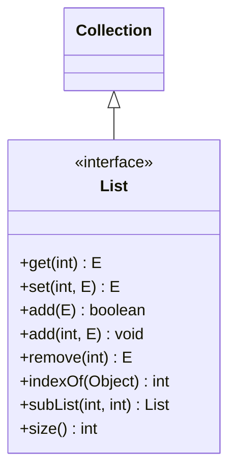
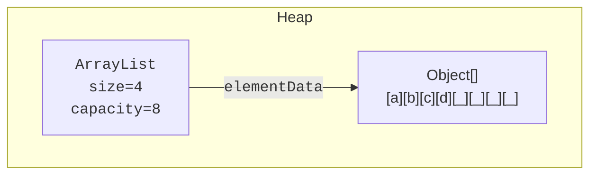
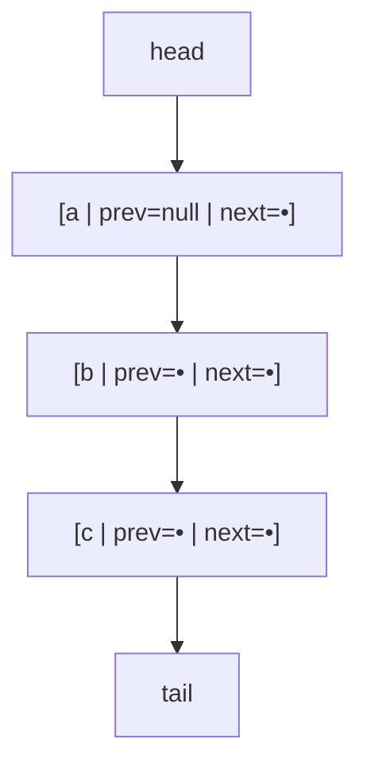

A **list** is an ordered, indexed sequence of elements. It is the
most-used container in almost any program, the JCF interface
`List<E>` is your default when you need to remember things in the
order they arrived.

<Figure
  slug="jcol-lists-cutout"
  alt="Lists, an isometric illustration"
/>

This page covers the `List` interface, its two main implementations
(`ArrayList` and `LinkedList`), and the small handful of facts about
their memory layout that explain almost every performance question
you'll ever ask.

## The List interface

The methods that distinguish a `List` from a plain `Collection` are
all about *position*: `get(i)`, `add(i, x)`, `remove(i)`,
`indexOf(x)`, `subList(from, to)`. A list has *seat numbers*.

<CodeBlock
  adapter="java"
  files={[
    {
      filename: "main.java",
      starterCode: `import java.util.ArrayList;
import java.util.List;

public class Main {
  public static void main(String[] args) {
    List<String> xs = new ArrayList<>();
    xs.add("alpha"); // append
    xs.add("beta");
    xs.add("gamma");
    xs.add(1, "between"); // insert at index 1

    System.out.println(xs); // [alpha, between, beta, gamma]
    System.out.println("xs[2] = " + xs.get(2));
    System.out.println("indexOf beta = " + xs.indexOf("beta"));

    xs.set(0, "ALPHA");
    xs.remove("gamma"); // by value
    xs.remove(0);       // by index

    System.out.println(xs); // [between, beta]
  }
}
`,
    },
  ]}
/>

## ArrayList: a list backed by an array

`ArrayList` is the workhorse. Internally it holds an `Object[]` and a
`size` counter. When the array fills up, it allocates a bigger one
(typically 1.5× the current capacity) and copies.

That single picture explains every `ArrayList` performance fact:

| Operation | Cost | Why |
| --- | --- | --- |
| `get(i)`, `set(i, e)` | `O(1)` | Pointer arithmetic into the array |
| `add(e)` (append) | `O(1)` *amortized* | One slot fill; occasionally double-and-copy |
| `add(i, e)` (insert middle) | `O(n)` | Shift everything after `i` |
| `remove(i)` | `O(n)` | Shift everything after `i` |
| `contains(x)`, `indexOf(x)` | `O(n)` | Linear scan |

## LinkedList: a doubly-linked node chain

`LinkedList` is the other side of the coin. Each element is a node
holding the value plus pointers to the previous and next nodes.

| Operation | Cost | Why |
| --- | --- | --- |
| `get(i)`, `set(i, e)` | `O(n)` | Walk from head or tail |
| `add(e)` (append) | `O(1)` | Wire one new node onto the tail |
| `add(0, e)` (prepend) | `O(1)` | Wire one new node onto the head |
| `addFirst` / `addLast` (via `Deque`) | `O(1)` | Same |
| `remove` at a node you already hold | `O(1)` | Re-wire pointers |
| `contains(x)`, `indexOf(x)` | `O(n)` | Linear scan |

So `LinkedList` is `O(1)` at the *ends* and `O(n)` in the *middle*. It
also implements `Deque<E>`, which is where most of its modern use
comes from.

## ArrayList vs LinkedList: when each wins

The honest short answer: **`ArrayList` wins almost every real
benchmark**. The reason is hardware: arrays have **contiguous
memory**, which the CPU's cache loves. Linked-list nodes are
scattered all over the heap, costing a cache miss on every step.

The cases where `LinkedList` still wins:

- You are doing many `addFirst` / `removeFirst` and need an *equal*
  guarantee, but `ArrayDeque` is almost always better for this.
- You have an explicit reference to a node and need `O(1)`
  removal, but Java's `LinkedList` API doesn't expose nodes.

In modern Java code, `LinkedList` shows up much less often than you
might guess from textbooks. Reach for `ArrayList` by default;
reach for `ArrayDeque` when you genuinely need queue-like access at
both ends.

<CodeBlock
  adapter="java"
  files={[
    {
      filename: "main.java",
      starterCode: `import java.util.ArrayList;
import java.util.LinkedList;
import java.util.List;

public class Main {
  static long appendMany(List<Integer> list, int n) {
    long start = System.nanoTime();
    for (int i = 0; i < n; i++)
      list.add(i);
    return System.nanoTime() - start;
  }

  public static void main(String[] args) {
    int n = 200_000;
    long a = appendMany(new ArrayList<>(), n);
    long l = appendMany(new LinkedList<>(), n);
    System.out.println("ArrayList  append " + n + " : " + (a / 1_000_000) +
                       " ms");
    System.out.println("LinkedList append " + n + " : " + (l / 1_000_000) +
                       " ms");
  }
}
`,
    },
  ]}
/>

(Numbers depend on the JIT, but `ArrayList` typically beats
`LinkedList` even for "pure append" because of cache locality and
the cheaper node-less storage.)

## Initial capacity: when you know the size

If you know the rough size of an `ArrayList` ahead of time, pass it
to the constructor. Otherwise you pay for repeated `grow()` and
`Arrays.copyOf`.

<CodeBlock
  adapter="java"
  files={[
    {
      filename: "main.java",
      starterCode: `import java.util.ArrayList;
import java.util.List;

public class Main {
  public static void main(String[] args) {
    // Default initial capacity is 10. If you know you'll add 10,000,
    // size up front to avoid log(10000/10) reallocations.
    List<Integer> xs = new ArrayList<>(10_000);
    for (int i = 0; i < 10_000; i++)
      xs.add(i);
    System.out.println("size = " + xs.size());
  }
}
`,
    },
  ]}
/>

## Sublist: a *view*, not a copy

`subList(from, to)` returns a *live view* of the underlying list.
Changes to the sublist affect the original, and structural changes
to the original *invalidate* the sublist.

<CodeBlock
  adapter="java"
  files={[
    {
      filename: "main.java",
      starterCode: `import java.util.ArrayList;
import java.util.List;

public class Main {
  public static void main(String[] args) {
    List<Integer> xs = new ArrayList<>();
    for (int i = 1; i <= 5; i++)
      xs.add(i);

    List<Integer> middle = xs.subList(1, 4); // view of indices 1..3
    System.out.println("middle = " + middle);

    middle.set(0, 99); // mutates the original
    System.out.println("xs = " + xs);

    middle.clear(); // removes those elements from xs
    System.out.println("xs = " + xs);
  }
}
`,
    },
  ]}
/>

This is enormously useful for slicing, and a frequent source of
surprise for people who expect a copy.

## Immutable list literals: List.of(...)

Java 9 added factory methods `List.of(a, b, c)` that produce
**immutable** lists. They are cheap, type-safe, and exactly what you
want for small fixed collections (especially as constants).

<CodeBlock
  adapter="java"
  files={[
    {
      filename: "main.java",
      starterCode: `import java.util.List;

public class Main {
  public static void main(String[] args) {
    List<String> primary = List.of("red", "green", "blue");
    System.out.println(primary);

    try {
      primary.add("yellow"); // throws, immutable
    } catch (UnsupportedOperationException e) {
      System.out.println("threw: " + e.getClass().getSimpleName());
    }
  }
}
`,
    },
  ]}
/>

For collections that are computed once and never mutated, this is
strictly better than constructing an `ArrayList` and forgetting to
seal it.

## Removing while iterating: the right way

We met this in the iteration chapter, but it deserves a list-specific
note: do not `list.remove(...)` inside a for-each loop. Use the
iterator's `remove()`, or use `removeIf` (Java 8+):

<CodeBlock
  adapter="java"
  files={[
    {
      filename: "main.java",
      starterCode: `import java.util.ArrayList;
import java.util.List;

public class Main {
  public static void main(String[] args) {
    List<Integer> xs = new ArrayList<>();
    for (int i = 1; i <= 10; i++)
      xs.add(i);

    // The modern, declarative way:
    xs.removeIf(n -> n % 2 == 0);
    System.out.println(xs);
  }
}
`,
    },
  ]}
/>

`removeIf` accepts a `Predicate` and does the safe iteration for you.

## Practice

<ChallengeCard
  adapter="java"
  title="A bounded recent-history list"
  instructions={`Build a class \`RecentHistory<E>\` that remembers the **most recent** \`limit\` items added (older items fall off the front).

- The constructor takes \`int limit\`. Assume \`limit >= 1\`.
- \`void record(E item)\` appends \`item\`. If size exceeds \`limit\`, remove the oldest element.
- \`List<E> items()\` returns the current list of items, oldest first.

Expected output:

\`\`\`
[a, b, c]
[b, c, d]
[c, d, e]
\`\`\``}
  entryFilename="Main.java"
  files={[
    {
      filename: "Main.java",
      starterCode: `public class Main {
  public static void main(String[] args) {
    RecentHistory<String> h = new RecentHistory<>(3);
    h.record("a");
    h.record("b");
    h.record("c");
    System.out.println(h.items());
    h.record("d");
    System.out.println(h.items());
    h.record("e");
    System.out.println(h.items());
  }
}
`,
    },
    {
      filename: "RecentHistory.java",
      starterCode: `import java.util.ArrayList;
import java.util.List;

public class RecentHistory<E> {
  // TODO
}
`,
      solutionCode: `import java.util.ArrayList;
import java.util.List;

public class RecentHistory<E> {
  private final int limit;
  private final List<E> data = new ArrayList<>();
  public RecentHistory(int limit) { this.limit = limit; }

  public void record(E item) {
    data.add(item);
    while (data.size() > limit)
      data.remove(0);
  }

  public List<E> items() { return data; }
}
`,
    },
  ]}
  tests={[
    {
      id: "recent-history-rolls-off",
      name: "RecentHistory keeps only the most recent N",
      expect: { stdoutEquals: "[a, b, c]\n[b, c, d]\n[c, d, e]" },
    },
  ]}
/>

## Test your understanding

<MultipleChoice
  markdown={`Which operation is \`O(1)\` on \`ArrayList\` but \`O(n)\` on \`LinkedList\`?

- Appending at the end
  > Both are \`O(1)\` amortized at the end.
- \`contains(x)\`
  > Both are \`O(n)\`, they scan.
- [o] \`get(i)\` for arbitrary \`i\`
  > An \`ArrayList\` indexes by arithmetic; a \`LinkedList\` must walk.
- Removing the first element
  > That's actually faster on \`LinkedList\` (\`O(1)\`) than \`ArrayList\` (\`O(n)\`).`}
/>

<MultipleChoice
  markdown={`Why does \`ArrayList\` typically beat \`LinkedList\` in real-world benchmarks even for "linked-list-friendly" workloads?

- The JVM secretly stores \`LinkedList\` nodes contiguously
  > It does not.
- \`ArrayList\` is implemented in native code
  > Both are pure Java.
- [o] Contiguous array memory is far more cache-friendly than scattered linked-list nodes, so the CPU spends much less time waiting on memory
  > Big-O hides the constant factors that cache misses dominate in modern hardware.
- \`LinkedList\` was deprecated in Java 11
  > It is not deprecated.`}
/>

<MultipleChoice
  markdown={`What does \`subList(from, to)\` return?

- A primitive \`int[]\`
  > It returns a \`List\`.
- [o] A live *view* of the original list; mutations affect the backing list and structural changes to the backing list invalidate the view
  > This is both powerful and a frequent source of surprise.
- An immutable list snapshot
  > Sublists are mutable views, not immutable snapshots.
- A new independent \`ArrayList\`
  > It is *not* a copy.`}
/>
