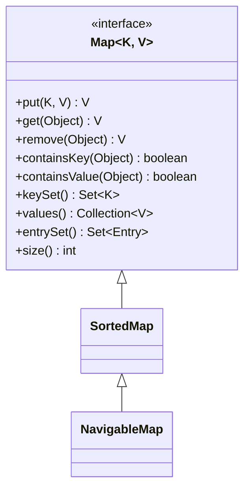
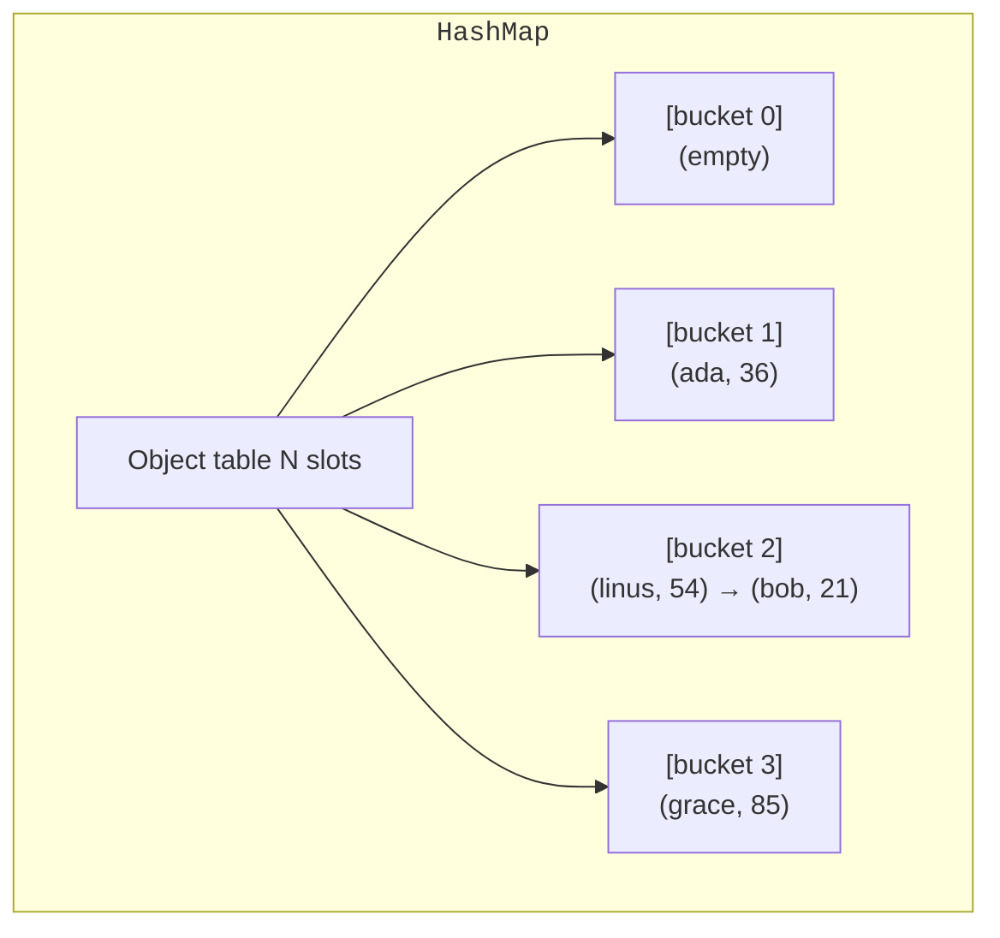

A **map** is a *function* from keys to values. If `Set` answers "is
this in here?", `Map` answers "what is associated with this?".

<Figure
  slug="jcol-maps-cutout"
  alt="Maps, an isometric illustration"
/>

Maps are arguably the most powerful container in any program. Caches,
indexes, configuration, frequency counts, lookup tables, JSON
objects, and the symbol tables of every compiler in the world are
maps under the skin.

## The Map interface

`Map<K, V>` is its own root, it does not extend `Collection`,
because its elements are *pairs* (`Map.Entry<K, V>`), not single
values.

<Figure
  slug="jcol-maps-map-interface-inline-cutout"
  alt="A wall of small drawers each with its own keyhole and a key hanging beside it"
  caption="Keys are unique; values are whatever each key was given."
/>

The three views, `keySet()`, `values()`, `entrySet()`, are how you
iterate a map. Of those, `entrySet()` is almost always what you want.

## HashMap

`HashMap` is the workhorse. Average `O(1)` for `put()`, `get()`,
`containsKey()`. No order guarantee.

<CodeBlock
  adapter="java"
  files={[
    {
      filename: "main.java",
      starterCode: `import java.util.HashMap;
import java.util.Map;

public class Main {
  public static void main(String[] args) {
    Map<String, Integer> wordCount = new HashMap<>();
    for (String w : "the quick brown fox the lazy dog the".split(" ")) {
      wordCount.merge(w, 1, Integer::sum);
    }

    for (Map.Entry<String, Integer> e : wordCount.entrySet()) {
      System.out.println(e.getKey() + " -> " + e.getValue());
    }
  }
}
`,
    },
  ]}
/>

`merge(key, defaultValue, remapping)` is the single most useful
`HashMap` method most people never learn. It atomically combines
"insert if absent, update if present", perfect for histograms.

## How HashMap actually works

Worth understanding the data structure once.

- Internally there is an `Object[] table` of *buckets*.
- A key's bucket index is computed from its `hashCode()`.
- If two keys hash to the same bucket (a *collision*), they are
  stored in a linked list inside that bucket, or, since Java 8, a
  red-black tree once the chain grows past 8 entries.
- When the table is too full (the *load factor*, default `0.75`, is
  exceeded), the table doubles and every entry is rehashed into a
  fresh, larger table.

This explains a lot:

- Why `put()` and `get()` are `O(1)` *average* but worst-case `O(log n)`
  (post-Java-8) after collisions.
- Why a bad `hashCode()` (constant, or near-constant) destroys
  performance, every operation falls back to walking a long chain.
- Why a `HashMap` uses more memory than you'd guess: it has empty
  buckets to keep the load factor low.

That "since Java 8" tree detail has a war story behind it. At the
Chaos Communication Congress in December 2011, security researchers
Alexander Klink and Julian Wälde demonstrated **hash flooding**:
because the string hash functions of most web platforms were
predictable, an attacker could precompute thousands of parameter
names that all collide into the same bucket and stuff them into a
single POST request. Every insert then crawled one enormous chain,
quadratic total work, so a few hundred kilobytes of crafted request
could pin a CPU core for minutes. PHP, Python, Ruby, ASP.NET, and
Java servers were all vulnerable, and vendors scrambled out patches.
Java's deeper fix arrived in Java 8: once a bucket's chain grows past
eight entries, `HashMap` converts it into a red-black tree, capping
even an adversarial worst case at `O(log n)`. The data structure you
are studying was hardened by an actual attack.

## LinkedHashMap

`LinkedHashMap` is to `HashMap` what `LinkedHashSet` is to `HashSet`:
it threads a linked list through the entries to preserve **insertion
order** (or, optionally, **access order**, for LRU caches).

<CodeBlock
  adapter="java"
  files={[
    {
      filename: "main.java",
      starterCode: `import java.util.LinkedHashMap;
import java.util.Map;

public class Main {
  public static void main(String[] args) {
    Map<String, Integer> m = new LinkedHashMap<>();
    m.put("alpha", 1);
    m.put("beta", 2);
    m.put("gamma", 3);
    m.put("delta", 4);

    // Iteration order = insertion order
    for (Map.Entry<String, Integer> e : m.entrySet()) {
      System.out.println(e.getKey() + " -> " + e.getValue());
    }
  }
}
`,
    },
  ]}
/>

Use it when the *order in which entries were added* matters for
display or determinism, for example, JSON-like response objects.

## TreeMap

`TreeMap` keeps keys in sorted order (red-black tree). `O(log n)`
everywhere, but in exchange you get range queries, `firstKey`,
`lastKey`, `floorKey`, `ceilingKey`, and `subMap`.

<Figure
  slug="jcol-maps-inline-cutout"
  alt="A wall of small pigeonholes, each with a distinct key hanging beside it, and one key opening exactly one hole to reveal the block inside"
  caption="One key opens exactly one entry, with no searching along the wall."
/>

<CodeBlock
  adapter="java"
  files={[
    {
      filename: "main.java",
      starterCode: `import java.util.Map;
import java.util.TreeMap;

public class Main {
  public static void main(String[] args) {
    TreeMap<Integer, String> grades = new TreeMap<>();
    grades.put(60, "D");
    grades.put(70, "C");
    grades.put(80, "B");
    grades.put(90, "A");

    // "What grade does a 75 earn?", floor: largest key <= 75
    int score = 75;
    Map.Entry<Integer, String> band = grades.floorEntry(score);
    System.out.println(score + " -> " + band.getValue());

    // Range query
    System.out.println("80-100: " + grades.subMap(80, 101));
  }
}
`,
    },
  ]}
/>

This is what makes `TreeMap` shine for *ranges* and *bands*, pricing
tiers, age groups, time windows.

## EnumMap

When the key type is an `enum`, `EnumMap` is dramatically more
efficient than `HashMap`: it's just an array indexed by the enum
ordinal. Use it whenever you have an enum-keyed lookup.

<CodeBlock
  adapter="java"
  files={[
    {
      filename: "main.java",
      starterCode: `import java.util.EnumMap;
import java.util.Map;

public class Main {
  enum Day { MON, TUE, WED, THU, FRI, SAT, SUN }

  public static void main(String[] args) {
    Map<Day, String> hours = new EnumMap<>(Day.class);
    hours.put(Day.MON, "9-5");
    hours.put(Day.FRI, "9-3");
    hours.put(Day.SAT, "closed");

    for (Day d : Day.values()) {
      System.out.println(d + ": " + hours.getOrDefault(d, "n/a"));
    }
  }
}
`,
    },
  ]}
/>

## The handful of Map methods worth memorizing

Java 8 added a small set of methods that eliminate a *lot* of "if
present, update; else insert" boilerplate. Learn them and your code
shrinks.

| Method | What it does |
| --- | --- |
| `getOrDefault(k, d)` | `get(k)` if present, else `d` |
| `putIfAbsent(k, v)` | `put()` only if no existing entry |
| `computeIfAbsent(k, fn)` | `put()` `fn.apply(k)` if absent; useful for "map of lists" |
| `computeIfPresent(k, fn)` | Update only if already present |
| `compute(k, fn)` | Update unconditionally, with current value (or null) |
| `merge(k, v, fn)` | If absent, put `v`; else put `fn.apply(old, v)` |

The most useful idiom of all is "map of lists":

<CodeBlock
  adapter="java"
  files={[
    {
      filename: "main.java",
      starterCode: `import java.util.*;

public class Main {
  public static void main(String[] args) {
    Map<String, List<String>> byInitial = new HashMap<>();
    for (String name :
         Arrays.asList("Ada", "Alan", "Barbara", "Bjarne", "Ada", "Cathy")) {
      String key = name.substring(0, 1);
      // create the list lazily the first time we see this key
      byInitial.computeIfAbsent(key, k -> new ArrayList<>()).add(name);
    }
    new TreeMap<>(byInitial).forEach(
        (k, v) -> System.out.println(k + " -> " + v));
  }
}
`,
    },
  ]}
/>

Without `computeIfAbsent()` that loop would be five lines of "if not
present, put an empty list, then add."

## A common pitfall: null keys and null values

`HashMap` allows one `null` key and any number of `null` values.
`TreeMap` does *not* allow `null` keys (it would crash in
`compareTo()`). The immutable `Map.of(...)` factories do not allow
`null` keys or values at all. Reading `map.get(k)` returns `null`
both when the key is absent *and* when the key's value is `null`,
use `containsKey()` to distinguish.

## Multi-file example: an in-memory cache

<CodeBlock
  adapter="java"
  entryFilename="Main.java"
  files={[
    {
      filename: "Main.java",
      starterCode: `public class Main {
  public static void main(String[] args) {
    Cache<String, Integer> sq = new Cache<>(k -> {
      System.out.println("computing " + k);
      return Integer.parseInt(k) * Integer.parseInt(k);
    });

    System.out.println(sq.get("3"));
    System.out.println(sq.get("3")); // no recomputation
    System.out.println(sq.get("4"));
  }
}
`,
    },
    {
      filename: "Cache.java",
      starterCode: `import java.util.HashMap;
import java.util.Map;
import java.util.function.Function;

public class Cache<K, V> {
  private final Map<K, V> store = new HashMap<>();
  private final Function<K, V> loader;

  public Cache(Function<K, V> loader) { this.loader = loader; }

  public V get(K key) { return store.computeIfAbsent(key, loader); }
}
`,
    },
  ]}
/>

A real memoizer in 12 lines of `Cache.java`. The discipline of
`computeIfAbsent()` is what makes it both compact and race-free against
itself (within a single thread).

## Practice

<ChallengeCard
  adapter="java"
  title="Group strings by length"
  instructions={`Implement \`Grouper.byLength(List<String> words)\` that returns a \`Map<Integer, List<String>>\` where the key is the word's length and the value is the list of words of that length, **in original order**.

Expected output (a TreeMap is used in the driver only to make the printout deterministic):

\`\`\`
3 -> [the, fox, dog]
4 -> [over, lazy]
5 -> [quick, brown, jumps]
\`\`\``}
  entryFilename="Main.java"
  files={[
    {
      filename: "Main.java",
      starterCode: `import java.util.List;
import java.util.Map;
import java.util.TreeMap;
import java.util.Arrays;

public class Main {
  public static void main(String[] args) {
    List<String> ws =
        Arrays.asList("the", "quick", "brown", "fox", "jumps", "over", "lazy", "dog");
    Map<Integer, List<String>> g = new TreeMap<>(Grouper.byLength(ws));
    g.forEach((k, v) -> System.out.println(k + " -> " + v));
  }
}
`,
    },
    {
      filename: "Grouper.java",
      starterCode: `import java.util.*;

public class Grouper {
  public static Map<Integer, List<String>> byLength(List<String> words) {
    // TODO: use computeIfAbsent to build lists on demand
    return new HashMap<>();
  }
}
`,
      solutionCode: `import java.util.*;

public class Grouper {
  public static Map<Integer, List<String>> byLength(List<String> words) {
    Map<Integer, List<String>> out = new HashMap<>();
    for (String w : words) {
      out.computeIfAbsent(w.length(), k -> new ArrayList<>()).add(w);
    }
    return out;
  }
}
`,
    },
  ]}
  tests={[
    {
      id: "grouper-by-length",
      name: "Grouper.byLength buckets words by length, preserving order",
      expect: {
        stdoutEquals:
          "3 -> [the, fox, dog]\n4 -> [over, lazy]\n5 -> [quick, brown, jumps]",
      },
    },
  ]}
/>

## Test your understanding

<MultipleChoice
  markdown={`Which \`Map\` operation is the modern, one-liner equivalent of "if the key is not present, put an empty list; in any case, add the new value to the list at that key"?

- \`put()\`
  > That overwrites; it doesn't help with the "list of values per key" pattern.
- \`merge()\`
  > Useful, but a bit awkward for the "map of lists" case.
- \`putIfAbsent()\`
  > It returns the *previous* value (or null), so chaining \`.add\` on it fails on first insertion.
- [o] \`computeIfAbsent(key, k -> new ArrayList<>()).add(value)\`
  > \`computeIfAbsent()\` returns the (newly or previously) inserted list, on which you can immediately call \`add()\`.`}
/>

<MultipleChoice
  markdown={`When should you reach for \`TreeMap\` over \`HashMap\`?

- When the keys are strings
  > Both maps handle string keys; ordering is the deciding factor.
- When values can be null
  > Both support null values.
- When you need higher throughput
  > \`HashMap\` is faster on average.
- [o] When you need keys iterated in sorted order, range queries (\`subMap\`), or "next key after \`x\`" (\`ceilingKey\`, \`floorKey\`)
  > The \`O(log n)\` price buys real ordering operations a hash table cannot provide.`}
/>

<MultipleChoice
  markdown={`Why is \`EnumMap\` preferred over \`HashMap\` when keys are enum constants?

- It is automatically thread-safe
  > It is not.
- \`HashMap\` is forbidden for enum keys
  > It works fine.
- [o] \`EnumMap\` is backed by a plain array indexed by the enum's \`ordinal\`, so it's faster and far more compact than a hash table
  > When the key space is a fixed small enum, a direct-indexed array is unbeatable.
- It throws on a missing key, which is desirable
  > It returns \`null\` like other maps.`}
/>
