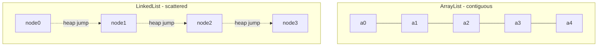
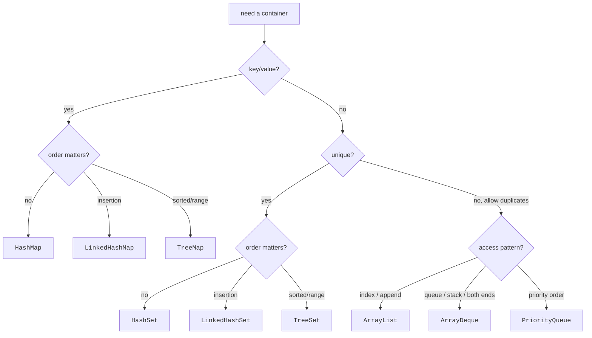

Every collection implements a contract, and every implementation
pays for that contract in a different currency. Choosing well means
knowing what each one is fast at, what it is slow at, and what it
costs in memory.

<Figure
  slug="jcol-performance-tradeoffs-cutout"
  alt="Performance tradeoffs, an isometric illustration"
/>

This chapter is the cheat sheet you'll come back to.

## The big table

Before the table, what the notation is claiming. These are the growth curves
the entries in it name:

<Chart slug="big-o-growth" />

| Operation | `ArrayList` | `LinkedList` | `ArrayDeque` | `HashSet` / `HashMap` | `LinkedHashSet` / `LinkedHashMap` | `TreeSet` / `TreeMap` |
| --- | --- | --- | --- | --- | --- | --- |
| `get(i)` | **O(1)** | O(n) | n/a | n/a | n/a | n/a |
| `add(e)` at end | **O(1)\*** | O(1) | **O(1)\*** | **O(1)\*** | **O(1)\*** | O(log n) |
| `add(0, e)` at front | O(n) | **O(1)** | **O(1)** | n/a | n/a | n/a |
| `remove(i)` at random position | O(n) | O(n) (find) + O(1) (remove) | n/a | n/a | n/a | n/a |
| `contains(e)` | O(n) | O(n) | O(n) | **O(1)\*** | **O(1)\*** | O(log n) |
| Iteration | **O(n)**, cache-friendly | O(n), pointer-chasing | **O(n)**, cache-friendly | O(n + capacity) | **O(n)** in insertion order | **O(n)** in sort order |
| Memory per element | 1 reference | 3 references | 1 reference | ~3 references + bucket | ~5 references | ~5 references |

`*` *amortized*: occasionally an `O(n)` resize/rehash happens, but
spread over many inserts it averages to `O(1)`.

## Big-O is not the whole story: cache locality

Modern CPUs are *much* faster than memory. A linear walk over a
contiguous array hits L1 cache on almost every access; a walk over a
linked list jumps to random addresses and stalls on cache misses.

For most workloads, **a slower-on-paper `ArrayList` beats a
faster-on-paper `LinkedList`.** Real-world middle-insertion has to
be enormous and frequent for the linked list to win. The verdict
from the highest possible authority came in a 2015 tweet by Joshua
Bloch, the architect of the Collections Framework: *"Does anyone
actually use LinkedList? I wrote it, and I never use it."*



The size of that effect surprises people. Walking the same array with a
larger stride does the same number of operations and takes several times
as long, because the cache line stops paying for itself.

<Chart slug="cache-stride-cost" />

## ArrayList capacity and resizing

`ArrayList` keeps a backing `Object[]`. When it fills up, it
allocates a new array that is **1.5×** the size, copies, and
discards the old one. That copy is what makes the *worst-case*
`add` `O(n)`, but it happens rarely enough that the *amortized*
cost is `O(1)`.

If you know roughly how many elements you'll add, **pre-size**:

<CodeBlock
  adapter="java"
  files={[
    {
      filename: "main.java",
      starterCode: `import java.util.ArrayList;
import java.util.List;

public class Main {
  public static void main(String[] args) {
    // Without a hint: many resize-and-copy events
    List<Integer> a = new ArrayList<>();
    for (int i = 0; i < 1_000_000; i++)
      a.add(i);
    System.out.println(a.size());

    // With a hint: one allocation, zero resizes
    List<Integer> b = new ArrayList<>(1_000_000);
    for (int i = 0; i < 1_000_000; i++)
      b.add(i);
    System.out.println(b.size());
  }
}
`,
    },
  ]}
/>

`ensureCapacity(int)` is the runtime equivalent.

The growth factor is what makes the amortized cost constant. Below, the
same sequence of appends under doubling and under adding a fixed number of
slots each time.

<Chart slug="amortized-vector-growth" />

## HashMap capacity and load factor

`HashMap` has *two* knobs:

- **Initial capacity**, the number of buckets in the backing
  table. Defaults to 16.
- **Load factor**, the threshold ratio of `size / capacity` at
  which the table doubles and rehashes. Defaults to 0.75.

<Figure
  slug="jcol-performance-tradeoffs-big-table-inline-cutout"
  alt="A grid of small gauges, one per container per operation, their needles at visibly different angles"
/>

Both values matter. A too-small initial capacity causes repeated
rehashing; a too-large load factor causes more collisions and
slower lookups.

The rule of thumb when you know the eventual size `n`:

```
initialCapacity = ceil(n / loadFactor) = ceil(n / 0.75)
```

<CodeBlock
  adapter="java"
  files={[
    {
      filename: "main.java",
      starterCode: `import java.util.HashMap;
import java.util.Map;

public class Main {
  public static void main(String[] args) {
    int n = 10_000;
    Map<Integer, String> m = new HashMap<>((int)Math.ceil(n / 0.75));
    for (int i = 0; i < n; i++)
      m.put(i, "v" + i);
    System.out.println(m.size());
  }
}
`,
    },
  ]}
/>

## When ArrayList vs. LinkedList actually matters

A short, honest list:

- **Prefer `ArrayList`** when you primarily index, append, or
  iterate. (That is 95% of all lists.)
- **Prefer `ArrayDeque`** when you need a stack or a queue, or
  efficient front-and-back access.
- **Consider `LinkedList`** only when you have a real measured need
  to insert and remove in the middle of a long list very often, and
  the contention shows up in a profiler. In practice this is rare.

## When HashSet vs. TreeSet vs. LinkedHashSet actually matters

- **`HashSet`**, fastest, no order. Default choice for "set of stuff."
- **`LinkedHashSet`**, keeps insertion order. Tiny extra cost. Use
  it for any output that must be deterministic.
- **`TreeSet`**, sorted, supports range queries. Worth `O(log n)`
  when you need sorted iteration or "next element after `x`."

<Figure
  slug="jcol-performance-tradeoffs-inline-cutout"
  alt="Two containers side by side, one quick to reach into and slow to insert, the other the reverse, each with its own gauge"
/>

## The cost of generics: autoboxing

`List<Integer>` is *not* `int[]`. Each `Integer` is an object on the
heap, with its own header and 4 bytes of data, plus a reference from
the array. For a million elements this can be **>20× the memory** of
a primitive `int[]` and noticeably slower to iterate.

When you handle huge numeric collections and performance matters,
either use raw arrays (`int[]`) or a primitive-specialized
collections library (Eclipse Collections, fastutil, Koloboke).

## Multi-file example: benchmarking append

<CodeBlock
  adapter="java"
  entryFilename="Main.java"
  files={[
    {
      filename: "Main.java",
      starterCode: `import java.util.ArrayList;

public class Main {
  public static void main(String[] args) {
    int n = 200_000;

    long t1 = Bench.time(() -> Bench.appendArrayListNoHint(n));
    long t2 = Bench.time(() -> Bench.appendArrayListWithHint(n));
    long t3 = Bench.time(() -> Bench.appendLinkedList(n));

    System.out.println("ArrayList (no hint):   " + t1 + " ms");
    System.out.println("ArrayList (with hint): " + t2 + " ms");
    System.out.println("LinkedList:            " + t3 + " ms");
  }
}
`,
    },
    {
      filename: "Bench.java",
      starterCode: `import java.util.ArrayList;
import java.util.LinkedList;
import java.util.List;

public final class Bench {
  private Bench() {}

  public static long time(Runnable r) {
    long t0 = System.currentTimeMillis();
    r.run();
    return System.currentTimeMillis() - t0;
  }

  public static void appendArrayListNoHint(int n) {
    List<Integer> xs = new ArrayList<>();
    for (int i = 0; i < n; i++)
      xs.add(i);
  }

  public static void appendArrayListWithHint(int n) {
    List<Integer> xs = new ArrayList<>(n);
    for (int i = 0; i < n; i++)
      xs.add(i);
  }

  public static void appendLinkedList(int n) {
    List<Integer> xs = new LinkedList<>();
    for (int i = 0; i < n; i++)
      xs.add(i);
  }
}
`,
    },
  ]}
/>

Numbers will vary by browser and load, but the order is almost
always: hinted `ArrayList` fastest, then unhinted `ArrayList`, then
`LinkedList` somewhat (or considerably) slower.

## A quick decision flow



## Test your understanding

<MultipleChoice
  markdown={`Why does \`ArrayList\` outperform \`LinkedList\` on iteration in practice, even though both are \`O(n)\`?

- \`LinkedList.iterator()\` allocates per element
  > It does not.
- [o] \`ArrayList\` stores elements in a contiguous backing array, so a sequential walk is extremely cache-friendly; \`LinkedList\` follows pointers to scattered heap nodes
  > Cache behavior dominates Big-O for in-memory walks at modern CPU speeds.
- \`ArrayList.iterator()\` is \`O(log n)\`
  > Both are \`O(n)\` per \`next()\`.
- \`ArrayList\` parallelizes by default
  > It does not.`}
/>

<MultipleChoice
  markdown={`What does the *load factor* of a \`HashMap\` control?

- [o] The ratio of size to capacity at which the table doubles and rehashes
  > Default 0.75: a 16-bucket map rehashes when it reaches 12 entries.
- The maximum number of entries
  > \`HashMap\` has no hard cap.
- The number of threads allowed to read it
  > It's not thread-related.
- The hash function used for keys
  > That's determined by the key type's \`hashCode\`.`}
/>

<MultipleChoice
  markdown={`You'll append about 50,000 elements to an \`ArrayList\`. Which construction is best?

- \`new ArrayList<>(10)\`, then call \`add\` 50k times
  > Worse: even more resizes.
- \`new LinkedList<>()\`
  > More memory and slower iteration in almost every scenario.
- \`new ArrayList<>()\`, then call \`add\` 50k times
  > Works, but triggers ~17 grow-and-copy events.
- [o] \`new ArrayList<>(50_000)\`, then call \`add\` 50k times
  > One allocation, zero resizes.`}
/>
