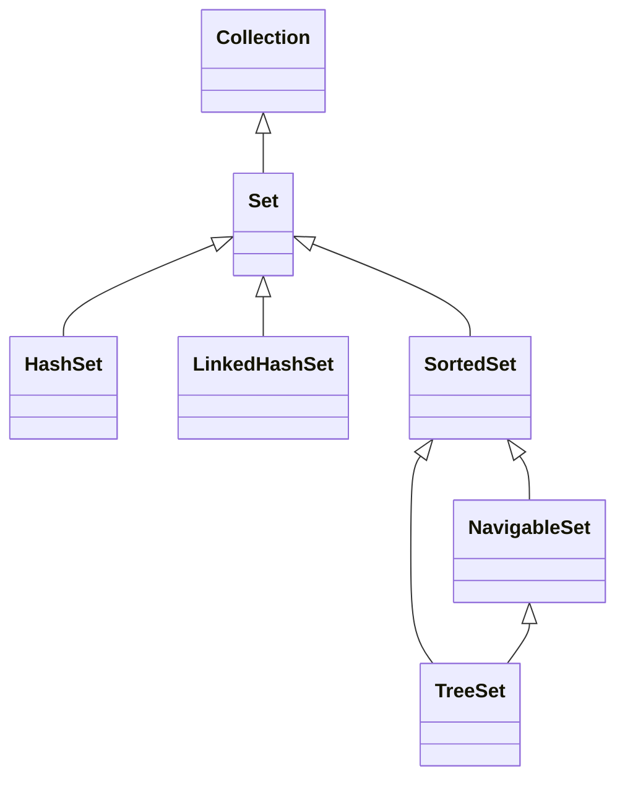
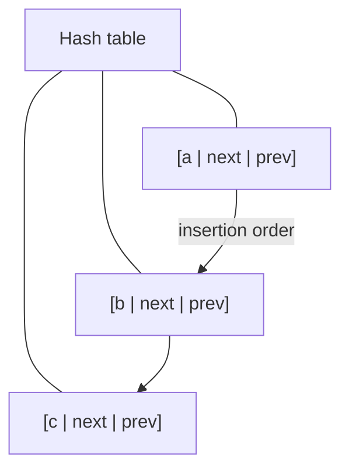

A **set** is a collection of *unique* elements. There is no notion of
position, only "is this thing in here or not?" The interface is
called `Set<E>`, and the three production-grade implementations cover
the three useful orderings: *no order*, *insertion order*, and
*sorted order*.

<Figure
  slug="jcol-sets-cutout"
  alt="Sets, an isometric illustration"
/>

## The Set interface

`Set<E>` extends `Collection<E>` and adds *zero* new methods. The
difference is purely in the *contract*: `add(x)` returns `false` (and
does nothing) if `x` is already present.

The three implementations you actually use:

| Class | Backed by | Ordering | Cost of `add`/`contains` |
| --- | --- | --- | --- |
| `HashSet<E>` | `HashMap<E,Object>` | *None* | `O(1)` average |
| `LinkedHashSet<E>` | hash table + linked list | *Insertion order* | `O(1)` average |
| `TreeSet<E>` | Red-black tree | *Sorted* by natural order or `Comparator` | `O(log n)` |

## HashSet

`HashSet` is the default: very fast, no order. Internally each
element becomes a key in a hidden `HashMap`, mapped to a sentinel
value.

<CodeBlock
  adapter="java"
  files={[
    {
      filename: "main.java",
      starterCode: `import java.util.HashSet;
import java.util.Set;

public class Main {
  public static void main(String[] args) {
    Set<String> seen = new HashSet<>();
    boolean firstAlpha = seen.add("alpha");
    boolean againAlpha = seen.add("alpha");
    seen.add("beta");
    seen.add("gamma");

    System.out.println("first add alpha? " + firstAlpha);
    System.out.println("again add alpha? " + againAlpha);
    System.out.println("size = " + seen.size());
    System.out.println("contains gamma? " + seen.contains("gamma"));
    System.out.println(seen); // iteration order is unspecified
  }
}
`,
    },
  ]}
/>

Notice:

- `add(...)` returns `true` only the first time. That alone is one of
  the most useful primitives in the framework (it gives you "have I
  seen this before?" in one line).
- The iteration order is *unspecified*. Do not rely on it.

`HashSet` relies entirely on `equals` and `hashCode`, review the
foundations chapter if you need to put your own classes in a set.

## LinkedHashSet

`LinkedHashSet` is `HashSet` plus a doubly-linked list threaded
through the entries to remember **insertion order**.

The cost is a little extra memory (two pointers per entry), not
much. The benefit is that iteration gives you elements in the order
you added them, which is invaluable when uniqueness and ordering
both matter (e.g. "the unique URLs visited, in visit order").

<CodeBlock
  adapter="java"
  files={[
    {
      filename: "main.java",
      starterCode: `import java.util.LinkedHashSet;
import java.util.Set;

public class Main {
  public static void main(String[] args) {
    Set<String> visited = new LinkedHashSet<>();
    visited.add("/home");
    visited.add("/about");
    visited.add("/home"); // duplicate, ignored
    visited.add("/contact");
    visited.add("/about"); // duplicate, ignored

    for (String url : visited)
      System.out.println(url);
  }
}
`,
    },
  ]}
/>

Output is `/home`, `/about`, `/contact`, in the order they first
appeared.

## TreeSet

`TreeSet` keeps elements in **sorted order**, using either the
elements' natural order (`Comparable`) or a supplied `Comparator`.
Backed by a red-black tree, every operation is `O(log n)`.

<CodeBlock
  adapter="java"
  files={[
    {
      filename: "main.java",
      starterCode: `import java.util.Set;
import java.util.TreeSet;

public class Main {
  public static void main(String[] args) {
    Set<Integer> sorted = new TreeSet<>();
    sorted.add(3);
    sorted.add(1);
    sorted.add(4);
    sorted.add(1);
    sorted.add(5);

    System.out.println(sorted); // [1, 3, 4, 5], sorted, no dupes

    TreeSet<String> words = new TreeSet<>();
    words.add("zeta");
    words.add("alpha");
    words.add("mu");

    System.out.println("first = " + words.first());
    System.out.println("last  = " + words.last());
    System.out.println("after kappa = " + words.higher("kappa"));
  }
}
`,
    },
  ]}
/>

`TreeSet` is also a `NavigableSet`, which gives you `higher(x)`,
`lower(x)`, `ceiling(x)`, `floor(x)`, `headSet(x)`, `tailSet(x)`,
all the range operations a sorted structure can give you for free.
Reach for it when "what is the next/previous element near `x`?" is a
real question.

## Set algebra: union, intersection, difference

The `Collection` API gives you the three classical set operations
through bulk methods. They mutate the receiver, which surprises
people once and then never again.

<Figure
  slug="jcol-sets-inline-cutout"
  alt="A bin with a narrow mouth that accepts a block once and rejects an identical second one, which bounces off onto the bench"
/>

<CodeBlock
  adapter="java"
  files={[
    {
      filename: "main.java",
      starterCode: `import java.util.HashSet;
import java.util.Set;
import java.util.Arrays;

public class Main {
  public static void main(String[] args) {
    Set<Integer> a = new HashSet<>(Arrays.asList(1, 2, 3, 4));
    Set<Integer> b = new HashSet<>(Arrays.asList(3, 4, 5, 6));

    Set<Integer> union = new HashSet<>(a);
    union.addAll(b);
    System.out.println("union        = " + new java.util.TreeSet<>(union));

    Set<Integer> intersection = new HashSet<>(a);
    intersection.retainAll(b);
    System.out.println("intersection = " +
                       new java.util.TreeSet<>(intersection));

    Set<Integer> difference = new HashSet<>(a);
    difference.removeAll(b);
    System.out.println("difference   = " + new java.util.TreeSet<>(difference));
  }
}
`,
    },
  ]}
/>

We wrap the printout in a `TreeSet` only to get a stable order for
display, the underlying sets are unordered.

## A pitfall: putting mutable objects in a set

We covered this in the foundations chapter, and it's worth saying
again here in context: a `HashSet` indexes by `hashCode` at insertion
time. If you mutate a field that participates in `hashCode`, the
element silently becomes unreachable in the set. The same hazard
exists with `TreeSet` if you mutate a field that affects `compareTo`.

**Use immutable value types as set elements.**

## A multi-file example: unique visitors

This puts `Set` to work in a recognizably real role: deduplicating an
incoming stream while preserving first-seen order.

<CodeBlock
  adapter="java"
  entryFilename="Main.java"
  files={[
    {
      filename: "Main.java",
      starterCode: `import java.util.List;
import java.util.Arrays;

public class Main {
  public static void main(String[] args) {
    List<String> raw =
        Arrays.asList("alice", "bob", "alice", "carol", "bob", "dave", "alice");
    VisitorLog log = new VisitorLog();
    for (String name : raw)
      log.record(name);

    System.out.println("unique visitors, in arrival order:");
    for (String name : log.uniqueInOrder())
      System.out.println("- " + name);
    System.out.println("count = " + log.uniqueCount());
  }
}
`,
    },
    {
      filename: "VisitorLog.java",
      starterCode: `import java.util.LinkedHashSet;
import java.util.Set;

public class VisitorLog {
  private final Set<String> seen = new LinkedHashSet<>();

  public boolean record(String name) {
    return seen.add(name); // returns true on first visit only
  }

  public Set<String> uniqueInOrder() { return seen; }
  public int uniqueCount() { return seen.size(); }
}
`,
    },
  ]}
/>

A single class, three methods, and it solves both "unique" and
"in arrival order" because we picked the right container.

## Practice

<ChallengeCard
  adapter="java"
  title="Distinct words in original order"
  instructions={`Write a class \`Distinct\` with a static method \`List<String> ofWords(String text)\` that splits the text on whitespace and returns each distinct word, **in the order it first appeared**.

- Tokenize by splitting on one or more whitespace characters.
- "Distinct" is **case-sensitive** here (treat "The" and "the" as different).
- The return type must be a \`List<String>\` so the caller can index.

Expected output:

\`\`\`
[the, quick, brown, fox, jumps, over, lazy, dog]
\`\`\``}
  entryFilename="Main.java"
  files={[
    {
      filename: "Main.java",
      starterCode: `public class Main {
  public static void main(String[] args) {
    String s = "the quick brown fox jumps over the lazy dog the fox";
    System.out.println(Distinct.ofWords(s));
  }
}
`,
    },
    {
      filename: "Distinct.java",
      starterCode: `import java.util.ArrayList;
import java.util.List;

public class Distinct {
  public static List<String> ofWords(String text) {
    // TODO: use a LinkedHashSet for "unique in insertion order"
    return new ArrayList<>();
  }
}
`,
      solutionCode: `import java.util.ArrayList;
import java.util.LinkedHashSet;
import java.util.List;
import java.util.Set;

public class Distinct {
  public static List<String> ofWords(String text) {
    Set<String> seen = new LinkedHashSet<>();
    for (String w : text.split("\\\\s+")) {
      if (!w.isEmpty())
        seen.add(w);
    }
    return new ArrayList<>(seen);
  }
}
`,
    },
  ]}
  tests={[
    {
      id: "distinct-in-order",
      name: "Distinct.ofWords keeps first-seen order, no duplicates",
      expect: { stdoutEquals: "[the, quick, brown, fox, jumps, over, lazy, dog]" },
    },
  ]}
/>

## Test your understanding

<MultipleChoice
  markdown={`Which set implementation should you reach for when you need *both* uniqueness *and* iteration in insertion order?

- \`HashSet\`
  > Iteration order is unspecified.
- [o] \`LinkedHashSet\`
  > It pays a small constant-factor cost for a linked list threaded through the entries.
- \`ArrayList\`
  > A list is not a set and allows duplicates.
- \`TreeSet\`
  > Sorted, not insertion order.`}
/>

<MultipleChoice
  markdown={`A method receives a \`Set<User>\`. The same \`User\` object is added twice. What happens?

- The set throws \`IllegalStateException\`
  > It does not.
- [o] The second \`add\` returns \`false\` and the set is unchanged
  > \`add\` is the standard "have I seen this before?" primitive.
- The first \`User\` is overwritten
  > \`Set\` does not overwrite, it ignores the duplicate.
- The size becomes 2
  > A correctly implemented \`User\` would have value equality, leading to dedup; using the same object instance is *definitely* a duplicate.`}
/>

<MultipleChoice
  markdown={`Why does mutating a field of an element already inside a \`HashSet\` (one that participates in \`hashCode\`) cause bugs?

- [o] The element's bucket was chosen from the old hash; after mutation the set looks for it in a different bucket and reports "not present"
  > Treat set elements (and map keys) as immutable for this exact reason.
- It triggers \`ConcurrentModificationException\`
  > Not by itself.
- It throws \`UnsupportedOperationException\`
  > That is for immutable collections, not for mutating elements.
- It silently clears the set
  > It does not.`}
/>
