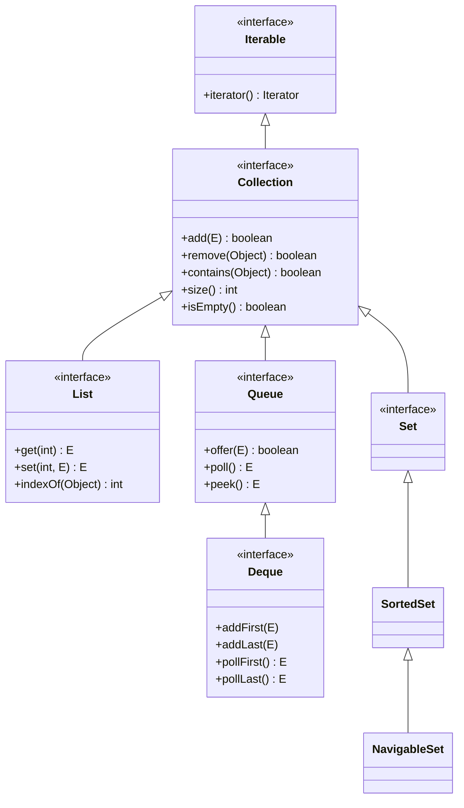
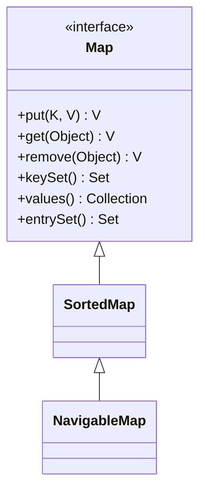

In December 1998, Java 1.2 shipped a redesign of `java.util` that
changed how everyone wrote Java. It was called the **Java Collections
Framework** (JCF), and it was the answer to every complaint about
`Vector` and `Hashtable`.

<Figure
  slug="jcol-collections-framework-cutout"
  alt="The collections framework, an isometric illustration"
/>

The framework was deliberately designed by a single architect, **Josh
Bloch**, with a specific goal: a small set of *interfaces* that
describe what a container *is*, and a small set of high-quality
*implementations* of each. The combination of those two ideas is what
makes the JCF feel coherent even today, almost three decades later.
(Bloch later distilled the lessons of building it into *Effective
Java*, which is why so much of that book reads like a guided tour of
the decisions you are about to study.)

## The two big ideas

The JCF was built around four goals:

- Program to **interfaces**, not implementations.
- A small, uniform **vocabulary** of container shapes.
- High-quality **default implementations** for each interface.
- **Algorithms** (sort, shuffle, search) that work on any matching
  container.

<Figure
  slug="jcol-the-collections-framework-two-big-ideas-inline-cutout"
  alt="One standard fitting and one standard crank shown together on the front of several different containers"
  caption="Common interfaces plus shared algorithms is the whole design."
/>

That is it. From those four goals everything else follows: the
interface hierarchy, the `Collections` static-utility class, the
`Iterator` interface, the standard implementations, and the way
methods all over the JDK are declared in terms of `List`, `Set`,
`Map` instead of concrete types.

## The interface hierarchy

Here is the **shape** of the framework. Memorize this diagram, every
remaining page in the course refers to some corner of it.

`Map` is *not* a subtype of `Collection`, it is its own hierarchy:

The reason `Map` is separate is that a map is fundamentally about
**pairs** (key, value), not about elements. We'll dwell on that in
the Maps chapter.

## What each interface *means*

The vocabulary of the JCF is small and worth saying out loud:

| Interface | Meaning | Mental model |
| --- | --- | --- |
| `Iterable<E>` | "I can be walked from start to finish" | A row of things |
| `Collection<E>` | "I am a group of elements" | A bag |
| `List<E>` | "I am an ordered, indexed sequence" | A row with seat numbers |
| `Set<E>` | "I am a group with no duplicates" | A set of unique stickers |
| `SortedSet<E>` | "I am a set whose iteration order is sorted" | A library shelf |
| `Queue<E>` | "I am a group with a head, things enter at one end" | A line at a coffee shop |
| `Deque<E>` | "I am a queue with two ends" | A deck of cards you can draw from either end |
| `Map<K,V>` | "I am a function from keys to values" | A phone book |
| `SortedMap<K,V>` | "...whose keys iterate in sorted order" | A dictionary |

You will reach for the *names on the left* in your method signatures.
The implementations come next.

## The default implementations

For each interface, the JCF ships one (sometimes two) production-grade
implementation. This is the table you will internalize over the
course:

| Interface | Default implementation | Backed by |
| --- | --- | --- |
| `List<E>` | `ArrayList<E>` | A growing `Object[]` |
| `List<E>` (linked) | `LinkedList<E>` | A doubly-linked node chain |
| `Set<E>` | `HashSet<E>` | A `HashMap` |
| `Set<E>` (insertion-ordered) | `LinkedHashSet<E>` | A hash table + linked list |
| `SortedSet<E>` | `TreeSet<E>` | A red-black tree |
| `Queue<E>` | `ArrayDeque<E>` or `PriorityQueue<E>` | Circular array / binary heap |
| `Deque<E>` | `ArrayDeque<E>` | Circular array |
| `Map<K,V>` | `HashMap<K,V>` | A hash table |
| `Map<K,V>` (insertion-ordered) | `LinkedHashMap<K,V>` | Hash table + linked list |
| `SortedMap<K,V>` | `TreeMap<K,V>` | A red-black tree |

Each implementation has its own performance and memory profile. We
will earn that table over many pages, for now, it's a road map.

## Programming to the interface

The single most important rule the JCF teaches you:

> **Declare variables and parameters with the interface type; pick
> the implementation only at construction.**

<CodeBlock
  adapter="java"
  files={[
    {
      filename: "main.java",
      starterCode: `import java.util.ArrayList;
import java.util.LinkedList;
import java.util.List;

public class Main {
  // The method talks about List<String>, it does NOT care
  // whether the underlying storage is an array or a linked list.
  static int totalLength(List<String> words) {
    int total = 0;
    for (String w : words)
      total += w.length();
    return total;
  }

  public static void main(String[] args) {
    List<String> a = new ArrayList<>();
    a.add("alpha");
    a.add("beta");

    List<String> b = new LinkedList<>();
    b.add("alpha");
    b.add("beta");

    System.out.println("array-backed:  " + totalLength(a));
    System.out.println("linked-backed: " + totalLength(b));
  }
}
`,
    },
  ]}
/>

If `totalLength` had been declared `totalLength(ArrayList<String>)`,
callers with a `LinkedList` would have been stuck. By accepting
`List<String>`, the method gains *every* present and future `List`
implementation for free.

## The Collections utility class

A second hallmark of the framework is that **algorithms live
separately from data structures**. The class `java.util.Collections`
holds static helpers, `sort()`, `shuffle()`, `reverse()`,
`unmodifiableList()`, `frequency()`, `min`, `max`, that work on any
matching collection.

<CodeBlock
  adapter="java"
  files={[
    {
      filename: "main.java",
      starterCode: `import java.util.ArrayList;
import java.util.Collections;
import java.util.List;

public class Main {
  public static void main(String[] args) {
    List<Integer> nums = new ArrayList<>();
    nums.add(3);
    nums.add(1);
    nums.add(4);
    nums.add(1);
    nums.add(5);
    nums.add(9);

    Collections.sort(nums);
    System.out.println("sorted:    " + nums);

    Collections.reverse(nums);
    System.out.println("reversed:  " + nums);

    System.out.println("frequency of 1: " + Collections.frequency(nums, 1));
    System.out.println("min:            " + Collections.min(nums));
    System.out.println("max:            " + Collections.max(nums));
  }
}
`,
    },
  ]}
/>

Notice you did not write a sort. You did not write a min. You did not
write a frequency-counter. They work on `ArrayList`, on `LinkedList`,
on user-written `List` implementations, anything that says "I am a
`List`."

## Iterator: a real walking protocol

The JCF replaced `Enumeration` with `Iterator`, which adds one
crucial method: `remove()`. It also became the basis of the
for-each loop in Java 5.

<CodeBlock
  adapter="java"
  files={[
    {
      filename: "main.java",
      starterCode: `import java.util.ArrayList;
import java.util.Iterator;
import java.util.List;

public class Main {
  public static void main(String[] args) {
    List<String> words = new ArrayList<>();
    words.add("alpha");
    words.add("");
    words.add("beta");
    words.add("");

    // Remove empty strings safely during iteration.
    Iterator<String> it = words.iterator();
    while (it.hasNext()) {
      if (it.next().isEmpty())
        it.remove();
    }
    System.out.println(words);

    // Same walk, but read-only, with for-each:
    for (String w : words)
      System.out.println("- " + w);
  }
}
`,
    },
  ]}
/>

That `it.remove()` is what `Enumeration` could never do safely. We
will return to iterators in their own chapter.

## A first multi-file example: programming to interfaces

This shows the JCF style end-to-end. A `Library` *consumes* a
`List<Book>` and a `Set<String>`, it does not care which
implementation you hand it.

<CodeBlock
  adapter="java"
  entryFilename="Main.java"
  files={[
    {
      filename: "Main.java",
      starterCode: `import java.util.ArrayList;
import java.util.HashSet;
import java.util.List;
import java.util.Set;

public class Main {
  public static void main(String[] args) {
    List<Book> books = new ArrayList<>();
    books.add(new Book("The Mythical Man-Month", "Brooks"));
    books.add(new Book("Design Patterns", "Gang of Four"));
    books.add(new Book("Effective Java", "Bloch"));

    Set<String> banned = new HashSet<>();
    banned.add("Brooks"); // pretend we don't carry Brooks

    Library lib = new Library(books, banned);
    for (Book b : lib.available()) {
      System.out.println(b.title() + " by " + b.author());
    }
  }
}
`,
    },
    {
      filename: "Book.java",
      starterCode: `public class Book {
  private final String title;
  private final String author;
  public Book(String title, String author) {
    this.title = title;
    this.author = author;
  }
  public String title() { return title; }
  public String author() { return author; }
}
`,
    },
    {
      filename: "Library.java",
      starterCode: `import java.util.ArrayList;
import java.util.List;
import java.util.Set;

public class Library {
  private final List<Book> books;
  private final Set<String> bannedAuthors;

  public Library(List<Book> books, Set<String> bannedAuthors) {
    this.books = books;
    this.bannedAuthors = bannedAuthors;
  }

  public List<Book> available() {
    List<Book> out = new ArrayList<>();
    for (Book b : books) {
      if (!bannedAuthors.contains(b.author()))
        out.add(b);
    }
    return out;
  }
}
`,
    },
  ]}
/>

`Library` would work just as well if `books` were a `LinkedList` and
`bannedAuthors` were a `TreeSet`. That is the whole point.

## Practice

<ChallengeCard
  adapter="java"
  title="A roster that programs to interfaces"
  instructions={`Write a class \`Roster\` that holds a \`List<String>\` of student names and exposes:

- \`void addStudent(String name)\`, appends the name
- \`int size()\`, the number of students
- \`boolean has(String name)\`, whether the roster contains that name
- \`List<String> all()\`, the underlying list

The constructor must take a \`List<String>\` as its only argument, so callers can pass any implementation they like (\`ArrayList\`, \`LinkedList\`, ...). The provided \`Main\` will exercise it. Expected output:

\`\`\`
size = 3
has Ada? true
has Bob? false
Ada
Grace
Linus
\`\`\``}
  entryFilename="Main.java"
  files={[
    {
      filename: "Main.java",
      starterCode: `import java.util.ArrayList;
import java.util.List;

public class Main {
  public static void main(String[] args) {
    Roster r = new Roster(new ArrayList<>());
    r.addStudent("Ada");
    r.addStudent("Grace");
    r.addStudent("Linus");

    System.out.println("size = " + r.size());
    System.out.println("has Ada? " + r.has("Ada"));
    System.out.println("has Bob? " + r.has("Bob"));
    for (String n : r.all())
      System.out.println(n);
  }
}
`,
    },
    {
      filename: "Roster.java",
      starterCode: `import java.util.List;

public class Roster {
  // TODO
}
`,
      solutionCode: `import java.util.List;

public class Roster {
  private final List<String> names;
  public Roster(List<String> names) { this.names = names; }
  public void addStudent(String name) { names.add(name); }
  public int size() { return names.size(); }
  public boolean has(String name) { return names.contains(name); }
  public List<String> all() { return names; }
}
`,
    },
  ]}
  tests={[
    {
      id: "roster-prints-expected",
      name: "Roster reports size, lookups, and listing",
      expect: {
        stdoutEquals: "size = 3\nhas Ada? true\nhas Bob? false\nAda\nGrace\nLinus",
      },
    },
  ]}
/>

## Test your understanding

<MultipleChoice
  markdown={`What was the *primary* design idea introduced by the Java Collections Framework?

- Faster sorting algorithms
  > Sorting got faster eventually, but speed wasn't the design idea.
- Adding network synchronization to data structures
  > It did not.
- Replacing arrays as the JVM's underlying storage
  > Arrays are still the substrate of most collections.
- [o] Separating *interfaces* that describe container shapes from *implementations* that realize them
  > That separation is what lets one method body work for every present and future implementation.`}
/>

<MultipleChoice
  markdown={`Why is \`Map\` *not* a subtype of \`Collection\`?

- [o] Because maps fundamentally hold (key, value) pairs, not single elements, so the \`Collection\` operations (\`add(E)\`, \`contains(E)\`) don't fit
  > The shape of a map is different enough that putting it under \`Collection\` would have meant either weaker types or awkward method signatures.
- Because \`Map\` is older than \`Collection\`
  > Both arrived together in Java 1.2.
- Because maps cannot be iterated
  > Maps can be iterated (via \`keySet\`, \`values\`, or \`entrySet\`).
- Because maps don't store data
  > Maps very much store data.`}
/>

<MultipleChoice
  markdown={`Why is it a good habit to write \`List<String> names = new ArrayList<>();\` rather than \`ArrayList<String> names = new ArrayList<>();\`?

- \`ArrayList\` does not exist in modern Java
  > It does and is widely used.
- The garbage collector treats interfaces and classes differently
  > It does not.
- [o] The variable is typed by what it represents (a list of strings), so the implementation can be swapped without touching the rest of the code
  > Programming to the interface is what makes JCF code so refactor-friendly.
- It compiles faster
  > Compile time is unaffected.`}
/>
