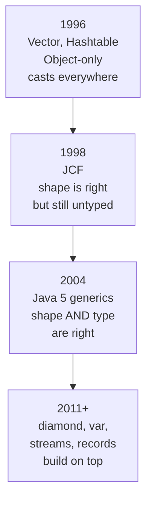

From 1998 to 2004, Java had the Collections Framework but did not
have **generics**. That meant every collection was a collection of
`Object`, with all the same casts and runtime crashes that `Vector`
suffered from. The JCF was structurally beautiful; it was still
type-unsafe.

Java 5 (released September 2004) fixed that with a single language
feature whose effect was enormous: **parameterized types**.

<svg
  viewBox="0 0 640 240"
  role="img"
  aria-label="Before generics, a box of mixed shapes hands back a piece inside a red burst at runtime; after, a solid green gate line in front of the typed box checks arrivals, the circle sails through, the triangle is crossed out before it ever gets in"
  style={{ display: "block", width: "100%", maxWidth: "640px", height: "auto", margin: "2.5rem auto" }}
>
  <g style={{ color: "var(--ds-blue-500)" }} fill="currentColor">
    <rect x="90" y="28" width="140" height="70" rx="12" fillOpacity="0.1" />
    <circle cx="120" cy="63" r="8" />
  </g>
  <rect x="140" y="47" width="16" height="16" rx="4" fill="var(--ds-green-500)" />
  <polygon points="180,55 171,71 189,71" fill="var(--ds-yellow-500)" />
  <g fill="var(--ds-gray-400)">
    <rect x="238" y="61.5" width="52" height="3" rx="1.5" />
    <polygon points="288,57.5 299,63 288,68.5" />
  </g>
  <polygon points="340,43 346,57 360,63 346,69 340,83 334,69 320,63 334,57" fill="var(--ds-red-500)" fillOpacity="0.85" />
  <rect x="332" y="55" width="16" height="16" rx="4" fill="var(--ds-green-500)" />
  <g style={{ color: "var(--ds-green-500)" }} fill="currentColor">
    <rect x="90" y="150" width="140" height="70" rx="12" fillOpacity="0.1" />
  </g>
  <g style={{ color: "var(--ds-blue-500)" }} fill="currentColor">
    <circle cx="120" cy="185" r="8" />
    <circle cx="146" cy="185" r="8" />
    <circle cx="172" cy="185" r="8" />
  </g>
  <rect x="278" y="142" width="4" height="86" rx="2" fill="var(--ds-green-500)" />
  <polyline points="266,132 272,138 284,124" fill="none" stroke="var(--ds-green-500)" strokeWidth="3" strokeLinecap="round" strokeLinejoin="round" />
  <g fill="var(--ds-gray-400)">
    <rect x="306" y="166.5" width="40" height="3" rx="1.5" />
    <polygon points="308,162.5 297,168 308,173.5" />
  </g>
  <circle cx="364" cy="168" r="8" fill="var(--ds-blue-500)" />
  <g fill="var(--ds-gray-400)">
    <rect x="306" y="206.5" width="40" height="3" rx="1.5" />
    <polygon points="308,202.5 297,208 308,213.5" />
  </g>
  <polygon points="356,198 347,216 365,216" fill="var(--ds-yellow-500)" />
  <g style={{ color: "var(--ds-red-500)" }} fill="currentColor">
    <rect x="270" y="205.5" width="20" height="5" rx="2.5" transform="rotate(45 280 208)" />
    <rect x="270" y="205.5" width="20" height="5" rx="2.5" transform="rotate(-45 280 208)" />
  </g>
</svg>

## What the world looked like before generics

Here is real, valid Java 1.4 code, written four years after the JCF
shipped:

<CodeBlock
  adapter="java"
  files={[
    {
      filename: "main.java",
      starterCode: `import java.util.ArrayList;
import java.util.List;

public class Main {
  public static void main(String[] args) {
    // Before generics, every List was a List of Object.
    List names = new ArrayList();
    names.add("Ada");
    names.add("Linus");
    names.add(42); // legal, there is no element type

    for (int i = 0; i < names.size(); i++) {
      String s = (String)names.get(i); // cast every time
      System.out.println(s.toUpperCase());
    }
  }
}
`,
    },
  ]}
/>

Run that and the third element crashes with `ClassCastException`. The
mistake (`names.add(42)`) was made on line 6; the explosion happens
on line 11. The further apart "the mistake" and "the symptom" are, the
worse a bug class is, and the JCF, through no fault of its own,
made that distance large.

## The two ideas of generics

Generics are not a hack on top of the existing collections. They are
a new *language* feature with two distinct ideas:

1. **A type can be parameterized by another type.** `List<String>`
   is not the same as `List<Integer>`. The element type travels with
   the container.
2. **The compiler checks the parameter, and inserts the casts for
   you.** You write `String s = names.get(0)` and the compiler emits
   the cast under the hood. If you try to put an `Integer` into a
   `List<String>`, the *compile* fails, before the program even
   runs.

|  | Pre-generics (Java 1.4) | Generics (Java 5+) |
| --- | --- | --- |
| **Declaration** | `List names = new ArrayList()` | `List<String> names = new ArrayList<>()` |
| **Compile time** | holds `Object`; no type checks | element type checked |
| **Runtime** | manual cast, risking `ClassCastException` | no cast in source, the compiler inserts one and proves it safe |

That is the entire story. The JCF you already know does not change
shape, the *types* on every method now carry the element type, so
the compiler can prove that the cast cannot fail.

## The same example after generics

<CodeBlock
  adapter="java"
  files={[
    {
      filename: "main.java",
      starterCode: `import java.util.ArrayList;
import java.util.List;

public class Main {
  public static void main(String[] args) {
    List<String> names = new ArrayList<>();
    names.add("Ada");
    names.add("Linus");
    // names.add(42);            // compile error, won't even start

    for (String s : names) { // no cast, the compiler knows
      System.out.println(s.toUpperCase());
    }
  }
}
`,
    },
  ]}
/>

Notice three changes:

- `List<String>` everywhere, the element type *is* part of the
  type now.
- The diamond `<>` on construction (Java 7 added this) lets the
  compiler infer the type argument from the variable's type.
- The for-each loop hands you a `String` directly. No cast in the
  source. The compiler proved that every element of a `List<String>`
  is a `String`, so the cast is unnecessary.

## How generics turned the JCF into a *typed* framework

Every single interface in the framework grew type parameters:

```
Iterable      → Iterable<E>
Collection    → Collection<E>
List          → List<E>
Set           → Set<E>
Queue         → Queue<E>
Map           → Map<K, V>
Iterator      → Iterator<E>
Comparable    → Comparable<T>
Comparator    → Comparator<T>
```

When you write `Map<String, Customer>`, the compiler now knows that
`map.get("ada")` returns a `Customer`, not an `Object`. That single
fact cleans up enormous amounts of code.

<CodeBlock
  adapter="java"
  files={[
    {
      filename: "main.java",
      starterCode: `import java.util.HashMap;
import java.util.Map;

public class Main {
  public static void main(String[] args) {
    Map<String, Integer> wordCount = new HashMap<>();
    wordCount.put("alpha", 3);
    wordCount.put("beta", 1);
    wordCount.put("gamma", 7);

    // Look, Integer comes out of get(), and we can do arithmetic.
    int total = 0;
    for (Integer n : wordCount.values())
      total += n;
    System.out.println("total = " + total);

    // The compiler knows the key type too:
    for (Map.Entry<String, Integer> e : wordCount.entrySet()) {
      System.out.println(e.getKey() + " -> " + e.getValue());
    }
  }
}
`,
    },
  ]}
/>

Trying to write `total += (String) ...` would be flagged by the
compiler. That is what *type safety* means in practice: the compiler
prevents whole categories of mistake.

## Where Java's generics actually came from

Generics took six years to arrive after the JCF, and the gap was not
procrastination, it was research. In 1998, programming-language
researchers **Philip Wadler**, **Martin Odersky**, **Gilad Bracha**,
and **Dave Stoutamire** published **GJ** ("Generic Java"), an
extension of Java with parameterized types designed around one brutal
constraint: the millions of lines of existing Java code, and every
existing `.class` file, had to keep working unchanged. GJ's solution,
check the types at compile time, then *erase* them, is exactly
what shipped in Java 5, and Odersky's GJ compiler was so solid that
Sun adopted it as the basis of the standard `javac` itself. (Odersky
took what he learned about bolting a sophisticated type system onto
the JVM and went on to create **Scala**; Wadler had earlier helped
design Haskell. Java's generics have a serious pedigree.) The
erasure decision has consequences we'll meet two pages from now.

## Why generic *types* and not just generic *methods*?

Other languages (notably Smalltalk and pre-2.0 Python) made the bet
that you don't need parameterized types, that you can just trust
runtime checks. The Java team made the opposite bet: programs grow
large enough that you need a *machine* to verify the data shapes you
intend, and the cost of writing `<String>` is small compared to the
cost of a `ClassCastException` in production.

The bet paid off. Today every mainstream typed language has generics
or something like them: C# (2005), Scala (2004), Kotlin (2011), Swift
(2014), TypeScript (2013), modern C++ templates, even Go (1.18, 2022).

## A multi-file taste: a typed phonebook

To feel how generics flow through a real little system, here is a
`Phonebook` with a typed map inside. The method `lookup` *returns
the right type*, with no cast.

<CodeBlock
  adapter="java"
  entryFilename="Main.java"
  files={[
    {
      filename: "Main.java",
      starterCode: `public class Main {
  public static void main(String[] args) {
    Phonebook book = new Phonebook();
    book.add("Ada", "555-0101");
    book.add("Grace", "555-0102");
    book.add("Linus", "555-0103");

    // No cast, generic types flow all the way through.
    String n = book.lookup("Grace");
    System.out.println("Grace -> " + n.toUpperCase());
    System.out.println("Bob   -> " + book.lookup("Bob"));
  }
}
`,
    },
    {
      filename: "Phonebook.java",
      starterCode: `import java.util.HashMap;
import java.util.Map;

public class Phonebook {
  private final Map<String, String> entries = new HashMap<>();

  public void add(String name, String number) { entries.put(name, number); }
  public String lookup(String name) {
    return entries.get(name); // returns String, not Object
  }
}
`,
    },
  ]}
/>

Now make it generic. Why should the phonebook only ever map *strings*
to *strings*? A general "key-to-record store" looks like this:

<CodeBlock
  adapter="java"
  entryFilename="Main.java"
  files={[
    {
      filename: "Main.java",
      starterCode: `public class Main {
  public static void main(String[] args) {
    Registry<String, Integer> ages = new Registry<>();
    ages.add("Ada", 36);
    ages.add("Linus", 54);
    System.out.println("Ada is " + ages.lookup("Ada") + " years old");
    System.out.println("Linus is " + ages.lookup("Linus") + " years old");

    Registry<Integer, String> roomByExt = new Registry<>();
    roomByExt.add(101, "Lobby");
    roomByExt.add(202, "Suite A");
    System.out.println("ext 202 -> " + roomByExt.lookup(202));
  }
}
`,
    },
    {
      filename: "Registry.java",
      starterCode: `import java.util.HashMap;
import java.util.Map;

public class Registry<K, V> {
  private final Map<K, V> entries = new HashMap<>();

  public void add(K key, V value) { entries.put(key, value); }
  public V lookup(K key) { return entries.get(key); }
}
`,
    },
  ]}
/>

One `Registry` class. Two distinct usages, `Registry<String, Integer>`
and `Registry<Integer, String>`. The compiler checks them
independently, and neither use can leak into the other. That is the
power generics give you: **reusable code that doesn't pay for that
reuse in type safety.**

## The arc, in one picture



Each step solves the previous step's biggest complaint. By 2004 the
collection story is complete in its essentials, and every page from
here on takes the typed framework as given.

## A quick warning: pre-generics code still exists

You will sometimes meet code or APIs that use **raw types**,
`List` instead of `List<String>`. They compile (Java keeps them for
backwards compatibility), but the compiler will emit an *unchecked
warning*, and you lose all the type safety we just gained.

<CodeBlock
  adapter="java"
  files={[
    {
      filename: "main.java",
      starterCode: `import java.util.ArrayList;
import java.util.List;

public class Main {
  @SuppressWarnings({"rawtypes", "unchecked"})
  public static void main(String[] args) {
    List raw = new ArrayList(); // raw type, bad
    raw.add("Ada");
    raw.add(42); // legal at compile time

    // Compiler can't help. We get to find out at runtime.
    for (Object o : raw)
      System.out.println(o.getClass().getSimpleName());
  }
}
`,
    },
  ]}
/>

Modern Java code essentially never uses raw types. The rule is
simple: **always provide the type argument.**

## Test your understanding

<MultipleChoice
  markdown={`What problem did Java 5 generics primarily solve for the Collections Framework?

- They made collections faster
  > Performance is largely unchanged by generics.
- [o] They moved type checking of element types from runtime (\`ClassCastException\`) to compile time
  > With generics, the compiler proves that a \`List<String>\` can only contain \`String\`s, so the cast in \`String s = list.get(0)\` cannot fail.
- They allowed multiple threads to share a \`List\` safely
  > Generics are unrelated to thread safety.
- They eliminated the need for the \`Collection\` interface
  > \`Collection\` is still central.`}
/>

<MultipleChoice
  markdown={`In \`Map<String, Customer>\`, what does the compiler know about \`map.get("ada")\`?

- Only that it returns some \`Object\`
  > That was the pre-generics behaviour.
- [o] That it returns a \`Customer\` (or \`null\`)
  > The second type parameter tells the compiler the value type, so no cast is needed at the call site.
- That it returns a \`String\`
  > The first parameter is the *key* type, not the return type.
- That it will throw if the key is missing
  > \`HashMap.get\` returns \`null\` for a missing key.`}
/>

<MultipleChoice
  markdown={`Why is it considered bad practice to write \`List list = new ArrayList();\` in modern Java?

- It does not compile
  > It does compile (with a warning).
- It is slower than \`List<String> list = new ArrayList<>();\`
  > Speed is unchanged.
- [o] It uses a raw type, throwing away the compile-time guarantees generics give you
  > Raw types exist only for backwards compatibility; using one effectively turns off generic type-checking for that variable.
- The JVM forbids it at runtime
  > It runs fine; the cost is in correctness, not compilation.`}
/>
