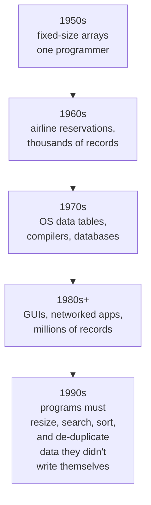
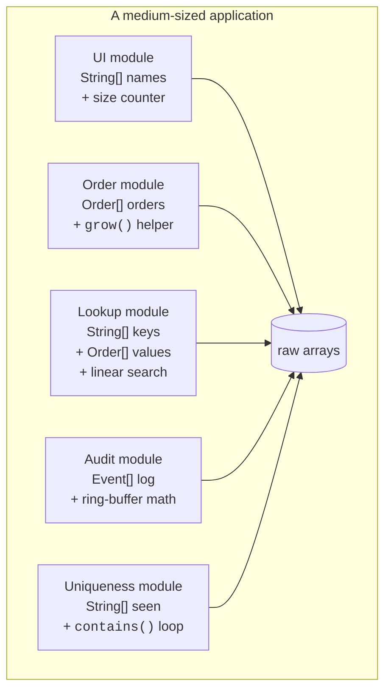

Before there were collections, there were **arrays**. Every language
had them, every program used them, and for a long time they were
basically *the* data structure. They are still everywhere — every
list, every hash table, every queue you'll meet in this course is
secretly built on top of an array. So we have to start here.

But arrays alone were not enough to build big software. This page
tells the story of why.

<svg
  viewBox="0 0 640 230"
  role="img"
  aria-label="A sealed six-cell array cannot take one more item — adding means building the longer array below and copying every cell down thin gray lines, just to seat one yellow newcomer beside a still-empty slot"
  style={{ display: "block", width: "100%", maxWidth: "640px", height: "auto", margin: "2.5rem auto" }}
>
  <g stroke="var(--ds-gray-300)" strokeWidth="1.5">
    <line x1="160" y1="74" x2="134" y2="150" />
    <line x1="212" y1="74" x2="186" y2="150" />
    <line x1="264" y1="74" x2="238" y2="150" />
    <line x1="316" y1="74" x2="290" y2="150" />
    <line x1="368" y1="74" x2="342" y2="150" />
    <line x1="420" y1="74" x2="394" y2="150" />
  </g>
  <g style={{ color: "var(--ds-blue-500)" }} fill="currentColor">
    <rect x="126" y="32" width="6" height="44" rx="3" fillOpacity="0.8" />
    <rect x="136" y="36" width="48" height="36" fillOpacity="0.55" />
    <rect x="188" y="36" width="48" height="36" fillOpacity="0.35" />
    <rect x="240" y="36" width="48" height="36" fillOpacity="0.55" />
    <rect x="292" y="36" width="48" height="36" fillOpacity="0.35" />
    <rect x="344" y="36" width="48" height="36" fillOpacity="0.55" />
    <rect x="396" y="36" width="48" height="36" fillOpacity="0.35" />
    <rect x="448" y="32" width="6" height="44" rx="3" fillOpacity="0.8" />
  </g>
  <g style={{ color: "var(--ds-blue-500)" }} fill="currentColor">
    <rect x="100" y="146" width="6" height="44" rx="3" fillOpacity="0.8" />
    <rect x="110" y="150" width="48" height="36" fillOpacity="0.4" />
    <rect x="162" y="150" width="48" height="36" fillOpacity="0.4" />
    <rect x="214" y="150" width="48" height="36" fillOpacity="0.4" />
    <rect x="266" y="150" width="48" height="36" fillOpacity="0.4" />
    <rect x="318" y="150" width="48" height="36" fillOpacity="0.4" />
    <rect x="370" y="150" width="48" height="36" fillOpacity="0.4" />
    <rect x="526" y="146" width="6" height="44" rx="3" fillOpacity="0.8" />
  </g>
  <rect x="422" y="150" width="48" height="36" fill="var(--ds-blue-500)" fillOpacity="0.08" />
  <circle cx="446" cy="168" r="9" fill="var(--ds-yellow-500)" />
  <rect x="474" y="150" width="48" height="36" fill="none" stroke="var(--ds-gray-400)" strokeWidth="1.5" strokeDasharray="5 4" />
</svg>

## A short history of code working with data

In the 1950s and 1960s, when computers were the size of rooms, the
program and its data fit in the programmer's head. A FORTRAN routine
might keep a dozen values in a `REAL ARRAY(100)` and that was the
whole world. Code that small does not need *abstractions* over
storage. It can just point at memory directly.



By the 1990s, programs were juggling user input, network responses,
files, caches, GUI state — data whose *size and shape were unknown at
compile time*. Arrays did not stretch. Arrays did not search. Arrays
did not de-duplicate. Every team in the world was reinventing the
same handful of container patterns on top of them.

## What an array actually gives you

An array is a **contiguous, fixed-size block of memory** of one
element type. Indexing is fast because it is just arithmetic:

```
address(arr[i]) = base + i * sizeof(element)
```

That is its great strength — `O(1)` random access — and the source
of its great weakness: once you allocate `new int[10]`, you have ten
slots forever.

<CodeBlock
  adapter="java"
  files={[
    {
      filename: "main.java",
      starterCode: `public class Main {
  public static void main(String[] args) {
    int[] scores = new int[5]; // five slots, all default 0
    scores[0] = 90;
    scores[1] = 72;
    scores[2] = 88;

    // Indexing is O(1) and feels great:
    System.out.println("scores[1] = " + scores[1]);
    System.out.println("length    = " + scores.length);

    // ...but the array literally cannot grow.
    // scores[5] = 100;          // ArrayIndexOutOfBoundsException
  }
}
`,
    },
  ]}
/>

Indexing is wonderful. Everything *else* is on you.

## Five things arrays do not do

Let's list, concretely, what an application built only on raw arrays
has to write by hand — every time, in every project.

### 1. Resize themselves

A user types names into a form. You do not know how many. With an
array you have to either guess too big (waste memory) or grow it
yourself by allocating a bigger array and copying.

<CodeBlock
  adapter="java"
  files={[
    {
      filename: "main.java",
      starterCode: `public class Main {
  // Hand-rolled "growing array of Strings".
  static String[] data = new String[2];
  static int size = 0;

  static void add(String s) {
    if (size == data.length) {
      // Grow: allocate a bigger array, copy, replace.
      String[] bigger = new String[data.length * 2];
      for (int i = 0; i < size; i++)
        bigger[i] = data[i];
      data = bigger;
    }
    data[size++] = s;
  }

  public static void main(String[] args) {
    add("Ada");
    add("Linus");
    add("Grace");
    add("Edsger");
    add("Barbara");
    for (int i = 0; i < size; i++)
      System.out.println(data[i]);
    System.out.println("capacity = " + data.length + ", size = " + size);
  }
}
`,
    },
  ]}
/>

That little dance — `size`, `capacity`, `grow`, `copy` — is exactly
what `ArrayList` does for you. Every team that didn't have an
`ArrayList` *wrote one*, slightly differently, with slightly
different bugs.

### 2. Remember anything about themselves

`int[]` has a `length` and that is it. It does not know how many
*used* slots there are. It does not know whether it is sorted. It
does not know whether it has duplicates. All of that is bookkeeping
you keep in *separate* variables — and which a teammate, six months
later, will forget to update.

### 3. Search efficiently

Looking up a value in an unsorted array is `O(n)`: walk every slot.
If you want fast lookup by key, you have to build a hash table or a
tree yourself. Possible, but it is a couple hundred lines of code
that has nothing to do with your problem.

### 4. Enforce uniqueness

If your business rule is "each email address appears at most once,"
the array does not help. Every `add` has to scan everything else.

### 5. Carry their type

Worst of all in pre-Java-5 code, an `Object[]` could hold *anything*.
A `Customer[]` could hold a `Dog`, and the compiler would not save
you — only a `ClassCastException` at 3 a.m. would.

## A picture of the mess

Here is what a real codebase looked like before reusable containers
existed. Every module rolled its own.



Five modules. Five hand-rolled containers. Five slightly different
`grow()` functions. Five slightly different bugs.

## What we'd need to fix this

Stand back and the requirements for *any* fix become clear:

1. **Resizing should be built in.** Adding an element should not be
   a project.
2. **Different shapes of access should be different types.**
   Sequence-of-things, set-of-unique-things, key-to-value-mapping —
   each deserves a name.
3. **Iteration should be uniform.** The way you walk over a list
   should look the same as the way you walk over a set.
4. **The type of the elements should travel with the container.**
   A list of strings must refuse an integer at *compile* time, not
   crash at runtime.
5. **The container should be programmable to an interface**, so the
   choice of "linked list versus array list" is one line, not a
   refactor.

That list is the seed of the Java Collections Framework — and items
4 and 5 are the seed of generics. The next page meets the first
generation of Java containers, before the JCF existed, to see why
those goals weren't satisfied accidentally.

## A taste of how much pain a real container removes

Compare the hand-rolled growing array above with the same thing using
`ArrayList`:

<CodeBlock
  adapter="java"
  files={[
    {
      filename: "main.java",
      starterCode: `import java.util.ArrayList;
import java.util.List;

public class Main {
  public static void main(String[] args) {
    List<String> data = new ArrayList<>();
    data.add("Ada");
    data.add("Linus");
    data.add("Grace");
    data.add("Edsger");
    data.add("Barbara");

    for (String s : data)
      System.out.println(s);
    System.out.println("size = " + data.size());
  }
}
`,
    },
  ]}
/>

No `grow`, no `size` counter, no `for (int i = 0; ...)`, no manual
copy. The container *is* the abstraction. And because it is
`List<String>`, the compiler will refuse to insert anything but a
string.

## Test your understanding

<MultipleChoice
  markdown={`Which property of arrays makes them fundamentally insufficient as the *only* data structure in a large program?

- They use too much memory
  > Memory use is rarely the dominant problem; arrays are actually quite memory-efficient.
- [o] They have a fixed size and offer no built-in support for resizing, searching, uniqueness, or higher-level access patterns
  > Arrays solve one job — O(1) indexed storage — and leave every other data-handling concern to the programmer.
- They cannot be iterated
  > Arrays can be iterated; the issue is uniformity, not capability.
- The Java compiler doesn't allow them in modern code
  > Arrays are still fully supported in Java and are the substrate of most collections.`}
/>

<MultipleChoice
  markdown={`Why is rewriting a "growing array" in every module a maintainability problem?

- Because hand-rolled code is always slower
  > A hand-rolled version can be just as fast; speed is not the main issue.
- [o] Because each copy is slightly different and accumulates slightly different bugs over time
  > Repeated reinvention guarantees inconsistency, and inconsistency is what makes large systems unmaintainable.
- Because the JVM forbids more than one growing array per program
  > It does not.
- Because arrays cannot be passed to methods
  > Arrays can be passed to methods.`}
/>

<MultipleChoice
  markdown={`In the diagram with five modules each pointing at "raw arrays," what does the picture illustrate about pre-collection systems?

- That arrays were too slow to use directly
  > Arrays are very fast; speed isn't the lesson.
- [o] That higher-level data-handling concerns were duplicated across modules, with no shared abstraction
  > Without a standard library of containers, every team reinvents the same handful of patterns with their own quirks.
- That arrays could not be shared between modules
  > Arrays can be shared; sharing isn't the issue.
- That Java forbids modules from owning their own data
  > It does not.`}
/>
