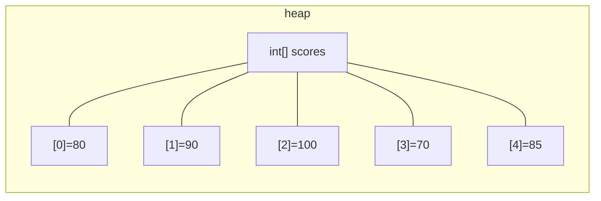
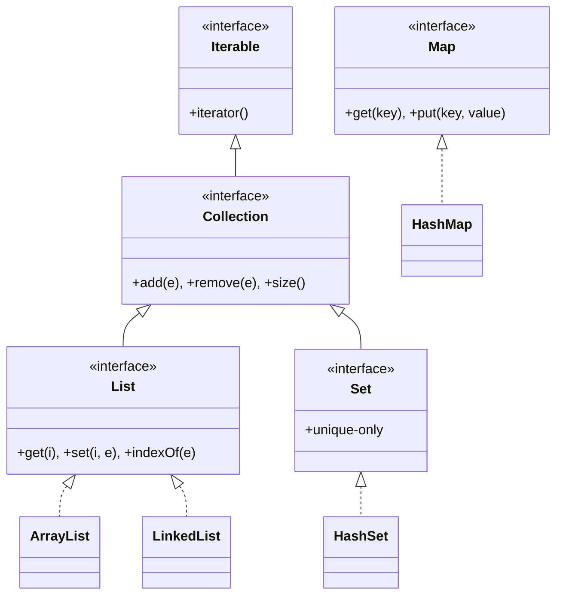

A single variable holds a single value. Real programs need to hold
*many* values, a list of orders, the lines of a file, the players
in a game. Java's two foundational tools are **arrays** and the
**collections framework**, starting with `ArrayList`.

<Figure
  slug="java-arrays-collections-cutout"
  alt="Arrays and collections, an isometric illustration"
/>

## Arrays: fixed-size, primitive-friendly

An array is a contiguous block of values of the same type. Its
size is fixed at creation time and cannot change later.

<CodeBlock
  adapter="java"
  files={[
    {
      filename: "main.java",
      starterCode: `public class Main {
  public static void main(String[] args) {
    int[] scores = new int[5]; // length 5, all zeros
    scores[0] = 80;
    scores[1] = 90;
    scores[2] = 100;
    scores[3] = 70;
    scores[4] = 85;

    // literal form is often nicer
    String[] names = {"Ada", "Grace", "Linus"};

    for (int i = 0; i < scores.length; i++) {
      System.out.println("scores[" + i + "] = " + scores[i]);
    }

    for (String n : names) {
      System.out.println("name: " + n);
    }
  }
}
`,
    },
  ]}
/>

Key facts about arrays:

- Indexed from `0` to `length - 1`. Going outside throws
  `ArrayIndexOutOfBoundsException`.
- `.length` is a *field*, not a method (no parentheses).
- Arrays can hold **primitives** (`int[]`, `double[]`) or
  **references** (`String[]`, `Account[]`).
- The size is set once. To grow, you must allocate a bigger array
  and copy.



## ArrayList: growable, generic

In real code, you almost always reach for an **`ArrayList`**
instead of a bare array. It can grow and shrink, has a rich set of
operations, and is part of Java's broader **Collections Framework**.

<CodeBlock
  adapter="java"
  files={[
    {
      filename: "main.java",
      starterCode: `import java.util.ArrayList;
import java.util.List;

public class Main {
  public static void main(String[] args) {
    List<String> todo = new ArrayList<>();
    todo.add("learn Java");
    todo.add("write tests");
    todo.add("read this chapter");

    System.out.println("size = " + todo.size());
    System.out.println("first = " + todo.get(0));

    todo.remove("write tests");

    for (String task : todo) {
      System.out.println("- " + task);
    }
  }
}
`,
    },
  ]}
/>

A few things to notice:

- We declared the variable as `List<String>`, the *interface*, not
  `ArrayList<String>`. We learned why in the interfaces chapter.
- `<String>` is a **generic** type parameter that tells the compiler
  this list holds Strings. Trying to `todo.add(42)` would not
  compile.
- `add`, `remove`, `get`, `size`, `contains`, `isEmpty` are the
  basic methods you'll use constantly.

## The shape of the Collections Framework



For this page we focus on `List` (and especially `ArrayList`). The
next page is dedicated to `Map` and `Set`.

## Iterating over a collection

The **for-each loop** works on anything that implements `Iterable`,
which includes every collection and every array:

```java
for (String task : todo) {
    System.out.println(task);
}
```

Use the for-each form whenever you don't need the index. Use the
classic `for (int i = 0; i < list.size(); i++)` form when you do.

## A common pitfall: modifying while iterating

You may not add to or remove from a collection inside a for-each
loop over it, doing so throws `ConcurrentModificationException`.

```java
for (String task : todo) {
    if (task.startsWith("learn")) {
        todo.remove(task);    // ❌ throws at runtime
    }
}
```

Two safe fixes:

- Iterate over a copy: `for (String task : new ArrayList<>(todo))`.
- Use an `Iterator` explicitly and call `iterator.remove()`.

## A worked example: averaging a list of scores

<CodeBlock
  adapter="java"
  entryFilename="Main.java"
  files={[
    {
      filename: "Main.java",
      starterCode: `import java.util.List;
import java.util.Arrays;

public class Main {
  public static void main(String[] args) {
    List<Integer> scores = Arrays.asList(80, 90, 100, 70, 85);
    double avg = Stats.average(scores);
    System.out.println("count = " + scores.size());
    System.out.println("avg = " + avg);
  }
}
`,
    },
    {
      filename: "Stats.java",
      starterCode: `import java.util.List;

public class Stats {
  public static double average(List<Integer> values) {
    if (values.isEmpty()) {
      throw new IllegalArgumentException("need at least one value");
    }
    long sum = 0;
    for (int v : values) {
      sum += v;
    }
    return (double)sum / values.size();
  }
}
`,
    },
  ]}
/>

`Arrays.asList(...)` produces a *fixed-size* list, perfect for "just a
bag of values I won't add to or remove from."

## Arrays vs ArrayList, when to use which?

| | Array | ArrayList |
| --- | --- | --- |
| Size | Fixed at creation | Grows on demand |
| Can hold primitives directly | Yes (`int[]`) | No, must use wrapper (`List<Integer>`) |
| Speed | Slightly faster, less overhead | A little slower, but rarely the bottleneck |
| API | Tiny (`.length`, indexing) | Rich (`add`, `remove`, `contains`, `sort`, …) |
| When to use | Performance-critical numeric code, or when size is truly fixed | Almost everywhere else |

In modern Java code, you'll see `ArrayList` (or `List`) **far**
more often than bare arrays.

<MultipleChoice
  markdown={`What happens if you try \`scores[scores.length]\` on a Java array?

- [o] Throws \`ArrayIndexOutOfBoundsException\` at runtime
  > Valid indices are 0..length-1.
- Returns null
  > No.
- Grows the array by one
  > Arrays cannot grow; ArrayList can.
- Returns 0
  > No, Java does not silently return defaults for out-of-bounds access.`}
/>

<MultipleChoice
  markdown={`Why is \`List<Integer>\` used instead of \`int[]\` in most everyday code?

- It is faster
  > Arrays are slightly faster for primitives.
- [o] It can grow and shrink, has a richer API, and integrates with the rest of the collections framework
  > Flexibility and the collections API matter more than raw speed in most everyday code.
- The compiler refuses to use \`int[]\`
  > It does not.
- It uses less memory
  > It actually uses more (boxing overhead).`}
/>

<MultipleChoice
  markdown={`What is wrong with removing an element from a list inside a \`for-each\` loop over that same list?

- The compiler refuses to compile it
  > It compiles fine; the failure happens at runtime.
- Nothing, that's the recommended pattern
  > Not recommended; it throws.
- [o] It throws \`ConcurrentModificationException\` because the iterator detects the structural change
  > The iterator notices the list changed underneath it and fails fast instead of returning garbage.
- It silently loses one element
  > It throws; it does not silently corrupt.`}
/>

## A challenge

<ChallengeCard
  adapter="java"
  title="Sum positive numbers"
  instructions={`Implement a static method \`Numbers.sumPositive(List<Integer>)\` that returns the sum of the *positive* numbers in the list (numbers strictly greater than zero). Zeros and negatives are ignored.

\`Main.java\` is given. It must print exactly:

\`\`\`
sumPositive=15
\`\`\``}
  entryFilename="Main.java"
  files={[
    {
      filename: "Main.java",
      starterCode: `import java.util.List;
import java.util.Arrays;

public class Main {
  public static void main(String[] args) {
    List<Integer> data = Arrays.asList(3, -1, 0, 7, -8, 5);
    System.out.println("sumPositive=" + Numbers.sumPositive(data));
  }
}
`,
    },
    {
      filename: "Numbers.java",
      starterCode: `import java.util.List;

public class Numbers {
  public static int sumPositive(List<Integer> values) {
    // TODO
    return 0;
  }
}
`,
      solutionCode: `import java.util.List;

public class Numbers {
  public static int sumPositive(List<Integer> values) {
    int total = 0;
    for (int v : values) {
      if (v > 0)
        total += v;
    }
    return total;
  }
}
`,
    },
  ]}
  tests={[
    {
      id: "sum-pos",
      name: "Sum positives only",
      expect: {
        stdoutLines: ["sumPositive=15"],
        stdoutLinesExact: true,
      },
    },
  ]}
/>

Lists are great for *ordered* sequences. But many problems need to
ask *"is this thing here?"* or *"what value goes with this key?"*
quickly. That's the job of `Set` and `Map`, which we tackle next.
