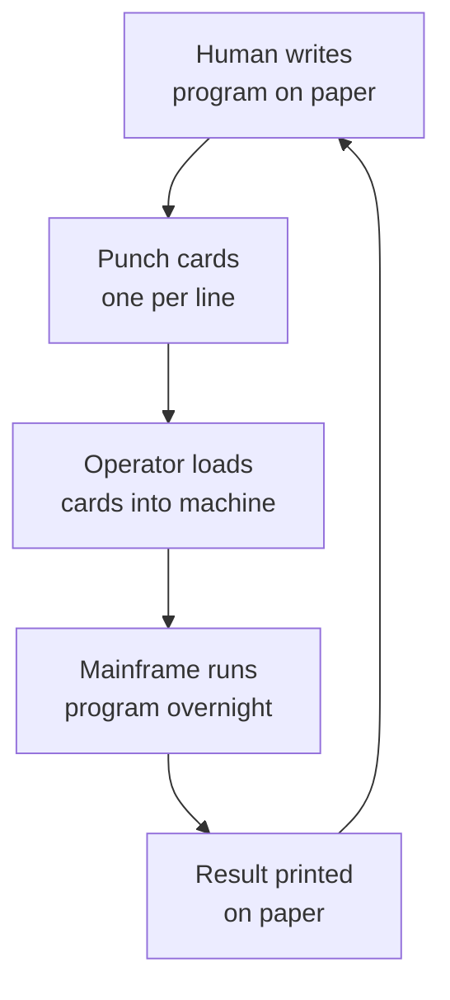
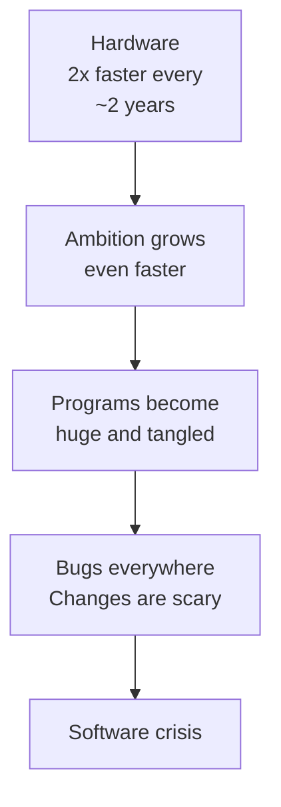
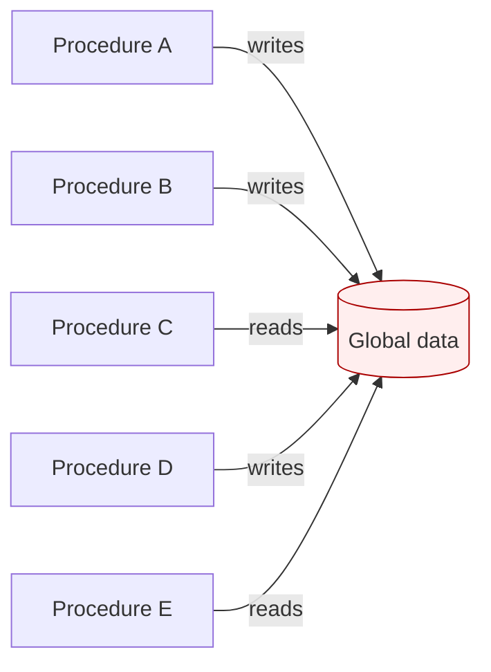
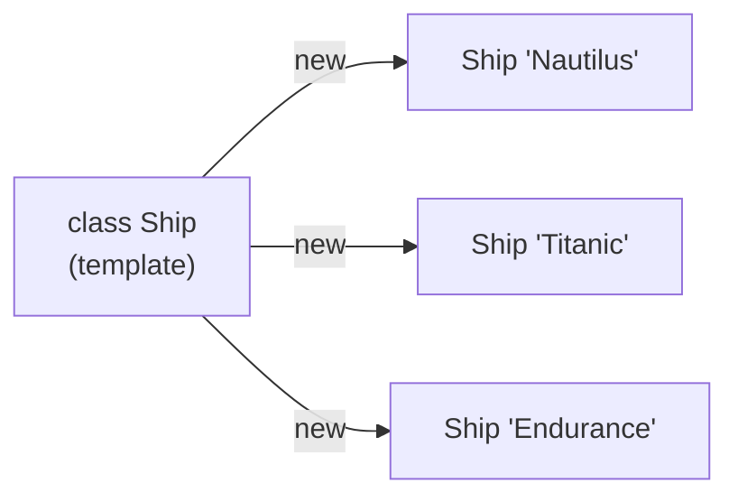
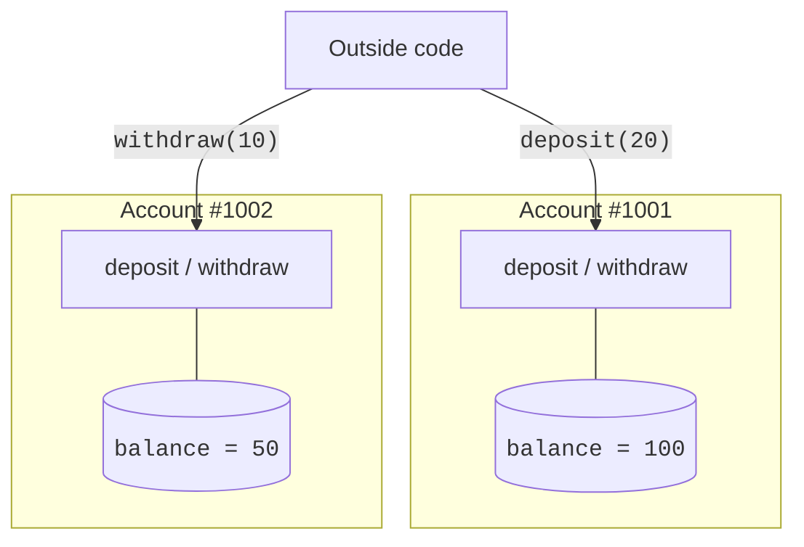

Before there was Java, a "program" was not a file. It was a physical
object: a deck of **punched cards**, or a roll of paper tape, or a
patch panel with wires plugged from socket to socket. A programmer
in the 1950s would write a program on paper, punch it onto cards,
one card per line, carry the deck to an operator in a cardboard
box, and come back the next day to learn whether it had worked.

<Figure
  slug="java-birth-of-oop-cutout"
  alt="From punched cards to objects, an isometric illustration"
/>

Every cycle of "edit, run, see what happened" could take *days*. So
programmers learned to think extremely carefully before committing a
single instruction to cardboard. That instinct is worth keeping even
now that our tools answer in milliseconds: a program is a plan you
are handing to a machine, and bad planning is expensive.

The languages themselves improved quickly. **Machine code**, raw
`0`s and `1`s, gave way to **assembly language**, where you could
write readable mnemonics like `ADD R1, R2` instead of binary. Then,
in the late 1950s and 1960s, languages like **FORTRAN**, **COBOL**,
and later **C** and **Pascal** let programmers write something that
looked like math or English and have a **compiler** translate it
into machine code. These languages were **procedural**: a program
was a sequence of *procedures* (also called functions) that
manipulated data, calling one another until a result emerged.

## A program is a recipe, see for yourself

The mental model of that whole era was simple: a program is a
**recipe**. Write down the steps, in order. Run the recipe. Get a
result. Sixty years later, that model still holds inside every
method you will ever write, including in Java.

<Figure
  slug="java-birth-of-oop-program-recipe-see-inline-cutout"
  alt="A card of plain pictogram steps in a row with an arrow between each, beside a machine carrying out those same actions in the same order"
  caption="A procedural program is a list of steps carried out in order."
/>

Here is such a recipe, as a real Java program. Run it, and read the
output top to bottom:

<CodeBlock
  adapter="java"
  files={[
    {
      filename: "main.java",
      starterCode: `public class Main {
  public static void main(String[] args) {
    System.out.println("Step 1: take 6 eggs");
    int eggs = 6;

    System.out.println("Step 2: use 2 for the cake");
    eggs = eggs - 2;

    System.out.println("Step 3: count what is left");
    System.out.println("Eggs remaining: " + eggs);
  }
}
`,
    },
  ]}
/>

The machine executed your instructions exactly, in order, top to
bottom. Change the numbers and run it again, the recipe obediently
recomputes. This "do this, then that" style is the foundation under
everything in this course. The question of the 1960s was: what
happens when the recipe grows to a million lines?

## The software crisis

The answer arrived fast, and it was ugly.

<Figure
  slug="java-birth-of-oop-software-crisis-inline-cutout"
  alt="A workshop overflowing with half-finished machines and tangled cords, a figure standing amid it"
  caption="Programs outgrew the way they were being written, and it showed."
/>

Through the 1960s, hardware roughly doubled in power every couple of
years, and ambition grew even faster: payroll for entire
corporations, airline reservations, banking networks, the flight
software for the Apollo missions. And those programs were *failing*,
not occasionally, but chronically. Projects shipped years late and
far over budget, full of bugs, and so tangled that nobody, including
the original authors, could safely change them.

The most famous casualty was IBM's **OS/360**, the operating system
for its System/360 mainframes. It consumed thousands of
programmer-years and shipped late anyway. Its manager, **Fred
Brooks**, distilled the experience into the 1975 classic *The
Mythical Man-Month*, including the observation now known as
**Brooks's law**: *adding manpower to a late software project makes
it later*, because every new person multiplies the communication
overhead among everyone else.

In October 1968, NATO sponsored a conference in Garmisch, Germany,
to confront the problem head-on. The attendees put a name to it,
the **software crisis**, and proposed, half as aspiration, a new
discipline to fix it: *software engineering*. The profession you are
now entering was invented, in real time, in response to a disaster.

## Why procedural programs got tangled

What exactly went wrong when recipes grew huge? Two patterns of pain
showed up over and over.

**Global state.** Many procedural programs kept their data in
**global variables**, variables that any procedure anywhere could
read or write. In a tiny program this is fine. In a 200,000-line
program it is a nightmare: a bug in one corner could silently corrupt
data, and hours later, on the far side of the codebase, a completely
unrelated feature would crash because of it.

Try to imagine debugging this: if `C` reads a wrong value, *who
corrupted it?* `A`? `B`? `D`? Any of them, at any time. The search
space is the entire program.

**No grouping of data and behavior.** The data for a "bank account"
might live in one place, an array of numbers, while the procedures
that operate on accounts lived somewhere else entirely. Nothing
*forced* the rule "only account code may touch account data." Any
programmer in a hurry could bypass the official procedures and poke
the numbers directly. Now the rules about accounts exist in two
places: the official procedures, and the head of whoever wrote the
shortcut.

There is a deeper mathematical reason the crisis was inevitable:
**complexity grows faster than size**. Each new piece of code
interacts with the pieces around it, so doubling a program's length
roughly *squares* the number of interactions a human is expected to
keep straight. Past a certain size, no amount of discipline or
overtime can compensate. You need techniques that *limit how much of
the program you must think about at once*.

<MultipleChoice
  markdown={`What was the central observation of the 1968 NATO conference on the "software crisis"?

- [o] That building large software systems was much harder than anyone had expected, and existing techniques did not scale
  > Big programs were collapsing under their own weight.
- That computers were too slow to run real programs
  > Hardware was actually improving very quickly.
- That assembly language was about to disappear
  > Assembly was alive and well; the issue was managing complexity, not language choice.
- That programmers were not paid enough
  > Compensation was not the issue named at the conference.`}
/>

## A new idea from a simulation lab

The deepest answer to the crisis did not come from rearranging
procedures. It came from a totally different way of thinking about
what a program *is*.

In 1960s Oslo, two Norwegian researchers, **Ole-Johan Dahl** and
**Kristen Nygaard**, were building software to *simulate* physical
systems: ships moving through a harbor, customers queuing at a bank.
They noticed something. The most natural way to write a simulation
is to model each *thing in the world* as a *thing in the program*: a
ship in the harbor becomes a `Ship` in the code, carrying its own
position and speed, and offering its own behaviors.

They built this insight into a language, **Simula 67**, which
introduced two words we still use every single day:

- **Class**, the description, the template, the blueprint of a kind
  of thing.
- **Object**, an actual *instance* of that thing, with its own data.

This was a quiet revolution, quiet enough that it took the field
decades to absorb, and significant enough that Dahl and Nygaard
eventually received the 2001 Turing Award, computing's highest
honor, for it. A program was no longer just "code that manipulates
data." A program was a *population of small things*, each holding
its own data and offering its own behavior.

In the 1970s, at Xerox PARC in California, **Alan Kay** and his team
pushed the idea to its limit in a language called **Smalltalk**:
*everything* is an object, even numbers, even `true` and `false`,
and objects interact only by sending each other messages. Kay coined
the very phrase "object-oriented programming." (He later quipped, at
the 1997 OOPSLA conference, "I made up the term 'object-oriented',
and I can tell you I did not have C++ in mind.") The same PARC group
invented overlapping windows, the bitmapped graphical interface, and
much of what a young Steve Jobs saw on his famous 1979 visit, the
visit that shaped the Lisa and the Macintosh. A staggering amount of
modern computing traces back to that one research lab.

## Why objects tamed complexity

Recall the central pain of the procedural era: global data that any
procedure could change. The object idea dissolves it with one rule:

> **Each object owns its own data, and only its own methods may
> touch that data.**

That rule, later named **encapsulation**, means that when a piece
of data is wrong, you only have to look at *one* object's methods to
find the culprit. It scopes the search. It puts the data behind a
door, and the door has a label saying who may open it.

Outside code can *ask* an account to deposit or withdraw, but it
cannot reach in and rewrite the balance. The rules of the account
live *with* the account.

As the idea matured through the 1970s and 80s, it stabilized into
four pillars. Do not memorize them now, we will spend whole
chapters on each. Just notice the shape of the list:

| Idea | One-sentence summary |
| --- | --- |
| **Encapsulation** | Each object hides its data and exposes only behavior. |
| **Abstraction** | Callers see *what* an object does, not *how* it does it. |
| **Inheritance** | A new class can be defined as "a kind of" an existing class. |
| **Polymorphism** | The same message can mean different things to different objects. |

<MultipleChoice
  markdown={`Which language introduced the concepts of *class* and *object*?

- Java
  > Java is a major adopter, not the inventor.
- [o] Simula 67
  > Simula, built for simulations, introduced classes and objects.
- Smalltalk
  > Smalltalk popularized them, but they were invented earlier.
- C
  > C is procedural; classes and objects came later.`}
/>

<MultipleChoice
  markdown={`What is the *single biggest problem* that encapsulation was invented to solve?

- [o] In large procedural programs, any code could change any data, making bugs nearly impossible to localize
  > Encapsulation gives each piece of data a single owner.
- Computers did not have enough memory for procedures
  > Memory was not the issue.
- Programs were too slow
  > Encapsulation is about correctness and maintainability, not speed.
- Programmers wanted to type less
  > OOP usually adds typing, not removes it.`}
/>

## From research to industry

Simula and Smalltalk were brilliant, but they were also rare. Most
real software in 1985 was still written in C, COBOL, and Pascal. The
object idea was powerful; it had not yet escaped the research labs.

Three things had to happen for it to take over the world: a
practical, production-grade language had to absorb the ideas; that
language had to run on every kind of computer, not just one research
workstation; and the industry had to be in enough pain to try
something new.

In the early 1990s, all three conditions were met at once, by a
secret project at Sun Microsystems whose actual goal was to program
*television set-top boxes and smart appliances*. That gloriously
sideways origin story is the next page.
