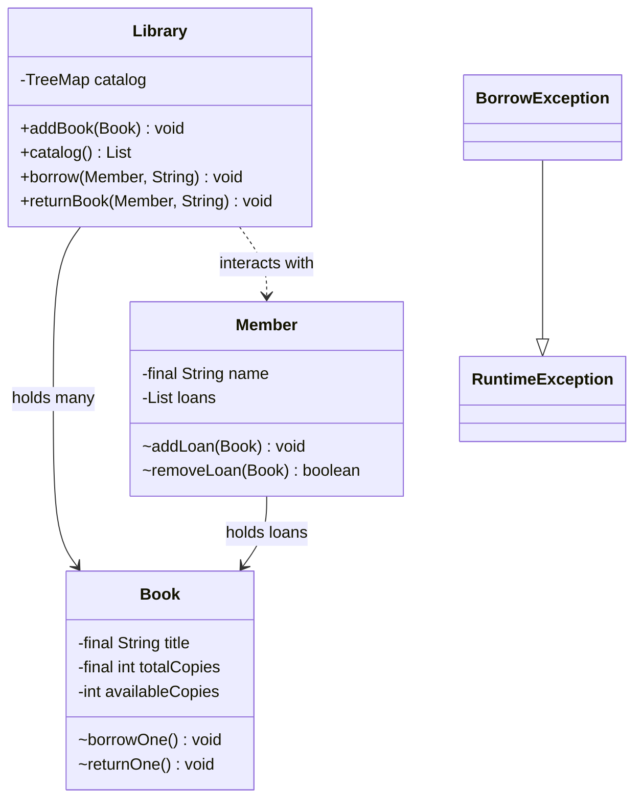

You have now seen everything you need to build a small but
*honestly designed* Java program. This capstone is a tiny library
checkout system that exercises:

- Classes and constructors
- Encapsulation and immutability
- Collections (`List`, `Map`)
- Polymorphism through an interface
- Exception handling with a custom exception
- Layered organization (domain + service)

Take your time. There is intentionally more than one valid
implementation. Use the provided `Main.java` to drive your design.

<svg
  viewBox="0 0 640 240"
  role="img"
  aria-label="A blue catalog card of book bars and a yellow card of member dots feed along thin gray lines into one green loans ledger, where each row pairs a book with a borrower and a green check — the capstone checkout system"
  style={{ display: "block", width: "100%", maxWidth: "640px", height: "auto", margin: "2.5rem auto" }}
>
  <g stroke="var(--ds-gray-300)" strokeWidth="2">
    <line x1="145" y1="118" x2="280" y2="150" />
    <line x1="495" y1="118" x2="360" y2="150" />
  </g>
  <g style={{ color: "var(--ds-blue-500)" }} fill="currentColor">
    <rect x="60" y="28" width="170" height="90" rx="12" fillOpacity="0.08" />
    <rect x="80" y="50" width="110" height="10" rx="5" fillOpacity="0.7" />
    <rect x="80" y="68" width="86" height="10" rx="5" fillOpacity="0.7" />
    <rect x="80" y="86" width="120" height="10" rx="5" fillOpacity="0.7" />
  </g>
  <g style={{ color: "var(--ds-yellow-500)" }} fill="currentColor">
    <rect x="410" y="28" width="170" height="90" rx="12" fillOpacity="0.11" />
    <circle cx="445" cy="58" r="7" />
    <circle cx="475" cy="58" r="7" />
    <circle cx="505" cy="58" r="7" />
    <circle cx="460" cy="88" r="7" />
    <circle cx="490" cy="88" r="7" />
  </g>
  <rect x="210" y="150" width="220" height="70" rx="12" fill="var(--ds-green-500)" fillOpacity="0.1" />
  <rect x="232" y="168" width="60" height="9" rx="4.5" fill="var(--ds-blue-500)" fillOpacity="0.7" />
  <circle cx="312" cy="172" r="5.5" fill="var(--ds-yellow-500)" />
  <polyline points="382,172 387,177 396,164" fill="none" stroke="var(--ds-green-500)" strokeWidth="3" strokeLinecap="round" strokeLinejoin="round" />
  <rect x="232" y="192" width="48" height="9" rx="4.5" fill="var(--ds-blue-500)" fillOpacity="0.7" />
  <circle cx="312" cy="196" r="5.5" fill="var(--ds-yellow-500)" />
  <polyline points="382,196 387,201 396,188" fill="none" stroke="var(--ds-green-500)" strokeWidth="3" strokeLinecap="round" strokeLinejoin="round" />
</svg>

## The system, in plain English

A `Library` has a catalog of `Book`s. A `Member` may borrow a copy
of a book — but only if a copy is available. When a member borrows
a book, the available-copy count for that book goes down by one;
when they return it, the count goes back up.

Borrowing an unknown book, or a book with no available copies,
throws a `BorrowException`. Returning a book that the member did
not borrow throws a `BorrowException`.

## The expected behavior

`Main.java` is fixed. With a correct implementation it must print
**exactly** the following. (Note how each failed attempt produces
*two* lines: the `... failed: ...` message printed inside the catch
block, then the `ok? false` line printed by the caller.)

```
Catalog:
- Effective Java (2 copies)
- Refactoring (1 copies)
borrow ok? true
borrow ok? true
borrow failed: no copies available: Effective Java
borrow ok? false
borrow failed: unknown book: Unknown Title
borrow ok? false
After borrows:
- Effective Java (0 copies)
- Refactoring (1 copies)
ada has 1 loan(s)
grace has 1 loan(s)
return ok? true
After ada returns Effective Java:
- Effective Java (1 copies)
- Refactoring (1 copies)
return failed: not on loan to this member: Refactoring
return ok? false
```

## The challenge

<ChallengeCard
  adapter="java"
  title="Mini Library System"
  instructions={`Implement four classes and one custom exception so that the provided \`Main\` produces the exact output shown above.

**Book.java**
- A class with private final fields \`String title\` and \`int totalCopies\`.
- A private mutable field \`int availableCopies\`.
- Constructor \`Book(String title, int totalCopies)\` sets \`availableCopies\` equal to \`totalCopies\`.
- Methods \`title()\`, \`totalCopies()\`, \`availableCopies()\`.
- A package-private method \`borrowOne()\` that decreases \`availableCopies\` by 1. Throws \`BorrowException\` with message \`"no copies available: " + title\` if none available.
- A package-private method \`returnOne()\` that increases \`availableCopies\` by 1, but never beyond \`totalCopies\`.

**Member.java**
- Private final \`String name\`. Private \`List<Book> loans\` initialised to a new ArrayList.
- Constructor \`Member(String name)\`.
- Methods \`name()\` and \`loanCount()\` (returns \`loans.size()\`).
- Package-private \`addLoan(Book b)\` and \`boolean removeLoan(Book b)\` (returns true if the book was on loan and is now removed, false otherwise).

**BorrowException.java**
- Extends \`RuntimeException\`. Single-string-message constructor.

**Library.java**
- Private final \`Map<String, Book> catalog\` (key = title).
- Constructor \`Library()\` initialises the map.
- Method \`void addBook(Book b)\` puts it in the catalog.
- Method \`List<Book> catalog()\` returns the books as a sorted-by-title \`List\` (use a \`TreeMap\` or sort yourself).
- Method \`void borrow(Member m, String title)\` looks up the book, calls \`borrowOne()\`, and calls \`m.addLoan(book)\`. Throws \`BorrowException\` with message \`"unknown book: " + title\` if the title isn't in the catalog.
- Method \`void returnBook(Member m, String title)\` looks up the book, calls \`m.removeLoan(book)\` — if it returns false, throw \`BorrowException("not on loan to this member: " + title)\`. Otherwise call \`book.returnOne()\`.

The given \`Main.java\` drives the behavior. Don't change it.`}
  entryFilename="Main.java"
  files={[
    {
      filename: "Main.java",
      starterCode: `public class Main {
  public static void main(String[] args) {
    Library lib = new Library();
    lib.addBook(new Book("Effective Java", 2));
    lib.addBook(new Book("Refactoring", 1));

    System.out.println("Catalog:");
    for (Book b : lib.catalog()) {
      System.out.println("- " + b.title() + " (" + b.availableCopies() +
                         " copies)");
    }

    Member ada = new Member("ada");
    Member grace = new Member("grace");

    System.out.println("borrow ok? " + tryBorrow(lib, ada, "Effective Java"));
    System.out.println("borrow ok? " + tryBorrow(lib, grace, "Effective Java"));
    System.out.println("borrow ok? " +
                       tryBorrow(lib, ada, "Effective Java")); // none left
    System.out.println("borrow ok? " + tryBorrow(lib, ada, "Unknown Title"));

    System.out.println("After borrows:");
    for (Book b : lib.catalog()) {
      System.out.println("- " + b.title() + " (" + b.availableCopies() +
                         " copies)");
    }

    System.out.println(ada.name() + " has " + ada.loanCount() + " loan(s)");
    System.out.println(grace.name() + " has " + grace.loanCount() + " loan(s)");

    System.out.println("return ok? " + tryReturn(lib, ada, "Effective Java"));
    System.out.println("After ada returns Effective Java:");
    for (Book b : lib.catalog()) {
      System.out.println("- " + b.title() + " (" + b.availableCopies() +
                         " copies)");
    }

    System.out.println("return ok? " +
                       tryReturn(lib, ada, "Refactoring")); // not on loan
  }

  static boolean tryBorrow(Library lib, Member m, String title) {
    try {
      lib.borrow(m, title);
      return true;
    } catch (BorrowException e) {
      System.out.println("borrow failed: " + e.getMessage());
      return false;
    }
  }

  static boolean tryReturn(Library lib, Member m, String title) {
    try {
      lib.returnBook(m, title);
      return true;
    } catch (BorrowException e) {
      System.out.println("return failed: " + e.getMessage());
      return false;
    }
  }
}
`,
    },
    {
      filename: "BorrowException.java",
      starterCode: `public class BorrowException extends RuntimeException {
  // TODO
}
`,
      solutionCode: `public class BorrowException extends RuntimeException {
  public BorrowException(String message) { super(message); }
}
`,
    },
    {
      filename: "Book.java",
      starterCode: `public class Book {
  // TODO: title, totalCopies, availableCopies + methods
}
`,
      solutionCode: `public class Book {
  private final String title;
  private final int totalCopies;
  private int availableCopies;

  public Book(String title, int totalCopies) {
    this.title = title;
    this.totalCopies = totalCopies;
    this.availableCopies = totalCopies;
  }

  public String title() { return title; }
  public int totalCopies() { return totalCopies; }
  public int availableCopies() { return availableCopies; }

  void borrowOne() {
    if (availableCopies == 0) {
      throw new BorrowException("no copies available: " + title);
    }
    availableCopies--;
  }

  void returnOne() {
    if (availableCopies < totalCopies) {
      availableCopies++;
    }
  }
}
`,
    },
    {
      filename: "Member.java",
      starterCode: `import java.util.ArrayList;
import java.util.List;

public class Member {
  // TODO
}
`,
      solutionCode: `import java.util.ArrayList;
import java.util.List;

public class Member {
  private final String name;
  private final List<Book> loans = new ArrayList<>();

  public Member(String name) { this.name = name; }

  public String name() { return name; }
  public int loanCount() { return loans.size(); }

  void addLoan(Book b) { loans.add(b); }

  boolean removeLoan(Book b) { return loans.remove(b); }
}
`,
    },
    {
      filename: "Library.java",
      starterCode: `import java.util.ArrayList;
import java.util.List;
import java.util.TreeMap;

public class Library {
  // TODO
}
`,
      solutionCode: `import java.util.ArrayList;
import java.util.List;
import java.util.TreeMap;

public class Library {
  private final TreeMap<String, Book> catalog = new TreeMap<>();

  public void addBook(Book b) { catalog.put(b.title(), b); }

  public List<Book> catalog() { return new ArrayList<>(catalog.values()); }

  public void borrow(Member m, String title) {
    Book b = catalog.get(title);
    if (b == null) {
      throw new BorrowException("unknown book: " + title);
    }
    b.borrowOne();
    m.addLoan(b);
  }

  public void returnBook(Member m, String title) {
    Book b = catalog.get(title);
    if (b == null) {
      throw new BorrowException("unknown book: " + title);
    }
    if (!m.removeLoan(b)) {
      throw new BorrowException("not on loan to this member: " + title);
    }
    b.returnOne();
  }
}
`,
    },
  ]}
  tests={[
    {
      id: "library",
      name: "Mini library produces expected trace",
      expect: {
        stdoutLines: [
          "Catalog:",
          "- Effective Java (2 copies)",
          "- Refactoring (1 copies)",
          "borrow ok? true",
          "borrow ok? true",
          "borrow failed: no copies available: Effective Java",
          "borrow ok? false",
          "borrow failed: unknown book: Unknown Title",
          "borrow ok? false",
          "After borrows:",
          "- Effective Java (0 copies)",
          "- Refactoring (1 copies)",
          "ada has 1 loan(s)",
          "grace has 1 loan(s)",
          "return ok? true",
          "After ada returns Effective Java:",
          "- Effective Java (1 copies)",
          "- Refactoring (1 copies)",
          "return failed: not on loan to this member: Refactoring",
          "return ok? false",
        ],
        stdoutLinesExact: true,
      },
    },
  ]}
/>

## How the design uses the course's ideas

A short tour of the design choices in the reference solution:



- **Encapsulation:** `availableCopies` is private. Only `Book.borrowOne`
  and `Book.returnOne` may change it, and only inside the package.
  This is exactly the "single place that owns the rule" pattern.
- **Visibility:** `borrowOne` and `returnOne` are *package-private*,
  not `public`. They are intended for `Library` to use, not random
  outside code — outside code goes through `Library.borrow`.
- **Custom exception:** `BorrowException` is a domain-specific
  unchecked exception. The service throws it; the UI layer
  (`Main`) catches it and turns it into user-facing output.
- **Map for lookup:** the catalog is a `Map<String, Book>` because
  we look books up by title — exactly the case for a Map.
- **Polymorphism / interfaces:** not used heavily here, on purpose
  — they shine when there's a *choice* of implementations. Adding
  a `BookRepository` interface with both in-memory and persistent
  versions would be the natural next step.

Once your solution passes the test, take a few minutes to:

- Add a new method `int totalAvailable()` on `Library`.
- Try restricting members to a maximum of 3 simultaneous loans.
- Try adding a `LinkedHashMap` instead of `TreeMap` and observe
  what changes in the output. (You will need to also change
  iteration order expectations.)

These small extensions are how real codebases evolve.

You're done with the capstone. The final page is a roadmap for
where to go next.
