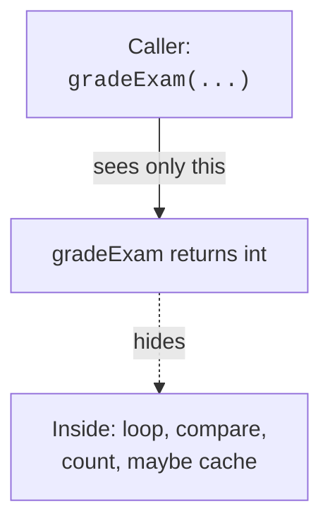

The hardest part of programming is rarely the syntax. It is
*figuring out what you want the program to do, precisely enough that
the machine can do it*. The set of mental habits that get you from
a fuzzy English description to a working program is called
**computational thinking**.

<IllustrationPrompt subject="Jeannette Wing" photo />

The term was popularized by Jeannette Wing in 2006, but the habits
are far older. There are four of them. Each is worth a lifetime of
practice.

The path from a fuzzy idea to running code:

**Vague problem in English → Decompose → Find patterns → Abstract → Design algorithm → Code it**

<svg
  viewBox="0 0 640 230"
  role="img"
  aria-label="A fuzzy blob is worked across four benches — split into pieces, matching pieces spotted in green, boiled down to one core, then lined up as ordered steps toward a flag — computational thinking in motion"
  style={{ display: "block", width: "100%", maxWidth: "640px", height: "auto", margin: "2.5rem auto" }}
>
  <g fill="currentColor" opacity="0.12">
    <rect x="60" y="160" width="100" height="14" rx="7" />
    <rect x="200" y="160" width="100" height="14" rx="7" />
    <rect x="340" y="160" width="100" height="14" rx="7" />
    <rect x="480" y="160" width="100" height="14" rx="7" />
  </g>
  <g style={{ color: "var(--ds-blue-500)" }} fill="currentColor">
    <path d="M82 122C84 96 132 88 142 110C150 128 120 148 100 140C86 134 80 132 82 122Z" fillOpacity="0.3" />
    <rect x="216" y="100" width="18" height="18" rx="4" fillOpacity="0.35" />
    <rect x="262" y="124" width="18" height="18" rx="4" fillOpacity="0.35" />
  </g>
  <g style={{ color: "var(--ds-green-500)" }} fill="currentColor">
    <rect x="244" y="100" width="18" height="18" rx="4" />
    <rect x="222" y="126" width="18" height="18" rx="4" />
  </g>
  <g fill="currentColor" opacity="0.12">
    <rect x="368" y="96" width="44" height="44" rx="10" />
  </g>
  <g style={{ color: "var(--ds-green-500)" }} fill="currentColor">
    <circle cx="390" cy="118" r="10" />
  </g>
  <g style={{ color: "var(--ds-blue-500)" }} fill="currentColor">
    <circle cx="500" cy="118" r="8" />
    <circle cx="530" cy="118" r="8" />
    <circle cx="560" cy="118" r="8" />
    <polygon points="572,110 572,126 584,118" fillOpacity="0.6" />
  </g>
  <g fill="currentColor" opacity="0.3">
    <circle cx="170" cy="150" r="3" />
    <circle cx="186" cy="142" r="3" />
    <circle cx="310" cy="150" r="3" />
    <circle cx="326" cy="142" r="3" />
    <circle cx="450" cy="150" r="3" />
    <circle cx="466" cy="142" r="3" />
  </g>
  <g style={{ color: "var(--ds-green-500)" }} fill="currentColor">
    <rect x="596" y="76" width="4" height="60" rx="2" fillOpacity="0.7" />
    <polygon points="600,76 622,86 600,96" />
  </g>
</svg>

## 1. Decomposition: break it into pieces

The first habit is the simplest: **a big problem is solved by
splitting it into smaller problems, and then splitting *those* until
each piece is small enough to think about.**

Suppose someone asks you: "Write a program that grades multiple
choice exams." That's huge. But decompose it:

- Read the answer key.
- Read each student's submission.
- For each student:
  - Compare each answer to the key.
  - Count how many were correct.
  - Compute the percentage.
- Print a report for each student.
- Print class statistics (average, highest, lowest).

Each bullet is now a much smaller problem. Each one can be
decomposed further until it is one short method (function).

A core skill of an experienced programmer is *knowing where to cut*.
There is no formula. With practice you start to see natural seams in
a problem the way a carpenter sees the grain in a piece of wood.

## 2. Pattern recognition: look for familiar shapes

When you decompose a problem, you will notice that some of the
sub-problems look like things you have done before. **"Oh, this is
basically a search." "Oh, this is just counting." "Oh, this is the
same as the average we computed last week, just with different
data."**

Pattern recognition is what turns a one-off solver into a fluent
programmer. After a few months you will start to see:

- *Iterate over a collection and count things that satisfy a
  condition* — you do this hundreds of times.
- *Look something up in a table given a key* — you do this hundreds
  of times.
- *Combine two collections into a third* — you do this hundreds of
  times.

We will spend whole lessons later on the patterns that show up most
often.

## 3. Abstraction: hide what doesn't matter right now

**Abstraction** is the habit of working with the *idea* of a thing
without the distracting details. When you press the "M" key on your
keyboard, you do not think about the electrical signal, the USB
protocol, the keyboard driver, the operating system's event queue,
the editor's input handler, or the font renderer that draws the
glyph. You just think: *type M*.

Each of those layers is an abstraction. You can ignore them because
*somebody else worked out a clean interface*. That is the whole game
of software design: build interfaces clean enough that other people
(including future-you) can ignore your code's internals.

When you write a method called `gradeExam(String[] answers, String[] key)`,
its *callers* see only "give me answers and a key, get a score
back." That is their abstraction. Inside, you can do whatever you
want — change the algorithm, optimize it, fix bugs — without
disturbing the callers.



## 4. Algorithm design: a precise sequence of steps

Once a sub-problem is small and familiar, you write an **algorithm**:
a finite, unambiguous sequence of steps that solves it. The classic
example is the recipe for finding the largest number in a list:

```text
Let "biggest" = the first number
For each remaining number n:
    if n > biggest:
        biggest = n
Return biggest
```

That is an algorithm. It is precise. It always terminates. It always
gives the right answer. And it can be translated into Java almost
mechanically:

<CodeBlock
  adapter="java"
  files={[
    {
      filename: "main.java",
      starterCode: `public class Main {
  public static void main(String[] args) {
    int[] nums = {3, 8, 1, 9, 4, 7, 2};

    int biggest = nums[0];
    for (int i = 1; i < nums.length; i++) {
      if (nums[i] > biggest) {
        biggest = nums[i];
      }
    }

    System.out.println("biggest = " + biggest);
  }
}
`,
    },
  ]}
/>

Notice how directly the English version maps onto the code. **Good
algorithms are usually short, simple, and boring.** That is a
feature.

## A worked example: the four habits together

Suppose the task is: *given a paragraph, find the most common word.*

**Decompose.**

1. Get the paragraph.
2. Break it into words.
3. Count how many times each word appears.
4. Find the word with the highest count.
5. Print it.

**Recognize patterns.** Steps 3 and 4 are both *patterns we have
seen*: "tally" and "find the max." Good — we don't have to invent
those from scratch.

**Abstract.** We can hide the implementation of each step behind a
small named method: `splitIntoWords(text)`, `countOccurrences(words)`,
`mostCommon(counts)`. The `main` method becomes a one-line story:
`mostCommon(countOccurrences(splitIntoWords(paragraph)))`.

**Algorithm.** Each named method needs a concrete sequence of steps
inside. The "find the max" algorithm we wrote above can be reused
almost verbatim for step 4.

We are not going to implement the full thing now — we don't yet know
about maps or strings. But notice how *the four habits did the hard
part*. Translating into Java becomes a clerical task.

<MultipleChoice
  markdown={`Which of the four habits of computational thinking is most directly about *splitting* a big problem into smaller ones?

- Pattern recognition
  > That's about *spotting* familiar sub-problems, not creating them.
- [o] Decomposition
  > Decomposition is breaking a problem down.
- Abstraction
  > Abstraction hides details, but does not split the work.
- Algorithm design
  > That's writing the steps once a sub-problem is small enough.`}
/>

<MultipleChoice
  markdown={`Why is *abstraction* useful when writing software?

- It makes programs run faster
  > Abstraction is about *managing complexity*, not speed.
- [o] It lets the caller use a piece of code without needing to understand its internals
  > Hiding details lets each part of the program be understood on its own.
- It removes bugs from the program automatically
  > It does not.
- It is required by the Java compiler
  > Abstraction is a design idea, not a syntax rule.`}
/>

## A small puzzle for your head

Without writing any code, decompose this problem on paper or in your
head: *Given a long string, print only the lines that contain the
word "Java".* What are the sub-problems? What patterns are present?
What can you abstract behind a name?

You should arrive at something like: *split into lines* → *filter
lines containing "Java"* → *print each remaining line*. Two of those
three steps are extremely common patterns. The whole problem is, at
its core, "filter a collection by a condition" — which is one of the
most common patterns in all of programming.

This is the kind of mental work you will do *before every program*
for the rest of your career. The next page sharpens it into a
problem-solving method.
