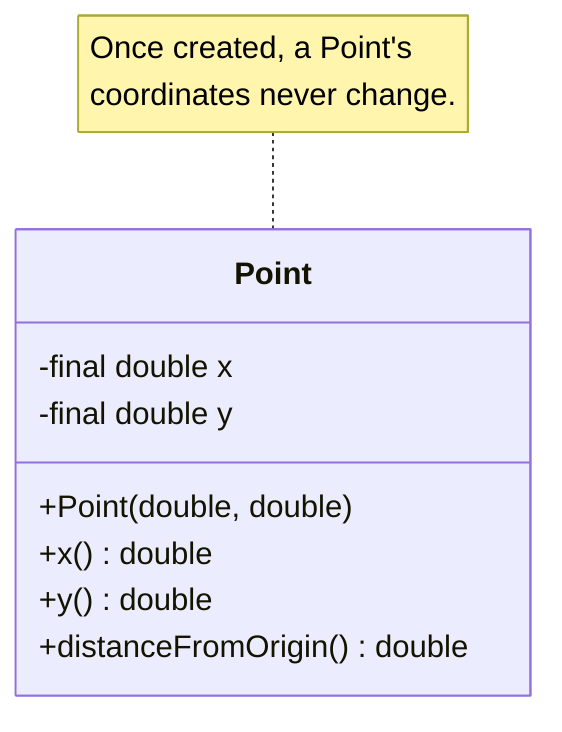

A **constructor** is a special method that runs once, when a new
object is being built with `new`. Its job is to *bring a valid
object into existence*. If your constructor finishes without
throwing an exception, callers are entitled to assume the object is
ready to use.

This page is about constructors and the broader **lifecycle** of an
object — birth, life, and eventual death.

<svg
  viewBox="0 0 640 230"
  role="img"
  aria-label="The same house three times along a timeline: rising inside yellow scaffolding, standing finished with a lit window, then fading into drifting dots — an object's construction, useful life, and quiet collection"
  style={{ display: "block", width: "100%", maxWidth: "640px", height: "auto", margin: "2.5rem auto" }}
>
  <g fill="currentColor" opacity="0.12">
    <rect x="70" y="198" width="500" height="3" rx="1.5" />
  </g>
  <g fill="currentColor" opacity="0.08">
    <rect x="120" y="124" width="80" height="64" />
    <polygon points="112,124 208,124 160,88" />
  </g>
  <g style={{ color: "var(--ds-yellow-500)" }} fill="currentColor">
    <rect x="112" y="96" width="5" height="92" rx="2" fillOpacity="0.5" />
    <rect x="204" y="96" width="5" height="92" rx="2" fillOpacity="0.5" />
    <rect x="108" y="118" width="108" height="5" rx="2" fillOpacity="0.5" />
    <rect x="108" y="152" width="108" height="5" rx="2" fillOpacity="0.5" />
    <rect x="157" y="190" width="6" height="12" rx="3" />
  </g>
  <g style={{ color: "var(--ds-blue-500)" }} fill="currentColor">
    <rect x="280" y="118" width="80" height="70" rx="4" fillOpacity="0.85" />
    <polygon points="270,118 370,118 320,82" />
  </g>
  <g style={{ color: "var(--ds-green-500)" }} fill="currentColor">
    <rect x="312" y="158" width="18" height="30" rx="3" />
    <rect x="317" y="190" width="6" height="12" rx="3" />
  </g>
  <g style={{ color: "var(--ds-white)" }} fill="currentColor">
    <circle cx="298" cy="138" r="5" fillOpacity="0.85" />
    <circle cx="342" cy="138" r="5" fillOpacity="0.85" />
  </g>
  <g style={{ color: "var(--ds-blue-500)" }} fill="currentColor">
    <rect x="440" y="118" width="80" height="70" rx="4" fillOpacity="0.16" />
    <polygon points="430,118 530,118 480,82" fillOpacity="0.13" />
    <circle cx="532" cy="96" r="5" fillOpacity="0.25" />
    <circle cx="548" cy="78" r="4" fillOpacity="0.18" />
    <circle cx="562" cy="60" r="3" fillOpacity="0.12" />
    <circle cx="574" cy="44" r="2.5" fillOpacity="0.08" />
  </g>
  <g fill="currentColor" opacity="0.3">
    <rect x="477" y="190" width="6" height="12" rx="3" />
  </g>
</svg>

## Anatomy of a constructor

A constructor:

- Has the **same name as the class**.
- Has **no return type** (not even `void`).
- May take parameters, just like a regular method.

<CodeBlock
  adapter="java"
  files={[
    {
      filename: "main.java",
      starterCode: `public class Main {
  public static void main(String[] args) {
    Point p = new Point(3, 4);
    System.out.println("p = (" + p.x() + ", " + p.y() + ")");
    System.out.println("distance from origin = " + p.distanceFromOrigin());
  }
}

class Point {
  private final double x;
  private final double y;

  public Point(double x, double y) { // constructor
    this.x = x;
    this.y = y;
  }

  public double x() { return x; }
  public double y() { return y; }

  public double distanceFromOrigin() { return Math.sqrt(x * x + y * y); }
}
`,
    },
  ]}
/>

## Why constructors exist

In a language without constructors, you would do something like this:

```text
Point p = new Point();    // create a blank
p.x = 3;                  // fill in fields one by one
p.y = 4;
// hope you didn't forget any
```

Two big problems:

1. **Half-built objects.** Between the `new` and the last assignment,
   the object is invalid. If anyone uses it in that window, bad
   things happen.
2. **Forgotten fields.** Nothing forces you to set every field.

Constructors fix both. With `new Point(3, 4)`, an object is *born
fully initialized*, in one atomic step.

## The default constructor

If you do not declare any constructor at all, Java gives you a free
one with no parameters that does nothing. The moment you declare
*any* constructor, the default disappears — so if you want a no-arg
constructor *and* a custom one, you have to declare both yourself.

<CodeBlock
  adapter="java"
  files={[
    {
      filename: "main.java",
      starterCode: `public class Main {
  public static void main(String[] args) {
    Box b1 = new Box();  // default, sets size to 1
    Box b2 = new Box(5); // explicit size
    System.out.println("b1.size = " + b1.size());
    System.out.println("b2.size = " + b2.size());
  }
}

class Box {
  private int size;

  public Box() { // no-arg constructor
    this(1);     // delegate to the int constructor
  }

  public Box(int size) {
    if (size <= 0) {
      throw new IllegalArgumentException("size must be positive");
    }
    this.size = size;
  }

  public int size() { return size; }
}
`,
    },
  ]}
/>

`this(1)` calls *another constructor of the same class*. This is
called **constructor chaining**, and it is the right way to share
setup logic between constructors.

## Enforcing invariants in the constructor

The constructor is the perfect place to enforce the rules that must
*always* be true about an object. If the rules can't be met,
**throw an exception** rather than silently creating a broken
object.

<CodeBlock
  adapter="java"
  files={[
    {
      filename: "main.java",
      starterCode: `public class Main {
  public static void main(String[] args) {
    try {
      Person p = new Person("Ada", -5);
    } catch (IllegalArgumentException e) {
      System.out.println("rejected: " + e.getMessage());
    }
  }
}

class Person {
  private final String name;
  private final int age;

  public Person(String name, int age) {
    if (name == null || name.isEmpty()) {
      throw new IllegalArgumentException("name is required");
    }
    if (age < 0 || age > 150) {
      throw new IllegalArgumentException("age must be 0..150, got " + age);
    }
    this.name = name;
    this.age = age;
  }
}
`,
    },
  ]}
/>

A `Person` with `age = -5` simply never comes into existence. The
caller learns about the problem immediately, at the call site, not
hours later when something downstream blows up.

## The lifecycle of an object

An object moves through six stages, from creation to reclamation:

1. **Allocation.** `new Point(3, 4)` finds free memory on the heap.
2. **Default initialization.** Java fills every field with its
   default value (`0` for numbers, `false` for booleans, `null` for
   references).
3. **Constructor.** The constructor body runs.
4. **Life.** The object is now usable. Its fields can change
   (unless declared `final`). Methods can be called on it.
5. **Unreachability.** When no living variable holds a reference to
   it, the object becomes garbage.
6. **Garbage collection.** Eventually the JVM's garbage collector
   notices and reclaims the memory.

Steps 1-3 happen in milliseconds during `new`. Steps 4-6 happen over
the program's lifetime.

## `final` fields and "immutable" objects

Fields declared `final` must be assigned exactly once — either
inline or in the constructor — and then never again. An object whose
fields are all `final` (and which holds only references to other
immutable things) is called **immutable**. Immutable objects are
*remarkably* useful:

- They can be shared freely without worrying about who might change
  them.
- They are easy to reason about.
- They are inherently thread-safe.

`String` is the most famous immutable class in Java. So are `Integer`,
`LocalDate`, and many others.



## What happens at the end

Java does not have destructors (the C++ feature for "code that runs
when an object is about to die"). The garbage collector simply
reclaims memory. If your object held a non-memory resource (file
handle, network socket, database connection), you must release it
*explicitly*, usually with a `close()` method called inside a
`try-with-resources` block. We will see that in the exceptions
chapter.

<MultipleChoice
  markdown={`Why do constructors not have a return type?

- Because they return \`void\`
  > They don't even return \`void\` — the return type is omitted entirely.
- [o] Because their "return value" is the newly created object, handed back by \`new\`, not by the constructor itself
  > The constructor's job is to initialize, not to return.
- Because Java's syntax does not allow return types in any method
  > Methods do have return types; constructors are the exception.
- Because they always return \`null\`
  > They do not return \`null\`; they return the new object.`}
/>

<MultipleChoice
  markdown={`What is the *main* purpose of a constructor?

- To free memory when an object dies
  > Java reclaims memory automatically.
- [o] To run code that brings a new object into a valid initial state
  > Construction = initialization + invariant enforcement.
- To replace one object with another
  > It builds; it does not replace.
- To print debug information
  > Not the central purpose.`}
/>

## A small challenge

<ChallengeCard
  adapter="java"
  title="Range, a half-open interval"
  instructions={`Create a class \`Range\` representing the half-open interval [low, high).

Requirements:

- Constructor \`Range(int low, int high)\`.
- The constructor must throw \`IllegalArgumentException\` if \`low >= high\`.
- Both \`low\` and \`high\` should be \`private final\` fields.
- Method \`int low()\` returns low. Method \`int high()\` returns high.
- Method \`int length()\` returns \`high - low\`.
- Method \`boolean contains(int n)\` returns true if \`low <= n < high\`.

\`Main.java\` is fixed and must print exactly:

\`\`\`
length=5
contains 3 = true
contains 5 = false
rejected: low must be less than high
\`\`\``}
  entryFilename="Main.java"
  files={[
    {
      filename: "Main.java",
      starterCode: `public class Main {
  public static void main(String[] args) {
    Range r = new Range(0, 5);
    System.out.println("length=" + r.length());
    System.out.println("contains 3 = " + r.contains(3));
    System.out.println("contains 5 = " + r.contains(5));

    try {
      Range bad = new Range(5, 5);
    } catch (IllegalArgumentException e) {
      System.out.println("rejected: " + e.getMessage());
    }
  }
}
`,
    },
    {
      filename: "Range.java",
      starterCode: `public class Range {
  // TODO: implement
}
`,
      solutionCode: `public class Range {
  private final int low;
  private final int high;

  public Range(int low, int high) {
    if (low >= high) {
      throw new IllegalArgumentException("low must be less than high");
    }
    this.low = low;
    this.high = high;
  }

  public int low() { return low; }
  public int high() { return high; }
  public int length() { return high - low; }

  public boolean contains(int n) { return n >= low && n < high; }
}
`,
    },
  ]}
  tests={[
    {
      id: "range",
      name: "Range with validation",
      expect: {
        stdoutLines: [
          "length=5",
          "contains 3 = true",
          "contains 5 = false",
          "rejected: low must be less than high",
        ],
        stdoutLinesExact: true,
      },
    },
  ]}
/>

Constructors are the front gate of every class you'll ever write.
They are where you decide what *kinds* of objects can exist. Next we
look at one of OOP's most powerful — and most over-used —
relationships: **inheritance and polymorphism**.
