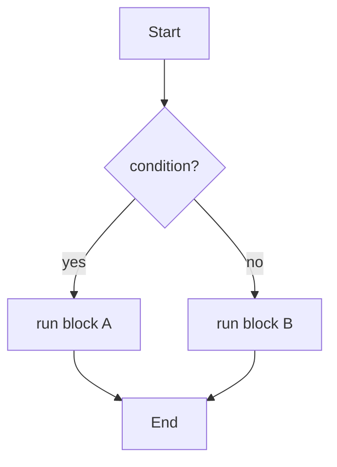
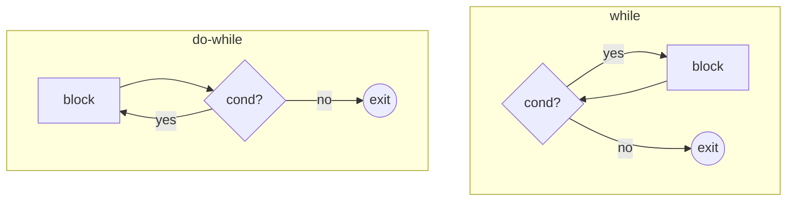

A program made only of straight-line statements is uninteresting. The
moment a program needs to *decide* or *repeat*, you reach for
**control flow**: the constructs that change which line runs next.

<svg
  viewBox="0 0 640 250"
  role="img"
  aria-label="A blue token slides down a thin line into a yellow decision diamond; one path curves left straight to the green exit while the other passes through a blue work block whose loop line sweeps back up to the diamond for another round"
  style={{ display: "block", width: "100%", maxWidth: "560px", height: "auto", margin: "2.5rem auto" }}
>
  <g fill="none" stroke="var(--ds-gray-300)" strokeWidth="2.5" strokeLinecap="round">
    <line x1="320" y1="42" x2="320" y2="68" />
    <path d="M 306 106 C 250 136 248 176 296 208" />
    <path d="M 334 106 C 380 124 398 132 404 140" />
    <path d="M 430 148 C 476 118 430 78 359 86" />
    <path d="M 396 166 C 380 192 360 202 348 207" />
  </g>
  <polygon points="357.7,80.5 348,88 359.9,91.3" fill="var(--ds-gray-400)" />
  <circle cx="320" cy="30" r="9" fill="var(--ds-blue-500)" />
  <rect x="302" y="74" width="36" height="36" rx="8" fill="var(--ds-yellow-500)" transform="rotate(45 320 92)" />
  <rect x="382" y="140" width="48" height="26" rx="9" fill="var(--ds-blue-500)" />
  <rect x="284" y="202" width="72" height="28" rx="14" fill="var(--ds-green-500)" />
</svg>

## `if` and `else`

`if` runs a block of code only when a condition is true. `else` runs
when the condition is false. `else if` chains additional conditions.

<CodeBlock
  adapter="java"
  files={[
    {
      filename: "main.java",
      starterCode: `public class Main {
  public static void main(String[] args) {
    int score = 72;

    if (score >= 90) {
      System.out.println("A");
    } else if (score >= 80) {
      System.out.println("B");
    } else if (score >= 70) {
      System.out.println("C");
    } else {
      System.out.println("F");
    }
  }
}
`,
    },
  ]}
/>

Conditions are expressions of type `boolean`. The comparison
operators that produce booleans are `==`, `!=`, `<`, `<=`, `>`,
`>=`. Combine booleans with `&&` (and), `||` (or), `!` (not).

> Remember: `==` on objects compares *references*, not contents. For
> strings, use `.equals(...)`. For primitives, `==` does the obvious
> thing.

## `switch`

When you want to branch on a *value*, `switch` is often clearer than
a long `if/else` chain.

<CodeBlock
  adapter="java"
  files={[
    {
      filename: "main.java",
      starterCode: `public class Main {
  public static void main(String[] args) {
    int day = 3;
    String name;

    switch (day) {
    case 1:
      name = "Monday";
      break;
    case 2:
      name = "Tuesday";
      break;
    case 3:
      name = "Wednesday";
      break;
    case 4:
      name = "Thursday";
      break;
    case 5:
      name = "Friday";
      break;
    case 6:
      name = "Saturday";
      break;
    case 7:
      name = "Sunday";
      break;
    default:
      name = "?";
    }

    System.out.println("Day " + day + " is " + name);
  }
}
`,
    },
  ]}
/>

A few things to remember about `switch`:

- Without `break`, execution **falls through** to the next case.
  That is occasionally useful and frequently a bug.
- Modern Java has a much nicer `switch` expression with `->` arrows
  and no fall-through. We use the classic form here because it is
  the one you will see most in existing code.

## `while` and `do-while`

`while` repeats a block *as long as* a condition is true. The
condition is checked **before** each pass.

<CodeBlock
  adapter="java"
  files={[
    {
      filename: "main.java",
      starterCode: `public class Main {
  public static void main(String[] args) {
    int n = 10;
    while (n > 0) {
      System.out.println(n);
      n = n - 1;
    }
    System.out.println("Lift off!");
  }
}
`,
    },
  ]}
/>

`do-while` is the same, except the condition is checked **after**
each pass — so the block always runs at least once.

## `for`

`for` is the workhorse of loops. It packages three things on one line:

1. **Initialization** — runs once at the start.
2. **Condition** — checked before each pass.
3. **Update** — runs at the end of each pass.

<CodeBlock
  adapter="java"
  files={[
    {
      filename: "main.java",
      starterCode: `public class Main {
  public static void main(String[] args) {
    for (int i = 1; i <= 5; i++) {
      System.out.println("i = " + i);
    }
  }
}
`,
    },
  ]}
/>

`i++` is shorthand for `i = i + 1`. Likewise `i--`, `i += 2`, `i *=
3`, etc.

## The enhanced `for` (for-each)

For going through *every element* of an array or collection, Java
has a cleaner form:

<CodeBlock
  adapter="java"
  files={[
    {
      filename: "main.java",
      starterCode: `public class Main {
  public static void main(String[] args) {
    int[] primes = {2, 3, 5, 7, 11, 13};
    int total = 0;

    for (int p : primes) {
      total += p;
      System.out.println("saw " + p);
    }

    System.out.println("total = " + total);
  }
}
`,
    },
  ]}
/>

Read `for (int p : primes)` as *"for each int p in primes."*

## `break` and `continue`

- `break` exits the innermost loop immediately.
- `continue` jumps to the next iteration of the innermost loop.

<CodeBlock
  adapter="java"
  files={[
    {
      filename: "main.java",
      starterCode: `public class Main {
  public static void main(String[] args) {
    for (int i = 1; i <= 10; i++) {
      if (i == 5)
        continue; // skip 5
      if (i == 8)
        break; // stop entirely at 8
      System.out.println(i);
    }
  }
}
`,
    },
  ]}
/>

Use these sparingly. Loops are easier to reason about when the
condition itself expresses why they end.

## A tracing exercise

Try to predict the output of this program *before* you run it. Then
run it and check.

<CodeBlock
  adapter="java"
  files={[
    {
      filename: "main.java",
      starterCode: `public class Main {
  public static void main(String[] args) {
    int sum = 0;
    for (int i = 1; i <= 5; i++) {
      for (int j = 1; j <= i; j++) {
        sum += j;
        System.out.println("i=" + i + " j=" + j + " sum=" + sum);
      }
    }
    System.out.println("final sum = " + sum);
  }
}
`,
    },
  ]}
/>

This is a *nested loop* — a loop inside a loop. Each value of the
outer `i` triggers a full inner sweep over `j`. Read it slowly. The
ability to mentally execute a nested loop is one of the major
beginner milestones.

<MultipleChoice
  markdown={`What's the difference between \`while\` and \`do-while\`?

- They are the same
  > They are not.
- \`while\` is faster than \`do-while\`
  > Speed is not the distinction.
- [o] \`while\` checks the condition before the first iteration; \`do-while\` checks after, so its body always runs at least once
  > The difference is purely *when* the condition is tested: before vs after the body.
- \`do-while\` cannot have a condition
  > It must have one — it's the trailing condition.`}
/>

<MultipleChoice
  markdown={`What does \`for (int x : arr)\` do?

- Loops the index from \`x\` to \`arr.length\`
  > That's a classic indexed \`for\`, not the enhanced form.
- Creates a new array \`x\` with the same contents as \`arr\`
  > It does not create an array.
- [o] Iterates over each element of \`arr\` in order, binding the current element to \`x\`
  > \`x\` is the *element*, not the index.
- Sorts the array
  > It does not sort.`}
/>

## A small challenge: FizzBuzz

FizzBuzz started life as a children's counting game, but it has a
strange second career in software. In 2007, developer Imran Ghory
wrote that a surprising share of candidates applying for programming
jobs — including some with degrees — could not solve it on a
whiteboard, and proposed it as a minimal screening question. Jeff
Atwood's follow-up post, "Why Can't Programmers.. Program?", turned
it into the most famous interview question in the industry. The task
itself is humble: print the numbers 1 through 15, but replace
multiples of 3 with `Fizz`, multiples of 5 with `Buzz`, and
multiples of both with `FizzBuzz`. Pass it, and you are already
ahead of those interview horror stories.

<ChallengeCard
  adapter="java"
  title="FizzBuzz"
  instructions={`Print the numbers from 1 to 15, one per line. But:

- If a number is divisible by both 3 and 5, print \`FizzBuzz\` instead.
- If divisible only by 3, print \`Fizz\`.
- If divisible only by 5, print \`Buzz\`.
- Otherwise, print the number itself.

The first lines of correct output are:

\`\`\`
1
2
Fizz
4
Buzz
Fizz
7
8
Fizz
Buzz
\`\`\``}
  entryFilename="Main.java"
  files={[
    {
      filename: "Main.java",
      starterCode: `public class Main {
  public static void main(String[] args) {
    // TODO: print FizzBuzz from 1 to 15
  }
}
`,
      solutionCode: `public class Main {
  public static void main(String[] args) {
    for (int i = 1; i <= 15; i++) {
      if (i % 15 == 0) {
        System.out.println("FizzBuzz");
      } else if (i % 3 == 0) {
        System.out.println("Fizz");
      } else if (i % 5 == 0) {
        System.out.println("Buzz");
      } else {
        System.out.println(i);
      }
    }
  }
}
`,
    },
  ]}
  tests={[
    {
      id: "fizzbuzz",
      name: "Prints correct FizzBuzz output",
      expect: {
        stdoutLines: [
          "1",
          "2",
          "Fizz",
          "4",
          "Buzz",
          "Fizz",
          "7",
          "8",
          "Fizz",
          "Buzz",
          "11",
          "Fizz",
          "13",
          "14",
          "FizzBuzz",
        ],
        stdoutLinesExact: true,
      },
    },
  ]}
/>

Loops and conditions are the *machinery*. Methods are the way we
package that machinery into reusable, named units. That is next.
