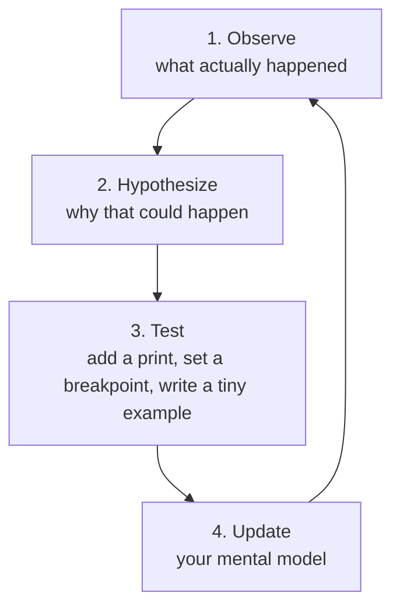
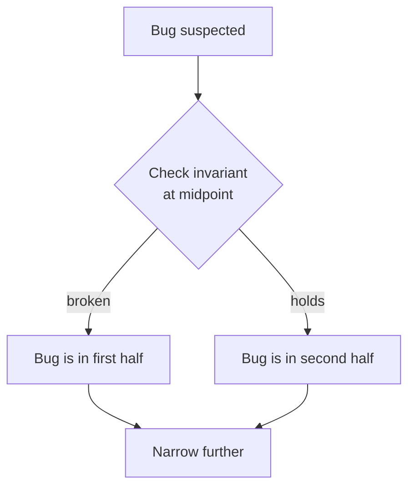

Every program you ever write will, at some point, do something you
didn't expect. **Debugging is not a special skill reserved for
experts**, it is one of the most ordinary parts of being a
programmer. What separates beginners from professionals is not how
*much* their code breaks, but how *quickly and confidently* they
diagnose what went wrong.

<Figure
  slug="java-debugging-cutout"
  alt="Debugging and reasoning, an isometric illustration"
/>

This page is about that confidence. It is the most important
non-syntax skill on the entire course.

## The right mindset

Before any technique, this:

> *When my program does something I didn't expect, it is not
> "broken", it is doing exactly what I told it to do. The bug is in
> my understanding of the code, not in the code itself.*

A computer does not have moods. It does not get tired. If your
function returned `-1` when you expected `7`, there is a *reason*,
a deterministic chain of cause and effect that you can, in
principle, trace.

Debugging is the disciplined process of finding that chain.

The word itself comes with a museum piece. On September 9, 1947,
operators of the Harvard Mark II computer, a team that included
computing pioneer Grace Hopper, traced a malfunction to an actual
moth crushed inside one of the machine's relays. They taped the
insect into the logbook with the note *"First actual case of bug
being found."* The joke only works because "bug" was already old
engineering slang, Thomas Edison was complaining about "bugs" in
his inventions in the 1870s, but the moth made it immortal, and the
logbook page, moth and all, now lives in the Smithsonian. Take
comfort in this: the very first computers shipped with bugs, and
the very first programmers spent their days hunting them. You are
not doing it wrong. This *is* the job.

## A four-step debugging loop

The loop is worth running early, because when a bug is found decides most
of what it costs:

<Chart slug="bug-cost-by-stage" />



This loop is so simple it sounds trivial. It is also the *only*
loop. Whenever you find yourself "guessing harder," step back to
step 1.

## Reading a stack trace

When an exception escapes, the JVM prints a **stack trace**,
the chain of method calls that was active at the moment of the
crash. Read it from **top to bottom**.

<CodeBlock
  adapter="java"
  files={[
    {
      filename: "main.java",
      starterCode: `public class Main {
  public static void main(String[] args) { printLength(null); }

  static void printLength(String s) {
    System.out.println("length is " + s.length());
  }
}
`,
    },
  ]}
/>

You'll see something like:

```
Exception in thread "main" java.lang.NullPointerException ...
    at Main.printLength(Main.java:7)
    at Main.main(Main.java:3)
```

Three precise pieces of information:

- **The exception type:** `NullPointerException`, a reference was
  null and we dereferenced it.
- **The top frame:** `Main.printLength(Main.java:7)`, the
  *actual* line that crashed.
- **The chain below:** how we got there, `main` called
  `printLength`.

Don't be intimidated. The top line *almost always* tells you the
file and line number to look at first.

## The most useful technique: print debugging

You can attach professional debuggers, set breakpoints, watch
variables, and you should learn how, eventually. But the single
most-used debugging technique in the world is **printing values**.

<CodeBlock
  adapter="java"
  files={[
    {
      filename: "main.java",
      starterCode: `public class Main {
  public static void main(String[] args) {
    int[] xs = {4, 9, 1, 7, 2};
    int max = findMax(xs);
    System.out.println("max = " + max);
  }

  static int findMax(int[] xs) {
    int max = xs[0];
    for (int i = 0; i < xs.length; i++) {
      System.out.println("DBG i=" + i + " xs[i]=" + xs[i] + " max=" + max);
      if (xs[i] > max) {
        max = xs[i];
      }
    }
    return max;
  }
}
`,
    },
  ]}
/>

The `DBG ...` lines let you *see the computation happen*. You stop
guessing what `max` was on iteration 3, you can read it. Almost
every bug in a small program gives itself up to two well-placed
prints.

Discipline tips:

- Tag debug prints with a prefix (`DBG`, `>>>`) so they are easy to
  grep for and easy to remove.
- Print *both the value and what it's supposed to mean*:
  `System.out.println("after sort: xs = " + Arrays.toString(xs));`
- Remove them before committing, or convert them into proper log
  statements.

## Rubber-duck debugging

A startling fraction of bugs reveal themselves the moment you try
to **explain the code to someone else**, line by line. Famously,
the "someone else" can be a small rubber duck on your desk. The
act of *describing what each line is supposed to do* forces you to
notice the line that *doesn't* do what you thought.

If you have no duck, write it out as a comment on paper. Same
effect.

## Invariants: the secret weapon

An **invariant** is something that is supposed to be true *at a
given point in the program*. Spotting bugs becomes much easier when
you make invariants explicit.

For example, in a sorted-insertion algorithm, you might write:

```java
// invariant: xs[0..i) is sorted
for (int i = 1; i < xs.length; i++) {
    // ...
}
```

Now when the program goes wrong, you can *check the invariant*. If
the invariant doesn't hold halfway through, you know the bug is
*above* that point. If it does hold but the answer is still wrong,
the bug is *below*. This is bisection thinking, and it is wildly
faster than poking at random.



A useful Java tool for invariants is **`assert`**, though in
production code many teams prefer simple `if (!cond) throw new
IllegalStateException(...)` checks because they are always on.

## The "five whys" of debugging

When you find what *caused* a bug, don't stop. Ask "why?" four
more times.

> The output is wrong because `total` was 0.
>
> *Why?* Because `total` was never updated.
>
> *Why?* Because the loop never ran.
>
> *Why?* Because the list was empty.
>
> *Why?* Because we filtered out everything in `loadData()`.
>
> *Why?* Because the filter condition was inverted.

The deepest "why" is often the real fix. Fixing only the symptom
("just set `total = -1` when empty") leaves the underlying bug in
place to come back later.

## A debugging walkthrough

The code below is supposed to compute the sum of all *even*
numbers in a list. It is wrong. Read it, then read the prints to
see what really happens.

<Figure
  slug="java-debugging-and-reasoning-inline-cutout"
  alt="A figure at a bench talking through a stalled machine to a small rubber duck standing on the bench beside it"
/>

<CodeBlock
  adapter="java"
  files={[
    {
      filename: "main.java",
      starterCode: `import java.util.List;
import java.util.Arrays;

public class Main {
  public static void main(String[] args) {
    List<Integer> data = Arrays.asList(1, 2, 3, 4, 5, 6);
    int s = sumEvens(data);
    System.out.println("sum = " + s);
  }

  static int sumEvens(List<Integer> xs) {
    int total = 0;
    for (int x : xs) {
      System.out.println("DBG x=" + x + " x%2=" + (x % 2));
      if (x % 2 == 1) { // ← BUG: this is odd, not even
        total += x;
      }
    }
    return total;
  }
}
`,
    },
  ]}
/>

The `DBG` output shows clearly that we are summing `1, 3, 5`, not
`2, 4, 6`. Once you *see* the wrong values flowing past, the fix
(`== 0` instead of `== 1`) is obvious.

This is the entire job: make the program show you what it is
*really doing*, then compare to what it is *supposed to do*. The
difference is the bug.

<MultipleChoice
  markdown={`When you read a Java stack trace, which line is generally the most useful place to start?

- The bottom-most line
  > That's usually \`main\`, too far up.
- The line that mentions \`Thread.run\`
  > That's framework plumbing, not your code.
- [o] The top-most line, it points to the actual statement that threw the exception
  > A stack trace reads top-to-bottom, so the top frame is where the error actually occurred.
- A middle line, picked at random
  > Not useful.`}
/>

<MultipleChoice
  markdown={`What is the **central** premise behind invariants as a debugging tool?

- The compiler verifies them automatically
  > It does not.
- Invariants prevent all bugs by themselves
  > They help find bugs; they do not prevent them.
- [o] By stating "X must be true at this point," you can bisect a long computation into parts that obey the invariant and parts that violate it, narrowing the bug
  > Checking an invariant tells you which side of a point the bug lives on, halving the search.
- Invariants make code faster
  > That's not the point.`}
/>

<MultipleChoice
  markdown={`Why is "rubber-duck debugging" effective even when the duck has no answers?

- [o] Explaining the code line by line forces the programmer to articulate *what each step is supposed to do*, which often surfaces the line that doesn't match the explanation
  > Saying each step aloud exposes the gap between what you intended and what the code says.
- The duck has special insight
  > It does not.
- It causes the compiler to recheck the code
  > It does not.
- It slows the programmer down enough for a coffee break
  > Funny but not the reason.`}
/>

Debugging is the daily craft of programming. The next page lifts
the lens further: how do you *write* code so that it is easier to
debug, change, and live with for years? That is the discipline of
**writing maintainable software.**
