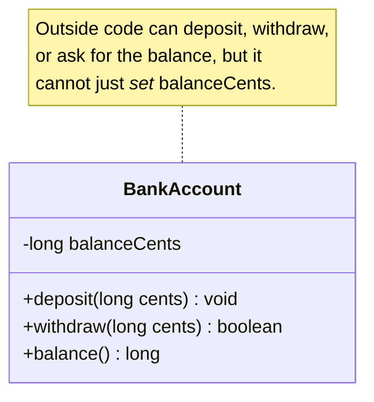

We have been writing private fields and public methods without
fully explaining why. Now we explain. The two ideas at work are
**encapsulation** and **abstraction**, and they are the reason OOP
exists at all.

<Figure
  slug="java-encapsulation-cutout"
  alt="Encapsulation and abstraction, an isometric illustration"
/>

## Encapsulation: each object owns its data

**Encapsulation** is the rule that *only an object's own methods may
touch its own data*. Outside code asks the object to do things; it
does not reach in and edit fields.

Mechanically, Java enforces this with **access modifiers**:

| Modifier | Visible to |
| --- | --- |
| `private` | Only code inside the same class |
| (package-private, no modifier) | Code in the same package |
| `protected` | Same package, plus subclasses |
| `public` | Everyone |

The single most important habit you can build right now: **make
fields `private` by default**, and only expose what callers need
through methods.



## Why does this matter?

Imagine `balanceCents` were `public`. Anywhere in your codebase,
someone could write `account.balanceCents = -1_000_000;`, and the
account class would have no way to enforce the rule "a balance
cannot be negative."

With `balanceCents` private and only `deposit` and `withdraw`
exposed, the *class* owns the rules. The class can refuse a
withdrawal that would overdraw the account. The class can log every
change. The class is the *single place* where decisions about its
own data live. If the balance is wrong, you know exactly where to
look.

This is the technical foundation that made it possible to write
million-line software systems without going insane.

## A worked example

<CodeBlock
  adapter="java"
  entryFilename="Main.java"
  files={[
    {
      filename: "Main.java",
      starterCode: `public class Main {
  public static void main(String[] args) {
    BankAccount a = new BankAccount("Ada");
    a.deposit(500);
    boolean ok1 = a.withdraw(200);
    boolean ok2 = a.withdraw(9999);
    System.out.println("owner=" + a.owner());
    System.out.println("ok1=" + ok1);
    System.out.println("ok2=" + ok2);
    System.out.println("balance=" + a.balance());
  }
}
`,
    },
    {
      filename: "BankAccount.java",
      starterCode: `public class BankAccount {
  private final String owner;
  private long balanceCents = 0;

  public BankAccount(String owner) { this.owner = owner; }

  public String owner() { return owner; }

  public long balance() { return balanceCents; }

  public void deposit(long cents) {
    if (cents <= 0) {
      throw new IllegalArgumentException("must be positive");
    }
    balanceCents += cents;
  }

  public boolean withdraw(long cents) {
    if (cents <= 0) {
      throw new IllegalArgumentException("must be positive");
    }
    if (cents > balanceCents)
      return false;
    balanceCents -= cents;
    return true;
  }
}
`,
    },
  ]}
/>

Notice how much *logic* lives inside `BankAccount` itself. The class
refuses negative or zero amounts. It refuses overdraws. Callers
*cannot* bypass these rules because they cannot touch
`balanceCents` directly.

If next month we add a "fees" feature, *all* the logic lives in
`BankAccount`. The rest of the program stays the same.

## Abstraction: callers see the *what*, not the *how*

**Abstraction** is the design idea behind encapsulation: callers
care about *what* an object does for them, not *how* it does it.

The `BankAccount` class is, from the outside, just:

- "I have an owner."
- "I have a balance."
- "You can deposit money into me."
- "You can ask to withdraw, I'll say yes or no."

That is the **abstraction**. The fact that the balance is stored as
`balanceCents` (rather than as `balanceDollars` or as a `BigDecimal`)
is the **implementation**. We can change the implementation without
breaking any caller, as long as the abstraction stays the same.

The abstraction hides the implementation:

| Abstraction (what the world sees) | Implementation (how it really works) |
| --- | --- |
| `owner`, `balance`, `deposit`, `withdraw` | `balanceCents: long` |
| | validation rules |
| | possibly a transaction log, etc. |

A class is *well designed* to the extent that its abstraction is
small, clean, and stable while its implementation can change freely.

## Common mistakes beginners make

### 1. Public fields "to save time"

```java
public class Person {
    public String name;
    public int    age;
}
```

This skips encapsulation entirely. It is a `struct` masquerading as
a class. There is no way for `Person` to enforce rules about its own
state. Whenever you see this, ask: who is allowed to set `age = -5`?

### 2. Getters and setters for every field

The opposite extreme is *almost* as bad. If you write
`getX`/`setX` for every private field, you have exposed the
implementation through a thin disguise. Outside code can still set
the field to nonsense, just through a method.

```java
// Don't blindly do this:
public void setAge(int age) { this.age = age; }
```

A good rule: *do not* add a setter unless your design genuinely
requires the field to change after construction. If it does, the
setter should enforce the rules. ("`setAge` must be > 0.")

### 3. Methods that expose internal collections

```java
public List<Item> getItems() {
    return items;     // returns the internal list, outside code can mutate it!
}
```

Callers can now do `account.getItems().clear()` and silently break
the class's invariants. Common fixes: return a *defensive copy*, or
return an unmodifiable view, or expose specific operations like
`add`, `remove`, `count` instead.

<MultipleChoice
  markdown={`What is the *single* most important reason to make fields \`private\`?

- It makes the class faster
  > Access modifiers do not change speed in any meaningful way.
- [o] So the class itself is the only place that decides how its own data may change, allowing it to enforce its invariants
  > Encapsulation gives the class ownership of its own rules.
- Because the Java compiler refuses to compile public fields
  > It compiles them fine, encapsulation is a design choice, not a language requirement.
- It uses less memory
  > Access modifiers do not change memory usage.`}
/>

<MultipleChoice
  markdown={`Which is the *best* sign that a class is well-encapsulated?

- It uses the keyword \`final\` somewhere
  > \`final\` helps but is not the central criterion.
- It has a public field for every state value
  > That's the opposite of encapsulation.
- It has a getter and setter for every field
  > That is often a sign of *bad* encapsulation, the API mirrors the storage.
- [o] Its public methods are named for behaviors that callers actually need, and its fields are private
  > The API talks about *behavior*, not storage.`}
/>

## A small challenge

<ChallengeCard
  adapter="java"
  title="Encapsulate a Thermostat"
  instructions={`Build a class \`Thermostat\` that:

- Has a private \`int\` field \`targetC\` for the target temperature in Celsius.
- Has a constructor \`Thermostat(int initialTarget)\`.
- Has a method \`int target()\` that returns the current target.
- Has a method \`void setTarget(int newTarget)\` that updates the target only if it is between 5 and 35 inclusive; otherwise the method does nothing and the target stays the same.

\`Main.java\` is given and must print exactly:

\`\`\`
target=20
after legal change: 24
after illegal change: 24
\`\`\``}
  entryFilename="Main.java"
  files={[
    {
      filename: "Main.java",
      starterCode: `public class Main {
  public static void main(String[] args) {
    Thermostat t = new Thermostat(20);
    System.out.println("target=" + t.target());

    t.setTarget(24);
    System.out.println("after legal change: " + t.target());

    t.setTarget(100);
    System.out.println("after illegal change: " + t.target());
  }
}
`,
    },
    {
      filename: "Thermostat.java",
      starterCode: `public class Thermostat {
  // TODO: implement
}
`,
      solutionCode: `public class Thermostat {
  private int targetC;

  public Thermostat(int initialTarget) { this.targetC = clamp(initialTarget); }

  public int target() { return targetC; }

  public void setTarget(int newTarget) {
    if (newTarget >= 5 && newTarget <= 35) {
      this.targetC = newTarget;
    }
  }

  private int clamp(int v) {
    if (v < 5)
      return 5;
    if (v > 35)
      return 35;
    return v;
  }
}
`,
    },
  ]}
  tests={[
    {
      id: "thermo",
      name: "Encapsulates target with bounds",
      expect: {
        stdoutLines: [
          "target=20",
          "after legal change: 24",
          "after illegal change: 24",
        ],
        stdoutLinesExact: true,
      },
    },
  ]}
/>

Notice how `setTarget` *silently refuses* a bad value. The
abstraction is "this thermostat is always sensible." Implementation
details, bounds checks, clamping, perhaps logging, stay inside.

Next we look at **constructors** in more depth: how an object comes
to exist, and the entire lifecycle from birth to garbage collection.
