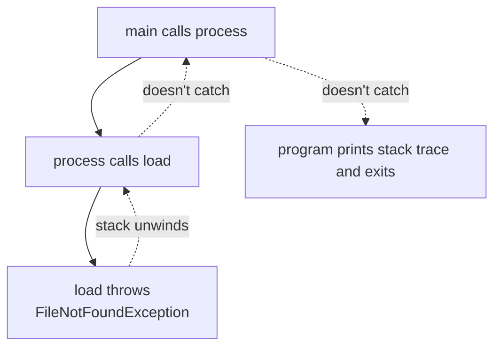
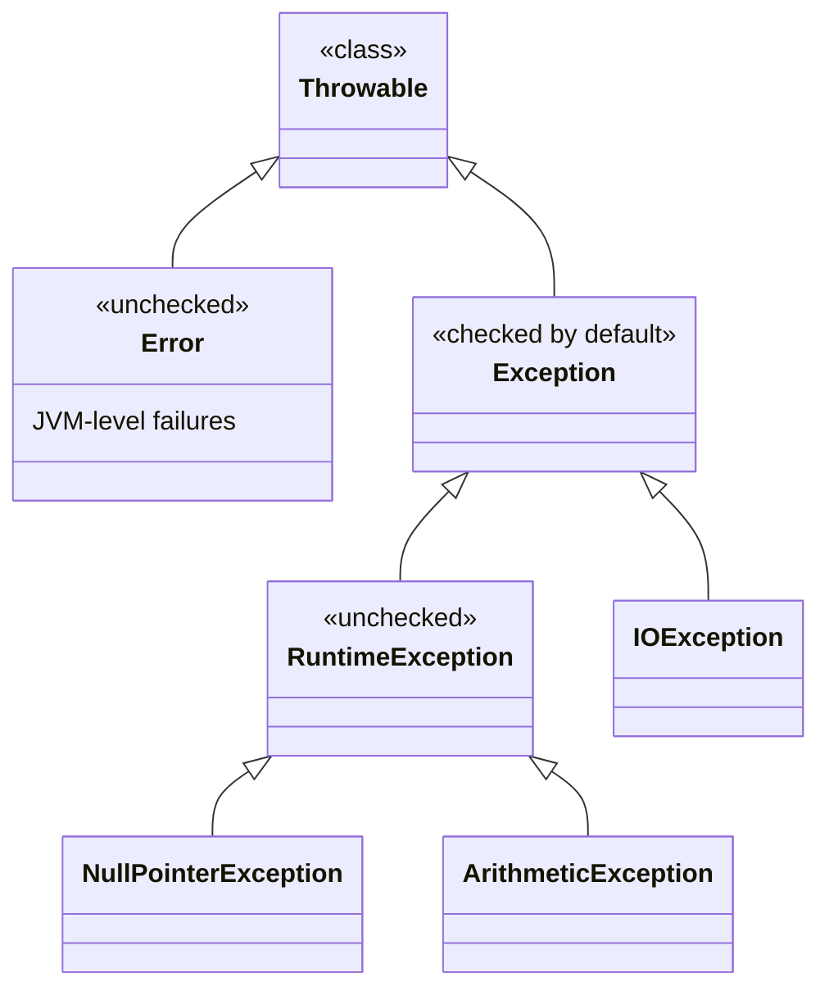

Things go wrong. Files are missing. Network calls time out. Users
type the wrong thing. Code passes the wrong argument. A robust
program does not pretend otherwise, it has a clear, designed
answer to *every* category of failure. In Java, that answer is
**exceptions**.

<Figure
  slug="java-exception-handling-cutout"
  alt="Exception handling, an isometric illustration"
/>

## What is an exception?

An exception is an object that represents "something went wrong
right here." When code encounters a problem it cannot handle
locally, it **throws** an exception. The JVM walks back up the
call stack looking for a method that **catches** that kind of
exception. If no one does, the program crashes with a stack trace.



## A first example

<CodeBlock
  adapter="java"
  files={[
    {
      filename: "main.java",
      starterCode: `public class Main {
  public static void main(String[] args) {
    int[] xs = {10, 20, 30};

    try {
      System.out.println(xs[5]); // out of bounds!
      System.out.println("this never runs");
    } catch (ArrayIndexOutOfBoundsException e) {
      System.out.println("caught: " + e.getMessage());
    } finally {
      System.out.println("always runs");
    }

    System.out.println("program continues normally");
  }
}
`,
    },
  ]}
/>

Three keywords:

- **`try`**, wraps code that might fail.
- **`catch`**, handles a specific type of exception.
- **`finally`**, *always* runs whether or not an exception was
  thrown. Used for cleanup (closing files, releasing locks).

## The exception family tree



Three branches matter:

- **`Error`**, extremely serious, you generally do *not* catch these
  (e.g., `OutOfMemoryError`, `StackOverflowError`).
- **`Exception`** (other than RuntimeException), **checked**. The
  compiler forces you to either catch them or declare them with
  `throws`.
- **`RuntimeException`**, **unchecked**. The compiler does *not*
  force you to handle them.

## Checked vs unchecked, intuitively

**Checked** exceptions represent "expected problems with the
outside world", files missing, networks failing, parsing user
input. Java forces you to acknowledge them.

**Unchecked** exceptions represent "your program has a bug", null
pointers, out-of-bounds indices, divisions by zero, illegal
arguments. The compiler can't *help* you with these (every line
could have a bug), so it leaves the choice up to you.

A practical rule:

- *Throw* an unchecked exception (often `IllegalArgumentException`
  or `IllegalStateException`) when *the caller broke a contract*.
- *Throw* a checked exception when the failure is normal-but-rare
  and the caller realistically has to handle it.

Worth knowing: checked exceptions are one of Java's most contested
design decisions, and Java remains nearly alone in having them.
When Anders Hejlsberg designed C#, he deliberately left them out,
arguing in a widely-read 2003 interview that in large systems they
breed exactly the reflexive, do-nothing `catch` blocks this page
warns about, developers appeasing the compiler rather than handling
failures. Kotlin, which runs on the JVM beside Java, dropped them
too. You will form your own opinion with experience; for now, treat
a checked exception as the compiler asking a fair question, "what
is your plan when this fails?", and answer it honestly rather than
silencing it.

## Declaring with `throws`

If a method can throw a *checked* exception that it does not
catch, the method must declare it:

<CodeBlock
  adapter="java"
  files={[
    {
      filename: "main.java",
      starterCode: `public class Main {
  public static void main(String[] args) {
    try {
      int age = parseAge("not a number");
      System.out.println(age);
    } catch (BadInputException e) {
      System.out.println("rejected: " + e.getMessage());
    }
  }

  static int parseAge(String s) throws BadInputException {
    try {
      int n = Integer.parseInt(s);
      if (n < 0)
        throw new BadInputException("age cannot be negative");
      return n;
    } catch (NumberFormatException e) {
      // wrap a lower-level exception in our own
      throw new BadInputException("not a number: " + s);
    }
  }
}

class BadInputException extends Exception {
  public BadInputException(String message) { super(message); }
}
`,
    },
  ]}
/>

Notice the **wrapping** technique: we catch the JDK's
`NumberFormatException` and rethrow our own, more domain-specific
`BadInputException`. Wrapping helps you avoid leaking internal
details up to callers.

## try-with-resources

Many resources (files, sockets, database connections) must be
**closed** when you're done with them. The pattern used to look
like this:

```java
Resource r = open();
try {
    use(r);
} finally {
    r.close();
}
```

That works, but the `try-with-resources` form is shorter and
safer:

```java
try (Resource r = open()) {
    use(r);
}        // r.close() is called automatically
```

Any class that implements `AutoCloseable` (which all standard
file/network/DB classes do) is eligible. We are not using real
files in this online runner, but the pattern is identical wherever
you encounter resources.

## Anti-patterns to avoid

### Swallowing exceptions

```java
try {
    risky();
} catch (Exception e) {
    // ignore
}
```

You have just made a bug **invisible**. When something goes wrong,
*nothing* tells you. The program limps along producing wrong
answers. *Never* write an empty catch block. At minimum log the
exception.

### Catching `Exception` (or `Throwable`)

A broad catch hides bugs you didn't even know about, like a
`NullPointerException` from a typo. Catch the **narrowest** type
that meaningfully handles the problem.

### Using exceptions for control flow

```java
try {
    while (true) processNext();
} catch (NoSuchElementException end) {
    // loop exit
}
```

Exceptions are *expensive* and obscure the intent. If something is
a normal end of input, use a `boolean hasNext()` instead.

## A worked example

<CodeBlock
  adapter="java"
  entryFilename="Main.java"
  files={[
    {
      filename: "Main.java",
      starterCode: `public class Main {
  public static void main(String[] args) {
    printSafe("42");
    printSafe("oops");
    printSafe(null);
    System.out.println("done");
  }

  static void printSafe(String s) {
    try {
      int n = SafeParser.parse(s);
      System.out.println("parsed " + n);
    } catch (IllegalArgumentException e) {
      System.out.println("bad input: " + e.getMessage());
    }
  }
}
`,
    },
    {
      filename: "SafeParser.java",
      starterCode: `public class SafeParser {
  public static int parse(String s) {
    if (s == null) {
      throw new IllegalArgumentException("input was null");
    }
    try {
      return Integer.parseInt(s);
    } catch (NumberFormatException e) {
      throw new IllegalArgumentException("not a number: " + s);
    }
  }
}
`,
    },
  ]}
/>

Expected output:

```
parsed 42
bad input: not a number: oops
bad input: input was null
done
```

The program survives all three cases, including the null, because
each problem is *recognized*, *named*, and *handled*.

<MultipleChoice
  markdown={`What is the difference between a *checked* and an *unchecked* exception?

- Checked exceptions are slower
  > Not the difference.
- Unchecked exceptions cannot be caught
  > They can be caught, the compiler just doesn't *require* it.
- [o] Checked exceptions must be either caught or declared in a \`throws\` clause; unchecked exceptions (RuntimeException and its subclasses) have no such requirement
  > The compiler enforces handling for checked exceptions only; unchecked ones are left to the programmer.
- Unchecked exceptions are always fatal
  > They can be caught and recovered from.`}
/>

<MultipleChoice
  markdown={`Why is an empty \`catch (Exception e) { }\` block a problem?

- It is slow
  > Not the main issue.
- The compiler refuses to compile it
  > It compiles fine.
- [o] It silently swallows every failure, hiding bugs and making the program produce wrong answers without telling anyone
  > An empty catch discards the error, so failures pass unnoticed and corrupt later results.
- It always throws \`NullPointerException\`
  > It does nothing of the sort.`}
/>

<MultipleChoice
  markdown={`When is the \`finally\` block executed?

- Only when no exception was thrown
  > It runs even when one was thrown.
- Only when an exception was thrown
  > It runs in both cases.
- [o] Always, after the try (and any catch) finishes, whether or not an exception was thrown
  > \`finally\` runs on every path out of the try, which is why it is used for cleanup.
- Only when the JVM is shutting down
  > It runs at the end of every \`try\` block.`}
/>

## A challenge

<ChallengeCard
  adapter="java"
  title="Safe division"
  instructions={`Implement \`SafeMath.divide(int a, int b)\` that returns \`a / b\`, but throws \`IllegalArgumentException\` with message \`"cannot divide by zero"\` when \`b\` is zero.

\`Main.java\` is provided. Expected output (exact):

\`\`\`
10/2 = 5
10/0 -> cannot divide by zero
done
\`\`\``}
  entryFilename="Main.java"
  files={[
    {
      filename: "Main.java",
      starterCode: `public class Main {
  public static void main(String[] args) {
    System.out.println("10/2 = " + SafeMath.divide(10, 2));
    try {
      int r = SafeMath.divide(10, 0);
      System.out.println("10/0 = " + r);
    } catch (IllegalArgumentException e) {
      System.out.println("10/0 -> " + e.getMessage());
    }
    System.out.println("done");
  }
}
`,
    },
    {
      filename: "SafeMath.java",
      starterCode: `public class SafeMath {
  public static int divide(int a, int b) {
    // TODO
    return 0;
  }
}
`,
      solutionCode: `public class SafeMath {
  public static int divide(int a, int b) {
    if (b == 0) {
      throw new IllegalArgumentException("cannot divide by zero");
    }
    return a / b;
  }
}
`,
    },
  ]}
  tests={[
    {
      id: "safe-div",
      name: "Throws on zero",
      expect: {
        stdoutLines: [
          "10/2 = 5",
          "10/0 -> cannot divide by zero",
          "done",
        ],
        stdoutLinesExact: true,
      },
    },
  ]}
/>

Exceptions are how Java programs draw a clean line between "the
happy path" and "every way things can go wrong." With them in
hand, we can finally talk about the broader engineering practice
of **debugging**.
