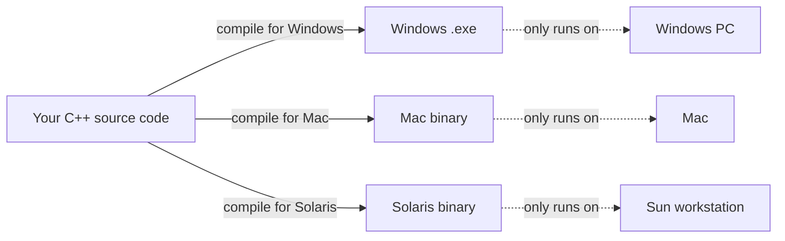
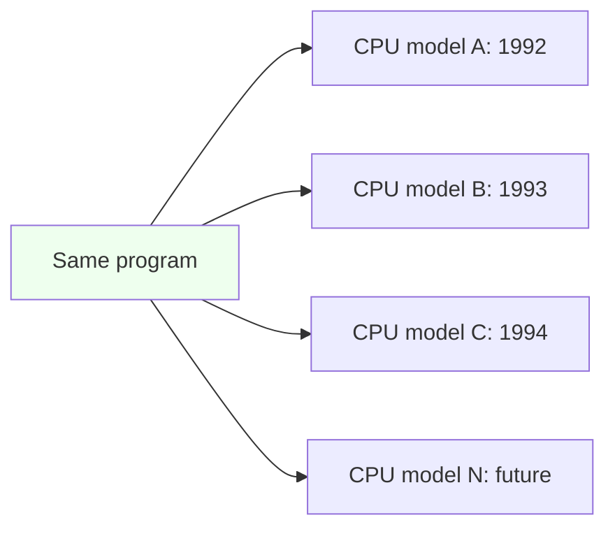
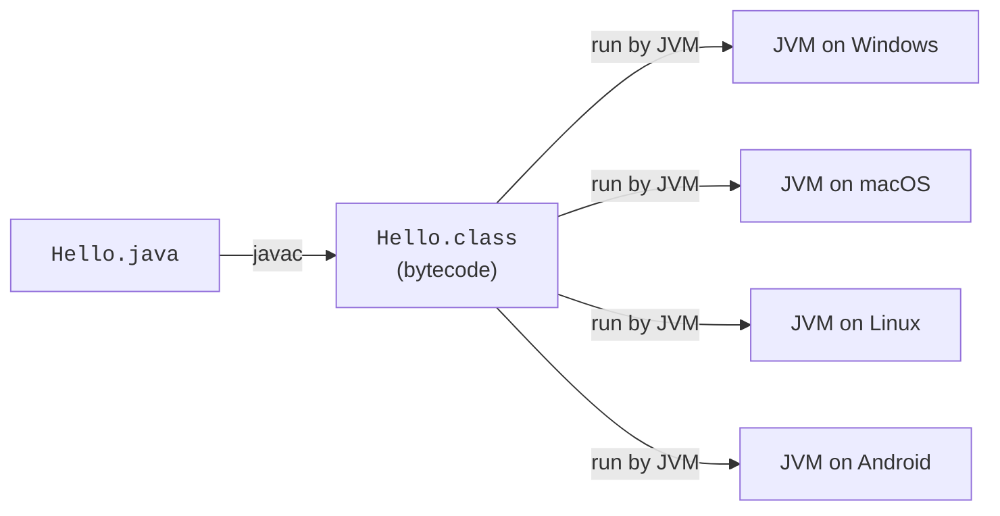

<IllustrationPrompt subject="Bjarne Stroustrup" photo />

By the late 1980s, the object-oriented ideas from the last page had
finally reached industry, mostly through **C++**, created by
**Bjarne Stroustrup** at Bell Labs, which grafted classes onto the
wildly popular C language. C++ was fast, it ran everywhere C ran,
and for a while it looked like the future of all serious software.

But two cracks kept widening as programs grew.

**Portability was a fantasy.** In theory you could compile the same
C++ source for Windows, Mac, and Unix. In practice every platform
had different libraries, different conventions, different sizes for
built-in types, different ways to draw pixels and talk to the
network. A serious cross-platform C++ product was really several
near-identical codebases in a trench coat, the same bug fixed five
times, in five slightly different ways, for five platforms.

**Memory was managed by hand.** In C++ the programmer was personally
responsible for every byte: requesting it with `new`, returning it
with `delete`, never forgetting, never returning it twice, never
touching it after returning it. A careful programmer can manage that
in a small program. In a five-million-line system written by a
hundred people over ten years, a single forgotten `delete` could
ruin everyone's week, and regularly did.

Hold those two pains in mind. Now for the toasters.

## The Green Project

<IllustrationPrompt subject="James Gosling" photo />

In 1991, a small team inside **Sun Microsystems** set up a secret
project, code-named **Green**. The goal had nothing to do with
enterprise software or the web, the web barely existed. The goal
was software for **consumer electronics**: TVs, set-top boxes, the
"interactive devices" that everyone in Silicon Valley believed were
about to take over the living room. The team was led by a Canadian
computer scientist named **James Gosling**.

<svg
  viewBox="0 0 640 200"
  role="img"
  aria-label="Three very different abstract housings, a wide blue box, a tall yellow capsule, and a blue hexagon, all carry the same small green chip, joined by one thin green thread: one language written for every kind of device"
  style={{ display: "block", width: "100%", maxWidth: "640px", height: "auto", margin: "2.5rem auto" }}
>
  <polyline points="170,110 330,96 490,120" fill="none" stroke="var(--ds-green-500)" strokeWidth="2" strokeOpacity="0.45" />
  <rect x="100" y="60" width="140" height="100" rx="16" fill="var(--ds-blue-500)" fillOpacity="0.12" />
  <rect x="290" y="36" width="80" height="128" rx="38" fill="var(--ds-yellow-500)" fillOpacity="0.15" />
  <polygon points="490,55 538,82 538,138 490,165 442,138 442,82" fill="var(--ds-blue-500)" fillOpacity="0.2" />
  <g style={{ color: "var(--ds-green-500)" }} fill="currentColor">
    <rect x="160" y="100" width="20" height="20" rx="4" />
    <rect x="320" y="86" width="20" height="20" rx="4" />
    <rect x="480" y="110" width="20" height="20" rx="4" />
  </g>
  <g style={{ color: "var(--ds-white)" }} fill="currentColor" fillOpacity="0.9">
    <circle cx="170" cy="110" r="2.5" />
    <circle cx="330" cy="96" r="2.5" />
    <circle cx="490" cy="120" r="2.5" />
  </g>
</svg>

Consumer electronics had a peculiar property: every device used a
different microchip, and manufacturers swapped chips whenever a
cheaper one appeared. Software written in C++ for this year's TV
chip had to be recompiled, retested, and often partly rewritten for
next year's. For a company hoping to ship millions of devices, that
was unacceptable. Gosling's team needed programs that would
**outlive the chip** they were written for, and that were small,
reliable, and safe enough to run unattended in someone's living
room. (You cannot ship a debugger to a toaster.)

The team genuinely tried C++ first. Gosling has told the story in
interviews: he kept patching C++ to make it more portable and more
memory-safe, and eventually realized he had been *building a new
language by accident*. So he embraced the inevitable and built one
from scratch. He called it **Oak**, after a tree outside his office
window. When the lawyers discovered "Oak" was already trademarked,
the team brainstormed a new name, and, the story goes, settled on
**Java**, with all its coffee associations, somewhere between the
whiteboard and the espresso machine.

## What Gosling kept, what he removed

Gosling knew C and C++ deeply, and Java's design reads as a direct
reaction to them. He kept the *surface*, the curly braces, the
semicolons, the familiar C-family look, so that millions of
existing programmers would feel at home. Then he ripped out every
feature that, in his experience, caused catastrophic production
bugs.

| Idea | C++ | Java |
| --- | --- | --- |
| Manual memory management | Yes, `new`/`delete` | **No**, automatic garbage collection |
| Pointer arithmetic | Yes | **Removed**, too dangerous |
| Multiple inheritance | Yes | **Removed**, replaced by interfaces |
| Operator overloading | Yes | **Removed**, too easy to abuse |
| Compiled to machine code? | Yes | **No**, compiled to *bytecode* |
| Same program runs everywhere? | Theoretically | **Yes**, by design |
| Classes | Optional (you can write C-style) | **Mandatory**, every method lives in a class |

This conservatism is why Java looks "boring" to fans of exotic
languages. It is also exactly why Java still runs banks, airlines,
and stock exchanges thirty years later: everything that remained was
boring *on purpose*.

<MultipleChoice
  markdown={`What was Java originally designed for?

- Building web pages
  > Web use came later, by happy accident.
- Scientific computing
  > That was FORTRAN's strength.
- [o] Programming consumer electronics devices like TVs and set-top boxes
  > The Green project's original target was embedded devices.
- Database servers
  > Java would later dominate this space, but it was not the original target.`}
/>

## The big idea: write once, run anywhere

The most radical decision is the one that solved the chip-churn
problem, and, as a side effect, the entire industry's
cross-platform pain.

A C++ compiler produces **machine code**: instructions for one
specific CPU on one specific operating system. Java's compiler,
`javac`, produces something else: **bytecode**, instructions for a
*fictional* CPU, stored in `.class` files. To run the program, each
real machine runs a small program called the **Java Virtual
Machine** (JVM), which reads the bytecode and executes it.

<svg
  viewBox="0 0 640 230"
  role="img"
  aria-label="A blue source card compiles through a thin gray arrow into one solid blue bytecode capsule, which fans along thin lines into three differently shaped machines, and sits inside each one unchanged: write once, run anywhere"
  style={{ display: "block", width: "100%", maxWidth: "640px", height: "auto", margin: "2.5rem auto" }}
>
  <g stroke="var(--ds-gray-300)" strokeWidth="2">
    <line x1="328" y1="115" x2="440" y2="52" />
    <line x1="328" y1="115" x2="440" y2="115" />
    <line x1="328" y1="115" x2="440" y2="178" />
  </g>
  <g style={{ color: "var(--ds-blue-500)" }} fill="currentColor">
    <rect x="60" y="70" width="110" height="90" rx="12" fillOpacity="0.12" />
    <rect x="76" y="92" width="70" height="7" rx="3.5" fillOpacity="0.5" />
    <rect x="76" y="108" width="54" height="7" rx="3.5" fillOpacity="0.5" />
    <rect x="76" y="124" width="78" height="7" rx="3.5" fillOpacity="0.5" />
  </g>
  <g fill="var(--ds-gray-400)">
    <rect x="186" y="113.5" width="40" height="3" rx="1.5" />
    <polygon points="224,109.5 235,115 224,120.5" />
  </g>
  <rect x="252" y="101" width="76" height="28" rx="14" fill="var(--ds-blue-500)" />
  <g style={{ color: "var(--ds-white)" }} fill="currentColor" fillOpacity="0.85">
    <rect x="270" y="111.5" width="18" height="7" rx="3.5" />
    <rect x="294" y="111.5" width="14" height="7" rx="3.5" />
  </g>
  <rect x="440" y="26" width="140" height="52" rx="12" fill="var(--ds-green-500)" fillOpacity="0.15" />
  <rect x="482" y="41" width="56" height="22" rx="11" fill="var(--ds-blue-500)" />
  <rect x="440" y="92" width="140" height="48" rx="24" fill="var(--ds-yellow-500)" fillOpacity="0.18" />
  <rect x="482" y="105" width="56" height="22" rx="11" fill="var(--ds-blue-500)" />
  <polygon points="440,182 460,156 560,156 580,182 560,208 460,208" fill="var(--ds-blue-500)" fillOpacity="0.12" />
  <rect x="482" y="171" width="56" height="22" rx="11" fill="var(--ds-blue-500)" />
</svg>

Same `Hello.class`, every platform. All the machine-specific magic
lives inside the JVM, and providing a JVM for every platform that
matters is Sun's problem (now Oracle's), not yours. Sun compressed
the whole ambition into a slogan: **write once, run anywhere**.
Programmers who lived through the rough early years joked it was
really "write once, debug everywhere," but the joke conceded the
point: for the first time, a mainstream language genuinely let you
compile your program once and run the same artifact on radically
different machines.

The JVM does far more than execute bytecode, it manages memory for
you (the **garbage collector** that replaced `delete`), verifies
code before running it, and quietly recompiles your hottest code to
native speed while the program runs. Those ideas each get proper
attention in the *How Programs Execute* chapter later in the course.

## See it run

Enough claims, let's test one. The block below is a complete Java
program. When you run it, your browser compiles the source with
`javac` and executes the resulting bytecode on a real JVM. The
program asks the JVM what platform it *thinks* it is running on.

<CodeBlock
  adapter="java"
  files={[
    {
      filename: "main.java",
      starterCode: `public class Main {
  public static void main(String[] args) {
    System.out.println("Hello from the JVM!");
    System.out.println("Java version: " + System.getProperty("java.version"));
    System.out.println("OS reported by JVM: " + System.getProperty("os.name"));
  }
}
`,
    },
  ]}
/>

Look at the `os.name` line. The JVM honestly reports the platform it
is hosted on, but notice that *your code never had to know*. The
exact same `.class` file produced here would run, unchanged, on a
Linux server in a data center or a point-of-sale terminal in a
supermarket. That is the toaster problem, solved, for every
computer on Earth.

<MultipleChoice
  markdown={`Why is the same Java \`.class\` file able to run on Windows, Mac, and Linux?

- Because the \`.class\` file contains separate code for each platform
  > It contains a single set of bytecode instructions.
- [o] Because each platform has its own JVM that knows how to execute bytecode
  > The platform-specific work is done by the JVM, not by your program.
- Because operating systems can directly execute bytecode
  > They cannot, bytecode is not native machine code.
- Because Java is interpreted in the browser
  > The browser here happens to host a JVM, but any JVM anywhere runs the same file.`}
/>

## The accident that made it famous

Here is the punchline of the whole story: the smart-TV revolution
the Green team was betting on *did not happen*, not for another
twenty years. By 1994 the project was searching for a reason to
exist. And then the team noticed something. A brand-new kind of
program was emerging on the young **World Wide Web**: code that
could be downloaded from a server and run on *any* user's machine,
whatever hardware they happened to own. Nobody could know in advance
what kind of computer would receive it. Sound familiar?

The exact properties Java had grown for toasters, compact,
portable, sandboxed, safe to run on a stranger's device, were
precisely what the web needed. In 1995 Sun released Java publicly,
along with a browser called HotJava that could run small Java
programs ("applets") embedded in web pages. Netscape, the dominant
browser of the era, licensed Java within months. For the first time
in history, clicking a link could deliver a running *program*, not
just a page. People had never seen anything like it.

Applets themselves would eventually fade away, but they put Java on
every desk in the industry at the exact moment the industry was
desperate for a portable, memory-safe, object-oriented language. The
toaster language ended up running banks. How that conquest unfolded,
universities, enterprises, Android, and a decade-long lawsuit, is
a great story, and it is waiting in the **Interesting discussions**
section at the end of this course.

<MultipleChoice
  markdown={`Which of these C++ features did Gosling deliberately remove from Java?

- Classes
  > Java *kept* classes, and made them mandatory.
- Functions
  > Java has methods, which are essentially functions inside classes.
- [o] Manual memory management with explicit \`new\` and \`delete\`
  > Java introduced automatic garbage collection.
- Strong typing
  > Java has *stricter* typing than C++, not weaker.`}
/>

That is the whole origin story: a crisis, an idea, and an accident.
You now know *why* Java looks the way it does, why everything lives
in a class, why there is no `delete`, why there is a virtual machine
under your code. From here on, we set the history aside and start
building the thinking skills the rest of the course runs on.
