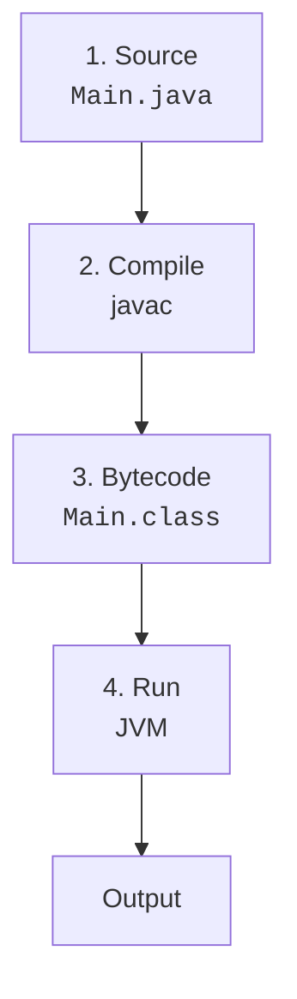
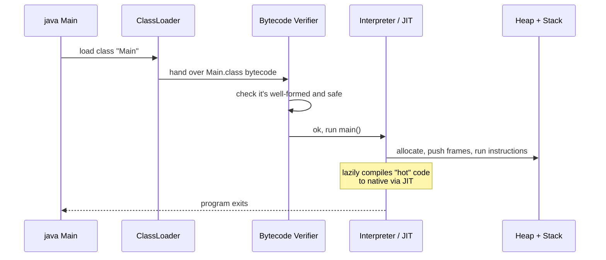
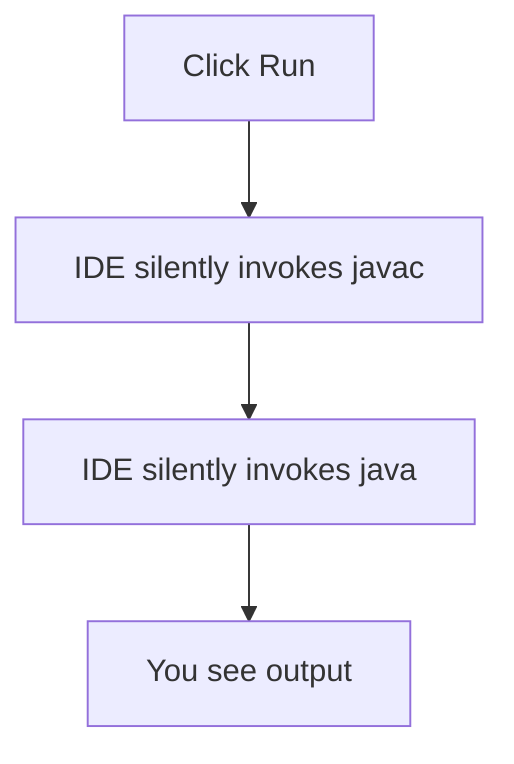

So far we have written `.java` files and watched them produce
output. Magic. This page replaces that magic with a mental model of
**what actually happens** between "type the code" and "see the
output."

<Figure
  slug="java-how-programs-execute-cutout"
  alt="How programs execute, an isometric illustration"
/>

## The four stages

Every Java program goes through these four stages:

1. **Source code.** You write `Main.java`, text that humans can read.
2. **Compilation.** A program called `javac` reads your source and
   produces a `Main.class` file containing **bytecode**, a compact,
   abstract instruction set the JVM understands.
3. **Bytecode.** This is *not* machine code for your CPU. It's an
   intermediate format. The same `.class` file works on Windows,
   macOS, Linux, ARM, x86, anywhere a JVM is installed.
4. **Execution.** The JVM (started by the `java` command) loads
   the bytecode, verifies it, translates it (lazily) into actual
   CPU instructions, and runs them.

<Figure
  slug="java-how-programs-execute-four-stages-inline-cutout"
  alt="A card passing four machines in a row, leaving each visibly changed"
  caption="Source, bytecode, virtual machine, machine code: four stages in order."
/>

This separation between *compile* and *run* is exactly what makes
"write once, run anywhere" possible. The compiler doesn't need to
know what kind of CPU will eventually run the code. The JVM, on
each platform, does that part.

## What does `javac` actually do?

`javac` is a program written in Java itself. It:

- Reads the source text.
- Parses it into an internal tree (an AST, abstract syntax tree).
- Checks types, scopes, access modifiers, "does `x.foo()` make
  sense given the type of `x`?"
- Reports errors if anything is wrong (and produces **no** `.class`
  if there are errors).
- Emits one `.class` file per class, containing bytecode plus
  metadata.

If `javac` fails, your program never runs at all. The compiler is
your first and best safety net.

## What does the `java` command actually do?

The `java` command starts the JVM and asks it to run the `main`
method of a class you name. The JVM then:

Three pieces are worth understanding even at a beginner level:

1. **Classloader.** Finds `.class` files on disk (or in JAR
   archives), reads them into memory, links them together. Loads
   only what is actually used, `Cat.class` may never load if your
   program never mentions `Cat`.
2. **Verifier.** Checks that the bytecode is internally consistent
   ("does this method really claim to leave one `int` on the stack?
   does this branch jump to a valid instruction?"). This protects
   the JVM from broken or malicious class files.
3. **Interpreter + JIT.** The JVM first *interprets* bytecode
   instruction-by-instruction. When it notices a method being called
   often (a "hot" method), the **Just-In-Time compiler (JIT)** turns
   that method into real CPU instructions, so subsequent calls run
   at native speed. We will cover this more on the next page.

## A worked example

Let's walk a tiny program through every stage.

<CodeBlock
  adapter="java"
  files={[
    {
      filename: "main.java",
      starterCode: `public class Main {
  public static void main(String[] args) {
    int x = 2;
    int y = 3;
    int sum = add(x, y);
    System.out.println(sum);
  }

  static int add(int a, int b) { return a + b; }
}
`,
    },
  ]}
/>

When you click Run:

- The browser-based Java runtime invokes the equivalent of `javac`
  on `Main.java`, producing `Main.class` (bytecode).
- The runtime then invokes the equivalent of `java Main`, which
  starts a JVM, loads `Main`, and runs `main`.
- `main` allocates two `int` locals (`x`, `y`) on its **stack
  frame**, calls `add()`, which gets its own frame, returns 5, prints.

The output appears. Behind that one click are *all* the stages
above.

## "Compile-time" vs "run-time"

You will hear these phrases all the time. They simply describe
*when* something is decided:

- **Compile-time:** decided while `javac` is running. Examples:
  - "What is the type of `x`?"
  - "Does `Foo` extend `Bar`?"
  - "Is this field accessible from here?"
- **Run-time:** decided while the JVM is running. Examples:
  - "What value does `x` hold *right now*?"
  - "Which override of `area()` should we dispatch to?"
  - "Has this file actually been opened?"

Statically typed languages like Java try to push as many decisions
as possible to compile-time, because compile-time errors are *much*
cheaper than run-time crashes.

## A note about IDEs and "running"

Modern IDEs (and online runners like this one) often *appear* to
"just run" your code. They are quietly performing the compile step
behind the scenes. There is no shortcut around `.java → .class → run`,
you just don't have to type it.

<Figure
  slug="java-how-programs-execute-inline-cutout"
  alt="A source card going into a translating machine and the result being carried out by a second machine beside it"
  caption="The compile step still happens even when your editor hides it."
/>

This is worth knowing the first time a program refuses to run and the
editor shows you an error before anything has started. Nothing broke
at run time. The compile step, the one the editor performed quietly,
said no.

<MultipleChoice
  markdown={`What does the Java compiler (\`javac\`) produce?

- Machine code that only runs on the developer's CPU
  > Bytecode is not tied to a specific CPU.
- A new \`.java\` file
  > It reads \`.java\` and produces \`.class\`.
- A native executable for your operating system
  > That's what C/C++ compilers produce, not \`javac\`.
- [o] One or more \`.class\` files containing platform-independent bytecode
  > Bytecode is the input to the JVM.`}
/>

<MultipleChoice
  markdown={`Why does Java use bytecode and a JVM instead of compiling directly to native code?

- Because native code is illegal
  > It's not, it's just less portable.
- Because the JVM is faster than native execution
  > Generally the opposite, though the JIT closes much of the gap.
- [o] Because bytecode is portable, the same \`.class\` files can run on any platform that has a JVM, fulfilling Java's "write once, run anywhere" promise
  > One compiled artifact runs everywhere a JVM exists, instead of one build per platform.
- Because Java cannot be compiled directly
  > It could be, in principle, the design choice was portability.`}
/>

<MultipleChoice
  markdown={`Which of these is decided at *compile time* rather than at run time?

- Which override of a method is dispatched to
  > That's a runtime decision (dynamic dispatch).
- The actual numeric value of an int variable
  > That depends on input or computation at run time.
- [o] Whether a particular field is accessible from a particular call site, based on its access modifier
  > Access checks are done by the compiler.
- Whether a file actually exists on disk
  > That's a runtime decision (and may change over time).`}
/>

Now that you have the rough shape of execution, the next page zooms
into the JVM itself: what it really is, what it does, and the parts
of it that are worth knowing as a beginner.
