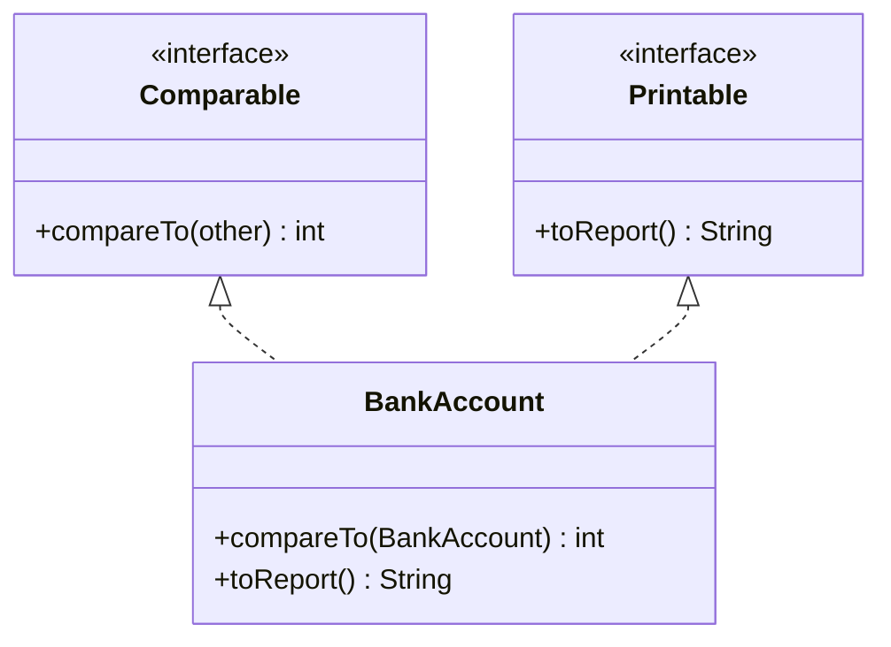
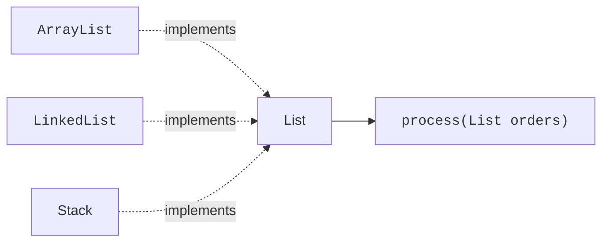

Inheritance models **is-a** ("a Circle *is a* Shape"). But many
relationships in real code are more like **can-do** ("this thing
*can be* compared," "this thing *can be* printed nicely," "this thing
*can be* iterated over"). Java captures *can-do* with **interfaces**.

<svg
  viewBox="0 0 640 230"
  role="img"
  aria-label="One wall socket and three very different machines, each cord ending in the identical two-prong plug — an interface is the agreed plug shape, not the machine behind it"
  style={{ display: "block", width: "100%", maxWidth: "640px", height: "auto", margin: "2.5rem auto" }}
>
  <g fill="currentColor" opacity="0.07">
    <rect x="80" y="30" width="110" height="170" rx="12" />
  </g>
  <g style={{ color: "var(--ds-blue-500)" }} fill="currentColor">
    <rect x="118" y="86" width="56" height="72" rx="10" fillOpacity="0.2" />
    <rect x="132" y="104" width="10" height="22" rx="3" fillOpacity="0.7" />
    <rect x="150" y="104" width="10" height="22" rx="3" fillOpacity="0.7" />
    <circle cx="146" cy="142" r="5" fillOpacity="0.4" />
  </g>
  <g style={{ color: "var(--ds-green-500)" }} fill="currentColor">
    <circle cx="430" cy="66" r="28" fillOpacity="0.85" />
    <rect x="186" y="96" width="28" height="22" rx="6" />
    <circle cx="232" cy="104" r="3" fillOpacity="0.45" />
    <circle cx="268" cy="96" r="3" fillOpacity="0.45" />
    <circle cx="304" cy="86" r="3" fillOpacity="0.45" />
    <circle cx="340" cy="78" r="3" fillOpacity="0.45" />
    <circle cx="372" cy="72" r="3" fillOpacity="0.45" />
  </g>
  <g style={{ color: "var(--ds-yellow-500)" }} fill="currentColor">
    <rect x="412" y="128" width="56" height="48" rx="10" fillOpacity="0.85" />
    <rect x="236" y="150" width="26" height="18" rx="5" />
    <rect x="224" y="153" width="12" height="4" rx="2" />
    <rect x="224" y="161" width="12" height="4" rx="2" />
    <circle cx="286" cy="156" r="3" fillOpacity="0.5" />
    <circle cx="322" cy="154" r="3" fillOpacity="0.5" />
    <circle cx="358" cy="152" r="3" fillOpacity="0.5" />
  </g>
  <g style={{ color: "var(--ds-blue-500)" }} fill="currentColor">
    <polygon points="408,196 422,182 450,182 464,196 450,210 422,210" fillOpacity="0.85" />
    <rect x="258" y="192" width="26" height="18" rx="5" fillOpacity="0.9" />
    <rect x="246" y="195" width="12" height="4" rx="2" fillOpacity="0.9" />
    <rect x="246" y="203" width="12" height="4" rx="2" fillOpacity="0.9" />
    <circle cx="308" cy="200" r="3" fillOpacity="0.5" />
    <circle cx="344" cy="200" r="3" fillOpacity="0.5" />
    <circle cx="380" cy="199" r="3" fillOpacity="0.5" />
  </g>
</svg>

## What is an interface?

An interface is a *contract*. It says: "any class that implements me
promises to provide these methods." It does not say *how* — only
*what*.

```java
public interface Greeter {
    String greet(String name);
}
```

Any class that says `implements Greeter` must provide a method with
exactly that signature. The interface itself has no fields, no
constructor, and (traditionally) no method bodies.

## Implementing an interface

<CodeBlock
  adapter="java"
  entryFilename="Main.java"
  files={[
    {
      filename: "Main.java",
      starterCode: `public class Main {
  public static void main(String[] args) {
    Greeter formal = new FormalGreeter();
    Greeter casual = new CasualGreeter();

    say(formal, "Ada");
    say(casual, "Ada");
  }

  static void say(Greeter g, String name) { System.out.println(g.greet(name)); }
}
`,
    },
    {
      filename: "Greeter.java",
      starterCode: `public interface Greeter {
  String greet(String name);
}
`,
    },
    {
      filename: "FormalGreeter.java",
      starterCode: `public class FormalGreeter implements Greeter {
  @Override
  public String greet(String name) {
    return "Good day, " + name + ".";
  }
}
`,
    },
    {
      filename: "CasualGreeter.java",
      starterCode: `public class CasualGreeter implements Greeter {
  @Override
  public String greet(String name) {
    return "hey " + name + "!";
  }
}
`,
    },
  ]}
/>

Notice that `say` takes a `Greeter` — not a `FormalGreeter` or a
`CasualGreeter`. The method works with any current *or future* class
that implements `Greeter`. This is the same polymorphism we saw with
inheritance, but achieved without `extends`.

## Interfaces vs abstract classes

You may be thinking: "this sounds like an abstract class." There is
overlap, but the differences matter.

| | abstract class | interface |
| --- | --- | --- |
| Models | **is-a** (identity) | **can-do** (capability) |
| Fields | Yes, any kind | Only `public static final` constants |
| Constructors | Yes | No |
| State | Yes (instance fields) | No |
| How many can a class have? | Extends *one* | Implements *many* |
| Code reuse | Strong — shared fields + methods | Limited (default methods only) |

**The single most important difference:** a class can `implements`
**many** interfaces but `extends` **only one** class.

That is why interfaces are perfect for capabilities: a `BankAccount`
can be `Comparable`, `Serializable`, and `Loggable` all at once,
without trying to inherit from three different parents.



The dashed arrows mean "implements."

## A more realistic example: sorting anything

The Java standard library defines:

```java
public interface Comparable<T> {
    int compareTo(T other);
}
```

Any class that implements `Comparable` can be sorted by
`Collections.sort` or `Arrays.sort`. The library has no idea what
your class is — it just trusts the contract.

<CodeBlock
  adapter="java"
  entryFilename="Main.java"
  files={[
    {
      filename: "Main.java",
      starterCode: `import java.util.Arrays;

public class Main {
  public static void main(String[] args) {
    Book[] shelf = {
        new Book("Java", 320),
        new Book("Go", 180),
        new Book("Rust", 450),
    };

    Arrays.sort(shelf);

    for (Book b : shelf) {
      System.out.println(b);
    }
  }
}
`,
    },
    {
      filename: "Book.java",
      starterCode: `public class Book implements Comparable<Book> {
  private final String title;
  private final int pages;

  public Book(String title, int pages) {
    this.title = title;
    this.pages = pages;
  }

  @Override
  public int compareTo(Book other) {
    return Integer.compare(this.pages, other.pages);
  }

  @Override
  public String toString() {
    return title + " (" + pages + " pages)";
  }
}
`,
    },
  ]}
/>

`Arrays.sort` was written years before your `Book` class existed.
It works because `Book` honors the `Comparable` contract.

## Default methods

Since Java 8, interfaces may carry **default methods** — methods
with a body that subclasses inherit unless they override. This lets
interfaces evolve over time without breaking existing
implementations.

<CodeBlock
  adapter="java"
  files={[
    {
      filename: "main.java",
      starterCode: `public class Main {
  public static void main(String[] args) {
    Greeter g = new Plain();
    System.out.println(g.greet("Ada"));
    System.out.println(g.greetLoudly("Ada"));
  }
}

interface Greeter {
  String greet(String name);

  // default method — implementers get this for free
  default String greetLoudly(String name) { return greet(name).toUpperCase(); }
}

class Plain implements Greeter {
  public String greet(String name) { return "hello, " + name; }
}
`,
    },
  ]}
/>

Use default methods sparingly. Their main job is *backwards
compatibility*, not "everyone gets free behavior."

## Designing with interfaces: depend on capabilities, not classes

A subtle but vital design rule: **prefer interface types in method
parameters and return types.** Saying `void process(List<Order>
orders)` is better than `void process(ArrayList<Order> orders)`.
Why? Because callers may have an `ArrayList`, a `LinkedList`, or
anything else that `implements List`. Asking only for the
*capability* you actually need gives callers freedom and gives you
the right to change your storage later.



The method `process` doesn't care which arrow the data came down. It
only cares that it can call `List` methods on the parameter.

<MultipleChoice
  markdown={`What is the most fundamental difference between an abstract class and an interface?

- Abstract classes are faster
  > Speed is unrelated.
- [o] A class can implement many interfaces but extend only one class, so interfaces are the right way to mix in multiple independent capabilities
  > Single inheritance limits you to one parent class, but a class can promise many interface contracts at once.
- Interfaces support fields, abstract classes don't
  > It's the other way around.
- Interfaces don't allow \`@Override\`
  > They do.`}
/>

<MultipleChoice
  markdown={`Why is it good practice to declare a parameter type as \`List<T>\` rather than \`ArrayList<T>\`?

- It's shorter to type
  > Not the real reason.
- ArrayList is deprecated
  > It is not.
- [o] You ask only for the capability you actually need, so callers can pass any List implementation and you can change your own storage later
  > Depending on the interface keeps both the caller and your implementation free to vary.
- The compiler refuses concrete types in parameters
  > It accepts them just fine.`}
/>

## A small challenge

<ChallengeCard
  adapter="java"
  title="A printable hierarchy"
  instructions={`Define an interface \`Printable\` with one method \`String toReport()\`.

Then define two classes that both implement \`Printable\`:

- \`Invoice\` with a constructor \`Invoice(int id, int totalCents)\` and \`toReport()\` returning \`"Invoice #" + id + ": " + totalCents + "c"\`.
- \`Greeting\` with a constructor \`Greeting(String who)\` and \`toReport()\` returning \`"Hi, " + who + "!"\`.

\`Main.java\` is provided. Expected output (exact):

\`\`\`
Invoice #7: 1299c
Hi, Ada!
\`\`\``}
  entryFilename="Main.java"
  files={[
    {
      filename: "Main.java",
      starterCode: `public class Main {
  public static void main(String[] args) {
    Printable[] items = {
        new Invoice(7, 1299),
        new Greeting("Ada"),
    };
    for (Printable p : items) {
      System.out.println(p.toReport());
    }
  }
}
`,
    },
    {
      filename: "Printable.java",
      starterCode: `public interface Printable {
  // TODO
}
`,
      solutionCode: `public interface Printable {
  String toReport();
}
`,
    },
    {
      filename: "Invoice.java",
      starterCode: `public class Invoice implements Printable {
  // TODO
}
`,
      solutionCode: `public class Invoice implements Printable {
  private final int id;
  private final int totalCents;

  public Invoice(int id, int totalCents) {
    this.id = id;
    this.totalCents = totalCents;
  }

  @Override
  public String toReport() {
    return "Invoice #" + id + ": " + totalCents + "c";
  }
}
`,
    },
    {
      filename: "Greeting.java",
      starterCode: `public class Greeting implements Printable {
  // TODO
}
`,
      solutionCode: `public class Greeting implements Printable {
  private final String who;

  public Greeting(String who) { this.who = who; }

  @Override
  public String toReport() {
    return "Hi, " + who + "!";
  }
}
`,
    },
  ]}
  tests={[
    {
      id: "printable",
      name: "Interface implemented by two classes",
      expect: {
        stdoutLines: [
          "Invoice #7: 1299c",
          "Hi, Ada!",
        ],
        stdoutLinesExact: true,
      },
    },
  ]}
/>

Interfaces are how grown-up Java programs are organized. They draw
clean lines between *what* a piece of code needs and *what concrete
class happens to provide it.* The next chapter zooms out from
classes to ask: **how does a Java program actually execute?**
