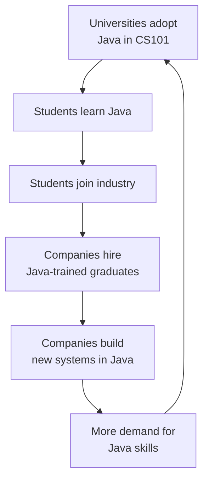

The origin story earlier in this course ended in 1995, with a
toaster language unexpectedly riding the web into public view. Being
technically impressive, however, has never been enough, the
graveyard of programming languages is full of brilliant designs. By
2007, Java was *everywhere*. This page is the story of how that
happened: part engineering, part timing, part marketing, and part
self-reinforcing luck.

<svg
  viewBox="0 0 640 230"
  role="img"
  aria-label="A solid blue core radiates two thin rings dotted with green, yellow, and blue satellites, adoption spreading outward ring by ring until Java is everywhere"
  style={{ display: "block", width: "100%", maxWidth: "560px", height: "auto", margin: "2.5rem auto" }}
>
  <g fill="none" stroke="var(--ds-gray-300)" strokeWidth="2">
    <circle cx="320" cy="115" r="45" />
    <circle cx="320" cy="115" r="78" />
  </g>
  <circle cx="320" cy="115" r="16" fill="var(--ds-blue-500)" />
  <circle cx="354.5" cy="86.1" r="8" fill="var(--ds-green-500)" />
  <circle cx="277.7" cy="130.4" r="8" fill="var(--ds-yellow-500)" />
  <circle cx="335.4" cy="157.3" r="8" fill="var(--ds-blue-500)" fillOpacity="0.7" />
  <circle cx="396.8" cy="128.5" r="7" fill="var(--ds-green-500)" fillOpacity="0.8" />
  <circle cx="252.5" cy="76" r="7" fill="var(--ds-yellow-500)" fillOpacity="0.8" />
  <circle cx="281" cy="182.5" r="7" fill="var(--ds-blue-500)" />
  <circle cx="333.5" cy="38.2" r="6" fill="var(--ds-green-500)" />
</svg>

## Free, but corporate

Java was launched by **Sun Microsystems**, a serious hardware
company. That mattered. Hobbyist languages often die when their
creator loses interest. Java had a corporate parent willing to spend
real money to keep the JVM, the compiler, the standard library, and
the developer tools healthy. Sun gave the entire software
development kit away for free, on every major platform, while making
its money on the high-end servers Java workloads ran on.

For a CTO in 1998 wondering "is this language safe to bet a ten-year
project on?", a free, well-supported, corporate-backed language was
extremely attractive. Java felt like a *grown-up* choice in a way
that, say, Perl or Tcl did not.

## The education flywheel

Java's deliberately restrained design, no pointer arithmetic, no
manual memory management, mandatory classes, strict typing, also
made it an ideal first language for university courses. There were
fewer footguns to explain, and the same `Hello World` behaved
identically on a student's laptop and the professor's office
machine. Through the early 2000s, university after university
switched their introductory computer science course to Java, and the
College Board moved the **AP Computer Science** exam to Java
starting with the 2003–04 school year.

The result was a self-reinforcing loop, and that loop, more than
any single technical feature, is why Java remained one of the
most-taught languages on the planet for two decades:

Meanwhile, large companies were adopting Java for reasons that line
up almost line-for-line with the pains of the 1990s:

| Enterprise pain | Java answer |
| --- | --- |
| "Our developers crash production with bad memory management." | Garbage collection, no `delete` to forget. |
| "Code we write today must run on hardware we have not bought yet." | Bytecode + JVM, no recompile required. |
| "Our codebase will outlive any single developer." | Strict typing and mandatory class structure, readable by newcomers. |
| "We need one language across desktop, server, and embedded." | Java ran on all three. |
| "We can't keep writing string functions from scratch." | A huge standard library shipped with every JVM. |

## Era 1: applets rise and fall (1995–2005)

The first thing the world saw Java do was animate things inside web
pages. An **applet** was a small program the browser downloaded and
ran in a sandbox, calculators, plots, simple games, proofs of
concept. For a brief window in the late 1990s, applets looked like
the future of interactive content.

They never lived up to it. Applets were slow to start (the JVM had
to boot inside the browser), awkward to secure, and steadily
out-competed by JavaScript, which, despite the confusing name, is
an *unrelated* language that Netscape named partly to ride Java's
hype, and later by Flash. Browsers eventually removed plug-in
support entirely, and applets went extinct. But they had done their
job: they were Java's debut on the world stage, and the reason
millions of people first heard the word.

## Era 2: the enterprise stack (2000–2010)

While applets faded in the browser, Java quietly conquered the
server. **Servlets** (1997) let Java respond to web requests, and on
top of them grew a bewildering ecosystem of enterprise standards,
J2EE, EJB, JMS, and a parade of other acronyms. Banks, insurers,
airlines, and government departments built entire platforms on these
foundations. Some of the standards aged well; others became
notorious case studies in over-engineering. The backlash against the
heavyweight parts produced **Spring** (2003), a lighter framework
that remains the dominant way to build Java backends today.

You do not need any of these frameworks to learn Java, they are all
downstream of the language itself. But when a job posting says "Java
developer," this server-side world is usually what it means.

## Era 3: Android, the second wave (2008–)

In 2008 something happened that nobody at Sun had predicted. Google
launched **Android** and chose Java as its application language.
Suddenly every Android app on Earth was a Java program, and hundreds
of thousands of developers learned Java specifically to write mobile
apps, a population that had nothing to do with banking backends.

Android never used Sun's JVM: it shipped its own runtime (first
**Dalvik**, later **ART**) executing a different bytecode, with the
Java *language* on top. That technical distinction turned out to
matter enormously, because in 2010 **Oracle**, which had just
acquired Sun, and Java with it, sued Google over Android's use of
Java's APIs. *Oracle v. Google* ran for over a decade, swung both
ways through trials and appeals, and put a genuinely nerdy question
in front of the United States Supreme Court: can you copyright the
*shape* of an API, the method names and signatures that programmers
build against? In April 2021 the Court ruled 6–2 for Google, finding
its reimplementation of the Java API to be fair use. Programmers
everywhere exhaled: the freedom to reimplement an interface is load
bearing for the entire industry.

Today, Google recommends **Kotlin** for new Android code, but
Kotlin is itself a JVM-family language, interoperable with Java, so
the platform's Java DNA remains.

## Era 4: big data and the JVM as a platform (2010–)

By 2010, "big data" was the headline, and the dominant tools,
**Hadoop**, **Spark**, **Kafka**, **Elasticsearch**, **Cassandra**,
were all built on the JVM, written in Java or Scala. Data
engineering became another massive Java domain. This era cemented an
idea bigger than the language: the JVM as a *platform* hosting many
languages (**Scala**, 2004; **Clojure**, 2007; **Kotlin**, 2011),
all compiling to the same bytecode and sharing each other's
libraries.

## Era 5: modern Java (2017–today)

For its first two decades Java evolved slowly, a major release
every two or three years. Since 2017, new versions ship on a strict
**six-month cadence**, and the language has been catching up on a
generation of ideas:

| Version | Year | Headline additions |
| --- | --- | --- |
| Java 1 | 1996 | Applets |
| Java 5 | 2004 | Generics, enums |
| Java 8 | 2014 | Lambdas, streams |
| Java 11 | 2018 | First LTS of the new release cadence |
| Java 17 | 2021 | Sealed classes (records arrived in 16) |
| Java 21 | 2023 | Virtual threads, pattern matching for switch |

Honesty requires listing what was *given up* along the way: applets
are gone, Java Web Start is gone, the Java EE enterprise standards
were handed to the Eclipse Foundation (as **Jakarta EE**), and Sun
itself is gone, absorbed into Oracle in 2010. What survived and
grew is exactly the core of the original proposition: a portable,
statically typed, garbage-collected, object-oriented language
running on a superb virtual machine.

## "Boring" is a compliment

Java has a reputation in some circles for being old or boring. This
is a strange critique, because what people usually mean by it is:
*Java is what serious organizations use to build software that has
to work.* Features arrive slowly and carefully; in exchange, Java
programs written in 2002 still compile and run in 2026, and the
skills you build in this course will hold their value for decades.
Very few technology investments age that well.

<MultipleChoice
  markdown={`Why was Java attractive to large enterprises in the late 1990s?

- Because it was the fastest language available
  > It was fast, but not the fastest.
- Because it could be combined with COBOL in the same source file
  > It could not.
- [o] Because it was portable across platforms, garbage-collected, strongly typed, and supported by a major hardware vendor
  > Several pragmatic advantages combined to make Java a safe long-term bet.
- Because it was the cheapest language to license
  > It was free, but so were many others.`}
/>

<MultipleChoice
  markdown={`Why are Java applets no longer used?

- Because the JVM no longer supports them
  > The JVM still supports the relevant APIs; the issue is elsewhere.
- [o] Because browsers stopped supporting browser plug-ins, and JavaScript took over interactive content in web pages
  > The browser environment changed, and applets did not fit anymore.
- Because Java itself has been deprecated
  > Java is alive and well.
- Because Sun never released them
  > Sun did release them; they were a major early Java technology.`}
/>

<MultipleChoice
  markdown={`What was the central legal question in *Oracle v. Google*?

- Whether Google could use the name "Java" in marketing
  > Naming was a side issue at most.
- Whether Android phones infringed Sun's hardware patents
  > The decisive question was about software interfaces, not hardware.
- [o] Whether reimplementing the Java API, its method names and signatures, in Android was copyright infringement or fair use
  > The Supreme Court ruled in 2021 that Google's reuse of the API's structure was fair use.
- Whether the JVM could legally run on mobile devices
  > Running a JVM was never the issue; Android didn't even use Sun's JVM.`}
/>

The next discussion zooms out one more step: never mind Java's
products, how did Java change *programming itself*? The fingerprints
are on nearly every language you will ever use.
