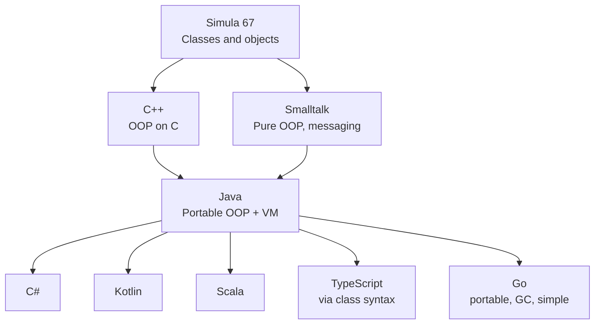

If Java disappeared tomorrow, programming would still look profoundly
like Java. Many of the ideas now taken for granted in modern
software engineering, across totally unrelated languages, were
either invented, popularized, or first proven at scale by the Java
ecosystem.

<Figure
  slug="java-javas-influence-cutout"
  alt="How Java influenced modern software engineering, an isometric illustration"
/>

This closing discussion is a survey of those influences. It will
help you recognize Java's fingerprints in languages you will meet
later, like C#, Kotlin, TypeScript, Go, and even modern JavaScript.

## 1. "Automatic memory management is normal"

Before Java, *every* mainstream language used for serious software
made the programmer manage memory by hand. Java was the first
mass-adopted language to ship with a high-quality garbage collector
and prove, in production, that **you can build huge fast systems
without manual memory management**.

Today, garbage collection is the default in C#, Python, Ruby, Go,
JavaScript, Kotlin, and nearly every new language (Swift achieves
the same freedom-from-`delete` through automatic reference counting
instead). Even C++ and Rust have, in different ways, designed their
memory models *in reaction to* the convenience that Java
demonstrated.

## 2. "Strong typing is a good idea, even at scale"

In the late 1990s, dynamic languages like Perl and (later) Ruby and
Python argued that strong static typing was a productivity tax. Java
took the other view: every variable has a known type at compile time.

History has come around. The most successful languages of the last
decade, TypeScript, Kotlin, Swift, Rust, Go, all have static type
systems. The single most popular evolution in JavaScript-land,
TypeScript, exists to *add* Java-style static typing to a
dynamically-typed language.

## 3. "Programs should be portable by default"

The JVM was the first commercially successful **runtime virtual
machine**. The idea, *compile once, run on a managed runtime*, is
now standard:

- .NET's CLR (the runtime under C#, F#, VB.NET) is essentially a
  child of the JVM idea.
- Python and Ruby use a similar bytecode-and-VM architecture.
- WebAssembly explicitly aims to be a "JVM for the web," running
  many languages safely in browsers.

Java taught the industry that the small cost of a virtual machine is
worth the giant benefits of portability, security, and runtime
optimization.

## 4. "Exceptions are how errors travel"

Java did not invent exceptions, but it popularized them. Before Java,
many programs used integer return codes (`-1` means error, `0` means
success, and so on), and missed checks caused most production bugs.
Java's `try/catch/finally` model is now standard in C#, Python,
JavaScript, Swift, Kotlin, and many others.

(We will spend a full lesson on exceptions later.)

## 5. "Code lives in well-defined packages and modules"

Java's `package` keyword and its `import` system created a clear
namespace for every class. Before Java, many languages dumped
everything into a single global namespace, leading to clashing names
in large projects.

Today, `import` (Java, Python, TypeScript), `using` (C#), and
`use` (Rust) all express the same idea: a piece of code declares
exactly which other pieces of code it depends on. This is one of
those tiny features that, over millions of lines, prevents
catastrophic confusion.

## 6. "Build tools and dependency repositories are first-class"

**Maven** (2004) and **Gradle** (2007) defined how modern
"declarative" build tools work: a project declares its dependencies
and lets the build tool fetch them from a central repository
(**Maven Central**). This pattern was so successful it is now the
default in *every* major ecosystem: npm (JavaScript), pip/PyPI
(Python), Cargo (Rust), NuGet (.NET), Go modules, RubyGems.

## 7. "Test-driven development with JUnit"

**JUnit** made automated unit testing easy in Java, and it began as
an in-flight hack. In 1997, Kent Beck and Erich Gamma found
themselves on the same long flight to the OOPSLA conference in
Atlanta and spent it pair-programming a tiny Java test framework,
based on Beck's earlier SUnit for Smalltalk. That airplane project
became so influential that an entire family of testing frameworks in
other languages, pytest, Jest, RSpec, NUnit, Mocha, Go's `testing`
package, descends from its design.

<Figure
  slug="java-javas-influence-1-automatic-memory-inline-cutout"
  alt="A yard of crates with a small cart moving through it collecting the ones nobody holds"
/>

The very phrase **xUnit framework** comes from JUnit.

## 8. "Design patterns are a shared vocabulary"

The 1994 book *Design Patterns: Elements of Reusable Object-Oriented
Software* (the **Gang of Four** book) crystallized 23 named patterns
for OOP design. Most of its examples were in C++ and Smalltalk, but
its enormous popularity *in the Java community* during the late
1990s and 2000s embedded patterns like **Singleton**, **Observer**,
**Strategy**, **Decorator**, and **Factory** into the everyday
vocabulary of working programmers everywhere.

Today, if you tell a fellow programmer "this is a Strategy pattern,"
they will understand you, regardless of which language they prefer.

## 9. "Code reviews, code style, and engineering culture"

Java was the language where many large companies first learned to
write at scale, million-line, hundred-developer codebases. Practices
like **mandatory code review**, **shared style guides**, **continuous
integration**, and **automated formatting** matured in the Java
community in the early 2000s. They then spread to every other
ecosystem.

You will never see this written on the Java homepage, but Java *as a
culture* taught the industry how to work together on huge
codebases.

## A diagram of inheritance, between languages

Almost every modern mainstream OOP language is a descendant of Java,
sometimes nearly literally. C# is the clearest case: Microsoft first
shipped its own Java dialect (Visual J++), fought Sun in court over
it, and then had Anders Hejlsberg, the creator of Turbo Pascal and
Delphi, whom Microsoft had hired from Borland, design C# as its
own Java-shaped language for the .NET platform. Kotlin and Scala
were built directly *on* Java's virtual machine. TypeScript and Go
absorbed Java's lessons from a greater distance.

<MultipleChoice
  markdown={`Which idea did Java *not* invent, but popularized so successfully that it is now standard?

- The use of carriage returns to end lines of source code
  > That predates Java by decades.
- The notion of a function
  > Functions go back to the very beginning.
- Storing strings in variables
  > Variables have stored strings forever.
- [o] Garbage collection in production-grade general-purpose programming
  > GC existed (Lisp had it) but Java made it mainstream.`}
/>

<MultipleChoice
  markdown={`Which of these languages was *directly* inspired by Java's design?

- FORTRAN
  > FORTRAN is from the 1950s.
- [o] C#, created by Microsoft as a Windows-friendly counterpart to Java
  > C# borrowed extensively from Java's syntax and design.
- COBOL
  > COBOL is from the 1950s, long before Java.
- BASIC
  > BASIC is from the 1960s.`}
/>

## End of the story

You now have, in your head, both halves of the story: how
programming arrived at Java, and how Java in turn reshaped
programming. Every feature you worked with in this course,
exception handling, garbage collection, interfaces, packages, was
solving a specific software-crisis problem, the way Gosling and his
successors decided it should be solved. That kind of contextual
understanding is what makes a real engineer out of someone who only
knows the syntax.

All that remains is the road ahead, the final page sketches where
to take your Java from here.
