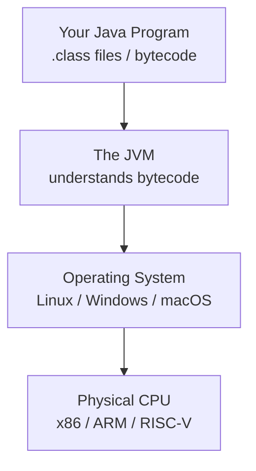
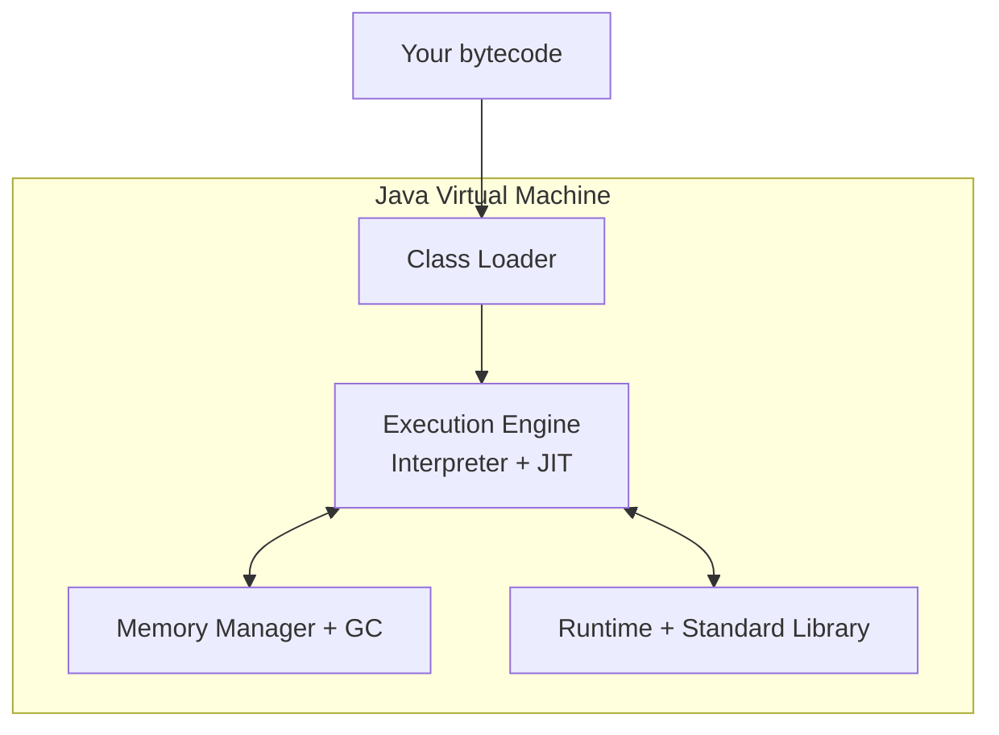
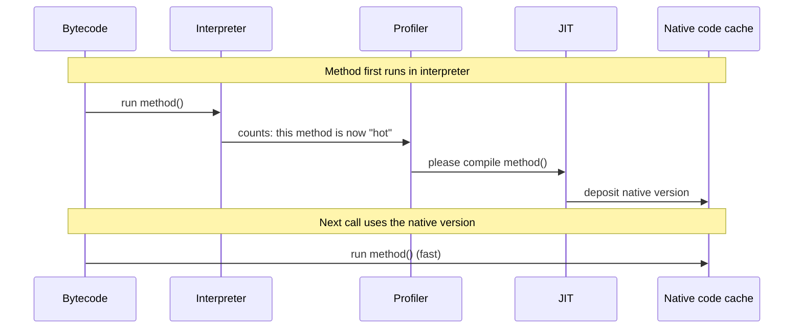
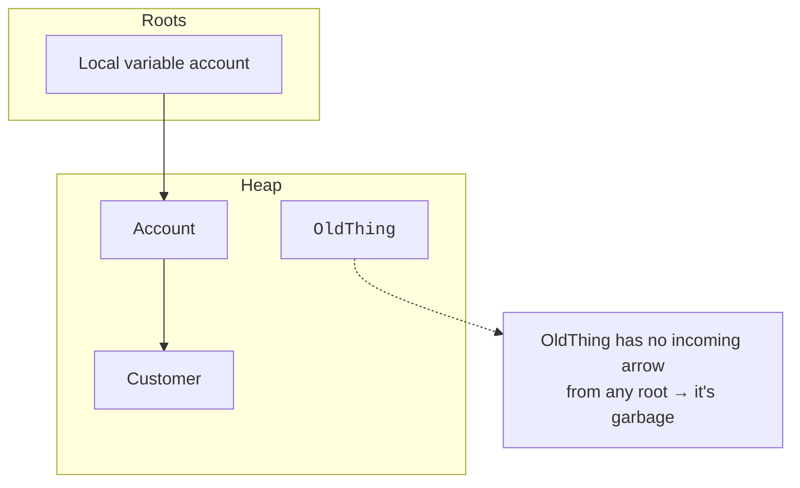

The Java Virtual Machine, **JVM**, is the program that runs your
program. Without it, your `.class` files are just data. With it,
they come alive. This page builds an intuition for the JVM at the
level a thoughtful beginner needs: enough to reason about programs,
not enough to write a JIT compiler.

<Figure
  slug="java-jvm-conceptually-cutout"
  alt="The JVM, conceptually, an isometric illustration"
/>

## What is a "virtual machine," really?

Your CPU is a physical machine: it has its own instruction set,
registers, and quirks. A **virtual machine** is a *software*
machine, it has its own instruction set (bytecode), its own model
of memory, and its own rules, and it runs on top of any real
machine that hosts it.

Your program talks to the JVM. The JVM talks to the OS. The OS
talks to the CPU. Because the JVM is the same on every platform
(even though *its own* implementation differs), your program is
shielded from platform differences.

## What the JVM provides

A JVM is a hefty piece of software. Conceptually, it provides four
services to your program:

1. **A class loader**, finds and loads `.class` files on demand.
2. **A memory manager**, allocates objects on the heap, manages
   stack frames per call, and **garbage collects** memory that is no
   longer reachable.
3. **An execution engine**, interprets bytecode, and (over time)
   *compiles hot methods* to native CPU instructions for speed
   (this is the JIT).
4. **A standard library and runtime**, the classes in `java.lang`,
   `java.util`, `java.io`, etc. that ship with every JVM.

When people say "the JVM," they may mean any of these pieces, the
context usually tells you which.

## Interpreter + JIT, intuitively

The execution engine does not pick one strategy and stick with it.
It does two things at once:

- **Interpreter:** reads bytecode instructions one at a time and
  carries them out. Slow per instruction but always available.
- **JIT (Just-In-Time compiler):** notices methods that run a lot.
  Translates their bytecode into real CPU instructions. Future
  calls run at native speed.

You don't have to do anything to get this. The JVM watches your
program and quietly speeds it up. This is called **adaptive
optimization**, and it's one reason mature Java programs are fast
even though they "start out being interpreted."

## A simplified view of JVM memory

For a beginner, three regions are worth knowing:

- **Stack** (one per thread). Holds the chain of *active method
  calls*, every call gets a "stack frame" with its parameters and
  local variables. Tiny, fast, automatic.
- **Heap** (one shared region). Every object you create with `new`
  lives here. Big, shared between threads, garbage collected.
- **Method area / metaspace.** Holds loaded classes themselves,
  their fields, methods, bytecode, constants.

A snapshot of what each region holds while `main` is calling `add`:

- **Stack** (per thread), a pile of frames, newest on top:
  `main thread bottom` → `frame: main(args)` → `frame: add(a=2, b=3)`.
- **Heap** (shared), the live objects: `Account #1 (balance=500)`,
  `Account #2 (balance=250)`, `String 'Ada'`.
- **Method area**, the loaded classes themselves: `class Account`,
  `class String`, `class Main`.

We dedicate the next page entirely to stack vs heap, for now, the
three regions are what matter.

## Garbage collection, intuitively

In C, you have to remember to free every chunk of memory you
allocate. Forget once, and your program leaks; free twice, and your
program crashes.

The JVM does it for you. Its **garbage collector** periodically
asks: "starting from the live program state (local variables,
static fields, etc.), which objects can I still *reach* by following
references?" Anything not reachable is dead, and its memory is
reclaimed.

You don't call the garbage collector. You don't decide when it
runs. You just write code that doesn't keep references to objects
you no longer need, and the JVM takes care of the rest.

Collection is not free, and what it costs depends on how full the heap
is. The pauses stay small over a wide range and then stop being small
quite suddenly.

<Chart slug="gc-pause-heap" />

## What you do *not* need to know yet

The JVM is a vast subject. As a beginner, you do **not** need to
worry about:

- Which specific garbage collector your JVM uses (G1, ZGC, Shenandoah).
- JIT tiering or inlining policies.
- Method handles, invokedynamic, or bytecode-level tricks.
- Tuning heap sizes with `-Xmx` and `-Xms`.

These topics matter when you're operating production systems. For
now, the conceptual model above is enough to make every other
chapter make sense.

## A small experiment

The code below creates a lot of `Box` objects and lets most of them
become unreachable. The JVM quietly reclaims them.

<CodeBlock
  adapter="java"
  files={[
    {
      filename: "main.java",
      starterCode: `public class Main {
  public static void main(String[] args) {
    // Make a million temporary objects
    long total = 0;
    for (int i = 0; i < 1_000_000; i++) {
      Box b = new Box(i); // allocate on heap
      total += b.value();
      // 'b' goes out of scope at the end of this iteration
      // → that Box becomes unreachable → eventually GC'd
    }
    System.out.println("sum = " + total);
  }
}

class Box {
  private final int value;
  public Box(int value) { this.value = value; }
  public int value() { return value; }
}
`,
    },
  ]}
/>

Without garbage collection, this loop would steadily eat memory
until the program crashed. With it, memory stays approximately
flat. You didn't write a single line of cleanup code.

<MultipleChoice
  markdown={`Which best describes the JVM's execution engine?

- [o] It interprets bytecode at first, and uses a Just-In-Time compiler to translate frequently-used methods into native CPU instructions for speed
  > The engine combines interpretation with JIT compilation of hot methods, getting both quick startup and native speed.
- It compiles everything to native code before running anything
  > That's "ahead-of-time" compilation, not the standard JVM model.
- It runs Java code by translating it back to source first
  > It does not.
- It always interprets bytecode, line by line
  > It does interpret, but it also JIT-compiles hot methods.`}
/>

<MultipleChoice
  markdown={`Why does Java have a garbage collector?

- [o] So programmers do not have to manually free memory; objects that become unreachable are reclaimed automatically
  > Automatic reclamation removes the manual free/delete step and the bugs that come with it.
- To make the JVM smaller
  > It actually makes the JVM larger and more complex.
- To prevent the program from creating any objects
  > It does not prevent allocation; it manages reclamation.
- Because the JVM cannot create memory itself
  > It can; the GC manages reclamation, not creation.`}
/>

<MultipleChoice
  markdown={`Which JVM region holds objects you create with \`new\`?

- [o] The heap
  > Objects live in the shared heap.
- The class loader
  > A class loader loads classes; it isn't a memory region.
- The stack
  > The stack holds method frames and local variables.
- The method area
  > That stores class definitions, not instances.`}
/>

You now have a working mental model of the JVM. The next page
zooms in on the two memory regions you'll think about most as a
programmer: the **stack** and the **heap**.
