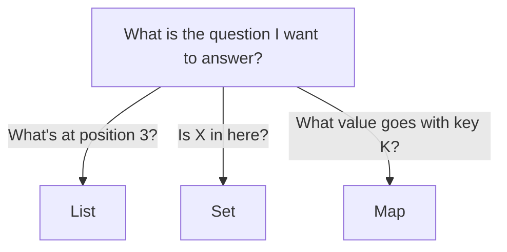
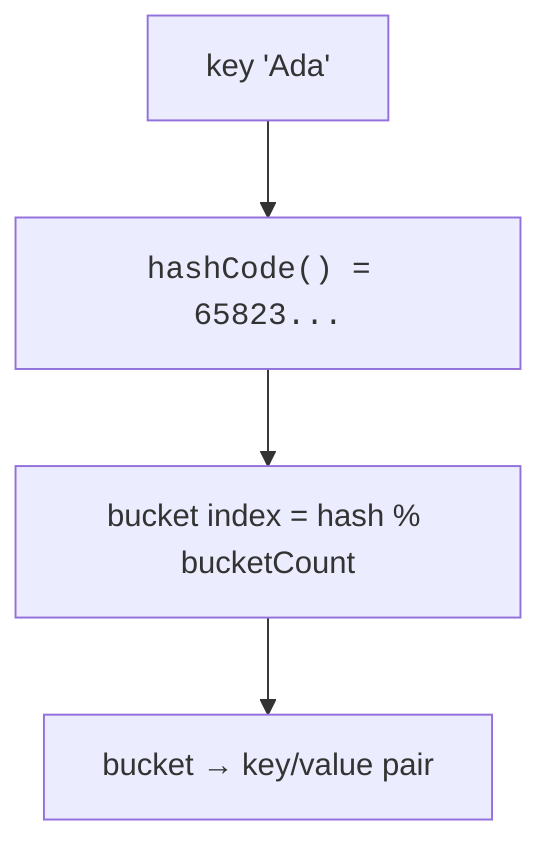

`List` is for ordered, possibly-duplicated, position-addressed data.
But not every problem fits that shape. Two of the most useful
collections in any language are:

<Figure
  slug="java-maps-and-sets-cutout"
  alt="Maps and sets, an isometric illustration"
/>

- **`Set`**, a bag of *unique* items, with very fast "is this in
  here?" checks.
- **`Map`**, a collection of **key → value** pairs, with very
  fast "what value goes with this key?" lookups.

Once you have these two in your toolbox, a huge fraction of
"messy data wrangling" problems become easy.

## `Set`: uniqueness and membership

<CodeBlock
  adapter="java"
  files={[
    {
      filename: "main.java",
      starterCode: `import java.util.HashSet;
import java.util.Set;

public class Main {
  public static void main(String[] args) {
    Set<String> seen = new HashSet<>();
    seen.add("Ada");
    seen.add("Grace");
    seen.add("Ada"); // duplicate, ignored

    System.out.println("size = " + seen.size());
    System.out.println("contains Ada? " + seen.contains("Ada"));
    System.out.println("contains Linus? " + seen.contains("Linus"));
  }
}
`,
    },
  ]}
/>

A `HashSet`:

- Stores each element **at most once**, duplicates are silently
  ignored.
- Has **no defined order** (don't rely on iteration order).
- Offers `add`, `remove`, `contains` in (effectively) constant
  time, on average.

Use a `Set` when you need to ask "have I seen this before?" or
"what are the *distinct* values?"

## `Map`: lookup by key

<CodeBlock
  adapter="java"
  files={[
    {
      filename: "main.java",
      starterCode: `import java.util.HashMap;
import java.util.Map;

public class Main {
  public static void main(String[] args) {
    Map<String, Integer> agesByName = new HashMap<>();
    agesByName.put("Ada", 36);
    agesByName.put("Grace", 85);
    agesByName.put("Linus", 54);

    System.out.println("Ada is " + agesByName.get("Ada"));

    // .get returns null for unknown keys
    Integer maybe = agesByName.get("Unknown");
    System.out.println("Unknown -> " + maybe);

    // safer alternative: a default
    int age = agesByName.getOrDefault("Unknown", -1);
    System.out.println("with default -> " + age);

    // iterate
    for (Map.Entry<String, Integer> entry : agesByName.entrySet()) {
      System.out.println(entry.getKey() + " = " + entry.getValue());
    }
  }
}
`,
    },
  ]}
/>

A `HashMap<K, V>`:

- Stores **key → value** pairs.
- Keys are unique. Putting the same key twice overwrites the value.
- `get`, `put`, `remove`, `containsKey` are constant time on
  average.
- Iteration order is **not** guaranteed.

Each key maps to exactly one value:

| Key | Value |
| --- | --- |
| `"Ada"` | `36` |
| `"Grace"` | `85` |
| `"Linus"` | `54` |

## Choosing between List, Set, Map

A simple mental flowchart:

That picture solves 90% of "which collection should I use?"
questions.

## How does "fast lookup" actually work?

The three strategies grow differently, and the gap only opens at a size no
test ever uses:

<Chart slug="collection-lookup-growth" />

Both `HashSet` and `HashMap` use **hashing**. When you add an
element (or key), Java calls its `hashCode()` method to compute a
number, then uses that number to pick a bucket. Looking the
element up later is as easy as: compute the hash, go to that
bucket, check what's there.

This is why an unsorted `HashSet` of 10 million strings can answer
"is X in here?" in microseconds: it doesn't *search*, it *computes*
where the answer would be and looks there directly.

For this to work, two contracts must hold for the key type:

- **`equals`** must correctly compare two keys for "are they the
  same."
- **`hashCode`** must return the *same* number for any two keys that
  are `equals`.

`String`, `Integer`, `Double`, and most JDK value types already
implement these correctly. For your *own* classes, if you want to
use them as map keys or set elements, you must override both
`equals` and `hashCode` consistently.

## A worked example: word counts

A classic small problem: read a list of words, print how many
times each one appeared. A `Map<String, Integer>` makes this
trivial.

<CodeBlock
  adapter="java"
  entryFilename="Main.java"
  files={[
    {
      filename: "Main.java",
      starterCode: `import java.util.List;
import java.util.Map;
import java.util.TreeMap;

public class Main {
  public static void main(String[] args) {
    List<String> words = List.of("to", "be", "or", "not", "to", "be");

    Map<String, Integer> counts = WordCounter.count(words);

    // TreeMap gives us sorted keys for deterministic output
    TreeMap<String, Integer> sorted = new TreeMap<>(counts);
    for (Map.Entry<String, Integer> e : sorted.entrySet()) {
      System.out.println(e.getKey() + " " + e.getValue());
    }
  }
}
`,
    },
    {
      filename: "WordCounter.java",
      starterCode: `import java.util.HashMap;
import java.util.List;
import java.util.Map;

public class WordCounter {
  public static Map<String, Integer> count(List<String> words) {
    Map<String, Integer> counts = new HashMap<>();
    for (String w : words) {
      counts.merge(w, 1, Integer::sum);
    }
    return counts;
  }
}
`,
    },
  ]}
/>

`merge(key, value, remappingFunction)` is a beautiful little
method: if the key is absent, it inserts `value`. If the key is
present, it replaces the existing value with the result of
applying the function. Reading "if absent put 1; else add 1" in
one line.

## When *not* to use Map

The fastest way to slow down a small program is to reach for a
`HashMap` when a couple of fields on a class would do. If your
"map" has exactly the same three keys every time (`"name"`, `"age"`,
`"city"`), make a class. Maps are for *dynamic* sets of keys you
genuinely don't know in advance.

<MultipleChoice
  markdown={`What happens if you add the same string twice to a HashSet?

- [o] The second add is silently ignored, the set still contains exactly one copy
  > A \`Set\` stores each element at most once, so a duplicate \`add\` is a no-op.
- The first copy is removed
  > It is not removed.
- The second add throws an exception
  > It doesn't throw.
- The set now contains two copies
  > Sets enforce uniqueness.`}
/>

<MultipleChoice
  markdown={`Why does \`HashMap.get(key)\` typically run in roughly constant time, no matter how large the map is?

- [o] It computes the key's hash code, picks a bucket directly, and looks only in that bucket
  > Hashing jumps straight to where the value would be, instead of scanning entries.
- It linearly scans every entry, but very quickly
  > That would be O(n).
- It keeps the map sorted by key
  > It does not sort.
- It uses a binary search across the keys
  > That's a TreeMap (and it's O(log n), not O(1)).`}
/>

<MultipleChoice
  markdown={`What is the **best** collection for the question *"have I already processed this ID?"*

- A plain array
  > Same problem as ArrayList: linear search.
- [o] HashSet of IDs
  > A set answers "seen before?" in constant time on average, which is exactly the question.
- ArrayList
  > \`contains\` on a list is linear time.
- HashMap with the ID as the value
  > Keys go in maps, not values.`}
/>

## A challenge

<ChallengeCard
  adapter="java"
  title="Count unique characters"
  instructions={`Implement \`Letters.uniqueLetterCount(String s)\` that returns the number of distinct *letters* in \`s\`. Ignore non-letter characters. Treat 'A' and 'a' as the same letter (case-insensitive).

For the input \`"Hello, World! 1234"\`, the unique letters are: h, e, l, o, w, r, d → 7 distinct letters.

\`Main.java\` is given. It must print exactly:

\`\`\`
unique=7
\`\`\``}
  entryFilename="Main.java"
  files={[
    {
      filename: "Main.java",
      starterCode: `public class Main {
  public static void main(String[] args) {
    int n = Letters.uniqueLetterCount("Hello, World! 1234");
    System.out.println("unique=" + n);
  }
}
`,
    },
    {
      filename: "Letters.java",
      starterCode: `import java.util.HashSet;
import java.util.Set;

public class Letters {
  public static int uniqueLetterCount(String s) {
    // TODO
    return 0;
  }
}
`,
      solutionCode: `import java.util.HashSet;
import java.util.Set;

public class Letters {
  public static int uniqueLetterCount(String s) {
    Set<Character> seen = new HashSet<>();
    for (int i = 0; i < s.length(); i++) {
      char c = s.charAt(i);
      if (Character.isLetter(c)) {
        seen.add(Character.toLowerCase(c));
      }
    }
    return seen.size();
  }
}
`,
    },
  ]}
  tests={[
    {
      id: "uniq",
      name: "Unique letters, case-insensitive",
      expect: {
        stdoutLines: ["unique=7"],
        stdoutLinesExact: true,
      },
    },
  ]}
/>

Lists, sets, and maps cover an enormous range of real-world
problems. Now we shift from *what to store* to *what to do when
things go wrong*: **exception handling**.
