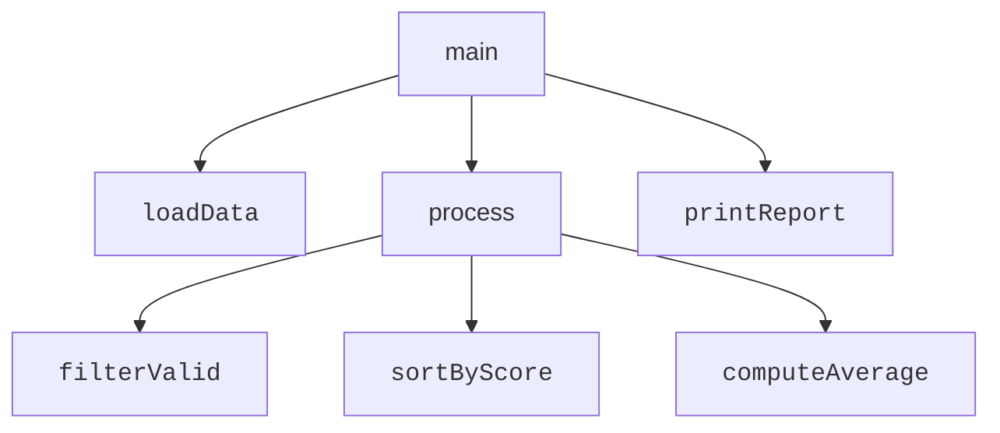
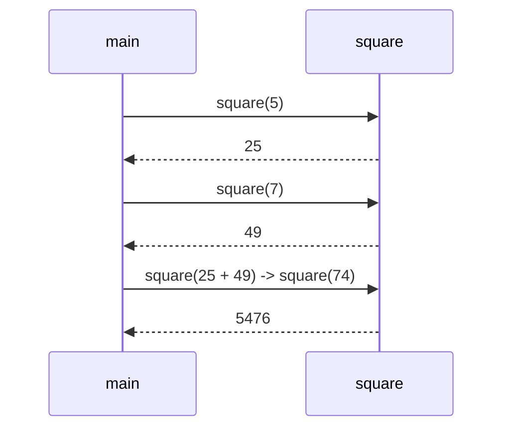

A **method** is a named, reusable block of code that takes some
inputs (called **parameters**) and (optionally) produces an output
(its **return value**). In other languages a similar idea is called
a *function* or *procedure*. In Java, all methods belong to a class,
which is why we always call them *methods*.

If variables are *nouns*, methods are *verbs*.

<svg
  viewBox="0 0 640 230"
  role="img"
  aria-label="Three identical code clusters stacked in one card all reach along thin gray lines to a single named green capsule, which alone produces the result — write the pattern once, call it by name"
  style={{ display: "block", width: "100%", maxWidth: "640px", height: "auto", margin: "2.5rem auto" }}
>
  <g stroke="var(--ds-gray-300)" strokeWidth="2">
    <line x1="196" y1="48" x2="350" y2="115" />
    <line x1="196" y1="108" x2="350" y2="115" />
    <line x1="196" y1="168" x2="350" y2="115" />
  </g>
  <rect x="80" y="24" width="180" height="182" rx="14" fill="currentColor" opacity="0.05" />
  <circle cx="110" cy="48" r="6" fill="var(--ds-blue-500)" />
  <rect x="126" y="42" width="13" height="13" rx="4" fill="var(--ds-green-500)" />
  <rect x="148" y="44" width="40" height="8" rx="4" fill="var(--ds-blue-500)" fillOpacity="0.4" />
  <circle cx="110" cy="108" r="6" fill="var(--ds-blue-500)" />
  <rect x="126" y="102" width="13" height="13" rx="4" fill="var(--ds-green-500)" />
  <rect x="148" y="104" width="40" height="8" rx="4" fill="var(--ds-blue-500)" fillOpacity="0.4" />
  <circle cx="110" cy="168" r="6" fill="var(--ds-blue-500)" />
  <rect x="126" y="162" width="13" height="13" rx="4" fill="var(--ds-green-500)" />
  <rect x="148" y="164" width="40" height="8" rx="4" fill="var(--ds-blue-500)" fillOpacity="0.4" />
  <rect x="350" y="88" width="170" height="54" rx="27" fill="var(--ds-green-500)" />
  <g style={{ color: "var(--ds-white)" }} fill="currentColor" fillOpacity="0.9">
    <rect x="376" y="102" width="56" height="9" rx="4.5" />
    <rect x="446" y="101" width="13" height="13" rx="4" />
  </g>
  <g fill="var(--ds-gray-400)">
    <rect x="528" y="113.5" width="32" height="3" rx="1.5" />
    <polygon points="558,109.5 569,115 558,120.5" />
  </g>
  <circle cx="590" cy="115" r="8" fill="var(--ds-blue-500)" />
</svg>

## Why methods exist

Imagine writing a 500-line `main` method that does everything. By
the time you reach line 400, even you have forgotten what lines
100-200 do. The fix is to give each chunk a *name* — a method — and
*call* the method from `main`.

A well-designed Java program reads, at the top level, like a
**story**: short sentences, each delegating to a method whose name
makes its intent obvious.



This is **modularity**: each method is a small module that does one
thing.

## Anatomy of a method

```java
returnType methodName(paramType paramName, ...) {
    // body
    return someValue;     // unless returnType is void
}
```

A few rules:

- The **return type** says what kind of value the method gives back.
  Use `void` if it returns nothing.
- The **name** should be a verb or short verb phrase: `add`,
  `printReport`, `findLargest`. Lower-case first letter, camelCase
  for multi-word names.
- The **parameters** are local variables that are initialized from
  the caller's arguments.
- `return` immediately ends the method and gives its argument back
  to the caller.

## A first example

<CodeBlock
  adapter="java"
  files={[
    {
      filename: "main.java",
      starterCode: `public class Main {
  public static void main(String[] args) {
    int a = square(5);
    int b = square(7);
    int c = square(a + b);

    System.out.println("a = " + a);
    System.out.println("b = " + b);
    System.out.println("c = " + c);
  }

  static int square(int x) { return x * x; }
}
`,
    },
  ]}
/>

Notice:

- `square` is declared `static` because we are calling it from another
  `static` method (`main`) without first creating an object. We'll
  drop `static` in the next chapter when methods belong to instances.
- The caller passes a value; the method receives it as a *new local
  variable* `x`. Changing `x` inside `square` would not affect the
  caller.

## A call diagram



Each call is a tiny, self-contained conversation. `main` doesn't
care *how* `square` does its job; it only trusts that the return
value is the square of the argument.

## Why short methods are better than long ones

A few rules of thumb that have served programmers well for decades:

- **A method should do one thing.** If you find yourself writing the
  word "and" in its description, split it.
- **A method should fit on a screen.** Roughly: 5-20 lines.
  Occasionally longer for genuinely linear sequences, but rarely.
- **A method's name should be honest.** If `compute()` also prints
  to the screen, rename it to `computeAndPrint`, or split it.

These rules are not bureaucracy. They are how you keep your
codebase from collapsing under its own weight (recall the software
crisis from chapter one).

## A multi-method example

Let's compute the average and the maximum of a list of integers,
each in its own method.

<CodeBlock
  adapter="java"
  files={[
    {
      filename: "main.java",
      starterCode: `public class Main {
  public static void main(String[] args) {
    int[] scores = {72, 85, 90, 64, 91, 78};

    int avg = average(scores);
    int max = maximum(scores);

    System.out.println("average = " + avg);
    System.out.println("maximum = " + max);
  }

  static int sum(int[] xs) {
    int s = 0;
    for (int x : xs)
      s += x;
    return s;
  }

  static int average(int[] xs) { return sum(xs) / xs.length; }

  static int maximum(int[] xs) {
    int m = xs[0];
    for (int i = 1; i < xs.length; i++) {
      if (xs[i] > m)
        m = xs[i];
    }
    return m;
  }
}
`,
    },
  ]}
/>

Read `main`. You can understand the *story* — load scores, take the
average, take the maximum, print both — without reading the bodies
of `sum`, `average`, or `maximum`. The methods provide
**abstraction**: callers see the *what*, not the *how*.

If tomorrow someone discovers a faster way to compute the maximum,
they can replace `maximum`'s body without touching `main`.

## Parameters: by value, by reference (almost)

This is a subtle point and worth stating once carefully.

When you call a method, the arguments are **copied** into the
parameters. For primitives, that means the value itself is copied
(so changes inside the method don't affect the caller). For
reference types, the *reference* (the address) is copied — but it
still points at the same object on the heap, so the method *can*
mutate the object's contents.

<CodeBlock
  adapter="java"
  files={[
    {
      filename: "main.java",
      starterCode: `public class Main {
  public static void main(String[] args) {
    int x = 5;
    bumpInt(x);
    System.out.println("after bumpInt, x = " + x); // still 5

    int[] arr = {1, 2, 3};
    bumpAll(arr);
    System.out.print("after bumpAll, arr = ");
    for (int v : arr)
      System.out.print(v + " ");
    System.out.println(); // 2 3 4
  }

  static void bumpInt(int n) {
    n = n + 1; // changes local copy only
  }

  static void bumpAll(int[] xs) {
    for (int i = 0; i < xs.length; i++) {
      xs[i] = xs[i] + 1; // changes the actual array
    }
  }
}
`,
    },
  ]}
/>

This trips up nearly every Java beginner once. Take it slowly.

## Method overloading

Java lets you have multiple methods with the same name, as long as
their **parameter lists** differ. The compiler picks the right one
based on the argument types.

<CodeBlock
  adapter="java"
  files={[
    {
      filename: "main.java",
      starterCode: `public class Main {
  public static void main(String[] args) {
    System.out.println(area(5));       // square
    System.out.println(area(3, 4));    // rectangle
    System.out.println(area(3.14, 5)); // ellipse, sort of
  }

  static int area(int side) { return side * side; }
  static int area(int width, int height) { return width * height; }
  static double area(double r1, double r2) { return Math.PI * r1 * r2; }
}
`,
    },
  ]}
/>

This is purely a convenience for readers — the same *name* across
methods that conceptually do the same thing for different inputs.

<MultipleChoice
  markdown={`Why do we group instructions into methods?

- Because the compiler runs them faster
  > Method boundaries are not a speed optimization here.
- Because Java requires more than one method per class
  > It doesn't.
- [o] To give each chunk of logic a name, so the whole program reads as a story of small, named ideas
  > Modularity helps humans, not the compiler.
- Because variables can only exist inside methods
  > They can exist in classes too (fields).`}
/>

<MultipleChoice
  markdown={`What does a method's *return type* declare?

- The maximum size of its body
  > No.
- [o] The kind of value the method gives back to its caller (or \`void\` if none)
  > The return type names what comes back out of the method.
- The number of parameters the method takes
  > That's the parameter list.
- The name of the variable it stores its result in
  > Storage is the caller's choice.`}
/>

## A small multi-file challenge

Write a `MathTools` class with two methods, and a `Main` that uses
them. Use small, single-purpose methods.

<ChallengeCard
  adapter="java"
  title="MathTools with min and max"
  instructions={`Implement a class \`MathTools\` with two **static** methods:

- \`int min(int[] xs)\` — return the smallest element.
- \`int max(int[] xs)\` — return the largest element.

\`Main.java\` is fixed; it calls both and prints:

\`\`\`
min = 2
max = 91
\`\`\``}
  entryFilename="Main.java"
  files={[
    {
      filename: "Main.java",
      starterCode: `public class Main {
  public static void main(String[] args) {
    int[] xs = {72, 85, 91, 2, 64, 78};
    System.out.println("min = " + MathTools.min(xs));
    System.out.println("max = " + MathTools.max(xs));
  }
}
`,
    },
    {
      filename: "MathTools.java",
      starterCode: `public class MathTools {
  // TODO: implement static int min(int[] xs)
  // TODO: implement static int max(int[] xs)
}
`,
      solutionCode: `public class MathTools {
  public static int min(int[] xs) {
    int m = xs[0];
    for (int i = 1; i < xs.length; i++) {
      if (xs[i] < m)
        m = xs[i];
    }
    return m;
  }

  public static int max(int[] xs) {
    int m = xs[0];
    for (int i = 1; i < xs.length; i++) {
      if (xs[i] > m)
        m = xs[i];
    }
    return m;
  }
}
`,
    },
  ]}
  tests={[
    {
      id: "minmax",
      name: "Computes the correct min and max",
      expect: {
        stdoutLines: ["min = 2", "max = 91"],
        stdoutLinesExact: true,
      },
    },
  ]}
/>

You can now build small, well-organized procedural programs. Next we
take the much bigger step that the whole story of this course has
been pointing toward: **objects and classes**.
