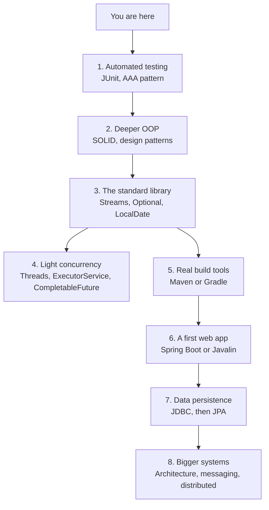

You have travelled a long way. From the story of how Java was
born, through computational thinking, classes and objects, the
JVM, memory, collections, exceptions, debugging, simple
algorithms, software organization, and a capstone, you now have
the *vocabulary* and the *mental models* of a Java programmer.

<Figure
  slug="java-next-steps-cutout"
  alt="Where to go next, an isometric illustration"
/>

This short page is your roadmap forward.

## What you can already do

Take a moment to recognize what you've built. You can now:

- Read and write small Java programs with multiple classes.
- Reason about objects on the heap and frames on the stack.
- Pick the right collection (List, Set, Map) for a problem.
- Throw, catch, and design with exceptions.
- Debug methodically with prints, invariants, and the "five whys."
- Structure a small program into focused, well-named classes.

That is the *real* foundation. Everything else is variations on
these themes.

## Where to go next

Below is a suggested order. You don't have to follow it strictly,
follow whichever branch excites you most.

### 1. Automated testing with JUnit

The single highest-value next topic. Once you can write tests, every
future skill you learn compounds, you can experiment confidently,
refactor without fear, and prove your code does what you claim.

Focus on:

- Writing tests in the "arrange / act / assert" shape.
- Testing one behavior per test, with a clear name.
- Using assertions like `assertEquals`, `assertThrows`.
- Test-driven development (TDD) as an *exercise*, write the test
  first, watch it fail, write code to pass it.

### 2. Deeper OOP

You learned the *mechanics* of OOP. The next step is the *taste*:
the SOLID principles, common design patterns (strategy, factory,
observer, decorator), and when *not* to apply them. The book
*Refactoring* by Martin Fowler and *Effective Java* by Joshua Bloch
are the classics.

### 3. The modern standard library

Java has evolved a lot since the early days. Two big wins for
beginners:

- **Streams** (`list.stream().filter(...).map(...).collect(...)`),
  a declarative way to transform collections.
- **`Optional<T>`**, a type that explicitly says "this value may
  be absent," a better answer than `null`.
- **`java.time`** (`LocalDate`, `Instant`, `Duration`), the modern
  way to handle dates and times.

### 4. A taste of concurrency

Programs that do *more than one thing at once*, handling many
users, talking to several services, doing background work, are
the rule, not the exception. Start with:

- `Thread` and `Runnable`: the absolute basics.
- `ExecutorService`: the "thread pool" you'll actually use.
- `CompletableFuture`: composing asynchronous work.
- The general dangers: race conditions, deadlocks.

You do **not** need to become a concurrency expert to be a working
Java engineer. You do need to recognize when a problem is
concurrent and reach for the right tool.

### 5. Real build tools

For tiny programs `javac` is enough. For anything larger, the world
runs on **Maven** or **Gradle**. These tools manage your
dependencies, compile your code, run your tests, and package the
result. Learn one of them well; the other will then make sense.

### 6. A first web application

Most jobs that say "Java developer" mean "Java backend developer."
The dominant ecosystem is **Spring Boot**, but a lightweight
framework like **Javalin** is gentler for a first encounter. Build
a tiny REST API that does CRUD on a domain you care about.

### 7. Data persistence

Real programs talk to databases. Start with raw **JDBC** to
understand what is actually happening at the SQL/network level.
Only then move to **JPA / Hibernate**, frameworks make sense once
you've felt the problem they solve.

### 8. Bigger systems

When you're comfortable with all of the above, study how *many*
services cooperate: messaging (Kafka, RabbitMQ), service-to-service
calls, observability (logs, metrics, traces), and how teams divide
ownership. Books like *Designing Data-Intensive Applications* by
Martin Kleppmann are excellent reading at this point.

## Habits to keep practicing

The technologies change. These habits don't.

- **Read other people's code.** Open-source Java projects are
  free education. Even just reading the standard library's
  `ArrayList` source teaches you a lot.
- **Write small programs often.** A 50-line script that solves a
  real annoyance teaches more than a textbook chapter.
- **Refactor relentlessly.** Whenever you understand your code
  better than when you wrote it, change the code to match.
- **Take pride in names.** A great name now saves an hour of
  someone's life next year.
- **Debug methodically, not frantically.** Observe, hypothesize,
  test, update. Always.

## A closing thought

The reason Java has lasted 30 years is not because it is the
prettiest language. It is because it makes it *possible* for
large teams of imperfect humans to build large systems that keep
working. The OOP discipline, the JVM, the strict type system, and
the deep standard library are all in service of that goal.

You now share that discipline. Welcome to the craft.

Happy hacking.
