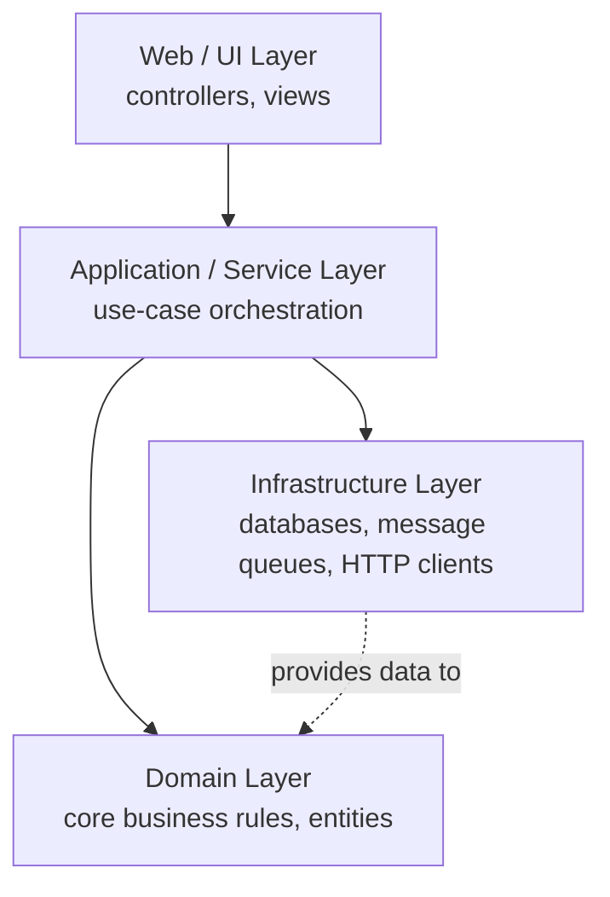
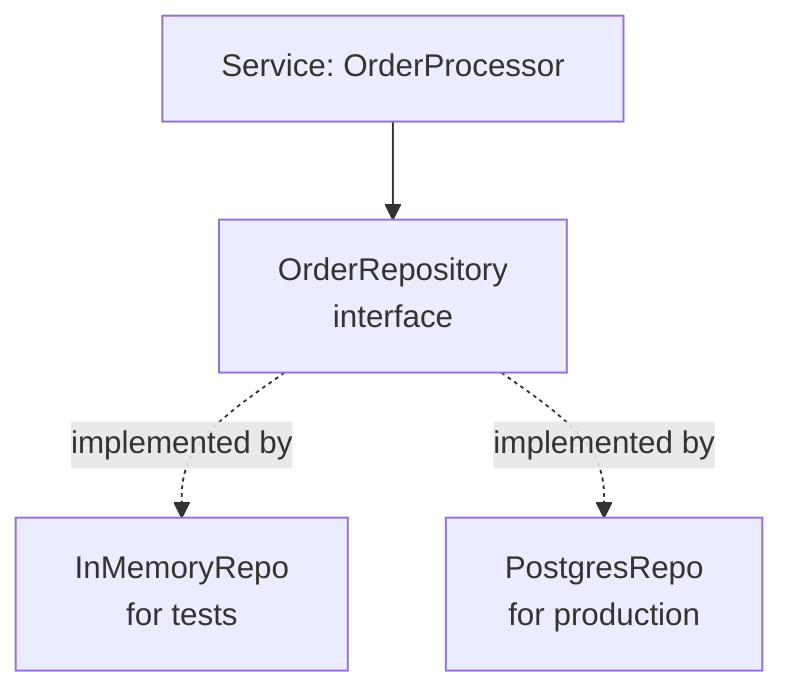
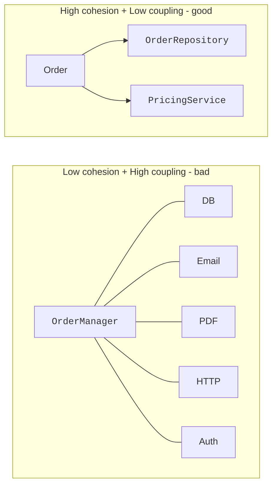

A program of two classes fits in your head. A program of two
*thousand* classes does not. **Software organization** is the
collection of conventions and patterns that let humans keep
reasoning about large codebases as if they were small ones.

<Figure
  slug="java-software-organization-cutout"
  alt="Software organization, an isometric illustration"
/>

This page is a conceptual tour. You will not write a 2,000-class
system here, but you will leave with mental models that scale.

## Packages: physical organization

A Java **package** is a folder for related classes. Every class
belongs to exactly one package, declared at the top of the file:

```java
package com.acme.billing;

public class Invoice { ... }
```

By convention:

- Packages are lowercase, with dots: `com.acme.billing`,
  `org.openrobot.vision`.
- The convention `com.<organization>.<project>.<area>` is used to
  guarantee globally unique names, important when libraries from
  many sources end up in the same program.
- Folder structure on disk mirrors the package: `src/com/acme/billing/Invoice.java`.

<Figure
  slug="java-software-organization-packages-physical-organization-inline-cutout"
  alt="A rack of labelled folders, each holding cards of one kind only"
  caption="Packages put each kind of class in its own labelled place."
/>

Packages have two practical benefits:

1. **Naming.** Two different libraries can both have a `Logger`
   class, as long as one is `com.acme.logging.Logger` and the
   other is `org.tinylogs.Logger`. No collision.
2. **Visibility.** Classes and members declared with no access
   modifier are **package-private**, visible only inside the same
   package. This lets a package expose a *small* public API while
   keeping internals hidden from outsiders.

## Layered architecture

The most common shape for a non-trivial Java application is a
**layered architecture**. Each layer has a focused job and only
talks to the layer immediately below it.

<Figure
  slug="java-software-organization-layered-architecture-inline-cutout"
  alt="A stack of platforms where every support runs downward, and one support drawn upward struck through"
  caption="Higher layers may depend on lower ones, and never the other way round."
/>



What lives where:

- **UI / Web:** translates external requests (HTTP, CLI, GUI
  events) into method calls, and translates results back into
  responses.
- **Application / Service:** orchestrates a use case end to end,
  "place an order", by coordinating multiple domain operations.
- **Domain:** the *heart* of the application, the classes that
  model your problem. `Order`, `Invoice`, `Customer`, with their
  rules. These should be the most stable, most carefully designed
  classes in the system.
- **Infrastructure:** the messy outside world, databases, network
  calls, file systems. Usually hidden behind interfaces.

The chief discipline of layering: **higher layers may depend on
lower layers; lower layers must not depend on higher layers.** The
domain should never know about HTTP. If it does, you cannot test
it or reuse it.

## Depend on interfaces, not on implementations

We met this idea in the interfaces chapter; here we see why it
matters at the system level.



`OrderProcessor` calls methods on an `OrderRepository` interface. It
doesn't know if the implementation is in-memory, in Postgres, in
a mock, or in something brand new. That single design choice makes
the service:

- **Testable**, swap in a fake `OrderRepository` in a unit test.
- **Portable**, swap Postgres for something else and the service
  doesn't change.
- **Comprehensible**, when reading `OrderProcessor`, you don't
  need to know SQL.

This pattern goes by many names, dependency inversion, ports and
adapters, hexagonal architecture. They are all the same shape.

## A tour of a tiny real-shaped project

Imagine a small library checkout system. A reasonable package
layout:

```text
src/main/java/
└── com/acme/library/
    ├── domain/
    │   ├── Book.java
    │   ├── Loan.java
    │   └── Member.java
    ├── application/
    │   └── CheckoutService.java
    ├── infrastructure/
    │   ├── InMemoryBookRepository.java
    │   └── InMemoryLoanRepository.java
    ├── web/
    │   └── LoansController.java         // accepts HTTP requests
    └── Main.java                         // wires everything up at startup
```

Six classes, four packages, four layers. From the outside, the
shape is exactly the same as a 200-class enterprise codebase.

The wiring at startup, creating the infrastructure objects, handing
them to the service, handing the service to the controller, is
called **composition root**. In small programs it's a few lines of
`new`. In larger programs, frameworks like Spring do it for you,
but the *idea* is identical.

## Cohesion and coupling

Two old, vital words:

- **Cohesion:** how closely the things inside one module are
  related. *High* cohesion is good. A class whose fields and
  methods all serve one purpose has high cohesion.
- **Coupling:** how many of one module's details another module
  knows about. *Low* coupling is good. A class that interacts with
  three others through a single, clear interface has low coupling.

The phrase to remember: **high cohesion, low coupling.** It is the
two-word summary of *every* opinion about software architecture
ever written.



## Architecture is the *outline* of the code

Software architecture is sometimes treated as something separate
from "real coding." It is not. **Architecture is the shape of the
code.** Every time you decide which class owns a piece of state,
which package something goes in, which method calls which, you
are *practicing* architecture.

<Figure
  slug="java-software-organization-architecture-outline-code-inline-cutout"
  alt="A plan of rooms and doorways drawn out before a single bench is carried in"
  caption="Architecture is the shape of the code, decided before there is much code to shape."
/>

Good architecture is the same thing as good *organization*: when
something needs to change, only a small part of the system needs to
change. When something needs to be understood, only a small part
needs to be read.

That is the entire game.

<MultipleChoice
  markdown={`Which is the single best summary of "good architecture"?

- "Write the fewest possible classes"
  > Smallness isn't the same as good structure.
- "Use the latest frameworks"
  > Not architecture.
- "Make every class depend on every other class for flexibility"
  > That's the opposite of low coupling.
- [o] "When something needs to change, only a small, predictable part of the system needs to change"
  > Sometimes called the "locality of change" principle.`}
/>

<MultipleChoice
  markdown={`Why is it a problem when the *domain* layer depends on the *infrastructure* layer (e.g., on database classes)?

- [o] It couples the core business rules to a specific technology choice, making the domain hard to test, hard to reuse, and hard to evolve as the infrastructure changes
  > The domain should stay independent of databases and frameworks so it can be tested and reused freely.
- It causes a stack overflow
  > It does not.
- The compiler refuses to allow it
  > It allows it; this is a design rule, not a compiler rule.
- It makes the program faster
  > It does not make it faster.`}
/>

<MultipleChoice
  markdown={`The two-word summary of every architectural principle you'll ever read is:

- "Many classes"
  > Not the summary.
- "Latest framework"
  > Not the summary.
- "Fast code"
  > Not the summary.
- [o] "High cohesion, low coupling"
  > Keep related things together and minimize how much one module must know about another.`}
/>

You have now seen the conceptual machinery of organizing software
of any size. The next page is the capstone: put many of these
ideas to work in a single, multi-file challenge that ties the
whole course together.
