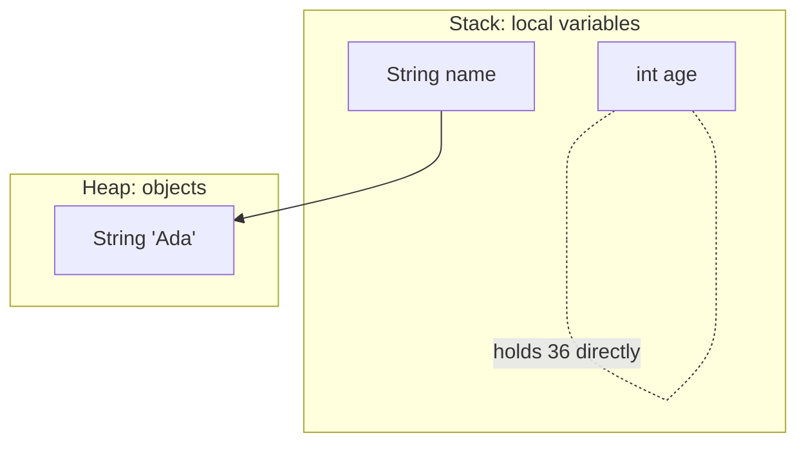

A **type** is a category of value, together with the operations that
make sense on that value. `int` is a type. So is `String`, `boolean`,
`double`, and (later) every class you ever write. The set of rules
that says "this kind of value can be used in this place, but not
that one" is the **type system**.

<Figure
  slug="java-the-type-system-cutout"
  alt="The type system, an isometric illustration"
/>

Java's type system is **strict** and **static**.

- **Strict** means Java will refuse to mix incompatible types
  silently. `"hello" + 5` is allowed because Java defines a way
  (string concatenation). `"hello" - 5` is not, and the compiler
  will say so.
- **Static** means types are checked at compile time, *before* the
  program runs. If your code has a type mistake, you find out the
  moment you try to build, not three hours into a production run.

This is one of the deepest reasons Java is loved for big software.
A whole category of bugs is caught before the program even starts.

## Java's primitive types

We met these last lesson, but here is the complete list, with the
range of values each can hold:

| Type | Holds | Range |
| --- | --- | --- |
| `byte` | small integer | -128 to 127 |
| `short` | integer | about ±32,000 |
| `int` | integer | about ±2.1 billion |
| `long` | huge integer | about ±9 × 10¹⁸ |
| `float` | single-precision decimal | ~7 digits of precision |
| `double` | double-precision decimal | ~15 digits of precision |
| `boolean` | truth value | `true` or `false` |
| `char` | one Unicode code unit | `'A'`, `'7'`, `'你'` |

In practice you will use **`int`, `long`, `double`, `boolean`, and
`char`** for almost everything. The others exist but are rare.

## Reference types

Everything that is *not* a primitive is a **reference type**. That
includes:

- Every class (`String`, `Scanner`, `ArrayList`, any class you
  write).
- Every array (`int[]`, `String[]`, etc).
- Every interface (we'll meet these soon).

We saw last lesson that a reference variable holds an address to an
object on the heap. The *type* of the variable tells the compiler
what kinds of things you can ask that object to do.



## What the compiler checks

The Java compiler reads your source code and looks at every
expression. For each one it asks:

1. Is this operation defined for these types?
2. Is this value being used in a place that expects this type?

For example:

```java
int x = 5;
String s = "hello";

int y = x + 1;     // OK: int + int = int
String t = s + x;  // OK: Java defines String + int (concatenation)
int z = s + x;     // ERROR: cannot assign a String to an int

boolean done = x > 0;    // OK: > on ints returns a boolean
boolean wat  = x + s;    // ERROR: result is a String, not boolean
```

Each error message is your friend. Read it. It tells you exactly
which line, which expression, and what type it expected versus what
it got.

<CodeBlock
  adapter="java"
  files={[
    {
      filename: "main.java",
      starterCode: `public class Main {
  public static void main(String[] args) {
    int x = 5;
    String s = "hello";

    System.out.println(x + 1);      // 6
    System.out.println(s + x);      // "hello5"
    System.out.println(x > 0);      // true
    System.out.println("x = " + x); // "x = 5"
  }
}
`,
    },
  ]}
/>

## Implicit widening, explicit narrowing

Sometimes Java will quietly convert one number type to another *if
no information would be lost*. This is called **widening**.

```java
int    a = 5;
double b = a;        // OK: every int fits in a double
```

The other direction, fitting a bigger type into a smaller one,
*could* lose information, so Java refuses unless you explicitly
ask:

```java
double pi = 3.14;
int    n  = (int) pi;   // explicit narrowing cast, n becomes 3
```

The `(int) pi` is a **cast**: a programmer-asserted "yes I know I
might lose information, do it anyway." The fractional part is
chopped off.

If forcing you to *write out* that assertion seems pedantic,
consider the most expensive type conversion in history. On June 4,
1996, the first Ariane 5 rocket veered off course and self-destructed
about forty seconds after liftoff, scattering its uninsured
scientific payload over French Guiana. The inquiry board traced the
failure to a single conversion in guidance software reused from the
older Ariane 4: a 64-bit floating-point value describing the rocket's
horizontal velocity was converted to a 16-bit integer. Ariane 5 flew
faster than Ariane 4, the value no longer fit, the conversion
overflowed, the resulting error shut down the guidance computers, and
the rocket was lost. Java's insistence that narrowing conversions be
explicit, visible, greppable, reviewable, exists precisely so that
this kind of silent information loss cannot hide in a million-line
codebase.

<CodeBlock
  adapter="java"
  files={[
    {
      filename: "main.java",
      starterCode: `public class Main {
  public static void main(String[] args) {
    int a = 5;
    double b = a; // widening
    System.out.println("b = " + b);

    double pi = 3.14;
    int n = (int)pi; // narrowing
    System.out.println("n = " + n);
  }
}
`,
    },
  ]}
/>

## Type inference with `var`

Modern Java (10+) lets you write `var` instead of the explicit type
for local variables. Java infers the type from the right-hand side:

```java
var name  = "Ada";        // inferred as String
var year  = 1815;         // inferred as int
var ratio = 0.5;          // inferred as double
```

`var` is *not* dynamic typing. The type is fixed at the moment of
declaration; it just isn't typed out. We will use `var` sparingly in
this course because explicit types are more pedagogically helpful.

## Strings are not primitive

`String` is a *class*, not a primitive. But it has so much syntactic
support (the `""` literal, the `+` concatenation operator) that
beginners often think of it as primitive. Worth knowing:

- A string literal `"hello"` is an instance of the `String` class.
- Strings are **immutable**, once created, their contents cannot
  change. `s = s + "!"` does not change the old string; it creates a
  new one and points `s` at it.
- Common methods: `s.length()`, `s.toUpperCase()`, `s.toLowerCase()`,
  `s.substring(start, end)`, `s.indexOf(other)`, `s.equals(other)`.

> **Never** use `==` to compare strings. `==` compares references
> (addresses), not contents. Use `s.equals(other)`. This is one of
> the most common beginner bugs in Java.

<CodeBlock
  adapter="java"
  files={[
    {
      filename: "main.java",
      starterCode: `public class Main {
  public static void main(String[] args) {
    String a = "java";
    String b = a.toUpperCase();

    System.out.println("a = " + a); // unchanged
    System.out.println("b = " + b);
    System.out.println("length(a) = " + a.length());

    String greet = "Hello, world!";
    System.out.println(greet.substring(7, 12)); // "world"
  }
}
`,
    },
  ]}
/>

## Why all this is *good* news, not bad news

It can feel, at first, like Java is being annoying. "Why does it
yell at me about types when Python just runs the program?"

Because Java is doing free debugging on your behalf. Every type
mismatch caught at compile time is a bug you will never have to
diagnose at 3 AM in production. In small scripts the cost outweighs
the benefit; in large systems, it is the other way around.

This is also why we open *every* file with a class declaration, and
why every variable has an explicit type. Java is a language that
puts *the structure of your data* into the code itself, where the
compiler can see and check it.

<MultipleChoice
  markdown={`Why does Java check types at *compile* time?

- [o] To catch type mistakes before the program runs, so an entire category of bugs is impossible in production
  > Static typing trades upfront strictness for runtime safety.
- To make the source files smaller
  > Type checks do not change file size.
- To prevent the JVM from running too slowly
  > Type checks help safety, not raw speed.
- Because Java was designed before runtime type checking existed
  > Runtime type checking has existed forever; Java's choice is intentional.`}
/>

<MultipleChoice
  markdown={`Which of these comparisons of two \`String\` values is *correct* for checking that their contents are the same?

- [o] \`a.equals(b)\`
  > \`equals\` on String compares the actual character contents.
- \`a.compareTo(b) == 1\`
  > That is true only for a specific ordering, not equality.
- \`a + b\`
  > That concatenates, it doesn't compare.
- \`a == b\`
  > That compares references, not contents.`}
/>

## A small challenge

<ChallengeCard
  adapter="java"
  title="Convert between types"
  instructions={`Given a \`double\` named \`celsius\`, convert it to \`fahrenheit\` using \`F = C * 9 / 5 + 32\`. Also produce an integer rounded version (\`int rounded\`) by casting. Print exactly:

\`\`\`
fahrenheit = F
rounded = R
\`\`\`

where F is the \`double\` value and R is the cast-to-int value.`}
  entryFilename="Main.java"
  files={[
    {
      filename: "Main.java",
      starterCode: `public class Main {
  public static void main(String[] args) {
    double celsius = 36.6;

    // TODO: compute fahrenheit and rounded
  }
}
`,
      solutionCode: `public class Main {
  public static void main(String[] args) {
    double celsius = 36.6;

    double fahrenheit = celsius * 9 / 5 + 32;
    int rounded = (int)fahrenheit;

    System.out.println("fahrenheit = " + fahrenheit);
    System.out.println("rounded = " + rounded);
  }
}
`,
    },
  ]}
  tests={[
    {
      id: "temp",
      name: "Converts and rounds correctly",
      expect: {
        stdoutLines: ["fahrenheit = 97.88000000000001", "rounded = 97"],
        stdoutLinesExact: true,
      },
    },
  ]}
/>

Types are how Java holds the structure of your program steady while
it grows. Next we learn how programs *make decisions*, `if`,
`else`, and the various forms of looping.
