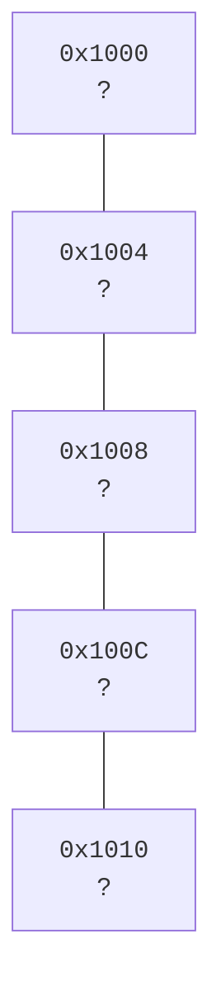
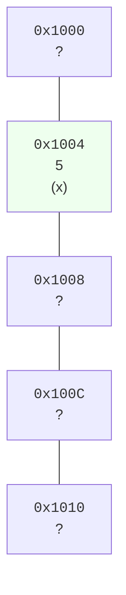
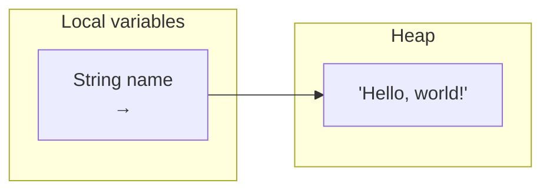

A **variable** is a name for a place in memory where a value lives.
That sentence is doing a lot of work. Let's unpack it slowly, with
pictures.

<Figure
  slug="java-variables-and-memory-cutout"
  alt="Variables and memory, an isometric illustration"
/>

## Memory as a row of boxes

Imagine the computer's memory as a giant row of boxes. Each box can
hold a small amount of data. Each box has an **address** (a number),
and each box has **contents** (the data).



When you write `int x = 5;`, three things happen:

1. Java reserves one of those boxes for you.
2. Java associates the *name* `x` with that box's address.
3. Java writes the value `5` into the box.



From now on, when your code says `x`, Java will look up that box and
use its contents. When your code says `x = 7`, Java goes to the box
and overwrites its contents.

You will essentially never need to know the actual addresses. You just
need to know that *boxes exist* and that *each variable name points
at one*.

<CodeBlock
  adapter="java"
  files={[
    {
      filename: "main.java",
      starterCode: `public class Main {
  public static void main(String[] args) {
    int x = 5;
    System.out.println("x is " + x);

    x = 7;
    System.out.println("x is now " + x);

    int y = x + 3;
    System.out.println("y is " + y);
  }
}
`,
    },
  ]}
/>

Notice that `=` is **not** an equation. `x = 7` does not mean "x
equals 7" forever. It means "go to the box called x and put 7 in
it." (Mathematicians, you have been warned.)

## Declaring vs assigning

There are two distinct actions:

- **Declaration.** "Reserve a box, call it `x`, and remember that
  whatever goes in it will be of type `int`." Written `int x;`.
- **Assignment.** "Put this value in the box `x`." Written
  `x = 5;`.

You can do both at once: `int x = 5;`. You usually do.

You cannot use a local variable before assigning to it. The Java
compiler will refuse:

```java
int x;
System.out.println(x);   // ERROR: variable x might not have been initialized
```

This is one of those "annoying" rules that has saved millions of
hours of debugging.

## Primitive types: numbers, booleans, characters

Java has eight **primitive** types. These are the basic kinds of
value that fit directly inside a box. The most important ones for
beginners:

| Type | What it holds | Example | Approx size |
| --- | --- | --- | --- |
| `int` | a whole number, ~ -2 billion to 2 billion | `42` | 4 bytes |
| `long` | a very large whole number | `42L` | 8 bytes |
| `double` | a fractional number | `3.14` | 8 bytes |
| `boolean` | `true` or `false` | `true` | (1 bit logically) |
| `char` | a single character | `'A'` | 2 bytes |

We will rarely worry about exact sizes. The key idea is that the
type tells Java **how big the box is and how to interpret its
contents**.

## Reference types: the box holds a pointer

Not everything fits in a tiny box. A `String` like
`"Hello, world!"` is too big to inline. So Java uses a trick: the
box for a reference variable does not hold the data itself. It
holds **the address of** the data, which lives elsewhere in memory
(on the **heap**).



We will treat the heap in detail when we discuss objects. For now,
just know that:

- Primitive variables hold the value directly.
- Reference variables (like `String`, or any class) hold a
  *reference* to a value living somewhere else.

This distinction will come back to bite you in subtle ways. Be
patient, every Java programmer eventually internalizes it.

## What `final` means

A variable declared with `final` cannot be reassigned after its
first assignment. It is a *commitment*.

<CodeBlock
  adapter="java"
  files={[
    {
      filename: "main.java",
      starterCode: `public class Main {
  public static void main(String[] args) {
    final int LIMIT = 100;
    System.out.println("LIMIT = " + LIMIT);

    // Uncomment to see the compiler refuse:
    // LIMIT = 200;
  }
}
`,
    },
  ]}
/>

Use `final` for values that should never change after being set. It
makes your code more readable and prevents a whole class of bugs.

## Variable scope: where a name is alive

A variable only exists inside the `{ ... }` block it was declared
in. Outside that block, the name is unknown.

<CodeBlock
  adapter="java"
  files={[
    {
      filename: "main.java",
      starterCode: `public class Main {
  public static void main(String[] args) {
    int outer = 10;

    if (outer > 5) {
      int inner = 20;
      System.out.println("inner = " + inner);
      System.out.println("outer = " + outer);
    }

    // 'inner' does not exist here, uncommenting the next line breaks the
    // build: System.out.println("inner outside = " + inner);

    System.out.println("outer = " + outer);
  }
}
`,
    },
  ]}
/>

Scope is what keeps local variables from interfering with each
other across different parts of the program.

<MultipleChoice
  markdown={`What does \`int x = 5;\` *do*, mechanically?

- [o] It declares a variable x of type int and stores the value 5 in it
  > Declaration + initial assignment.
- It defines a function called x
  > No, this is a variable declaration, not a function.
- It creates a permanent constant called x
  > That would require \`final\`.
- It checks whether x is mathematically equal to 5
  > That would be a comparison, written \`x == 5\`.`}
/>

<MultipleChoice
  markdown={`How is a \`String\` variable in Java different from an \`int\` variable?

- A String cannot be declared without \`final\`
  > It can.
- [o] An int holds its value directly; a String variable holds a reference to a String object stored elsewhere in memory
  > Primitives are inlined; reference types hold pointers.
- They are stored identically
  > They are not.
- A String can hold more characters than an int
  > That's about *what they hold*, not the mechanism.`}
/>

## A small challenge

<ChallengeCard
  adapter="java"
  title="Compute a rectangle's perimeter and area"
  instructions={`Given two \`int\` variables \`width\` and \`height\` (already set), compute the rectangle's *perimeter* and *area* and print:

\`\`\`
perimeter = P
area = A
\`\`\`

where \`P = 2 * (width + height)\` and \`A = width * height\`.`}
  entryFilename="Main.java"
  files={[
    {
      filename: "Main.java",
      starterCode: `public class Main {
  public static void main(String[] args) {
    int width = 7;
    int height = 4;

    // TODO: compute perimeter and area, and print exactly:
    // perimeter = 22
    // area = 28
  }
}
`,
      solutionCode: `public class Main {
  public static void main(String[] args) {
    int width = 7;
    int height = 4;

    int perimeter = 2 * (width + height);
    int area = width * height;

    System.out.println("perimeter = " + perimeter);
    System.out.println("area = " + area);
  }
}
`,
    },
  ]}
  tests={[
    {
      id: "rect",
      name: "Computes perimeter and area",
      expect: {
        stdoutLines: ["perimeter = 22", "area = 28"],
        stdoutLinesExact: true,
      },
    },
  ]}
/>

Variables are the *workspace* of every program. We now move on to
the *labels*, Java's type system, which is what makes Java
especially trustworthy for big software.
