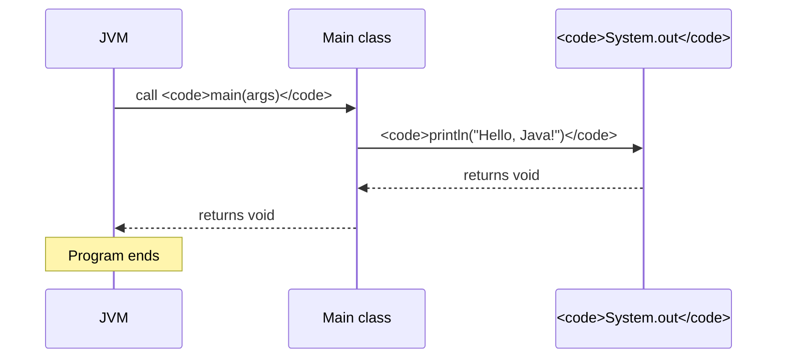

It is time to write Java for real. We will take the tiniest possible
useful program and explain *every single piece of it*. By the end of
this page, no Java program should ever look intimidating again, only
larger.

<Figure
  slug="java-your-first-program-cutout"
  alt="Your first Java program, an isometric illustration"
/>

## The program

<CodeBlock
  adapter="java"
  files={[
    {
      filename: "main.java",
      starterCode: `public class Main {
  public static void main(String[] args) { System.out.println("Hello, Java!"); }
}
`,
    },
  ]}
/>

Run it. You should see `Hello, Java!` in the output area.

<Figure
  slug="java-your-first-java-program-program-inline-cutout"
  alt="A plain card entering a machine and one short strip of type leaving its printer"
  caption="The smallest Java program still needs a class and a `main()` method."
/>

You have just joined a fifty-year-old ritual. The tradition of
greeting the world as your first program goes back to Brian
Kernighan at Bell Labs, who used a "hello, world" example in his
early-1970s tutorial for the B language and then canonized it in
*The C Programming Language* (1978), the most influential
programming book ever written. Practically every programmer alive
began exactly where you are now, making a machine say hello.

Now, let us pull this program apart.

## Line by line

### `public class Main {`

Every Java program lives inside a **class**. A class is a kind of
"file", a named container for code. We will spend an entire chapter
on classes soon. For now, all you need to know is that **there is no
such thing as a "free-standing" function in Java**. Every method
belongs to some class.

<SyntaxBreakdown
  parts={[
    { text: "public", label: "visible to any other code" },
    { text: "class", label: "the keyword that declares a class" },
    { text: "Main", label: "the name, in PascalCase" },
    { text: "{", label: "opens the class body" },
  ]}
/>

PascalCase means a capital letter for every word, so a class holding a
bank account would be `BankAccount`.

> By convention, the file is named exactly `Main.java`. Java is
> picky about this: a `public class Main` *must* live in a file
> called `Main.java`. CheerpJ in your browser tolerates this in the
> single-file code blocks, but it is the rule for real projects.

### `public static void main(String[] args) {`

This is the **entry point** of the program, the very first method
the JVM calls when you run your program. Every Java program needs
exactly one method that looks (almost) exactly like this.

Break it down:

<SyntaxBreakdown
  parts={[
    { text: "public", label: "callable from anywhere" },
    { text: "static", label: "belongs to the class, not to an instance" },
    { text: "void", label: "hands nothing back" },
    { text: "main", label: "the name the JVM looks for" },
    { text: "(String[] args)", label: "the command-line arguments" },
    { text: "{", label: "opens the method body" },
  ]}
/>

`static` is the one worth sitting with. It means the method belongs to
the class itself rather than to any particular object, which is what
lets the JVM call `main` *before* it has built a single object. (More
on this in the classes chapter.) `void` means the method hands nothing
back, and when it ends, so does the program.

`args` really is filled in: run `java Main hello world` on a real
computer and it arrives as `["hello", "world"]`. In your browser it is
empty.

### `System.out.println("Hello, Java!");`

This is the only line that *does* anything. It prints text.

<SyntaxBreakdown
  parts={[
    { text: "System", label: "a class in the standard library" },
    { text: ".out", label: "its standard output, the console" },
    { text: ".println(", label: "print the argument, then a newline" },
    { text: '"Hello, Java!"', label: "a string literal, of type String" },
    { text: ");", label: "the semicolon ends every statement" },
  ]}
/>

Read left to right, it is a chain of ownership: `System` is a class,
`out` is a field on it, and `println()` is a method on whatever `out`
holds. Every dotted name in Java reads the same way.

### The closing braces

Every `{` needs a matching `}`. The first close brace ends `main`;
the second ends the class. Indentation is just for humans;
Java does not care about whitespace. But you very much should.

## A picture of what runs

The JVM started, found `Main.main`, called it, and `main` made one
call into `System.out.println()`. Then it ended. That's it.

## Try changing things

Real understanding comes from breaking things on purpose. Try each
of the following in the code block above, and predict what will
happen *before* you click Run.

1. Change `println()` to `print()` (no `ln`). The newline disappears.
2. Add a second `println()` line. Both lines print.
3. Add `System.out.println(5 + 3);`, Java prints `8`. You can
   print numbers, not just strings.
4. Delete the semicolon at the end of any statement. Java will
   refuse to compile and tell you what is wrong.
5. Rename `main` to `start`. The JVM cannot find `main` and refuses
   to run.

This is the most important habit of all: **break things and watch
the error message**. Java's compiler is wordy but rarely cryptic.

<MultipleChoice
  markdown={`What is the role of the \`main\` method in a Java program?

- [o] It is the method called automatically by the JVM when the program starts
  > \`main\` is the agreed-upon entry point.
- It is optional, Java programs without a \`main\` method still run
  > A program with no \`main\` cannot start.
- It is required to be called \`Main\` like the class
  > It must be called \`main\` (lowercase), regardless of the class name.
- It is the only method that may print to the screen
  > Any method can print.`}
/>

<MultipleChoice
  markdown={`Why does \`main\` have to be declared \`static\`?

- Because \`static\` means the same as \`public\`
  > They mean different things.
- Because static methods are faster
  > Static-vs-instance has nothing to do with speed here.
- [o] Because the JVM needs to call \`main\` before any object of the class has been constructed
  > \`static\` means "belongs to the class itself," so it can be called without an instance.
- Because \`static\` is required for every method in Java
  > Most methods are *not* static.`}
/>

## Multi-file Java: a sneak peek

Every "real" Java program is spread across many files, usually one
class per file. The code block component supports this. Here is the
same greeting, split across two files:

<CodeBlock
  adapter="java"
  entryFilename="Main.java"
  files={[
    {
      filename: "Main.java",
      starterCode: `public class Main {
  public static void main(String[] args) {
    Greeter g = new Greeter("Java");
    g.greet();
  }
}
`,
    },
    {
      filename: "Greeter.java",
      starterCode: `public class Greeter {
  private final String name;

  public Greeter(String name) { this.name = name; }

  public void greet() { System.out.println("Hello, " + name + "!"); }
}
`,
    },
  ]}
/>

Do not worry yet about what `new`, `private final`, or `this` mean.
The point is: **`Main` no longer does the work itself. It creates a
`Greeter` object and asks the greeter to do it.** That is the seed
of object-oriented programming, and we will plant it properly in a
few pages.

<Figure
  slug="java-your-first-java-program-inline-cutout"
  alt="A small block stamped, carried through a translating machine, and set down finished on a plinth"
  caption="Compiled once, the same class file runs on any machine with a runtime."
/>

## A small challenge

<ChallengeCard
  adapter="java"
  title="Print a name card"
  instructions={`Write a program that prints exactly these three lines:

\`\`\`text
Name: Ada Lovelace
Year: 1815
Role: First programmer
\`\`\``}
  entryFilename="Main.java"
  files={[
    {
      filename: "Main.java",
      starterCode: `public class Main {
  public static void main(String[] args) {
    // TODO: print the three lines exactly
  }
}
`,
      solutionCode: `public class Main {
  public static void main(String[] args) {
    System.out.println("Name: Ada Lovelace");
    System.out.println("Year: 1815");
    System.out.println("Role: First programmer");
  }
}
`,
    },
  ]}
  tests={[
    {
      id: "name-card",
      name: "Prints the expected name card",
      expect: {
        stdoutLines: [
          "Name: Ada Lovelace",
          "Year: 1815",
          "Role: First programmer",
        ],
        stdoutLinesExact: true,
      },
    },
  ]}
/>

You now own the basic structure of every Java program you will ever
write. The next page is about what happens when you write `int x =
5;`, the heart of how a program holds onto data.
