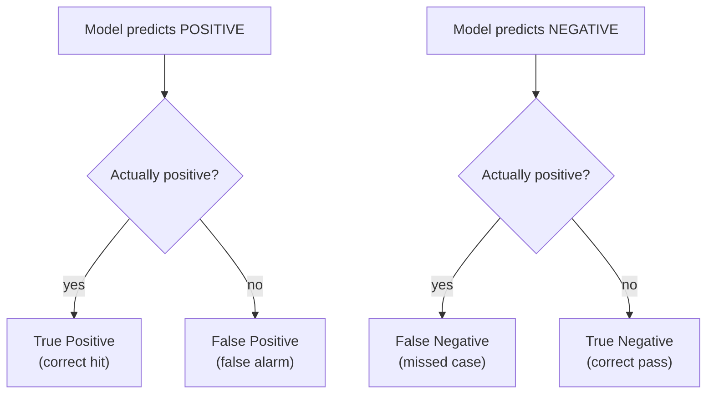
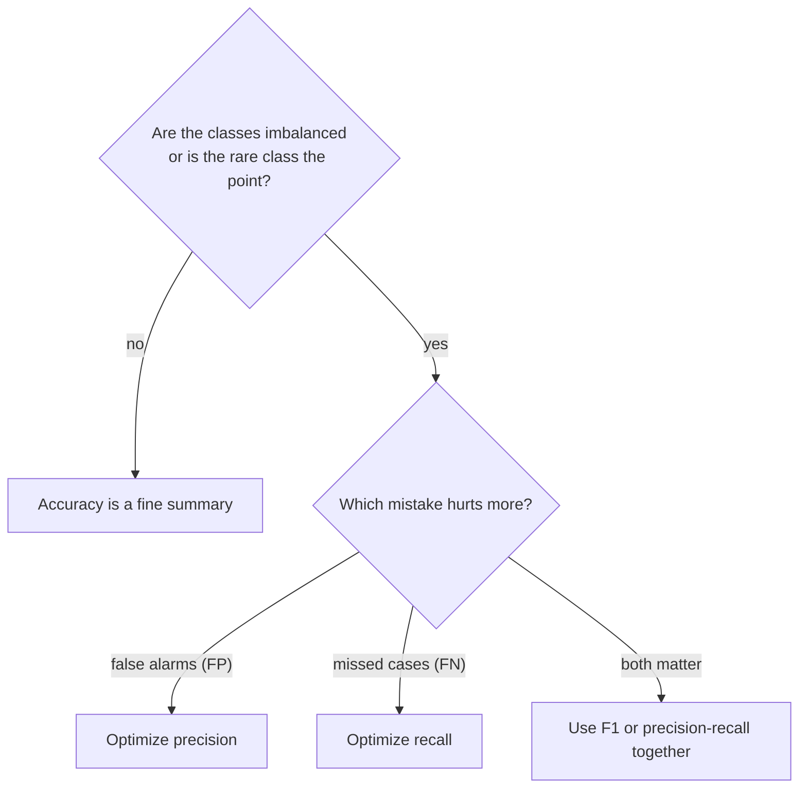

When a model predicts categories, the obvious question is "how often is it
right?", its **accuracy**. Accuracy is intuitive, easy to compute, and
genuinely useful sometimes. It is also responsible for more bad models
shipped with confidence than any other number in machine learning. This
chapter explains why, and gives you the tools that do not lie: the
**confusion matrix**, **precision**, **recall**, and **F1**.

<Figure
  slug="ml-classification-metrics-cutout"
  alt="Classification metrics beyond accuracy, an isometric illustration"
/>

## The accuracy trap

Loan defaults are rare: most borrowers repay. Build a "model" that ignores
its inputs and predicts "did not default" for everyone, and on the real
**lending-club** data it will score a high accuracy while catching not a
single defaulter. Let us watch this happen on genuinely imbalanced data.

<CodeBlock
  adapter="python"
  datasets={[{ path: "lending-club-loan-results.csv", stageAs: "loans.csv" }]}
  files={[
    {
      filename: "main.py",
      initCode: `import pandas as pd
loans = pd.read_csv("loans.csv")`,
      starterCode: `from sklearn.model_selection import train_test_split
from sklearn.dummy import DummyClassifier
from sklearn.metrics import accuracy_score, recall_score

# Real, imbalanced classification: most loans are repaid, few default.
features = ["loan_amnt", "int_rate", "term_in_months", "annual_inc"]
data = loans.dropna(subset=features + ["did_default"])
X = data[features]
y = data["did_default"].astype(int)  # 1 = defaulted (the rare positive class)
print(f"Share that defaulted: {y.mean():.1%}")

X_train, X_test, y_train, y_test = train_test_split(
    X, y, test_size=0.3, random_state=0, stratify=y
)

# A model that ALWAYS predicts the majority class "did not default".
dummy = DummyClassifier(strategy="most_frequent").fit(X_train, y_train)
y_pred = dummy.predict(X_test)

print(f"Accuracy: {accuracy_score(y_test, y_pred):.1%}")
print(f"Recall on the positive class: {recall_score(y_test, y_pred):.1%}")
print("Defaulters it actually caught:", int((y_pred[y_test == 1] == 1).sum()))
`,
    },
  ]}
/>

A high accuracy, and it caught **zero** defaulters. The accuracy is high
only because the repaid class is huge and easy. On any problem where the
rare class is the one you care about, fraud, disease, defaults,
defects, accuracy alone is dangerously misleading.

<Callout type="danger" title="Accuracy hides what matters on imbalanced data">
On imbalanced problems, a useless majority-class predictor can post a
gorgeous accuracy while completely failing at the actual task. Whenever the
classes are imbalanced, treat raw accuracy with deep suspicion and look at
per-class metrics instead.
</Callout>

## The confusion matrix: where every metric is born

Four counts, and the four different questions people ask of them. Note
how far apart precision and accuracy sit when the positive class is
rare.

<Chart slug="confusion-matrix-grid" />

To talk precisely about classifier mistakes, we first need names for the
four things that can happen on a binary problem. Compare each prediction to
the truth:

- **True Positive (TP)**, predicted positive, and it was. A correct catch.
- **False Positive (FP)**, predicted positive, but it was negative. A false
  alarm. (Statisticians call this a Type I error.)
- **False Negative (FN)**, predicted negative, but it was positive. A
  missed case. (A Type II error.)
- **True Negative (TN)**, predicted negative, and it was. A correct pass.

The **confusion matrix** simply counts these four outcomes. scikit-learn
lays it out with actual classes as rows and predicted classes as columns.

<CodeBlock
  adapter="python"
  datasets={[{ path: "lending-club-loan-results.csv", stageAs: "loans.csv" }]}
  files={[
    {
      filename: "main.py",
      initCode: `import pandas as pd
loans = pd.read_csv("loans.csv")`,
      starterCode: `from sklearn.model_selection import train_test_split
from sklearn.linear_model import LogisticRegression
from sklearn.metrics import confusion_matrix

features = ["loan_amnt", "int_rate", "term_in_months", "annual_inc"]
data = loans.dropna(subset=features + ["did_default"])
X = data[features]
y = data["did_default"].astype(int)  # 1 = defaulted
X_train, X_test, y_train, y_test = train_test_split(
    X, y, test_size=0.3, random_state=0, stratify=y
)

model = LogisticRegression(max_iter=1000).fit(X_train, y_train)
y_pred = model.predict(X_test)

cm = confusion_matrix(y_test, y_pred)
print("Confusion matrix (rows = actual, cols = predicted):")
print("                 pred 0   pred 1")
print(f"  actual 0 (neg)   {cm[0, 0]:5d}    {cm[0, 1]:5d}")
print(f"  actual 1 (pos)   {cm[1, 0]:5d}    {cm[1, 1]:5d}")
print()
tn, fp, fn, tp = cm.ravel()
print(f"TN={tn}  FP={fp}  FN={fn}  TP={tp}")
`,
    },
  ]}
/>

<Callout type="info" title="Read the corners carefully">
With the default labels `[0, 1]`, the bottom-right cell is **TP** (actual 1,
predicted 1) and the top-left is **TN**. The off-diagonal cells are the
mistakes: top-right is FP, bottom-left is FN. The whole point of the matrix
is that it separates the *two kinds* of mistake, which a single accuracy
number blends together.
</Callout>

## Precision: when false alarms are expensive

**Precision** answers: *of all the cases the model flagged as positive, what
fraction really were?*

$$
\text{precision} = \frac{TP}{TP + FP}
$$

- **What it measures.** The trustworthiness of a positive prediction. High
  precision means "when this model says positive, believe it."
- **What it does *not* measure.** How many positives you *missed*. A model
  can have perfect precision by making exactly one extremely confident
  positive prediction and ignoring every other real case.
- **When it matters most.** When **false positives are costly**. A spam
  filter that sends a real, important email to the junk folder (FP) has
  failed badly, so spam filters prize precision. Likewise a model that
  flags customers for an expensive intervention.

## Recall: when misses are expensive

**Recall** (also called sensitivity) answers: *of all the cases that were
actually positive, what fraction did the model catch?*

$$
\text{recall} = \frac{TP}{TP + FN}
$$

- **What it measures.** Coverage of the real positives. High recall means
  "few positives slip through."
- **What it does *not* measure.** How many false alarms you raised getting
  there. A model can reach perfect recall by predicting positive for
  *everyone*, catching all real cases and drowning in false positives.
- **When it matters most.** When **false negatives are costly**. A cancer
  screen that misses a real tumor (FN) can cost a life, so screening prizes
  recall even at the price of more false alarms (which a follow-up test can
  rule out).

<Callout type="warn" title="Precision and recall pull in opposite directions">
You can almost always raise one by sacrificing the other. Flag more cases as
positive and recall rises while precision falls; flag fewer and the reverse
happens. A single number cannot capture a classifier, you need at least
this pair, chosen around which mistake hurts more.
</Callout>

## The threshold is the dial

Precision and recall move in opposite directions as you turn it, and no
setting maximises both:

<Chart slug="precision-recall-threshold" />

Most classifiers do not really output a class, they output a
**probability**, and a threshold (0.5 by default) turns it into a class.
Moving that threshold is exactly how you trade precision against recall.

<CodeBlock
  adapter="python"
  files={[
    {
      filename: "main.py",
      starterCode: `import numpy as np
from sklearn.datasets import make_classification
from sklearn.model_selection import train_test_split
from sklearn.linear_model import LogisticRegression
from sklearn.metrics import precision_score, recall_score

X, y = make_classification(
    n_samples=1000, n_features=8, weights=[0.85, 0.15], random_state=1
)
X_train, X_test, y_train, y_test = train_test_split(
    X, y, test_size=0.3, random_state=1, stratify=y
)
model = LogisticRegression(max_iter=1000).fit(X_train, y_train)
probs = model.predict_proba(X_test)[:, 1]  # probability of class 1

print("threshold |  precision |  recall")
for t in [0.2, 0.35, 0.5, 0.65, 0.8]:
    pred = (probs >= t).astype(int)
    p = precision_score(y_test, pred, zero_division=0)
    r = recall_score(y_test, pred, zero_division=0)
    print(f"   {t:.2f}   |    {p:.2f}    |   {r:.2f}")
`,
    },
  ]}
/>

Read the table top to bottom: as the threshold rises, the model demands more
confidence before saying "positive," so precision climbs and recall falls.
There is no universally correct threshold, it depends on whether a false
alarm or a missed case is worse for *your* problem. The default 0.5 is just
a convention, not a law.

Moving the threshold assumes the scores mean something. A model can rank
perfectly and still be badly calibrated, which matters the moment anyone
treats `predict_proba` as a probability.

<Chart slug="calibration-curve" />

## F1: one number when you must have one

Sometimes you genuinely need a single score, to rank models, to early-stop
a search. Averaging precision and recall with a plain mean is too forgiving
(a model with precision 1.0 and recall 0.0 would score 0.5). The **F1
score** uses the *harmonic* mean, which stays low unless **both** are
decent.

$$
F_1 = 2 \cdot \frac{\text{precision} \cdot \text{recall}}{\text{precision} + \text{recall}}
$$

- **What it measures.** A balance of precision and recall that punishes
  lopsidedness. F1 is high only when neither is being sacrificed.
- **What it does *not* measure.** The true negatives, and your actual
  relative cost of FP versus FN, F1 weights precision and recall equally,
  which may not match your real priorities.
- **When it can mislead.** If false positives and false negatives have very
  different costs, the equal weighting in F1 is wrong for you, and you
  should optimize precision or recall directly (or a weighted F-beta score).

## `classification_report`: the whole picture at once

In practice you rarely compute these by hand. `classification_report`
prints precision, recall, and F1 for every class, plus support (how many
true examples of each class there were).

<CodeBlock
  adapter="python"
  files={[
    {
      filename: "main.py",
      starterCode: `from sklearn.datasets import make_classification
from sklearn.model_selection import train_test_split
from sklearn.linear_model import LogisticRegression
from sklearn.metrics import classification_report

X, y = make_classification(
    n_samples=1000, n_features=8, weights=[0.85, 0.15], random_state=1
)
X_train, X_test, y_train, y_test = train_test_split(
    X, y, test_size=0.3, random_state=1, stratify=y
)
model = LogisticRegression(max_iter=1000).fit(X_train, y_train)
y_pred = model.predict(X_test)

print(classification_report(y_test, y_pred, target_names=["negative", "positive"]))
`,
    },
  ]}
/>

Look at the positive row specifically, its precision and recall are the
honest report card on the rare, important class, the one accuracy was
hiding. The `macro avg` averages each metric across classes treating them
equally (good for imbalance); the `weighted avg` weights by support (closer
to overall accuracy).

<Callout type="info" title="Multi-class: the same ideas, averaged">
For more than two classes, precision, recall, and F1 are computed per class
(one-vs-rest) and then averaged. `macro` treats every class equally;
`weighted` accounts for class sizes; `micro` pools all decisions together.
On imbalanced multi-class problems, prefer `macro` so a tiny class is not
ignored.
</Callout>

## Choosing the right metric

The metric is not a technicality, it is a statement of values. "We must not
miss a real case" means recall. "We must not cry wolf" means precision. Pick
the metric that matches the cost of being wrong in your world.

## Common misconceptions

- **"High accuracy means a good classifier."** Only when classes are
  balanced *and* both errors cost the same. Otherwise it can be a mirage.
- **"Precision and recall are basically the same thing."** They answer
  opposite questions, trustworthiness of positive predictions versus
  coverage of real positives, and improving one often worsens the other.
- **"F1 is always the best single metric."** F1 assumes FP and FN matter
  equally. When they do not, F1 quietly optimizes the wrong thing.
- **"The 0.5 threshold is fixed."** It is an arbitrary default. Tuning the
  threshold to your costs is one of the cheapest, highest-impact moves in
  applied classification.
- **"Recall of 100% means the model is great."** Predicting positive for
  everything achieves it, with disastrous precision. Always read the pair.

## Real-world applications

A fraud team tunes for recall (catch the fraud) while capping false
positives so they do not freeze honest customers. An email provider tunes
spam filters for precision (never lose a real email). A medical screen
maximizes recall and lets a cheap confirmatory test clean up the false
alarms. In each case the confusion matrix, not accuracy, is the artifact
the team actually argues over.

## Your turn

<ChallengeCard
  adapter="python"
  title="Read a classifier's confusion matrix"
  category="model evaluation · classification metrics"
  estimatedTime="~7 min"
  instructions={`A \`LogisticRegression\` is fit on an imbalanced dataset, and
\`y_test\` / \`y_pred\` are provided (positive class is \`1\`).

1. Compute the confusion matrix into \`cm\` with
   \`confusion_matrix(y_test, y_pred)\`.
2. Unpack it into \`tn, fp, fn, tp\` (use \`cm.ravel()\`).
3. Compute \`precision\` and \`recall\` **for the positive class** from those
   four counts using the formulas (not by re-calling sklearn),
   \`precision = tp / (tp + fp)\` and \`recall = tp / (tp + fn)\`.

The tests confirm your hand-computed precision and recall match
scikit-learn's \`precision_score\` and \`recall_score\`.`}
  files={[
    {
      filename: "main.py",
      initCode: `from sklearn.datasets import make_classification
from sklearn.model_selection import train_test_split
from sklearn.linear_model import LogisticRegression
from sklearn.metrics import confusion_matrix, precision_score, recall_score

X, y = make_classification(
    n_samples=1000, n_features=8, weights=[0.85, 0.15], random_state=5
)
X_train, X_test, y_train, y_test = train_test_split(
    X, y, test_size=0.3, random_state=5, stratify=y
)
model = LogisticRegression(max_iter=1000).fit(X_train, y_train)
y_pred = model.predict(X_test)`,
      starterCode: `cm = None
tn = fp = fn = tp = None
precision = None
recall = None

print("Confusion matrix:\\n", cm)
print("precision:", precision, "recall:", recall)
`,
      solutionCode: `cm = confusion_matrix(y_test, y_pred)
tn, fp, fn, tp = cm.ravel()
precision = tp / (tp + fp)
recall = tp / (tp + fn)

print("Confusion matrix:\\n", cm)
print("precision:", precision, "recall:", recall)
`,
    },
  ]}
  tests={[
    {
      id: "cm_shape",
      name: "Confusion matrix is 2x2",
      description: "Binary problem",
      code: `assert cm is not None and cm.shape == (2, 2)`,
    },
    {
      id: "precision_match",
      name: "Hand-computed precision matches sklearn",
      description: "tp / (tp + fp)",
      code: `from sklearn.metrics import precision_score
assert precision is not None and abs(precision - precision_score(y_test, y_pred)) < 1e-9`,
    },
    {
      id: "recall_match",
      name: "Hand-computed recall matches sklearn",
      description: "tp / (tp + fn)",
      code: `from sklearn.metrics import recall_score
assert recall is not None and abs(recall - recall_score(y_test, y_pred)) < 1e-9`,
    },
  ]}
/>

## Check your understanding

<MultipleChoice
  markdown={`A model achieves 97% accuracy on a dataset where 96% of cases are negative. What is the most important next check?

- Ship it; 97% is excellent
  > A dataset where 96% of cases are negative means a model that predicts "negative" every time achieves 96% accuracy while catching zero positives. A 97% accuracy barely exceeds that useless baseline, so the metric alone is not grounds for confidence.
- Increase the training set size
  > More training data may or may not improve a model, but it does not address the diagnostic issue: you do not yet know whether the 97% accuracy reflects genuine skill or just majority-class prediction. Per-class metrics are the right next step.
- Switch to a regression model
  > The task is predicting a category (positive or negative), so classification is the correct task type. Switching to regression would not solve the imbalance problem and would change the nature of the output.
- [o] Look at per-class metrics (precision/recall on the positive class), because high accuracy may just reflect the dominant negative class
  > On imbalanced data, accuracy can be inflated by the majority class. The confusion matrix reveals whether the rare positives are actually being caught.

Accuracy near the base rate of the majority class is a classic warning sign on imbalanced problems.`}
/>

<MultipleChoice
  markdown={`**Precision** for the positive class is defined as:

- (TP + TN) / total
  > That is overall accuracy, not precision. It counts all correct predictions (both classes) divided by the total, ignoring the distinction between false positives and false negatives.
- TN / (TN + FP)
  > That formula is specificity (true negative rate), not precision. It measures how well the model avoids false alarms among all actual negatives, which is a different concept.
- TP / (TP + FN)
  > That formula is recall (sensitivity), not precision. The denominator counts true positives plus false negatives, all actual positives, measuring how many real positives were caught.
- [o] TP / (TP + FP), of everything predicted positive, the fraction that truly was
  > Precision measures how trustworthy a positive prediction is; its denominator is all the positive *predictions*, so false alarms (FP) lower it.

Precision is about the quality of positive predictions, penalized by false positives.`}
/>

<MultipleChoice
  markdown={`A cancer screening test should be tuned primarily for high **recall**. Why?

- Because recall ignores the positive class
  > Recall is specifically about the positive class: it measures the fraction of actual positives the model correctly identified (TP / (TP + FN)).
- Because false alarms are the main danger
  > When false alarms are the main danger, you optimize for precision (avoiding unnecessary positive predictions), not recall. In cancer screening, a false alarm means more tests, which is acceptable; a missed tumor is the greater risk.
- Because recall is always higher than precision
  > Neither metric is always higher than the other; their relative values depend on the model and the data. The choice between them is driven by which type of error is more costly, not by which number tends to be larger.
- [o] Because a false negative, missing a real case, is the most costly error, and recall measures the fraction of real positives caught
  > Recall (TP / (TP + FN)) directly tracks missed cases. In screening, a missed tumor is far worse than a false alarm that a follow-up test can rule out.

Screening prioritizes catching every real case, accepting more false positives as the price.`}
/>

<MultipleChoice
  markdown={`You raise a classifier's decision threshold from 0.5 to 0.8. What typically happens?

- Both precision and recall rise
  > A higher threshold cannot simultaneously improve both. It restricts which cases are called positive, which typically catches fewer real positives (lower recall) while making those calls more trustworthy (higher precision).
- [o] Precision tends to rise and recall tends to fall, because the model now demands more confidence before predicting positive
  > A higher bar for "positive" yields fewer, more confident positive predictions: more of them are correct (higher precision) but more real cases are missed (lower recall).
- Both precision and recall fall
  > A higher threshold reduces the number of positive predictions. Fewer but more confident positive calls typically means higher precision, not lower; recall falls because more true positives are missed.
- Accuracy is guaranteed to improve
  > Raising the threshold does not guarantee better accuracy; it shifts the precision-recall tradeoff. On imbalanced data, it can even lower accuracy by making the model too conservative about predicting the positive class.

Threshold is the dial that trades precision against recall in opposite directions.`}
/>

<MultipleChoice
  markdown={`Why does the **F1 score** use the harmonic mean of precision and recall rather than a simple average?

- [o] The harmonic mean stays low unless *both* precision and recall are reasonably high, so it punishes models that sacrifice one for the other
  > A plain average would reward a lopsided model (e.g. precision 1.0, recall 0.0 averages to 0.5); the harmonic mean drives such a score near zero.
- It ignores false negatives
  > F1 accounts for false negatives through the recall term in its formula. Recall is TP / (TP + FN), so missing positives (FN) directly lowers recall and therefore lowers F1.
- The harmonic mean is easier to compute
  > The harmonic mean is not simpler to compute than the arithmetic mean, it requires more steps. The reason it is used is its mathematical property of penalizing lopsided scores, not computational convenience.
- It makes F1 always equal to accuracy
  > F1 is not in general equal to accuracy. Accuracy counts all correct predictions; F1 focuses on the precision-recall balance for the positive class and does not involve true negatives.

F1 is designed to resist being fooled by one strong component masking a weak one.`}
/>

<MultipleChoice
  markdown={`A model reaches 100% recall on the positive class. By itself, what does this guarantee?

- Accuracy is 100%
  > High recall does not imply high accuracy. A classifier that predicts "positive" for every example gets perfect recall but will have low accuracy on any dataset where most cases are actually negative.
- Precision is also 100%
  > Recall and precision are independent metrics that do not imply each other. A model can reach 100% recall by flagging every single case as positive, which typically produces very low precision.
- The model is excellent
  > 100% recall alone provides no information about the model's precision. A classifier that predicts "positive" for everything achieves perfect recall with zero discriminative value.
- [o] Nothing about overall quality, predicting "positive" for every case also achieves 100% recall, while destroying precision
  > Recall alone can be maxed out trivially by flagging everything positive. It must be read together with precision to judge a classifier.

Perfect recall is meaningless without knowing the false-positive cost, captured by precision.`}
/>
