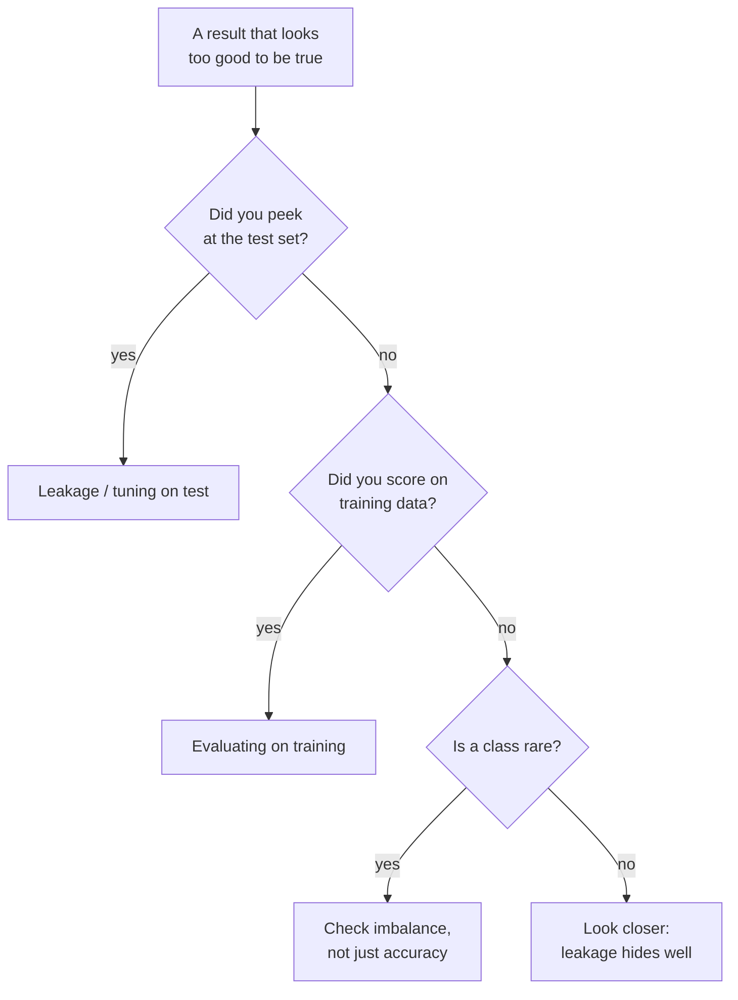

Most machine learning failures are not exotic. They are the same handful of
mistakes, made over and over, by people who absolutely know better in the
abstract but slip in the moment. The mistakes share a personality: they
produce results that look *great*, which is precisely why they are so
dangerous. A model that crashes is annoying but honest. A model that scores
99% because of a subtle leak is a trap with a bow on it.

<Figure
  slug="ml-common-pitfalls-cutout"
  alt="Common pitfalls and misconceptions, an isometric illustration"
/>

This page is a catalog of those traps. For each one: **what the trap is**,
**why it fools people**, and **the fix**. Read it once now, then come back
to it whenever a result looks too good to be true, because that feeling is
usually right.

## (a) Data leakage

**The trap.** Information that would not be available at prediction time
sneaks into training, so the model "knows" things it could never really
know. The two most common forms are *preprocessing before the split* and
*target leakage*.

<Figure
  slug="ml-common-pitfalls-and-misconceptions-data-leakage-inline-cutout"
  alt="A sealed test crate with a small pipe running into it from the training bench, a chip travelling along the pipe"
  caption="Leakage is any pipe that carries test information back into training."
/>

**Why it fools people.** Leakage produces spectacular validation and even
test scores, that is its signature. Everything looks like a triumph. The
model only fails once it meets genuinely new data, often in production,
where the leaked information is gone. By then the damage is done.

The most common version is so easy to do by accident: you scale or impute
using statistics computed from the **whole dataset**, *then* split. Now the
training fold's scaler already "saw" the mean of the test rows. Watch the
difference.

<CodeBlock
  adapter="python"
  datasets={[{ path: "palmer-penguins.csv", stageAs: "penguins.csv" }]}
  files={[
    {
      filename: "main.py",
      initCode: `import pandas as pd
penguins = pd.read_csv("penguins.csv").dropna(subset=["bill_length_mm","bill_depth_mm","flipper_length_mm","body_mass_g","species"])`,
      starterCode: `from sklearn.model_selection import cross_val_score
from sklearn.preprocessing import StandardScaler
from sklearn.linear_model import LogisticRegression
from sklearn.pipeline import Pipeline

features = ["bill_length_mm", "bill_depth_mm", "flipper_length_mm", "body_mass_g"]
X = penguins[features]
y = penguins["species"]

# LEAKY: scale using the WHOLE dataset, then cross-validate.
# Every fold's scaler has already seen statistics from its validation rows.
X_leaked = StandardScaler().fit_transform(X)
leaky_cv = cross_val_score(LogisticRegression(max_iter=5000), X_leaked, y, cv=5).mean()

# CORRECT: put the scaler INSIDE a pipeline, so each fold scales using only
# its own training portion.
correct = Pipeline(
    [
        ("scaler", StandardScaler()),
        ("model", LogisticRegression(max_iter=5000)),
    ]
)
correct_cv = cross_val_score(correct, X, y, cv=5).mean()

print(f"Leaky CV accuracy:   {leaky_cv:.4f}")
print(f"Correct CV accuracy: {correct_cv:.4f}")
print("On this gentle example the gap is small, but the leaky number is")
print("optimistic for the wrong reasons -- and on heavier preprocessing")
print("(imputation, target encoding) the gap can be enormous.")
`,
    },
  ]}
/>

**Target leakage** is the nastier cousin: a *feature* secretly encodes the
answer. A model predicting whether a patient has a disease, fed a column
like `was_prescribed_the_disease_drug`, will look perfect, it is reading
the diagnosis, not predicting it. The feature is a *consequence* of the
target, not a legitimate cause available beforehand.

**The fix.** Split **first**, and fit every learned transformation (scaling,
imputing, encoding, feature selection) on the training set only, which a
`Pipeline` makes automatic. For target leakage, ask of every feature: *would
I actually have this value, with this meaning, at the moment I need to
predict?* If not, drop it.

<Callout type="danger" title="Leakage is the deadliest pitfall because it looks like success">
A crashing model gets fixed. A leaking model gets *deployed*, because its
validation numbers are gorgeous. The discipline of splitting first and
wrapping preprocessing in a \`Pipeline\` exists almost entirely to make
leakage hard to commit by accident.
</Callout>

## (b) Evaluating on the training data

**The trap.** Reporting how well the model does on the very data it was
trained on, and treating that as its performance.

<Figure
  slug="ml-common-pitfalls-and-misconceptions-b-evaluating-on-inline-cutout"
  alt="A machine being tested with the very blocks that were used to build it, its gauge pinned at full"
  caption="Scoring on the training rows measures memory, not the ability to generalise."
/>

**Why it fools people.** The number is always flattering, sometimes a
perfect 1.000, and a perfect score *feels* like the goal. But a flexible
model can memorize its training data, so the training score measures
*memory*, not the ability to generalize. It answers a question nobody cares
about: "how well does the model recall what it has already seen?"

<CodeBlock
  adapter="python"
  datasets={[{ path: "palmer-penguins.csv", stageAs: "penguins.csv" }]}
  files={[
    {
      filename: "main.py",
      initCode: `import pandas as pd
penguins = pd.read_csv("penguins.csv").dropna(subset=["bill_length_mm","bill_depth_mm","flipper_length_mm","body_mass_g","species"])`,
      starterCode: `from sklearn.model_selection import train_test_split
from sklearn.tree import DecisionTreeClassifier

features = ["bill_length_mm", "bill_depth_mm", "flipper_length_mm", "body_mass_g"]
X = penguins[features]
y = penguins["species"]
X_train, X_test, y_train, y_test = train_test_split(
    X, y, test_size=0.3, random_state=0, stratify=y
)

# An unrestricted tree memorizes the training set.
tree = DecisionTreeClassifier(random_state=0).fit(X_train, y_train)

print(
    f"Training accuracy: {tree.score(X_train, y_train):.3f}  <- meaningless as a performance estimate"
)
print(f"Test accuracy:     {tree.score(X_test, y_test):.3f}  <- the honest number")
`,
    },
  ]}
/>

**The fix.** Always report performance on held-out data: a test set, or
cross-validated scores. The bigger the gap between training and held-out
scores, the more the model has overfit. Treat a perfect training score as a
red flag, never a trophy.

## (c) Ignoring class imbalance

**The trap.** On a dataset where one class is rare, you celebrate a high
accuracy while the model quietly ignores the rare class entirely, which is
often the *only* class you care about.

Accuracy stops meaning anything once positives are rare. A test that is
99% accurate on a 1-in-1000 condition still calls ten false alarms for every
true one:

<Chart slug="base-rate-grid" />

<Figure
  slug="ml-common-pitfalls-and-misconceptions-c-ignoring-class-inline-cutout"
  alt="A balance with ninety-nine chips on one pan and one on the other, a gauge beside it still reading high"
  caption="When one class is rare, a high score can hide a model that ignores it."
/>

**Why it fools people.** Accuracy is intuitive and usually trustworthy, so
people reach for it reflexively. But when most cases share one label, a model
that *always* predicts that majority label, learning nothing, scores high
accuracy by default. Real lending data makes the trap concrete: most loans are
repaid, so defaults are the rare class, and the only class a lender truly
cares about catching.

<CodeBlock
  adapter="python"
  datasets={[{ path: "lending-club-loan-results.csv", stageAs: "loans.csv" }]}
  files={[
    {
      filename: "main.py",
      initCode: `import pandas as pd
loans = pd.read_csv("loans.csv")`,
      starterCode: `import numpy as np
from sklearn.dummy import DummyClassifier
from sklearn.metrics import accuracy_score, recall_score, confusion_matrix

# Sample 5,000 loans for speed; did_default is genuinely imbalanced.
sample = loans.sample(n=5000, random_state=0)
y = sample["did_default"]            # True = the loan defaulted (the rare, costly class)
X = np.zeros((len(y), 1))
print(f"Share that actually defaulted: {y.mean():.3f}")

# A model that does NOTHING but predict the majority class ("no default").
model = DummyClassifier(strategy="most_frequent").fit(X, y)
pred = model.predict(X)

print(f"Accuracy: {accuracy_score(y, pred):.3f}   <- looks respectable!")
print(
    f"Recall on defaults: {recall_score(y, pred, pos_label=True):.3f}   <- it caught ZERO of them"
)
print("Confusion matrix:")
print(confusion_matrix(y, pred))
`,
    },
  ]}
/>

Roughly 79% accuracy and a 0% catch rate on the loans that lose money. **The fix:**
on imbalanced problems, look past accuracy to **precision, recall, the
confusion matrix, and ROC-AUC** (from the classification chapters). Use
`stratify` when splitting so the rare class is represented in both halves,
and consider class weights or resampling so the model is pushed to care
about the minority.

<Callout type="warn" title="Accuracy is the wrong default for imbalanced data">
The rarer the class you care about, the more accuracy flatters a model that
ignores it. If a trivial majority-class predictor would already score well,
accuracy cannot tell skill from laziness. Reach for recall, precision, and
the confusion matrix instead.
</Callout>

## (d) Chasing a single metric

**The trap.** Optimizing one number to the exclusion of everything else, and
losing sight of what the number leaves out.

Precision and recall move against each other as the threshold slides; a model
is a curve, not a number:

<Chart slug="precision-recall-threshold" />

**Why it fools people.** A single metric is comforting, it makes "better"
unambiguous and progress measurable. But every metric is a lossy summary.
Maximize precision alone and you may tank recall (catch only the easy,
obvious cases). Maximize accuracy and you may trample the rare class.
Optimize a proxy hard enough and it stops reflecting the real goal, the
metric becomes a target and ceases to be a good measure.

**The fix.** Choose your metric to match the *real cost structure* of the
problem, and watch a small basket of metrics, not one. A missed fraud and a
false fraud alert cost very different amounts; let that asymmetry, not
convenience, pick your metric. When two metrics trade off (precision vs.
recall), decide the balance you actually want *before* you optimize.

<Callout type="tip" title="The metric must encode what you actually care about">
Before optimizing anything, ask: what does a mistake *cost*, and are all
mistakes equal? If a false negative is ten times worse than a false
positive, accuracy, which treats them the same, is the wrong target.
Pick the metric that mirrors real-world costs, then keep an eye on the
others it ignores.
</Callout>

## (e) Not setting random seeds

**The trap.** Leaving the random pieces of your workflow, the split, a
forest's bootstrap sampling, a `KMeans` initialization, unseeded, so every
run gives different numbers.

A seed pins the split, and the split alone moves the score by more than most
model changes do:

<Chart slug="one-split-is-a-lottery" />

**Why it fools people.** It rarely causes an obvious error, just a slow
erosion of trust. You report 0.92, a colleague reruns and gets 0.89, and
nobody can tell whether a change *helped* or you simply caught a luckier
shuffle. Comparisons become meaningless because two runs differ for reasons
that have nothing to do with the thing you changed.

<CodeBlock
  adapter="python"
  datasets={[{ path: "palmer-penguins.csv", stageAs: "penguins.csv" }]}
  files={[
    {
      filename: "main.py",
      initCode: `import pandas as pd
penguins = pd.read_csv("penguins.csv").dropna(subset=["bill_length_mm","bill_depth_mm","flipper_length_mm","body_mass_g","species"])`,
      starterCode: `from sklearn.model_selection import train_test_split
from sklearn.tree import DecisionTreeClassifier

features = ["bill_length_mm", "bill_depth_mm", "flipper_length_mm", "body_mass_g"]
X = penguins[features]
y = penguins["species"]

# No random_state: the split (and thus the score) changes every run.
scores = []
for seed_free_run in range(5):
    Xtr, Xte, ytr, yte = train_test_split(X, y, test_size=0.3)  # unseeded!
    tree = DecisionTreeClassifier(random_state=0).fit(Xtr, ytr)
    scores.append(round(tree.score(Xte, yte), 3))

print("Five unseeded runs, different scores each time:", scores)
print("Which one do you report? With a fixed random_state, there is one answer.")
`,
    },
  ]}
/>

**The fix.** Set `random_state` (and `np.random.seed()` where relevant) on
every component that has one: the split, the model, the search. Reproducible
results are the bedrock of honest comparison and of anyone being able to
reproduce your work, including future you.

## (f) Tuning against the test set / repeated peeking

**The trap.** Using the test score to guide your choices, picking a model,
a threshold, a hyperparameter, or just deciding when to stop, and then
reporting that same test score as if it were untouched.

Why repeated peeking works: under the null, p-values are uniform, so enough
looks will hand you a good one on luck alone.

<Chart slug="pvalues-under-null" />

**Why it fools people.** Each individual peek feels harmless: "I just
checked, and version B was a bit better." But every decision informed by the
test set leaks a little of it into your model, and across dozens of peeks
you have effectively *trained on the test set* through your own choices. The
final number becomes an optimistic fiction, and you cannot feel it happening.

**The fix.** Make *all* decisions with cross-validation or a separate
validation set. The test set is unlocked exactly **once**, at the very end,
after everything is frozen. If you truly need another round of experiments
after looking, you need fresh data, the spent test set cannot be reused
honestly. This is the same discipline as the practical-workflow chapter,
restated because it is violated so often.

<Callout type="danger" title="Repeated peeking is slow-motion leakage">
You do not need to train on the test set to ruin it, you only need to keep
*consulting* it. Every model you keep because it beat the others on the test
set has been selected using the test set. Decide with validation data; spend
the test set once.
</Callout>

## (g) Extrapolating beyond the training range

**The trap.** Trusting a model's predictions for inputs far outside the
range of anything it was trained on.

**Why it fools people.** A model that is accurate *within* its training
range feels trustworthy everywhere, but it has only ever seen a slice of
reality. Outside that slice, it is guessing, and different model types guess
in wildly different (and sometimes absurd) ways. A linear model marches its
straight line off to infinity; a tree-based model goes *flat*, predicting a
constant, because it can never output a value beyond what it saw in training.

<CodeBlock
  adapter="python"
  datasets={[{ path: "diamonds.csv", stageAs: "diamonds.csv" }]}
  files={[
    {
      filename: "main.py",
      initCode: `import pandas as pd
diamonds = pd.read_csv("diamonds.csv")`,
      starterCode: `import numpy as np
from sklearn.linear_model import LinearRegression
from sklearn.ensemble import RandomForestRegressor

# Train ONLY on small diamonds (carat <= 0.7) -- the most a model here has
# ever seen is a roughly $6,600 stone. Then ask it about much bigger ones.
small = diamonds[diamonds["carat"] <= 0.7]
X_train = small[["carat"]]
y_train = small["price"]
print(f"Training price range: \${y_train.min():.0f} - \${y_train.max():.0f}")

lin = LinearRegression().fit(X_train, y_train)
forest = RandomForestRegressor(n_estimators=100, random_state=0).fit(X_train, y_train)

# Predict FAR outside the training carat range. Real ~3-carat diamonds cost
# around $14,000-15,000 -- far above anything in the training set.
far = pd.DataFrame({"carat": [2.0, 3.0]})
print("True price of a ~2-3 carat diamond is roughly $14,000-15,000.")
print(
    f"Linear model predicts:  {lin.predict(far).round(0)}  (marches the line upward)"
)
print(
    f"Random forest predicts: {forest.predict(far).round(0)}  (flat -- a constant near the top of what it saw)"
)
`,
    },
  ]}
/>

The forest's two predictions are *identical* and stuck far below the true
price: a tree-based model predicts by averaging training targets, so once you
leave the range it saw, it just returns a constant near the edge, it cannot
invent a value larger than anything in its training set. The linear model at
least keeps climbing, but it is extrapolating a straight line you would have
no reason to trust outside the data. **The fix:** know your training range, be
deeply skeptical of predictions outside it, and never assume a pattern
learned in one region holds in another.

## (h) Confusing correlation with causation

**The trap.** Concluding that because a feature predicts the target (or is
"important" to the model), changing that feature would change the outcome.

The sharpest version of the trap: the same data can favour one group in every
subgroup and the other overall.

<Chart slug="simpsons-paradox" />

**Why it fools people.** Predictive power feels like understanding, and a
high feature importance feels like a lever. But a feature can predict an
outcome because it is a *proxy* for the real cause, or a *symptom* of it, or
because both share a hidden common cause. The model exploits the association
happily; it says nothing about what would happen if you *intervened*.

A model might find ice-cream sales a strong predictor of drownings. Banning
ice cream will not save a single swimmer, hot weather drives both. **The
fix:** keep prediction and causation in separate mental boxes. A model
answers "given what I observe, what is likely?" To answer "what should we
*change*?" you need a controlled experiment or careful causal reasoning, not
a feature-importance ranking. (The interpretation chapter drills this home.)

<Callout type="warn" title="Prediction is not intervention">
"This feature predicts the outcome" and "changing this feature changes the
outcome" are different claims, and a model only ever supports the first. The
most confident-sounding misuse of machine learning is reading a predictive
model as a recipe for action. It is not.
</Callout>

## (i) "More features / more data is always better"

**The trap.** Believing that throwing in every available feature, or simply
piling on rows, must improve the model.

**Why it fools people.** "More information cannot hurt" sounds like common
sense. But more *features* can absolutely hurt: irrelevant ones add noise
the model can overfit to, correlated ones muddle interpretation, and a
high-cardinality junk column can even mislead importance measures. More
features also means more chances for one of them to be a leak. And more
*data* helps most when it is *relevant and representative*, a million more
rows of the same narrow situation will not teach a model about situations it
still has never seen.

<CodeBlock
  adapter="python"
  datasets={[{ path: "palmer-penguins.csv", stageAs: "penguins.csv" }]}
  files={[
    {
      filename: "main.py",
      initCode: `import pandas as pd
penguins = pd.read_csv("penguins.csv").dropna(subset=["bill_length_mm","bill_depth_mm","flipper_length_mm","body_mass_g","species"])`,
      starterCode: `import numpy as np
from sklearn.model_selection import cross_val_score
from sklearn.pipeline import make_pipeline
from sklearn.preprocessing import StandardScaler
from sklearn.neighbors import KNeighborsClassifier

features = ["bill_length_mm", "bill_depth_mm", "flipper_length_mm", "body_mass_g"]
X = penguins[features].values
y = penguins["species"].values
rng = np.random.default_rng(0)

# Add 200 columns of pure noise to the 4 real features.
noise = rng.normal(size=(X.shape[0], 200))
X_noisy = np.hstack([X, noise])

score_clean = cross_val_score(
    make_pipeline(StandardScaler(), KNeighborsClassifier()), X, y, cv=5
).mean()
score_noisy = cross_val_score(
    make_pipeline(StandardScaler(), KNeighborsClassifier()), X_noisy, y, cv=5
).mean()

print(f"CV accuracy with 4 real features:         {score_clean:.3f}")
print(f"CV accuracy after adding 200 noise cols:  {score_noisy:.3f}")
print("More columns made the model WORSE -- the noise drowned the signal.")
`,
    },
  ]}
/>

**The fix:** prefer features with a plausible connection to the target, and
let evidence, cross-validation, importance, domain knowledge, decide what
stays. Quality and relevance beat raw quantity. When you do want more data,
seek data that covers *new* situations, not just more of the same.

<Callout type="info" title="The pattern behind every pitfall">
Look back and you will see one theme. Almost every trap on this page is a
way of **fooling yourself about what your model has truly seen and truly
learned**, leaking the test set, scoring on memorized data, hiding behind a
flattering metric, mistaking memory for skill. The cure is always the same
posture: relentless honesty about what is held out, what is measured, and
what the number really means.
</Callout>

## Real-world applications

These are not academic worries; they are the post-mortems of real failed
projects. A hospital model that aced validation and flopped in the clinic
because a feature leaked the very diagnosis it was meant to predict. A fraud
system praised for 99.9% accuracy that never caught a single fraud, because
fraud was 0.1% of cases. A business "insight" that changing a predictive
feature would move an outcome, acted on at great cost, when the feature was
a mere symptom. Google Flu Trends, launched in 2008, famously over-predicted
flu cases for years as the patterns it had latched onto drifted, a 2014
*Science* paper dubbed it "the parable of Google Flu." Every one was
preventable by a habit on this page. Learning to *expect* these traps is a
large part of what separates a practitioner who can be trusted from one who
merely gets good-looking numbers.

<Figure
  slug="ml-pitfalls-flu-trends-cutout"
  alt="A chart board where a steep red curve pulls away from a nearly flat green one, the gap widening across the frame"
  caption="Google Flu Trends, 2008 to 2014: the patterns it latched onto drifted, and the predictions drifted with them."
/>

## Your turn

<ChallengeCard
  adapter="python"
  title="Fix a leaky workflow"
  category="pitfalls · data leakage"
  estimatedTime="~8 min"
  datasets={[{ path: "palmer-penguins.csv", stageAs: "penguins.csv" }]}
  instructions={`The starter code contains a **leaky** evaluation: it scales the
entire dataset with \`StandardScaler\` *before* cross-validating, so each
fold's scaler has already seen its validation rows. Your job is to fix it
the right way.

1. Do **not** pre-scale \`X\`. Instead build a \`Pipeline\` called
   \`pipe\` with two steps: a \`StandardScaler\` named \`"scaler"\` and a
   \`LogisticRegression(max_iter=5000)\` named \`"model"\`.
2. Cross-validate \`pipe\` directly on the raw \`X\`, \`y\` with \`cv=5\`
   and store the mean accuracy in \`correct_cv\` (use
   \`cross_val_score(...).mean()\`).

By scaling **inside** the pipeline, each fold is scaled using only its own
training portion, no leakage. The tests check that \`pipe\` is a
proper two-step pipeline (so scaling happens inside cross-validation) and
that \`correct_cv\` is a believable accuracy.`}
  files={[
    {
      filename: "main.py",
      initCode: `import pandas as pd
from sklearn.model_selection import cross_val_score
from sklearn.pipeline import Pipeline
from sklearn.preprocessing import StandardScaler
from sklearn.linear_model import LogisticRegression

penguins = pd.read_csv("penguins.csv").dropna(subset=["bill_length_mm","bill_depth_mm","flipper_length_mm","body_mass_g","species"])
features = ["bill_length_mm", "bill_depth_mm", "flipper_length_mm", "body_mass_g"]
X = penguins[features]
y = penguins["species"]`,
      starterCode: `# LEAKY starter (for reference): scales the whole dataset before CV.
# X_leaked = StandardScaler().fit_transform(X)
# leaky_cv = cross_val_score(LogisticRegression(max_iter=5000), X_leaked, y, cv=5).mean()

# YOUR FIX: scale INSIDE a pipeline so each fold scales only its training rows.
pipe = None

correct_cv = None

print("correct CV accuracy:", correct_cv)
`,
      solutionCode: `# YOUR FIX: scale INSIDE a pipeline so each fold scales only its training rows.
pipe = Pipeline(
    [
        ("scaler", StandardScaler()),
        ("model", LogisticRegression(max_iter=5000)),
    ]
)

correct_cv = cross_val_score(pipe, X, y, cv=5).mean()

print("correct CV accuracy:", correct_cv)
`,
    },
  ]}
  tests={[
    {
      id: "is_pipeline",
      name: "pipe is a two-step pipeline",
      description: "Scaler then model, so scaling stays inside CV folds",
      code: `from sklearn.pipeline import Pipeline
from sklearn.preprocessing import StandardScaler
assert isinstance(pipe, Pipeline), "pipe should be a Pipeline so scaling happens inside each fold"
names = [n for n, _ in pipe.steps]
assert names == ["scaler", "model"], f"Expected steps ['scaler', 'model'], got {names}"
assert isinstance(pipe.named_steps["scaler"], StandardScaler), "The 'scaler' step should be a StandardScaler"`,
    },
    {
      id: "cv_sane",
      name: "correct_cv is a believable accuracy",
      description: "Leak-free CV accuracy is high and in [0, 1]",
      code: `assert correct_cv is not None and 0.8 <= correct_cv <= 1.0, f"correct_cv {correct_cv} is not a believable accuracy"`,
    },
  ]}
/>

<ChallengeCard
  adapter="python"
  title="Expose an imbalance trap with the right metric"
  category="pitfalls · class imbalance"
  estimatedTime="~7 min"
  datasets={[{ path: "lending-club-loan-results.csv", stageAs: "loans.csv" }]}
  instructions={`A real lending dataset is imbalanced: most loans are repaid, so
defaults (\`did_default == True\`) are the rare class you care about. A
\`DummyClassifier\` that always predicts the majority class ("no default")
is already fitted for you as \`model\`, and its predictions are in
\`pred\`. The labels are in \`y\`.

1. Compute the plain accuracy of \`pred\` against \`y\` and store it in
   \`acc\` (use \`accuracy_score()\`).
2. Compute the **recall on defaults** (the \`True\` class) and store it in
   \`rare_recall\` (use \`recall_score(y, pred, pos_label=True)\`).

You should find a respectable \`acc\` next to a \`rare_recall\` of 0.0, the
model looks fine on accuracy yet catches none of the loans that lose money.
The tests check that \`acc\` is high (above 0.75) while \`rare_recall\` is
exactly 0.0, demonstrating the trap.`}
  files={[
    {
      filename: "main.py",
      initCode: `import numpy as np
import pandas as pd
from sklearn.dummy import DummyClassifier
from sklearn.metrics import accuracy_score, recall_score

# Sample 5,000 loans (random_state=0) so the numbers are reproducible.
loans = pd.read_csv("loans.csv").sample(n=5000, random_state=0)
y = loans["did_default"]
X = np.zeros((len(y), 1))
model = DummyClassifier(strategy="most_frequent").fit(X, y)
pred = model.predict(X)`,
      starterCode: `# 1. Plain accuracy of the majority-class predictor
acc = None

# 2. Recall on the rare class (defaults, i.e. did_default == True)
rare_recall = None

print("accuracy:", acc)
print("recall on defaults:", rare_recall)
`,
      solutionCode: `# 1. Plain accuracy of the majority-class predictor
acc = accuracy_score(y, pred)

# 2. Recall on the rare class (defaults, i.e. did_default == True)
rare_recall = recall_score(y, pred, pos_label=True)

print("accuracy:", acc)
print("recall on defaults:", rare_recall)
`,
    },
  ]}
  tests={[
    {
      id: "high_accuracy",
      name: "Accuracy looks great",
      description: "Majority-class predictor scores above 0.75 accuracy",
      code: `assert acc is not None and acc > 0.75, f"Expected accuracy above 0.75, got {acc}"`,
    },
    {
      id: "zero_recall",
      name: "Recall on the rare class is zero",
      description: "The model catches none of the rare, important cases",
      code: `assert rare_recall is not None and abs(rare_recall - 0.0) < 1e-9, f"Expected rare-class recall 0.0, got {rare_recall}"`,
    },
  ]}
/>

## Check your understanding

<MultipleChoice
  markdown={`You scale your entire dataset with \`StandardScaler().fit_transform(X)\` and *then* split into train and test. Why is this data leakage?

- Because scaling makes the model train more slowly
  > Training speed is irrelevant here; the issue is leakage of test-set statistics into preprocessing.
- [o] Because the scaler's mean and standard deviation were computed using the test rows, so test-set information has entered the training transformation
  > Fitting the scaler on the full dataset lets statistics from the test rows shape the scaling applied during training, leaking the test set into the fit.
- Because \`StandardScaler\` should never be used before splitting any data
  > \`StandardScaler\` is fine; the problem is *fitting* it on the full dataset rather than on the training portion alone.
- Because scaling changes the labels \`y\`
  > Scaling transforms features, not labels, so the labels are untouched; the leak is about information, not corrupted targets.

Fitting any learned transformation must happen on the training data only, which a \`Pipeline\` enforces automatically.`}
/>

<MultipleChoice
  markdown={`A model scores 1.000 accuracy on the data it was trained on. What is the right reaction?

- Celebrate, the model is perfect and ready to deploy
  > A perfect training score reflects memorization, not generalization, and says nothing about performance on new data.
- Retrain on even more of the same data to lock in the perfect score
  > Adding more of the same data does not address the real question of generalization, which only held-out evaluation answers.
- [o] Treat it as a red flag and check performance on held-out data, since a perfect training score usually signals memorization
  > A flexible model can memorize its training rows, so a perfect training score is a warning to evaluate on data the model never saw.
- Conclude the data must be corrupted
  > Corruption is not implied; a perfect training score is the expected result of an unrestricted, overfitting model.

The training score measures memory; the held-out score measures skill.`}
/>

<MultipleChoice
  markdown={`On a dataset that is 99% class 0, a model that always predicts class 0 reports 99% accuracy. What does this reveal?

- The model is excellent and needs no further checks
  > A model that ignores the rare class entirely is not excellent; the high accuracy is an artifact of the imbalance.
- The rare class should simply be deleted from the dataset
  > Deleting the rare class discards exactly the cases you care about; the fix is better metrics and handling, not removing the minority.
- The accuracy metric must be miscalculated
  > The accuracy is computed correctly; the issue is that accuracy is a misleading metric under heavy imbalance.
- [o] Accuracy can be high while the model ignores the rare class, so on imbalanced data you must also check recall, precision, and the confusion matrix
  > A trivial majority-class predictor scores high accuracy yet catches none of the rare class, so metrics that focus on the minority are needed to see the truth.

When a trivial predictor already scores well, accuracy cannot distinguish skill from doing nothing.`}
/>

<MultipleChoice
  markdown={`Why is leaving \`random_state\` unset across your split, model, and search a problem, even when nothing crashes?

- It changes which metric scikit-learn uses
  > The choice of metric is independent of random seeds; seeds only fix the random components.
- [o] Every run can give different numbers, so you cannot tell whether a change helped or you simply got a luckier random draw
  > Without fixed seeds, two runs differ for reasons unrelated to your change, making honest before-and-after comparison impossible.
- It makes models slower because randomness adds computation
  > Unseeded randomness does not meaningfully slow training; the harm is to reproducibility and comparison.
- It forces the model to overfit the training data
  > Seeds do not control overfitting; they control reproducibility of the random steps.

Fixed seeds make results reproducible, which is the basis of trustworthy comparison.`}
/>

<MultipleChoice
  markdown={`You repeatedly check the **test** score while deciding which model and hyperparameters to keep, then report that test score. What have you actually done?

- [o] Leaked the test set through your choices, so its reported score is now optimistic rather than an honest estimate of unseen performance
  > Every decision guided by the test score uses the test set, so across many peeks the model is effectively tuned to it and the final number is no longer honest.
- Made the test set more reliable by checking it often
  > Repeated checking does the opposite: it spends the test set's honesty, because its value depends on influencing none of your choices.
- Guaranteed the model will generalize, since the test score was high
  > A test score inflated by repeated peeking does not guarantee generalization; it is precisely the false confidence this pitfall produces.
- Nothing wrong, since you never explicitly trained on the test set
  > You did not call \`.fit()\` on the test set, but selecting choices by their test score leaks the test set through your decisions all the same.

Decisions belong to cross-validation or a validation set; the test set is opened once, at the end.`}
/>

<MultipleChoice
  markdown={`A random forest is trained only on small diamonds (carat up to 0.7). You ask it to predict the price of a 3-carat stone. What should you expect?

- [o] Its prediction will be roughly flat near the edge of the training range, because a forest cannot output values beyond what it saw in training
  > A forest predicts by averaging training targets, so far outside the training range it effectively returns a constant near the boundary, not a continued trend.
- It will predict exactly the true value, whatever the relationship
  > A model only learns within the range it saw; outside it there is no basis for an exact answer, regardless of the underlying relationship.
- It will raise an error because the input is out of range
  > The model accepts the input without error; it simply produces an unreliable prediction.
- It will accurately extrapolate the trend out to 3 carats
  > Tree-based models cannot output values beyond the targets seen in training, so they do not extrapolate a trend the way a line would.

Predictions far outside the training range are guesses, and different model families guess very differently.`}
/>

<MultipleChoice
  markdown={`A model finds that "number of umbrellas sold" strongly predicts "number of car accidents." A planner proposes banning umbrella sales to reduce accidents. What is the flaw?

- [o] Umbrella sales predict accidents only because rain drives both; the association is not causal, so banning umbrellas would not reduce accidents
  > Rain is a common cause of both umbrella sales and accidents, so the correlation reflects a shared driver rather than umbrellas causing crashes.
- The model needs more umbrella-related features to be accurate
  > Adding features does not turn a correlation into a cause; no amount of predictive accuracy justifies the causal claim.
- The model used the wrong features and should be retrained
  > The features are fine for prediction; the flaw is interpreting a predictive association as a causal lever.
- Predicting accidents is impossible, so the model must be wrong
  > Accidents can be predicted from correlated signals; the error is in the causal conclusion, not the prediction itself.

Prediction reflects association; only an experiment or careful causal reasoning supports a claim about intervention.`}
/>

<MultipleChoice
  markdown={`When is adding more **features** likely to *hurt* a model rather than help it?

- Never, additional features can only add information and improve a model
  > Irrelevant or redundant features add noise the model can overfit and can even mislead importance measures, so more features can certainly hurt.
- [o] When the added features are irrelevant or noisy, giving a flexible model extra opportunities to overfit and obscuring the real signal
  > Noise columns carry no signal but can be latched onto during training, raising variance and degrading generalization, as the noise-column demo showed.
- Adding features always helps as long as you have enough rows
  > Even with many rows, irrelevant features can hurt by adding dimensions of pure noise; quantity of rows does not neutralize bad features.
- Only when the features are perfectly correlated with the target
  > Features correlated with the target are useful; the harm comes from *irrelevant* or noisy features, not from informative ones.

Quality and relevance of features beat sheer quantity; let evidence decide what stays.`}
/>
